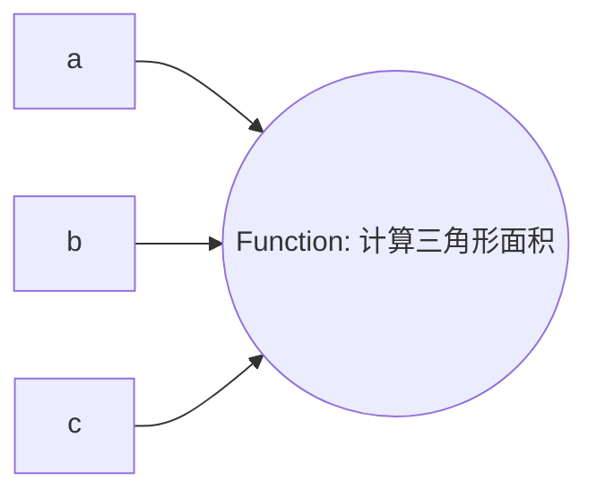

# 【大模型应用开发 动手做AI Agent】Function定义中的Sample是什么

## 1. 背景介绍

### 1.1 问题的由来

在大模型应用程序开发中,Function定义是一个关键的概念。Function定义用于描述AI代理(Agent)应该执行的任务或操作。在Function定义中,Sample是一个重要的组成部分,它提供了一个示例输入,用于说明Function的预期输入格式和内容。

随着人工智能技术的快速发展,大模型应用程序越来越复杂,需要处理各种各样的输入数据。因此,在设计Function时,Sample的作用变得越来越重要。一个好的Sample不仅可以帮助开发人员更好地理解Function的功能,还可以用于测试和调试Function的正确性。

### 1.2 研究现状

目前,关于Function定义中Sample的研究还相对较少。大多数研究都集中在Function定义的语法和语义上,而对Sample的作用和设计原则关注较少。一些研究提出了一些Sample设计的基本原则,如:Sample应该尽可能覆盖Function的所有可能输入情况,Sample应该简单明了,易于理解等。但是,这些原则还比较笼统,缺乏具体的操作指导。

### 1.3 研究意义

深入研究Function定义中Sample的作用和设计原则,对于提高大模型应用程序的开发效率和质量具有重要意义。一个好的Sample不仅可以帮助开发人员更好地理解Function的功能,还可以用于测试和调试Function的正确性,从而提高开发效率和代码质量。此外,良好的Sample设计原则还可以促进Function定义的标准化和规范化,从而提高大模型应用程序的可维护性和可扩展性。

### 1.4 本文结构

本文将从以下几个方面深入探讨Function定义中Sample的作用和设计原则:

1. 介绍Sample在Function定义中的作用和重要性。
2. 分析Sample的设计原则和要求。
3. 给出Sample设计的具体步骤和方法。
4. 通过实例说明Sample设计的最佳实践。
5. 讨论Sample设计中的常见问题和解决方案。
6. 总结Sample设计的未来发展趋势和挑战。

## 2. 核心概念与联系

在探讨Function定义中Sample的作用和设计原则之前,我们需要先了解一些核心概念及其之间的联系。

1. **Function定义**:Function定义是描述AI代理(Agent)应该执行的任务或操作的一种形式化方法。它通常包括Function的名称、输入参数、输出参数、描述等信息。

2. **Sample**:Sample是Function定义中的一个重要组成部分,它提供了一个示例输入,用于说明Function的预期输入格式和内容。

3. **输入数据**:输入数据是指Function需要处理的原始数据,它可以是各种形式的数据,如文本、图像、音频等。

4. **测试用例**:测试用例是用于验证Function正确性的一组输入数据和预期输出。Sample可以作为测试用例的一部分,用于测试Function的基本功能。

5. **代码实现**:代码实现是指将Function定义转化为可执行代码的过程。Sample可以作为代码实现的参考和指导,帮助开发人员更好地理解Function的功能和要求。

这些概念之间存在着密切的联系,Sample作为Function定义的一个重要组成部分,对于理解Function的功能、测试Function的正确性、实现Function的代码等都起着关键作用。

## 3. 核心算法原理 & 具体操作步骤

### 3.1 算法原理概述

设计一个好的Sample,需要遵循一定的原理和步骤。这里我们介绍一种基于**边界值分析**和**等价类划分**的Sample设计算法。

**边界值分析**是一种软件测试技术,它基于这样一个假设:程序在边界条件下更容易出错。因此,在设计Sample时,我们需要特别关注输入数据的边界值情况。

**等价类划分**是另一种软件测试技术,它将输入数据划分为几个等价类,每个等价类代表一种输入情况。在设计Sample时,我们需要为每个等价类至少提供一个Sample。

通过结合这两种技术,我们可以设计出覆盖面广、质量高的Sample。

### 3.2 算法步骤详解

1. **确定输入参数**:首先,我们需要明确Function的输入参数,包括参数名称、参数类型、参数含义等。

2. **划分等价类**:对于每个输入参数,我们需要根据其特征和约束条件,将其可能取值划分为几个等价类。例如,对于一个整数参数,我们可以将其划分为正数、负数、零三个等价类。

3. **确定边界值**:对于每个等价类,我们需要确定其边界值。边界值通常是等价类的最小值和最大值,但也可能是其他特殊值。

4. **设计Sample**:对于每个等价类,我们需要设计一个或多个Sample,包括边界值和中间值。对于一些特殊情况,我们还需要设计一些额外的Sample。

5. **组合Sample**:最后,我们需要将所有Sample组合在一起,形成一个完整的Sample集合。

下面我们通过一个具体的例子来说明这个算法的具体操作步骤。

假设我们需要设计一个Function,用于计算两个整数的最大公约数。该Function的输入参数为两个整数a和b。

1. **确定输入参数**:
   - 参数a:整数
   - 参数b:整数

2. **划分等价类**:
   - 参数a:
     - 正数
     - 负数
     - 零
   - 参数b:
     - 正数
     - 负数 
     - 零

3. **确定边界值**:
   - 参数a:
     - 正数:最小值1,最大值取决于具体需求
     - 负数:最小值取决于具体需求,最大值-1
     - 零:0
   - 参数b:
     - 正数:最小值1,最大值取决于具体需求
     - 负数:最小值取决于具体需求,最大值-1
     - 零:0

4. **设计Sample**:
   - 参数a:
     - 正数:1,最大值,中间值
     - 负数:最小值,-1,中间值
     - 零:0
   - 参数b:
     - 正数:1,最大值,中间值
     - 负数:最小值,-1,中间值
     - 零:0

5. **组合Sample**:
   - (1,1)
   - (1,最大值)
   - (1,中间值)
   - (最大值,1)
   - (最大值,最大值)
   - (最大值,中间值)
   - (中间值,1)
   - (中间值,最大值)
   - (中间值,中间值)
   - (最小值,1)
   - (-1,1)
   - (0,1)
   - (1,最小值)
   - (1,-1)
   - (1,0)
   - ...

通过这个例子,我们可以看到,该算法可以系统地设计出覆盖各种情况的Sample,从而提高Function的测试覆盖率和质量。

### 3.3 算法优缺点

该算法的优点是:

1. 系统性:通过等价类划分和边界值分析,可以系统地设计出覆盖各种情况的Sample。

2. 可操作性:算法步骤清晰,易于实施。

3. 通用性:该算法适用于大多数Function,不受输入参数类型和数量的限制。

4. 可扩展性:对于一些特殊情况,可以在算法基础上进行扩展和改进。

该算法的缺点是:

1. 工作量大:对于输入参数较多的Function,需要划分大量等价类和确定大量边界值,工作量较大。

2. 缺乏智能性:算法过于机械化,缺乏一定的智能性和自适应性。

3. 存在遗漏风险:由于人为操作,可能会遗漏一些特殊情况或边界值。

4. 缺乏优先级考虑:算法没有考虑不同Sample的重要性和优先级。

总的来说,该算法是一种比较实用和有效的Sample设计方法,但也存在一些不足,需要在实践中不断改进和优化。

### 3.4 算法应用领域

该算法可以广泛应用于各种Function的Sample设计,包括但不限于:

1. **数据处理Function**:用于处理各种数据(如文本、图像、音频等)的Function,如数据清洗、数据转换、特征提取等。

2. **数学计算Function**:用于执行各种数学计算的Function,如最大公约数、最小公倍数、矩阵运算等。

3. **逻辑判断Function**:用于执行各种逻辑判断的Function,如条件判断、模式匹配等。

4. **系统操作Function**:用于执行各种系统操作的Function,如文件操作、网络操作、进程管理等。

5. **Web服务Function**:用于提供各种Web服务的Function,如RESTful API、GraphQL API等。

6. **机器学习模型Function**:用于训练和部署各种机器学习模型的Function,如图像分类、自然语言处理等。

总之,只要是需要定义输入参数和输出结果的Function,都可以应用该算法来设计Sample。该算法的通用性和可扩展性使其在各种领域都有广泛的应用前景。

## 4. 数学模型和公式 & 详细讲解 & 举例说明

在上一节中,我们介绍了基于边界值分析和等价类划分的Sample设计算法。虽然算法步骤比较清晰,但是在实际操作过程中,仍然存在一些需要进一步量化和形式化的地方。本节将构建一个数学模型,并给出相应的公式,以更精确地描述和指导Sample设计过程。

### 4.1 数学模型构建

我们将Function的输入参数建模为一个有向无环图(Directed Acyclic Graph,DAG),其中每个节点代表一个输入参数,边代表参数之间的依赖关系。

对于每个参数节点,我们将其可能取值划分为几个等价类,每个等价类代表一种输入情况。等价类之间是不相交的,并且覆盖了参数的所有可能取值。

对于每个等价类,我们需要确定其边界值。边界值是等价类中的一些特殊值,通常包括最小值和最大值,但也可能包括其他特殊值。

最后,我们需要为每个等价类设计一个或多个Sample,包括边界值和中间值。对于一些特殊情况,我们还需要设计一些额外的Sample。

### 4.2 公式推导过程

基于上述数学模型,我们可以推导出一些公式,用于指导Sample设计过程。

假设Function有n个输入参数,记为$P_1,P_2,...,P_n$。对于第i个参数$P_i$,假设它被划分为$m_i$个等价类,记为$EC_{i1},EC_{i2},...,EC_{im_i}$。对于第j个等价类$EC_{ij}$,假设它有$k_{ij}$个边界值,记为$BV_{ij1},BV_{ij2},...,BV_{ijk_{ij}}$。

那么,我们需要为每个等价类设计至少一个Sample,包括边界值和中间值。设计Sample的数量记为$S_{ij}$,那么:

$$S_{ij} \geq k_{ij} + 1$$

对于整个Function,需要设计的Sample总数记为$S$,那么:

$$S = \sum_{i=1}^{n}\sum_{j=1}^{m_i}S_{ij}$$

在实际操作过程中,我们还需要考虑一些特殊情况,如参数之间的依赖关系、异常值处理等,可能需要设计一些额外的Sample。设额外Sample的数量记为$S_e$,那么:

$$S_{total} = S + S_e$$

其中,$S_{total}$表示需要设计的总Sample数量。

通过上述公式,我们可以更精确地计算和控制Sample的数量,从而优化Sample设计过程,提高效率和质量。

### 4.3 案例分析与讲解

为了更好地理解上述数学模型和公式,我们将通过一个具体案例进行分析和讲解。

假设我们需要设计一个Function,用于计算三角形的面积。该Function有三个输入参数:三条边的长度a,b,c。

1. **构建有向无环图**:

2. **划分等