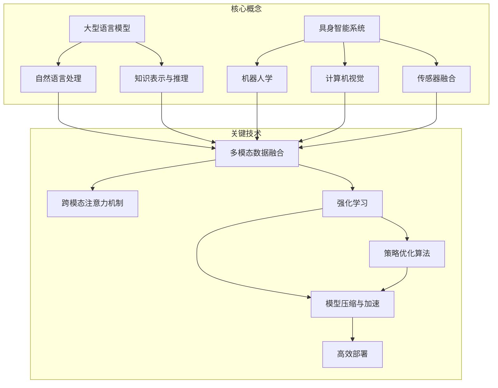
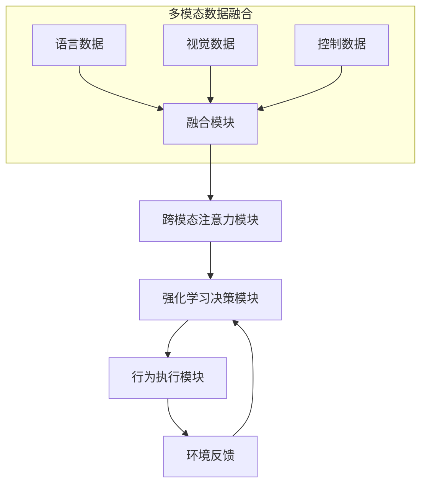

以下是《【大模型应用开发 动手做AI Agent】具身智能的发展》的文章正文内容：

# 【大模型应用开发 动手做AI Agent】具身智能的发展

## 1. 背景介绍

### 1.1 问题的由来

随着人工智能技术的不断发展,大型语言模型已经展现出了令人惊叹的能力。它们不仅能够生成逼真的自然语言文本,还能够对各种复杂任务进行推理和分析。然而,这些语言模型大多数仍然停留在纯文本层面,缺乏对真实世界的感知和理解能力。

为了真正实现通用人工智能,我们需要将语言模型与机器人等具身智能系统相结合,使其能够通过物理实体与环境进行交互,获取感知信息并做出相应反应。这种融合了语言理解、推理和行为控制的智能体,被称为"AI Agent"。

### 1.2 研究现状

目前,一些先驱性的研究已经开始探索将大型语言模型与机器人系统相结合的可能性。例如,OpenAI的InstructGPT模型能够根据自然语言指令生成机器人控制代码,实现简单的机器人行为。DeepMind的AlphaCode则能够将自然语言翻译为可执行的计算机程序。

然而,这些系统仍然存在一些局限性。它们大多数只能执行简单的任务,缺乏对复杂环境的理解和适应能力。此外,语言模型和机器人系统之间的交互方式也较为简单,无法充分利用双方的优势。

### 1.3 研究意义

将大型语言模型与具身智能系统相结合,不仅能够赋予语言模型对物理世界的感知和操作能力,还能够利用语言模型强大的推理和决策能力来指导机器人的行为。这种融合将极大地扩展人工智能系统的应用范围,使其能够应对更加复杂和动态的环境。

同时,这种结合也将促进语言模型和机器人系统的相互发展。语言模型能够从机器人获取的感知数据中学习,提高对真实世界的理解能力;而机器人系统也能够借助语言模型的指导,实现更加智能和灵活的行为控制。

### 1.4 本文结构

本文将全面探讨如何将大型语言模型与具身智能系统相结合,开发出智能AI Agent。我们将首先介绍相关的核心概念和技术,然后详细阐述核心算法原理和数学模型。接下来,我们将通过代码实例和应用场景,展示如何在实践中开发和应用这种AI Agent系统。最后,我们将总结研究成果,并对未来的发展趋势和挑战进行展望。

## 2. 核心概念与联系

在开发AI Agent系统之前,我们需要先了解一些核心概念和技术。

- **大型语言模型**：如GPT、BERT等,能够对自然语言进行理解和生成,是AI Agent系统的核心部分。
- **自然语言处理**：用于处理文本数据,包括词法分析、句法分析、语义分析等。
- **知识表示与推理**：将语言模型学习到的知识以结构化的形式表示,并进行逻辑推理。
- **具身智能系统**：包括机器人、传感器等物理实体,用于与环境进行交互。
- **机器人学**：研究机器人的感知、规划、控制等问题。
- **计算机视觉**：用于处理图像和视频数据,实现目标检测、跟踪等功能。
- **传感器融合**：将来自不同传感器的数据进行融合,获取更加准确的环境信息。
- **多模态数据融合**：将语言、视觉、控制等不同模态的数据进行融合,实现跨模态的理解和决策。
- **跨模态注意力机制**：用于捕捉不同模态数据之间的相关性和依赖关系。
- **强化学习**：通过与环境的交互,学习如何做出最优决策。
- **策略优化算法**：用于优化强化学习中的策略模型,提高决策质量。
- **模型压缩与加速**：通过模型剪枝、量化等技术,降低模型的计算复杂度,实现高效部署。

这些核心概念和关键技术相互关联、相辅相成,共同构建了AI Agent系统的理论基础和技术支撑。

## 3. 核心算法原理 & 具体操作步骤

### 3.1 算法原理概述

AI Agent系统的核心算法原理是将大型语言模型与具身智能系统进行紧密融合,实现跨模态的理解、推理和决策。具体来说,它包括以下几个主要步骤:

1. **多模态数据融合**:将来自语言模型、机器人传感器等不同模态的数据进行融合,形成统一的表示。
2. **跨模态注意力机制**:通过注意力机制,捕捉不同模态数据之间的相关性和依赖关系,实现跨模态的理解和推理。
3. **强化学习决策**:基于融合后的多模态表示,利用强化学习算法,学习如何做出最优的行为决策。
4. **行为执行与反馈**:将决策指令传递给机器人系统,执行相应的行为,并将行为结果作为反馈,用于优化决策模型。

通过这种紧密融合的方式,AI Agent系统能够充分利用语言模型的推理和决策能力,同时获取具身智能系统对环境的感知信息,实现更加智能和灵活的行为控制。

### 3.2 算法步骤详解

下面我们将详细介绍AI Agent系统的核心算法步骤:

1. **多模态数据融合**

   - 将来自语言模型的文本数据、机器人传感器的视觉数据、控制数据等不同模态的数据进行预处理和标准化。
   - 使用多模态编码器(如Transformer等)对不同模态的数据进行编码,获得统一的向量表示。
   - 通过注意力机制或其他融合策略,将不同模态的向量表示进行融合,形成统一的多模态表示。

2. **跨模态注意力机制**

   - 基于多模态融合后的表示,使用跨模态注意力机制捕捉不同模态数据之间的相关性和依赖关系。
   - 具体来说,对于每个模态的每个向量表示,计算其与其他模态向量表示的注意力权重,并根据权重进行加权求和,得到该向量的跨模态表示。
   - 通过这种方式,不同模态的信息能够相互增强和补充,实现更加全面和准确的理解和推理。

3. **强化学习决策**

   - 将跨模态注意力模块的输出作为强化学习算法的状态表示,反映当前的环境信息。
   - 使用策略优化算法(如PPO、SAC等)训练一个策略模型,输入状态表示,输出行为决策。
   - 将决策指令传递给机器人系统,执行相应的行为,并将行为结果作为反馈,用于优化策略模型。

4. **行为执行与反馈**

   - 机器人系统根据决策指令执行相应的行为,如移动、操作等。
   - 通过传感器获取行为执行后的环境变化信息,作为反馈输入到强化学习决策模块。
   - 根据反馈信息,计算奖励值,并用于更新策略模型的参数,使其能够学习到更优的决策策略。

通过上述步骤的循环迭代,AI Agent系统能够不断优化其决策能力,适应更加复杂的环境和任务。

### 3.3 算法优缺点

AI Agent系统的核心算法具有以下优点:

- 融合了语言模型和具身智能系统的优势,实现了跨模态的理解、推理和决策。
- 通过强化学习,能够在与环境的交互中不断优化决策策略,适应复杂动态环境。
- 具有较强的通用性,能够应用于各种场景和任务,如机器人控制、智能助手等。

但同时,该算法也存在一些缺点和挑战:

- 需要大量的训练数据和计算资源,训练过程耗时且成本高昂。
- 不同模态数据的融合和注意力机制的设计仍然是一个挑战,需要进一步探索。
- 决策策略的可解释性和可控性有待提高,以确保系统的安全性和可靠性。

### 3.4 算法应用领域

AI Agent系统的核心算法具有广泛的应用前景,包括但不限于以下领域:

- **机器人控制**:将语言指令与机器人传感器数据相结合,实现更加智能和灵活的机器人控制。
- **智能助手**:融合语音、视觉和环境信息,开发能够进行多模态交互的智能助手系统。
- **自动驾驶**:利用车载传感器数据和导航指令,实现自动驾驶决策和控制。
- **智能制造**:根据生产环境和任务需求,优化制造流程和机器人操作。
- **医疗辅助**:结合医疗影像、病历和医生指令,提供智能诊断和治疗建议。

总的来说,AI Agent系统的核心算法为实现真正的通用人工智能奠定了基础,将推动人工智能技术在更多领域的应用和发展。

## 4. 数学模型和公式 & 详细讲解 & 举例说明

### 4.1 数学模型构建

为了实现AI Agent系统的核心算法,我们需要构建一个统一的数学模型,将不同模态的数据进行融合和建模。

假设我们有$M$种不同的模态数据,每种模态数据包含$N_i$个样本,其中$i=1,2,...,M$。我们使用$\mathbf{x}_i^{(j)}$表示第$i$种模态的第$j$个样本,其中$j=1,2,...,N_i$。

我们的目标是将这些不同模态的数据融合成一个统一的表示$\mathbf{z}$,并基于这个表示进行跨模态的推理和决策。具体来说,我们定义了一个融合函数$f$和一个决策函数$g$,如下所示:

$$
\mathbf{z} = f(\mathbf{x}_1^{(1)}, \mathbf{x}_1^{(2)}, ..., \mathbf{x}_M^{(N_M)})
$$

$$
\mathbf{a} = g(\mathbf{z})
$$

其中,$\mathbf{z}$是融合后的多模态表示,$\mathbf{a}$是决策模块的输出,即AI Agent的行为决策。

在具体实现中,我们可以使用深度神经网络来构建融合函数$f$和决策函数$g$。例如,我们可以使用Transformer模型作为融合模块,将不同模态的数据编码为向量表示,然后通过注意力机制进行融合。对于决策模块,我们可以使用强化学习算法训练一个策略网络,输入融合后的多模态表示$\mathbf{z}$,输出行为决策$\mathbf{a}$。

### 4.2 公式推导过程

在实现跨模态注意力机制时,我们需要计算不同模态之间的注意力权重。假设我们有两种模态$X$和$Y$,其中$X$包含$N_X$个向量表示$\{\mathbf