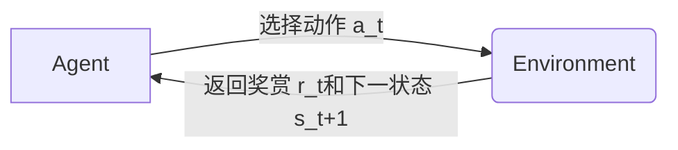
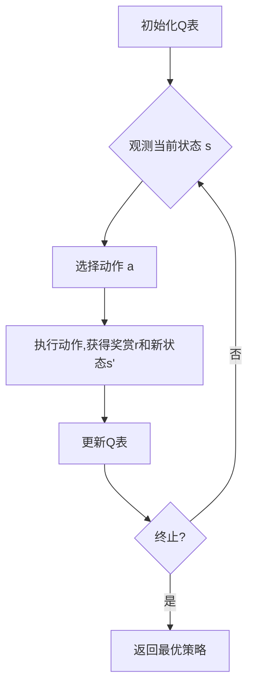

# 一切皆是映射：AI Q-learning在复杂系统中的挑战

## 1. 背景介绍

### 1.1 问题的由来

在当今快速发展的世界中,复杂系统无处不在。无论是自然界还是人工智能领域,我们都面临着需要理解和控制错综复杂的动态环境的挑战。传统的规则based或基于模型的方法在处理高度非线性、多变量和随机的复杂系统时往往会力不从心。

强化学习(Reinforcement Learning)作为机器学习的一个重要分支,为解决这一难题提供了一种全新的思路。其核心思想是通过与环境的互动,不断试错,获取反馈,自主学习最优策略,从而逐步掌握控制复杂系统的技能。

### 1.2 研究现状  

近年来,强化学习算法取得了长足的进步,尤其是结合深度学习的深度强化学习(Deep Reinforcement Learning)在多个领域取得了突破性的成就,如AlphaGo战胜人类顶尖棋手、OpenAI的机器人学会行走等。然而,现有算法在应对通用的复杂系统时仍面临诸多挑战:

- 状态空间爆炸(State Space Explosion)
- 奖赏疏离(Reward Sparsity)
- 环境非平稳性(Non-Stationarity)  
- 多智能体交互(Multi-Agent Interaction)
- 安全性和鲁棒性(Safety and Robustness)

其中,Q-learning作为强化学习中最经典和最广泛使用的off-policy算法之一,在处理复杂系统时也面临上述挑战。

### 1.3 研究意义

设计能够高效解决复杂系统控制问题的Q-learning算法对于人工智能的发展至关重要。这不仅能推动理论研究的深入,同时也将为众多实际应用场景带来革命性的变革,如智能交通系统、智能制造、机器人控制、资源优化调度等。本文将系统性地分析Q-learning在复杂系统中所面临的主要挑战,介绍相关的前沿研究进展,并对未来的发展方向进行展望。

### 1.4 本文结构

本文首先介绍Q-learning的核心概念和基本原理,然后重点分析其在复杂系统中遇到的主要挑战,对应地介绍了一些新兴的解决方案。接下来,我们将探讨Q-learning的数学模型,并结合实例深入解释其公式推导过程。此外,文中还将提供一个基于Python的Q-learning代码实例,帮助读者更好地理解和掌握算法实现细节。在此基础上,我们将介绍Q-learning在实际应用中的几个代表性场景。最后,文章将总结Q-learning的发展趋势和未来面临的挑战,并给出相关的学习资源和工具推荐。

## 2. 核心概念与联系

Q-learning作为强化学习领域的经典算法,其核心概念和思想也是整个强化学习领域的基石。为了更好地理解Q-learning在复杂系统中的应用,我们有必要先回顾一下强化学习和Q-learning的核心概念。

**强化学习(Reinforcement Learning)**是一种基于奖赏或惩罚的机器学习范式,其目标是使智能体(Agent)通过与环境(Environment)的交互来学习一种策略(Policy),从而最大化预期的长期奖赏。强化学习系统通常建模为一个马尔可夫决策过程(Markov Decision Process, MDP),由以下几个要素组成:

- 状态空间(State Space) $\mathcal{S}$
- 动作空间(Action Space) $\mathcal{A}$  
- 奖赏函数(Reward Function) $\mathcal{R}: \mathcal{S} \times \mathcal{A} \rightarrow \mathbb{R}$
- 状态转移概率(State Transition Probability) $\mathcal{P}_{ss'}^a = \mathbb{P}(s_{t+1}=s'|s_t=s,a_t=a)$
- 折扣因子(Discount Factor) $\gamma \in [0, 1)$

智能体与环境交互的过程可以用下图来描述:



目标是找到一个最优策略$\pi^*$,使得在该策略下的预期折现总奖赏最大化:

$$\pi^* = \arg\max_\pi \mathbb{E}_\pi \left[ \sum_{t=0}^\infty \gamma^t r_t \right]$$

**Q-learning**算法是一种无模型(Model-Free)的时序差分(Temporal Difference)强化学习算法,通过估计各状态-动作对的长期预期奖赏值(Action-Value Function)来逼近最优策略。我们定义Q函数为:

$$Q^\pi(s,a) = \mathbb{E}_\pi \left[ \sum_{k=0}^\infty \gamma^k r_{t+k+1} | s_t=s, a_t=a \right]$$

Q-learning的核心更新规则为:

$$Q(s_t, a_t) \leftarrow Q(s_t, a_t) + \alpha \left[ r_t + \gamma \max_{a'} Q(s_{t+1}, a') - Q(s_t, a_t) \right]$$

其中$\alpha$是学习率。通过不断与环境交互并更新Q函数,最终可以收敛到最优的Q*函数,从而得到最优策略$\pi^*(s) = \arg\max_a Q^*(s,a)$。

Q-learning的优势在于:
1. 无需事先了解环境的转移概率模型,可以通过在线互动来学习 
2. Off-policy特性,可以使用任意策略进行探索,提高学习效率
3. 收敛性证明,确保最终可以收敛到最优解

这些优点使得Q-learning成为强化学习领域应用最广泛的基础算法之一。然而,当面对复杂系统时,Q-learning也会遇到一系列的挑战,这需要我们对算法进行相应的改进和优化。

## 3. 核心算法原理 & 具体操作步骤

### 3.1 算法原理概述  

Q-learning的核心思想是通过估计最优Q值函数$Q^*(s,a)$来逼近最优策略$\pi^*$。算法原理可以用下图描述:



具体来说,算法首先初始化一个Q表,其中的元素$Q(s,a)$代表在状态s下执行动作a的长期预期奖赏值。然后在每一个时间步,智能体根据当前状态s和一定的策略(如$\epsilon$-贪婪)选择一个动作a执行,获得立即奖赏r和转移到新状态s'。根据这个转移过程,算法使用下面的Q-learning更新规则更新Q表中相应的Q值:

$$Q(s,a) \leftarrow Q(s,a) + \alpha \left[r + \gamma \max_{a'} Q(s',a') - Q(s,a)\right]$$

其中,
- $\alpha$是学习率,控制学习的速度
- $\gamma$是折扣因子,决定了未来奖赏的重要程度
- $\max_{a'} Q(s',a')$是新状态下的最大预期奖赏,也称为TD目标

通过不断地与环境交互并更新Q表,最终Q表会收敛到最优的Q*函数。此时,对任意状态s,执行$\arg\max_a Q^*(s,a)$即可获得最优动作,从而形成最优策略$\pi^*$。

需要注意的是,为了保证Q-learning的收敛性,通常需要满足以下条件:

1. 马尔可夫决策过程是可探索的(Explorable),即所有状态-动作对都可以被访问到
2. 学习率$\alpha$满足某些条件,如$\sum_{t=1}^\infty \alpha_t = \infty, \sum_{t=1}^\infty \alpha_t^2 < \infty$

### 3.2 算法步骤详解

下面我们用伪代码详细描述一下Q-learning算法的执行步骤:

```python
初始化 Q(s,a) = 0 对所有的状态-动作对 (s,a)
初始化 s    # 初始状态
重复 (对每个回合):
    初始化 done = False  
    重复 (对每个时间步):
        根据 epsilon-greedy 策略选择动作 a
        执行动作 a, 观测奖赏 r, 新状态 s'
        Q(s,a) = Q(s,a) + alpha * (r + gamma * max(Q(s',a')) - Q(s,a))
        s = s'
        如果 s' 是终止状态: 
            done = True
    直到 done
```

算法首先初始化Q表和初始状态s。然后对每个回合,重复以下步骤:

1. 根据当前状态s和$\epsilon$-贪婪策略选择一个动作a执行
2. 观测到立即奖赏r和新状态s'
3. 使用Q-learning更新规则更新Q(s,a)
4. 将当前状态更新为s'
5. 直到达到终止状态

其中,$\epsilon$-贪婪策略是一种广泛使用的行为策略,用于权衡探索(Exploration)和利用(Exploitation)之间的平衡:

- 以$\epsilon$的概率随机选择动作(探索)
- 以$1-\epsilon$的概率选择当前Q值最大的动作(利用)

$\epsilon$通常会随着时间的推移逐渐减小,以确保后期算法能够充分利用之前学到的经验。

### 3.3 算法优缺点

**优点:**

1. **无模型(Model-Free)**: Q-learning不需要事先了解环境的转移概率模型,可以通过在线互动直接从数据中学习,避免了建模的复杂性。
2. **Off-Policy**: Q-learning属于Off-Policy算法,这意味着它可以使用任意策略进行探索,而不局限于目标策略,从而大大提高了学习效率和策略改善的灵活性。
3. **收敛性**: 在满足适当条件下,Q-learning算法可以证明收敛于最优Q函数,并最终得到最优策略。
4. **简单直观**: Q-learning算法思路清晰,原理易于理解,实现也相对简单。

**缺点:**

1. **维数灾难**: 当状态空间和动作空间非常大时,Q表将变得非常巨大,导致计算和存储开销剧增,这被称为"维数灾难"(Curse of Dimensionality)。
2. **数据效率低下**: Q-learning通过不断与环境交互来学习,需要大量的在线数据,数据利用效率较低。
3. **收敛慢**: 特别是在大规模问题中,Q-learning往往需要大量的迭代次数才能收敛。
4. **过度探索**: 为了满足收敛条件,Q-learning需要持续探索,但过度探索会降低学习效率。

### 3.4 算法应用领域

尽管存在一些缺陷,但Q-learning由于其简单性和有效性,仍然被广泛应用于各个领域。下面列举一些典型的应用场景:

1. **机器人控制**: Q-learning可用于训练机器人完成各种任务,如行走、运动规划、机械臂控制等。
2. **游戏AI**: 很多经典游戏AI系统都使用了Q-learning算法,如AlphaGo、Atari游戏等。
3. **智能交通系统**: 可以通过Q-learning优化交通信号控制、车辆调度等,提高交通效率。
4. **资源优化调度**: 在数据中心、电网等系统中,Q-learning可用于优化资源的动态调度。
5. **智能制造**: 应用于工业机器人控制、工艺流程优化等,提高生产效率。
6. **金融交易**: 利用Q-learning进行自动化交易策略优化。
7. **推荐系统**: 将推荐问题建模为强化学习过程,使用Q-learning提高推荐质量。

总的来说,只要问题能够建模为马尔可夫决策过程,Q-learning就可以为之提供一种通用的求解方法。

## 4. 数学模型和公式 & 详细讲解 & 举例说明

### 4.1 数学模型构建

为了更好地理解和推导Q-learning算法的数学模型,我