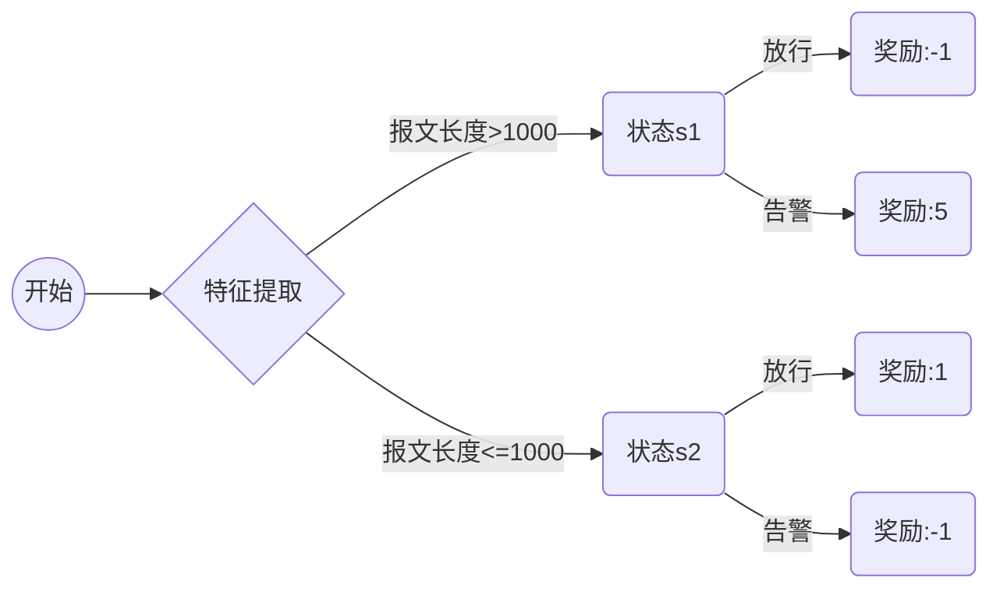

# 一切皆是映射：AI Q-learning在智能安全防护的应用

关键词：Q-learning, 智能安全, 强化学习, 映射, 状态-动作值函数, Bellman方程

## 1. 背景介绍
### 1.1  问题的由来
随着人工智能技术的飞速发展,智能安全防护已成为当今网络安全领域的一大热点和难点。传统的基于规则和特征的安全防护手段已难以应对日益复杂多变的网络攻击。如何利用AI技术,尤其是强化学习算法来构建智能、自适应的安全防护体系,成为亟待解决的关键问题。
### 1.2  研究现状
目前,国内外学者已开始探索将强化学习应用于智能安全防护的研究。CMU的Meng等人提出了一种基于Deep Q-Network的入侵检测方法[1]。腾讯安全团队利用Deep Q-learning实现了一种自适应的Web应用防火墙系统[2]。这些研究表明,强化学习在智能安全防护中具有广阔的应用前景。
### 1.3  研究意义 
本文以Q-learning算法为切入点,从"一切皆是映射"的视角来阐述强化学习在智能安全防护中的应用。通过深入剖析Q-learning的数学原理和工程实现,揭示其内在的"状态-动作值映射"机制,为构建智能安全防护体系提供新的思路和方法。这对于推动AI技术在网络安全领域的创新应用具有重要意义。
### 1.4  本文结构
本文将从以下几个方面展开论述：第2节介绍Q-learning的核心概念；第3节重点阐述Q-learning算法原理；第4节给出Q-learning的数学模型；第5节提供Q-learning的代码实例；第6节分析Q-learning在智能安全防护中的应用场景；第7节推荐相关学习资源；第8节总结全文并展望未来发展方向。

## 2. 核心概念与联系
Q-learning是一种无模型的离线策略强化学习算法[3]。其核心是通过学习一个最优的状态-动作值函数Q(s,a),来为智能体(Agent)选择最优动作策略。这里的Q值本质上就是一种状态到动作的映射。通过不断更新Q值,最终可以逼近最优映射Q*,从而使智能体学会在每个状态下选择最优动作。

在智能安全防护场景下,我们可以将恶意流量检测问题建模为一个强化学习过程：将检测引擎(如IDS、WAF等)视为智能体,将网络环境视为状态,将防护动作(如告警、阻断等)视为动作,将安全效果视为奖励,最终目标是学习一个最优的状态到动作的映射策略,使系统能够自适应地应对各种恶意流量。

## 3. 核心算法原理 & 具体操作步骤
### 3.1  算法原理概述
Q-learning的核心是价值迭代和策略提升的思想。通过价值迭代来不断更新状态-动作值函数Q(s,a),评估在状态s下采取动作a的长期价值；再利用贪婪策略根据Q值来选择最优动作,从而提升策略的性能。这个过程可以通过Bellman最优方程来形式化描述[4]：

$$Q^*(s,a)=\mathbb{E}[R_{t+1}+\gamma \max_{a'}Q^*(S_{t+1},a')|S_t=s,A_t=a]$$

其中,$Q^*(s,a)$表示状态-动作对(s,a)的最优价值,$R_{t+1}$表示采取动作a后获得的即时奖励,$\gamma$为折扣因子,$\max_{a'}Q^*(S_{t+1},a')$表示下一状态的最大Q值。

### 3.2  算法步骤详解
Q-learning算法主要分为以下5个步骤:

1. 初始化Q表格 $Q(s,a)$
2. 从状态 $s_t$ 开始,选取一个动作 $a_t$,一般采用 $\epsilon-greedy$ 策略,以 $\epsilon$ 的概率随机选择动作,否则选择Q值最大的动作。
3. 执行动作 $a_t$ 后,观察环境反馈的奖励 $r_t$ 和下一状态 $s_{t+1}$
4. 根据观察到的信息,利用Bellman方程来更新 $Q(s_t,a_t)$:
$$Q(s_t,a_t) \leftarrow Q(s_t,a_t)+\alpha[r_t+\gamma \max_aQ(s_{t+1},a)-Q(s_t,a_t)]$$
其中,$\alpha \in (0,1]$ 为学习率。
5. $s_t \leftarrow s_{t+1}$,循环执行步骤2-5,直到状态终止。

通过多轮次的探索学习,Q值最终会收敛到最优值 $Q^*(s,a)$,得到最优策略。

### 3.3  算法优缺点
Q-learning的主要优点有:
- 无需预先知道环境模型,通过探索来学习最优策略,具有自适应性。
- 离线更新,数据利用效率高,收敛性有保证。
- 通过 $\epsilon-greedy$ 策略在探索和利用间权衡,有助于找到全局最优。

但Q-learning也存在一些局限:
- 容易陷入局部最优,尤其在状态空间较大时。
- 对超参数敏感,如 $\alpha,\gamma,\epsilon$ 等,需要精细调优。
- 在连续状态空间上收敛速度慢,通常需要与函数近似等技术结合。

### 3.4  算法应用领域
Q-learning在众多领域得到了广泛应用,如:
- 自动驾驶:通过Q-learning来学习最优的驾驶策略[5]
- 推荐系统:利用Q-learning优化推荐策略,提升用户体验[6] 
- 智能电网:运用Q-learning来优化电网调度和能源管理[7]
- 通信网络:结合Q-learning来优化路由选择和资源分配[8]

在网络安全领域,Q-learning在异常检测、恶意软件分析、僵尸网络检测等方面展现出了良好的应用前景[9]。

## 4. 数学模型和公式 & 详细讲解 & 举例说明
### 4.1  数学模型构建
我们以恶意流量检测为例,来说明如何利用Q-learning构建检测模型。假设系统状态空间为 $\mathcal{S}$,包含流量统计特征(如报文长度、到达时间间隔等)；动作空间为 $\mathcal{A}=\{a_1,a_2\}$,其中 $a_1$ 表示放行, $a_2$ 表示告警；奖励函数为:
$$R(s,a)=\left\{\begin{matrix}
r_1, & if \ a=a_1 \ and \ s \in normal \\ 
r_2, & if \ a=a_2 \ and \ s \in malicious \\
-1, & otherwise
\end{matrix}\right.$$

这里 $r_1>0$ 表示对正常流量放行的奖励, $r_2>0$ 表示对恶意流量告警的奖励。我们的目标是学习一个最优状态-动作值函数 $Q^*(s,a)$。

### 4.2  公式推导过程
根据Bellman最优方程,我们可以得到Q-learning的更新公式:

$$\begin{aligned}
Q(s_t,a_t) & \leftarrow Q(s_t,a_t)+\alpha[R(s_t,a_t)+\gamma \max_aQ(s_{t+1},a)-Q(s_t,a_t)] \\
& =Q(s_t,a_t)+\alpha \delta_t
\end{aligned}$$

其中 $\delta_t=R(s_t,a_t)+\gamma \max_aQ(s_{t+1},a)-Q(s_t,a_t)$ 表示时间差分(TD)误差。可以证明,当 $\alpha$ 满足 $\sum_{t=1}^\infty \alpha_t=\infty$ 且 $\sum_{t=1}^\infty \alpha_t^2<\infty$ 时,Q值能够收敛到 $Q^*(s,a)$ [4]。

### 4.3  案例分析与讲解
下面我们以一个简单例子来说明Q-learning的工作原理。考虑如下的恶意流量检测场景:

在状态s1下,放行会导致恶意流量进入系统,奖励为负；而告警可以阻断恶意流量,奖励为正。在状态s2下则相反。我们的目标是学习一个最优策略 $\pi^*$,使长期累积奖励最大化。

假设初始Q值为0,折扣因子 $\gamma=0.9$,学习率 $\alpha=0.1$,采用 $\epsilon-greedy$ 策略,令 $\epsilon=0.2$。现在考虑如下一个学习序列:

$s_1 \stackrel{a_1}{\rightarrow} s_2 \stackrel{a_2}{\rightarrow} s_1 \stackrel{a_2}{\rightarrow} s_2$

根据Q-learning算法,我们可以得到:

$t=1: Q(s_1,a_1)=Q(s_1,a_1)+0.1[-1+0.9*0-Q(s_1,a_1)]=0-0.1=\mathbf{-0.1}$

$t=2: Q(s_2,a_2)=Q(s_2,a_2)+0.1[-1+0.9*\max(-0.1,0)-Q(s_2,a_2)]=0-0.19=\mathbf{-0.19}$

$t=3: Q(s_1,a_2)=Q(s_1,a_2)+0.1[5+0.9*\max(0,-0.19)-Q(s_1,a_2)]=0+0.481=\mathbf{0.481}$

经过3步更新后,我们得到了新的Q表:
|   | $a_1$ | $a_2$ |
|:---:|:---:|:---:|
|$s_1$| -0.1 | 0.481 |
|$s_2$| 0    | -0.19 |

可以看出,此时在状态s1下,选择告警动作($a_2$)可以获得更大的Q值,这与我们的预期是一致的。随着学习的不断进行,Q值会进一步被优化,最终收敛到最优值。

### 4.4  常见问题解答
Q: Q-learning能否处理连续状态空间?
A: 传统Q-learning是在离散状态空间上进行的,无法直接处理连续状态。但我们可以利用函数近似的方法,如DQN[10],通过神经网络来拟合Q函数,将其扩展到连续状态空间。

Q: Q-learning的收敛性如何保证?  
A: Q-learning作为一种随机逼近方法,其收敛性可以通过随机逼近理论来证明[11]。只要学习率满足 $\sum_{t=1}^\infty \alpha_t=\infty$ 且 $\sum_{t=1}^\infty \alpha_t^2<\infty$,同时每个状态-动作对能被无限次访问到,Q-learning就能以概率1收敛到最优值函数。

Q: Q-learning能否处理部分可观测环境?
A: 传统Q-learning是在马尔可夫决策过程(MDP)框架下进行的,要求环境状态完全可观测。若环境是部分可观测的,我们需要利用部分可观测马尔可夫决策过程(POMDP)来建模,可以使用Deep Recurrent Q-Network(DRQN)[12]等方法来学习POMDP下的最优策略。

## 5. 项目实践：代码实例和详细解释说明
### 5.1  开发环境搭建
我们使用Python作为开发语言,需要安装numpy、matplotlib等基础库。可以通过以下命令来安装:
```
pip install numpy matplotlib
```

### 5.2  源代码详细实现
下面给出Q-learning算法的Python实现:

```python
import numpy as np
import matplotlib.pyplot as plt

class QLearning:
    def __init__(self, state_dim, action_dim, learning_rate=0.1, gamma=0.9, epsilon=0.1):
        self.state_dim = state_dim  # 状态空间维度
        self.action_dim = action_dim  # 动作空间维度
        self.lr = learning_rate  # 学习率
        self.gamma = gamma  #