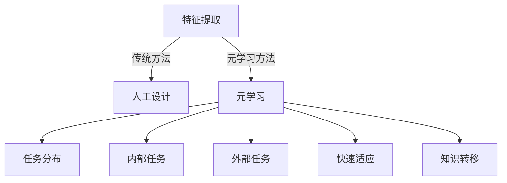
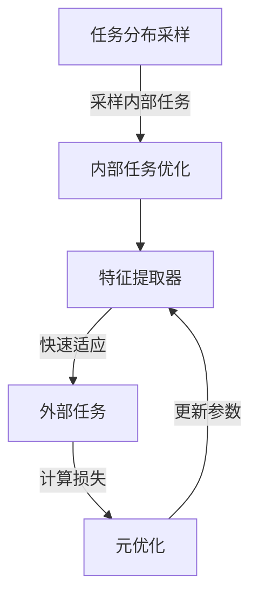

# 一切皆是映射：使用元学习进行有效的特征提取

## 1. 背景介绍

### 1.1 问题的由来

在机器学习和深度学习领域中,特征提取是一个关键步骤。传统的方法通常依赖于领域专家的经验和先验知识来手动设计特征提取器。然而,这种方法存在一些固有的缺陷:

1. **高成本和低效率**:手动设计特征提取器是一个耗时且昂贵的过程,需要大量的人力和专业知识。

2. **缺乏泛化能力**:手动设计的特征提取器通常只适用于特定的领域或任务,难以泛化到其他领域。

3. **缺乏自适应能力**:手动设计的特征提取器无法自动适应数据分布的变化,需要人工重新设计和调整。

为了解决这些问题,研究人员提出了使用元学习(Meta-Learning)的方法来自动学习特征提取器,从而实现有效的特征提取。

### 1.2 研究现状

近年来,元学习在自动特征提取领域取得了一些进展。一些流行的元学习方法包括:

- **MAML (Model-Agnostic Meta-Learning)**: 通过在多个任务上进行优化,学习一个可以快速适应新任务的初始化参数。

- **MetaQNN**: 使用元学习来优化卷积神经网络的权重,从而学习一个可以快速适应新任务的特征提取器。

- **Meta-Transfer Learning**: 通过在源域和目标域之间进行知识转移,学习一个可以泛化到新域的特征提取器。

尽管取得了一些进展,但现有的元学习方法在实际应用中仍然存在一些局限性,例如需要大量的计算资源、泛化能力有限等。因此,开发更加高效和通用的元学习算法仍然是一个重要的研究方向。

### 1.3 研究意义

发展有效的元学习特征提取方法具有重要的理论和实际意义:

1. **理论意义**:元学习特征提取可以被视为一种"学习如何学习"的范式,有助于我们更好地理解机器学习系统的本质,推动人工智能理论的发展。

2. **实际意义**:自动化的特征提取可以极大地降低人工成本,提高效率,并且可以应用于各种领域,如计算机视觉、自然语言处理、医疗影像分析等。

3. **泛化能力**:与手动设计的特征提取器相比,元学习特征提取器具有更强的泛化能力,可以更好地适应新的数据分布和任务。

4. **自适应能力**:元学习特征提取器可以根据数据分布的变化自动调整,从而提高系统的鲁棒性和适应性。

### 1.4 本文结构

本文将详细介绍使用元学习进行有效特征提取的理论和方法。文章的主要结构如下:

1. 背景介绍
2. 核心概念与联系
3. 核心算法原理与具体操作步骤
4. 数学模型和公式详细讲解
5. 项目实践:代码实例和详细解释
6. 实际应用场景
7. 工具和资源推荐
8. 总结:未来发展趋势与挑战
9. 附录:常见问题与解答

## 2. 核心概念与联系

在介绍元学习特征提取的具体算法之前,我们先来了解一些核心概念及其相互关系。

### 2.1 特征提取

特征提取(Feature Extraction)是指从原始数据中提取出对于特定任务更加有意义和高效的特征表示。在机器学习中,有效的特征提取对于模型的性能至关重要。

传统的特征提取方法通常依赖于人工设计,需要领域专家的先验知识。而元学习特征提取则是通过自动学习的方式来获得特征提取器,从而克服了传统方法的局限性。

### 2.2 元学习

元学习(Meta-Learning)是一种"学习如何学习"的范式。它的目标是学习一个可以快速适应新任务的模型初始化或优化策略。

在元学习特征提取中,我们希望通过在多个相关任务上进行优化,学习到一个可以快速适应新任务的特征提取器。这种方法可以显著提高特征提取器的泛化能力和自适应性。

### 2.3 任务分布

在元学习中,我们通常假设存在一个任务分布(Task Distribution),每个任务都是从这个分布中采样得到的。元学习算法的目标是学习一个可以泛化到任务分布中新任务的模型。

在特征提取的场景中,每个任务可以是一个特定的数据集或领域,我们希望学习到一个可以在不同数据集或领域中有效提取特征的特征提取器。

### 2.4 内部任务和外部任务

在元学习算法中,通常会区分内部任务(Inner Task)和外部任务(Outer Task)。

- **内部任务**:用于优化特征提取器的一系列任务,也称为元训练任务(Meta-Training Tasks)。
- **外部任务**:需要应用特征提取器的新任务,也称为元测试任务(Meta-Testing Tasks)。

元学习算法的目标是在内部任务上优化特征提取器,使其能够快速适应外部任务。

### 2.5 快速适应

快速适应(Fast Adaptation)是元学习的核心思想之一。它指的是通过少量数据或少量优化步骤,就可以使模型快速适应新任务的能力。

在特征提取场景中,我们希望通过少量数据就可以调整特征提取器,使其适应新的数据分布或任务,从而提高效率和泛化能力。

### 2.6 知识转移

知识转移(Knowledge Transfer)是另一个与元学习密切相关的概念。它指的是将在一个领域或任务中学习到的知识迁移到另一个领域或任务中。

在特征提取中,我们可以通过知识转移的方式,将在一个领域中学习到的特征提取器迁移到另一个领域,从而加速新领域的特征提取过程。

### 2.7 概念关联图

下面是上述核心概念之间的关联图:

这些概念相互关联,共同构成了元学习特征提取的理论基础。接下来,我们将深入探讨元学习特征提取的核心算法原理和具体实现方法。

## 3. 核心算法原理 & 具体操作步骤

### 3.1 算法原理概述

元学习特征提取的核心思想是:通过在一系列相关任务上进行优化,学习到一个可以快速适应新任务的特征提取器。这种方法可以克服传统手动设计特征提取器的局限性,提高特征提取器的泛化能力和自适应性。

具体来说,元学习特征提取算法通常包括以下几个关键步骤:

1. **任务分布采样**: 从一个任务分布中采样出一批内部任务(Meta-Training Tasks),用于优化特征提取器。

2. **内部任务优化**: 在内部任务上优化特征提取器的参数,使其能够在这些任务上表现良好。

3. **外部任务快速适应**: 对于新的外部任务(Meta-Testing Tasks),通过少量数据或少量优化步骤,快速调整特征提取器的参数,使其适应新任务。

4. **元优化**: 根据特征提取器在外部任务上的表现,对其参数进行元优化(Meta-Optimization),以提高其在整个任务分布上的泛化能力。

这个过程通过反复迭代,最终可以学习到一个具有良好泛化能力和自适应性的特征提取器。

下面是元学习特征提取算法的一般流程图:

不同的元学习算法在具体实现上可能有所不同,但总体思路是相似的。接下来,我们将介绍一些流行的元学习特征提取算法。

### 3.2 算法步骤详解

#### 3.2.1 MAML (Model-Agnostic Meta-Learning)

MAML是一种广为人知的元学习算法,它可以应用于各种模型架构和任务。在特征提取场景中,MAML的工作原理如下:

1. 从任务分布中采样一批内部任务。
2. 对于每个内部任务:
   - 将数据分为支持集(Support Set)和查询集(Query Set)。
   - 使用支持集数据优化特征提取器的参数,得到任务特定的参数。
   - 在查询集上计算损失函数。
3. 计算所有内部任务损失函数的总和,作为元损失函数(Meta-Loss)。
4. 通过优化元损失函数,更新特征提取器的初始参数。

MAML的优点是可以应用于任何可微分的模型架构,并且具有较好的泛化能力。但它也存在一些缺点,例如需要大量计算资源,并且在一些复杂任务上可能会遇到优化困难。

#### 3.2.2 MetaQNN

MetaQNN是一种专门用于优化卷积神经网络(CNN)特征提取器的元学习算法。它的工作原理如下:

1. 从任务分布中采样一批内部任务。
2. 对于每个内部任务:
   - 将数据分为支持集和查询集。
   - 使用支持集数据,通过少量梯度下降步骤优化CNN的卷积核参数。
   - 在查询集上计算损失函数。
3. 计算所有内部任务损失函数的总和,作为元损失函数。
4. 通过优化元损失函数,更新CNN卷积核的初始参数。

MetaQNN的优点是专门针对CNN进行了优化,可以有效地学习到一个泛化性强的特征提取器。但它也存在一些局限性,例如只适用于CNN架构,并且在非视觉任务上的表现可能不佳。

#### 3.2.3 Meta-Transfer Learning

Meta-Transfer Learning是一种将元学习与知识转移相结合的方法,用于学习可以跨领域泛化的特征提取器。它的工作原理如下:

1. 从源域(Source Domain)和目标域(Target Domain)的任务分布中采样内部任务。
2. 对于每个内部任务:
   - 将数据分为支持集和查询集。
   - 使用支持集数据优化特征提取器的参数,得到任务特定的参数。
   - 在查询集上计算损失函数。
3. 计算所有内部任务损失函数的总和,作为元损失函数。
4. 通过优化元损失函数,更新特征提取器的初始参数,使其能够在源域和目标域之间进行知识转移。

Meta-Transfer Learning的优点是可以学习到一个具有强大泛化能力的特征提取器,能够在不同领域之间进行有效的知识转移。但它也存在一些挑战,例如需要源域和目标域之间存在一定的相关性,并且可能需要更多的计算资源。

上述算法只是元学习特征提取领域的一小部分代表性算法。实际上,还存在许多其他算法和变体,如元学习器(Meta-Learner)、基于优化的元学习(Optimization-Based Meta-Learning)等。不同算法在不同场景下可能具有不同的优缺点,需要根据具体任务和要求进行选择和调整。

### 3.3 算法优缺点

元学习特征提取算法相比于传统的手动设计特征提取器,具有以下优点:

1. **自动化**: 无需人工设计和调整特征提取器,可以大大节省人力和时间成本。
2. **泛化能力强**: 通过在多个任务上进行优化,学习到的特征提取器具有更强的泛化能力,可以适应新的数据分布和任务。
3. **自适应性好**: 元学习特征提取器可以根据新任务的数据快速调整参数,具有良好的自适应性。
4. **知识转移**: 一些算法能够实现