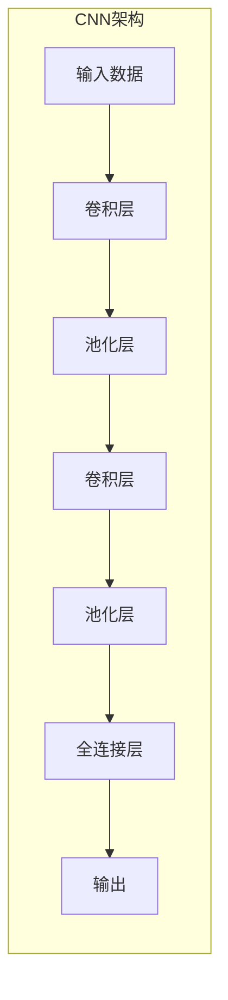

以下是标题为《一切皆是映射：卷积神经网络(CNN)原理解析》的技术博客文章正文内容：

# 一切皆是映射：卷积神经网络(CNN)原理解析

## 1. 背景介绍

### 1.1 问题的由来

在过去的几十年里，人工智能领域取得了长足的进步,尤其是在计算机视觉和模式识别等领域。传统的机器学习算法在处理结构化数据时表现良好,但在处理原始图像、视频、语音等非结构化数据时却面临着巨大的挑战。这促使研究人员不断探索新的算法和模型,以更好地解决这些复杂问题。

### 1.2 研究现状  

卷积神经网络(Convolutional Neural Network, CNN)作为一种前馈神经网络,在图像和视频识别、推荐系统以及自然语言处理等领域展现出了优秀的性能。自从AlexNet在2012年的ImageNet大赛上取得突破性成绩后,CNN在计算机视觉领域掀起了新的浪潮。如今,CNN已经成为深度学习中最成功和最流行的模型之一,被广泛应用于各种视觉任务中。

### 1.3 研究意义

CNN的核心思想是通过卷积操作对输入数据进行特征提取,并利用这些特征对输入数据进行分类或预测。与传统的神经网络相比,CNN在处理图像等高维数据时具有更高的效率和准确性。深入理解CNN的原理对于提高模型性能、优化模型结构、设计新的网络架构等具有重要意义。

### 1.4 本文结构

本文将从CNN的基本概念出发,逐步深入探讨其核心算法原理、数学模型及公式推导,并通过实际案例分析加深读者对CNN的理解。此外,文中还将介绍CNN的实际应用场景、开发工具和学习资源,最后对CNN的未来发展趋势和面临的挑战进行展望和讨论。

## 2. 核心概念与联系

CNN是一种特殊的人工神经网络,主要用于处理具有网格拓扑结构的数据,如图像、视频和语音等。CNN的核心思想是通过卷积操作从输入数据中提取特征,并利用这些特征进行模式识别和分类任务。

CNN由多个卷积层和池化层组成,每个卷积层由多个卷积核(也称为滤波器)构成。卷积核通过在输入数据上滑动,对局部区域进行特征提取,从而获得特征映射(Feature Map)。池化层则用于降低特征映射的维度,减少计算量和防止过拟合。

除了卷积层和池化层,CNN还包括全连接层,用于将提取的特征映射到最终的输出空间。通过反向传播算法对网络进行训练,CNN可以自动学习输入数据的特征表示,从而实现对输入数据的分类或预测。

CNN的核心思想体现了"一切皆是映射"的哲学,即通过一系列非线性映射将输入数据映射到期望的输出空间。这种映射过程包括卷积操作、池化操作和非线性激活函数等,共同构建了CNN的特征提取和模式识别能力。

## 3. 核心算法原理 & 具体操作步骤

### 3.1 算法原理概述

CNN的核心算法原理包括以下几个关键步骤:

1. **卷积操作(Convolution Operation)**: 通过卷积核在输入数据上滑动,对局部区域进行特征提取,生成特征映射。

2. **激活函数(Activation Function)**: 对卷积操作的输出结果应用非线性激活函数,增加网络的表达能力。

3. **池化操作(Pooling Operation)**: 对特征映射进行下采样,减少数据维度,提高计算效率并增强特征的平移不变性。

4. **全连接层(Fully Connected Layer)**: 将提取的特征映射到最终的输出空间,实现分类或回归任务。

5. **反向传播(Backpropagation)**: 通过计算损失函数对网络进行端到端的训练,自动学习特征表示和权重参数。

### 3.2 算法步骤详解

1. **卷积操作**

卷积操作是CNN的核心步骤,它通过卷积核在输入数据上滑动,对局部区域进行特征提取。具体步骤如下:

   a. 选择卷积核的大小和步长。
   b. 将卷积核在输入数据上滑动,对每个局部区域进行元素级乘积和求和操作。
   c. 将求和结果作为输出特征映射的一个元素。
   d. 重复步骤b和c,直到完成整个输入数据的卷积操作。

卷积操作可以看作是一种特征提取过程,通过学习到合适的卷积核权重,可以提取出输入数据中的重要特征。

2. **激活函数**

激活函数引入非线性,增加网络的表达能力。常用的激活函数包括ReLU、Sigmoid和Tanh等。激活函数对卷积操作的输出结果进行非线性变换,使得网络能够学习到更加复杂的特征表示。

3. **池化操作**

池化操作用于降低特征映射的维度,减少计算量并增强特征的平移不变性。常用的池化操作包括最大池化(Max Pooling)和平均池化(Average Pooling)。

   a. 选择池化窗口的大小和步长。
   b. 在特征映射上滑动池化窗口,对每个窗口内的元素进行最大值或平均值操作。
   c. 将操作结果作为下采样后的特征映射。

池化操作可以保留输入数据的主要特征,同时降低了数据的维度,从而提高了计算效率。

4. **全连接层**

全连接层将提取的特征映射到最终的输出空间,实现分类或回归任务。全连接层的每个神经元与前一层的所有神经元相连,通过权重矩阵进行线性变换。

5. **反向传播**

反向传播算法用于对CNN进行端到端的训练,自动学习特征表示和权重参数。具体步骤如下:

   a. 前向传播,计算输出结果。
   b. 计算输出结果与真实标签之间的损失函数。
   c. 反向传播,计算每个权重参数对损失函数的梯度。
   d. 使用优化算法(如梯度下降)更新权重参数。
   e. 重复步骤a到d,直到模型收敛或达到预设的迭代次数。

通过反向传播算法,CNN可以自动学习到最优的卷积核权重和全连接层权重,从而实现对输入数据的有效特征提取和模式识别。

### 3.3 算法优缺点

**优点**:

1. **自动特征提取**: CNN可以自动从原始数据中学习特征表示,无需人工设计特征。
2. **平移不变性**: 通过卷积操作和池化操作,CNN对输入数据的平移具有一定的不变性。
3. **参数共享**: 卷积核在整个输入数据上共享参数,大大减少了网络参数的数量,提高了计算效率。
4. **可解释性**: CNN提取的特征映射具有一定的可解释性,有助于理解模型的内部工作机制。

**缺点**:

1. **参数调优困难**: CNN模型包含许多超参数,如卷积核大小、步长、池化窗口大小等,调参过程复杂且耗时。
2. **对旋转和缩放敏感**: CNN对输入数据的旋转和缩放变换较为敏感,可能导致性能下降。
3. **对小目标检测效果差**: CNN在检测小目标时可能存在困难,需要采用特殊的网络结构和训练策略。
4. **需要大量数据**: CNN通常需要大量的训练数据才能达到较好的性能,对数据集的质量和数量有较高要求。

### 3.4 算法应用领域

CNN已被广泛应用于计算机视觉、自然语言处理、语音识别等领域,展现出了卓越的性能。以下是CNN的一些典型应用场景:

1. **图像分类**: CNN可以对图像进行分类,如识别图像中的物体、场景、人物等。
2. **目标检测**: CNN可以在图像或视频中定位和识别特定的目标对象。
3. **语义分割**: CNN可以对图像中的每个像素进行分类,实现对象的精确分割。
4. **视频分析**: CNN可以用于视频中的动作识别、人物跟踪、异常行为检测等任务。
5. **自然语言处理**: CNN可以应用于文本分类、情感分析、机器翻译等自然语言处理任务。
6. **语音识别**: CNN可以用于提取语音信号的特征,实现语音到文本的转换。
7. **推荐系统**: CNN可以从图像和文本数据中提取特征,用于个性化推荐。

随着CNN模型和算法的不断发展,其应用领域也在不断扩展,展现出了广阔的应用前景。

## 4. 数学模型和公式 & 详细讲解 & 举例说明

### 4.1 数学模型构建

CNN的数学模型可以表示为一系列函数组合,每个函数对应于网络中的一个操作步骤。我们用 $\mathbf{X}$ 表示输入数据, $\mathbf{Y}$ 表示输出结果,则CNN的数学模型可以表示为:

$$\mathbf{Y} = f(\mathbf{X}; \mathbf{W})$$

其中, $f$ 是一个复合函数,由多个子函数组成,表示CNN中的各个操作步骤; $\mathbf{W}$ 表示网络中的所有可学习参数,包括卷积核权重和全连接层权重。

我们可以将 $f$ 进一步分解为以下子函数:

$$f(\mathbf{X}; \mathbf{W}) = f_n \circ f_{n-1} \circ \cdots \circ f_2 \circ f_1(\mathbf{X}; \mathbf{W})$$

其中, $f_i$ 表示网络中的第 $i$ 个操作步骤,如卷积操作、激活函数、池化操作等。通过函数组合,我们可以构建出完整的CNN模型。

### 4.2 公式推导过程

接下来,我们将详细推导CNN中几个关键操作步骤的数学公式。

1. **卷积操作**

设输入数据为 $\mathbf{X} \in \mathbb{R}^{H \times W \times C}$,卷积核为 $\mathbf{K} \in \mathbb{R}^{k \times k \times C}$,步长为 $s$,则卷积操作可以表示为:

$$\mathbf{Y}_{i,j,m} = \sum_{c=1}^{C} \sum_{p=0}^{k-1} \sum_{q=0}^{k-1} \mathbf{X}_{s \cdot i + p, s \cdot j + q, c} \cdot \mathbf{K}_{p, q, c, m}$$

其中, $\mathbf{Y} \in \mathbb{R}^{H' \times W' \times M}$ 是卷积操作的输出特征映射, $H'$ 和 $W'$ 分别表示输出特征映射的高度和宽度, $M$ 表示卷积核的数量。

2. **激活函数**

常用的激活函数包括ReLU、Sigmoid和Tanh等,它们的数学表达式分别为:

ReLU: $f(x) = \max(0, x)$

Sigmoid: $f(x) = \frac{1}{1 + e^{-x}}$

Tanh: $f(x) = \frac{e^x - e^{-x}}{e^x + e^{-x}}$

3. **池化操作**

设输入特征映射为 $\mathbf{X} \in \mathbb{R}^{H \times W \times C}$,池化窗口大小为 $k \times k$,步长为 $s$,则最大池化操作可以表示为:

$$\mathbf{Y}_{i,j,c} = \max_{p=0, \ldots, k-1} \max_{q=0, \ldots, k-1} \mathbf{X}_{s \cdot i + p, s \cdot j + q, c}$$

其中, $\mathbf{Y} \in \mathbb{R}^{H' \times W' \times C