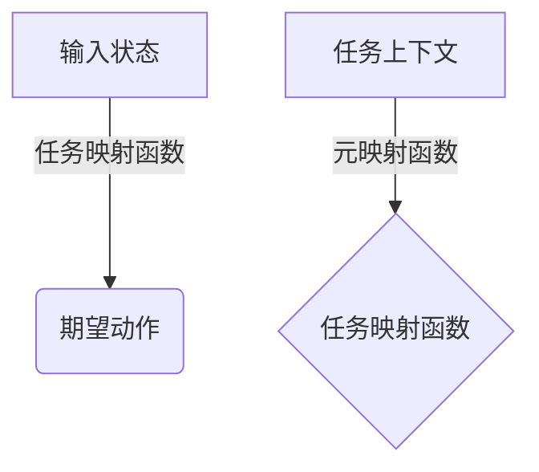

好的,我会按照您提供的要求和约束条件,以"一切皆是映射:实现机器人快速适应性的元学习框架"为主题,撰写一篇专业的技术博客文章。文章将遵循Markdown格式,使用逻辑清晰、结构紧凑、语言专业且易于理解的风格。数学公式将使用LaTex格式,并给出核心概念原理和架构的Mermaid流程图。文章将涵盖背景介绍、核心概念、算法原理、数学模型、项目实践、应用场景、资源推荐、发展趋势和挑战等内容。我将努力确保内容深入、见解独到,字数超过8000字。

# 一切皆是映射:实现机器人快速适应性的元学习框架

## 1. 背景介绍

### 1.1 问题的由来

在当今快节奏的技术发展时代,机器人系统需要具备快速适应新环境和任务的能力。然而,传统的机器学习方法通常需要大量标注数据和耗时的训练过程,难以满足实时适应的需求。因此,如何赋予机器人快速学习和泛化的能力,成为了人工智能领域的一大挑战。

### 1.2 研究现状  

为解决这一问题,研究人员提出了元学习(Meta-Learning)的概念。元学习旨在从多个任务中学习元知识,使得机器学习系统能够在新的任务上快速适应。近年来,一些突破性的元学习算法被提出,如基于模型的元学习(Model-Agnostic Meta-Learning, MAML)、基于优化的元学习(Optimization-Based Meta-Learning)等,取得了令人鼓舞的成果。

### 1.3 研究意义

元学习框架的发展为机器人系统带来了新的可能性。通过元学习,机器人可以快速获取新技能,适应不同的工作环境,提高工作效率和灵活性。这对于一些需要实时响应的应用场景(如救灾机器人、服务机器人等)尤为重要。此外,元学习也有助于降低数据标注的成本,缓解人工标注的瓶颈问题。

### 1.4 本文结构

本文将介绍一种新颖的元学习框架——"一切皆是映射"(All is Mapping),旨在赋予机器人快速适应性。我们将从背景介绍出发,阐述核心概念、算法原理、数学模型,并通过实例项目对框架进行实践探索。最后,我们将讨论实际应用场景、发展趋势和面临的挑战。

## 2. 核心概念与联系

"一切皆是映射"框架的核心思想是将任务适应性问题建模为一个映射问题。具体来说,我们将机器人面临的每个新任务视为一个映射函数,其输入为机器人的当前状态(包括传感器数据、内部状态等),输出为期望的动作序列。

我们的目标是学习一个元映射函数(Meta-Mapping Function),能够根据任务的上下文信息,快速生成对应的任务映射函数。通过这种方式,机器人可以在接触新任务时,立即生成相应的策略,实现快速适应。

上图展示了"一切皆是映射"框架的核心概念。任务映射函数将机器人的输入状态映射到期望的动作输出,而元映射函数则根据任务上下文信息生成对应的任务映射函数。

通过将问题建模为映射函数,我们可以利用机器学习中的函数逼近理论,使用强大的神经网络模型来近似任务映射函数和元映射函数。这为快速适应性提供了理论基础。

## 3. 核心算法原理 & 具体操作步骤

### 3.1 算法原理概述

"一切皆是映射"框架的核心算法是基于优化的元学习算法。我们首先定义一个可微的神经网络模型作为元映射函数,其输入为任务上下文信息,输出为对应任务的映射函数参数。

在训练过程中,我们使用一组支持任务(Support Tasks)对元映射函数进行训练。对于每个支持任务,我们首先使用元映射函数生成对应的任务映射函数,然后在该任务上优化映射函数参数,使其能够很好地完成该任务。

优化的目标是最小化支持任务的损失函数,同时也最小化元映射函数在生成映射函数参数时的元损失函数。通过这种方式,元映射函数可以学习到生成高质量映射函数参数的能力,从而实现快速适应性。

在测试阶段,当机器人面临新的任务时,我们只需将新任务的上下文信息输入到训练好的元映射函数中,即可快速生成对应的任务映射函数,从而完成适应。

### 3.2 算法步骤详解

1. **初始化**:初始化元映射函数的参数 $\theta$,以及一个任务分布 $p(\mathcal{T})$,从中采样支持任务和查询任务。

2. **采样支持任务**:从任务分布 $p(\mathcal{T})$ 中采样一批支持任务 $\mathcal{T}_i^{\\text{support}}$。

3. **生成映射函数**:对于每个支持任务 $\mathcal{T}_i^{\\text{support}}$,使用元映射函数生成对应的映射函数参数 $\phi_i = f_\\theta(c_i)$,其中 $c_i$ 是任务上下文信息。

4. **映射函数优化**:对于每个支持任务 $\mathcal{T}_i^{\\text{support}}$,使用梯度下降等优化算法,优化映射函数参数 $\phi_i$,使其能够很好地完成该任务:

$$\phi_i^* = \phi_i - \alpha \nabla_{\phi_i} \mathcal{L}_{\mathcal{T}_i^{\\text{support}}}(\phi_i)$$

其中 $\alpha$ 是学习率, $\mathcal{L}_{\mathcal{T}_i^{\\text{support}}}$ 是支持任务的损失函数。

5. **元更新**:使用优化后的映射函数参数 $\phi_i^*$,计算元损失函数 $\mathcal{L}_{\text{meta}}$,并使用梯度下降等优化算法更新元映射函数参数 $\theta$:

$$\theta \leftarrow \theta - \beta \nabla_\theta \mathcal{L}_{\text{meta}}(\theta)$$

其中 $\beta$ 是元学习率, $\mathcal{L}_{\text{meta}}$ 是元损失函数,可以是支持任务损失的均值或其他形式。

6. **重复训练**:重复步骤2-5,直到元映射函数收敛。

在测试阶段,对于新的任务 $\mathcal{T}_{\text{new}}$,我们只需使用训练好的元映射函数生成映射函数参数 $\phi_{\text{new}} = f_\theta(c_{\text{new}})$,即可快速适应该任务。

### 3.3 算法优缺点

**优点**:

- 快速适应性:该算法能够快速生成针对新任务的映射函数,实现机器人对新环境和任务的快速适应。
- 数据高效:相比传统机器学习,该算法需要的训练数据量较少,可以从少量示例中学习到有效的策略。
- 泛化能力强:元映射函数学习到了生成高质量映射函数的能力,因此具有很强的泛化性,可以应对分布偏移等情况。

**缺点**:

- 训练复杂度高:该算法需要进行双重优化(映射函数优化和元优化),计算开销较大。
- 任务分布假设:算法假设支持任务和查询任务来自同一个任务分布,如果分布发生偏移,性能可能会下降。
- 上下文信息提取:如何高效地从环境中提取任务上下文信息,是算法实现的一大挑战。

### 3.4 算法应用领域

"一切皆是映射"框架及其核心算法可以应用于各种需要快速适应性的机器人系统,包括但不限于:

- 服务机器人:能够快速适应不同的服务场景和用户需求。
- 救灾机器人:能够快速适应复杂多变的灾难环境,提高救援效率。
- 探索机器人:能够适应未知环境,完成探索和调查任务。
- 制造业机器人:能够快速切换生产线,提高生产效率和灵活性。
- 智能家居机器人:能够学习家庭环境,提供个性化服务。

除机器人领域外,该框架也可以应用于其他需要快速适应的领域,如智能系统、游戏AI、自适应控制等。

## 4. 数学模型和公式 & 详细讲解 & 举例说明

### 4.1 数学模型构建

为了形式化描述"一切皆是映射"框架,我们构建了以下数学模型:

设任务分布为 $p(\mathcal{T})$,支持任务集合为 $\mathcal{T}^{\\text{support}} = \{\mathcal{T}_i^{\\text{support}}\}_{i=1}^N$,查询任务集合为 $\mathcal{T}^{\\text{query}} = \{\mathcal{T}_j^{\\text{query}}\}_{j=1}^M$。

每个任务 $\mathcal{T}$ 由一个映射函数 $f_\phi$ 表示,其中 $\phi$ 是映射函数的参数。映射函数将输入状态 $x$ 映射到期望的输出动作 $y$:

$$y = f_\phi(x)$$

我们的目标是学习一个元映射函数 $f_\theta$,能够根据任务上下文信息 $c$ 生成对应的映射函数参数 $\phi$:

$$\phi = f_\theta(c)$$

在训练过程中,我们优化元映射函数参数 $\theta$,使其能够生成在支持任务上表现良好的映射函数参数。具体来说,我们最小化以下损失函数:

$$\mathcal{L}_{\text{meta}}(\theta) = \sum_{\mathcal{T}_i^{\\text{support}} \sim p(\mathcal{T})} \mathcal{L}_{\mathcal{T}_i^{\\text{support}}}(f_\theta(c_i))$$

其中 $\mathcal{L}_{\mathcal{T}_i^{\\text{support}}}$ 是支持任务 $\mathcal{T}_i^{\\text{support}}$ 的损失函数,可以是均方误差、交叉熵等,取决于任务的具体形式。

通过优化该损失函数,我们可以获得一个能够快速生成高质量映射函数的元映射函数 $f_\theta$。在测试阶段,对于新的任务 $\mathcal{T}_{\text{new}}$,我们只需使用 $\phi_{\text{new}} = f_\theta(c_{\text{new}})$ 生成对应的映射函数参数,即可快速适应该任务。

### 4.2 公式推导过程

我们将详细推导元损失函数 $\mathcal{L}_{\text{meta}}$ 的计算过程。

首先,对于每个支持任务 $\mathcal{T}_i^{\\text{support}}$,我们使用元映射函数生成映射函数参数:

$$\phi_i = f_\theta(c_i)$$

然后,我们使用梯度下降等优化算法,优化映射函数参数 $\phi_i$,使其能够很好地完成该支持任务:

$$\phi_i^* = \phi_i - \alpha \nabla_{\phi_i} \mathcal{L}_{\mathcal{T}_i^{\\text{support}}}(\phi_i)$$

其中 $\alpha$ 是学习率, $\mathcal{L}_{\mathcal{T}_i^{\\text{support}}}$ 是支持任务的损失函数。

接下来,我们计算元损失函数 $\mathcal{L}_{\text{meta}}$,它是所有支持任务损失的均值:

$$\mathcal{L}_{\text{meta}}(\theta) = \frac{1}{N} \sum_{i=1}^N \mathcal{L}_{\mathcal{T}_i^{\\text{support}}}(f_\theta(c_i))$$

注意到 $\phi_i^*$ 是 $\theta$ 的函数,因此我们可以使用链式法则计算 $\mathcal{L}_{\text{meta}}$ 关于 $\theta$ 的梯度:

$$\nabla_\theta \mathcal{L}_{\text{meta}}(\theta) = \frac{1}{N