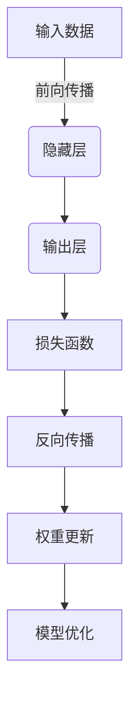
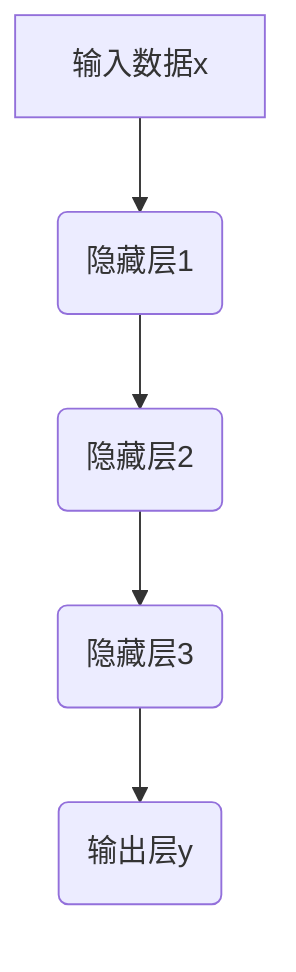

下面是以《一切皆是映射：深度学习中的前向传播算法》为题的技术博客文章正文：

# 一切皆是映射：深度学习中的前向传播算法

## 1. 背景介绍

### 1.1 问题的由来

在过去的几十年里，人工智能领域取得了长足的进步,尤其是深度学习技术的兴起,使得机器能够自主学习并解决越来越复杂的任务。然而,要真正理解深度学习的本质并高效地应用它,就必须深入探究其核心算法原理。前向传播算法作为深度学习模型的核心运算过程,其重要性不言而喻。

### 1.2 研究现状  

目前,前向传播算法在学术界和工业界都受到了广泛关注和研究。研究人员不断探索更高效、更准确的前向传播算法变体,以提高深度学习模型的性能和泛化能力。同时,工业界也在不断优化前向传播算法的实现,以加速模型训练和推理过程,满足实际应用场景的需求。

### 1.3 研究意义

深入理解前向传播算法的原理和实现细节,对于掌握深度学习的本质至关重要。通过剖析前向传播算法的数学模型、核心步骤和代码实现,我们可以更好地理解深度神经网络的工作机制,从而设计出更加高效和泛化性更强的模型。此外,优化前向传播算法的性能也是提高深度学习系统效率的关键所在。

### 1.4 本文结构

本文将从以下几个方面全面解析前向传播算法:

1. 介绍前向传播算法的核心概念和与其他深度学习组件的联系。
2. 详细阐述前向传播算法的原理、具体操作步骤、优缺点和应用领域。
3. 构建前向传播算法的数学模型,推导公式,并通过案例分析进行讲解。
4. 提供前向传播算法的代码实现示例,并对关键部分进行解读和分析。
5. 探讨前向传播算法在实际应用场景中的作用和未来发展趋势。
6. 推荐相关的学习资源、开发工具和论文,并总结常见问题与解答。

## 2. 核心概念与联系

前向传播算法是深度神经网络模型的核心运算过程,它将输入数据映射到输出,模拟了人脑的信息处理过程。在深度学习中,前向传播算法与其他组件密切相关,共同构成了完整的深度学习系统。

如上图所示,前向传播算法将输入数据传递到隐藏层,经过一系列非线性变换后,最终得到输出层的结果。这个过程中涉及到诸如卷积、池化、激活函数等操作。输出层的结果与真实标签之间的差异被称为损失函数,它将反馈给反向传播算法,用于更新神经网络的权重和偏置。通过不断地前向传播和反向传播,模型可以逐步优化,提高预测或分类的准确性。

因此,前向传播算法是深度学习模型的核心计算引擎,它与输入数据、隐藏层、输出层、损失函数、反向传播和模型优化等组件紧密耦合,共同构建了一个端到端的深度学习系统。

## 3. 核心算法原理 & 具体操作步骤

### 3.1 算法原理概述

前向传播算法的核心思想是将输入数据通过一系列线性和非线性变换,映射到输出空间。这个过程可以抽象为一个复合函数:

$$
y = f(x; W, b) = f^{(L)}(f^{(L-1)}(...f^{(1)}(x; W^{(1)}, b^{(1)})))
$$

其中:
- $x$是输入数据
- $y$是输出结果
- $W$和$b$分别代表权重和偏置
- $f^{(l)}$是第$l$层的变换函数,通常包含线性变换和非线性激活函数

整个前向传播过程可以看作是一系列嵌套的函数映射,将输入数据$x$逐层转换,最终得到输出$y$。每一层的变换函数$f^{(l)}$通常由线性变换(如全连接或卷积操作)和非线性激活函数(如ReLU或Sigmoid)组成。

### 3.2 算法步骤详解

前向传播算法可以概括为以下几个核心步骤:

1. **初始化**: 根据神经网络的架构,初始化每一层的权重$W$和偏置$b$,通常使用小的随机值。

2. **输入层**: 将输入数据$x$传递到第一层。

3. **隐藏层计算**:
   - 线性变换: 对上一层的输出进行线性变换,得到$z^{(l)} = W^{(l)}a^{(l-1)} + b^{(l)}$,其中$a^{(l-1)}$是上一层的输出。
   - 非线性激活: 对线性变换的结果应用非线性激活函数,得到$a^{(l)} = g(z^{(l)})$,其中$g$是激活函数,如ReLU或Sigmoid。
   - 重复上述两个步骤,直到计算完所有隐藏层。

4. **输出层计算**: 对最后一个隐藏层的输出进行线性变换,得到输出层的结果$y = f(x; W, b)$。

5. **输出结果**: 将输出层的结果$y$作为前向传播算法的最终输出。

上图展示了一个典型的三层隐藏层神经网络的前向传播过程。每一层都包含线性变换和非线性激活两个步骤,最终得到输出层的结果$y$。

### 3.3 算法优缺点

**优点**:

1. **可解释性强**: 前向传播算法模拟了人脑的信息处理过程,具有一定的生物学解释性。
2. **高度可并行化**: 前向传播算法的计算过程可以很好地利用现代硬件(如GPU)的并行计算能力,提高计算效率。
3. **高度可扩展性**: 通过增加隐藏层的数量和调整神经元的数量,前向传播算法可以处理越来越复杂的任务。

**缺点**:

1. **黑箱性质**: 虽然前向传播算法的原理相对简单,但是对于深层神经网络来说,中间隐藏层的计算过程仍然存在一定的黑箱性质,难以完全解释。
2. **过拟合风险**: 如果神经网络过于复杂,前向传播算法可能会过度拟合训练数据,导致泛化能力下降。
3. **梯度消失/爆炸**: 在训练深层神经网络时,前向传播算法可能会遇到梯度消失或梯度爆炸的问题,影响模型的收敛性能。

### 3.4 算法应用领域

前向传播算法广泛应用于各种深度学习任务,包括但不限于:

1. **计算机视觉**: 图像分类、目标检测、语义分割等。
2. **自然语言处理**: 机器翻译、文本生成、情感分析等。
3. **语音识别**: 自动语音识别、语音合成等。
4. **推荐系统**: 个性化推荐、广告推荐等。
5. **金融**: 金融风险预测、欺诈检测等。
6. **医疗**: 医学图像分析、疾病诊断等。

总的来说,前向传播算法是深度学习的核心计算引擎,在各种领域都发挥着重要作用。

## 4. 数学模型和公式 & 详细讲解 & 举例说明

### 4.1 数学模型构建

为了更好地理解前向传播算法的原理,我们需要构建其数学模型。考虑一个具有$L$层的全连接神经网络,其中第$l$层包含$n^{(l)}$个神经元。我们定义:

- $x$: 输入数据,维度为$n^{(0)}$
- $a^{(l)}$: 第$l$层的激活值(输出),维度为$n^{(l)}$
- $W^{(l)}$: 第$l$层的权重矩阵,维度为$n^{(l)} \times n^{(l-1)}$
- $b^{(l)}$: 第$l$层的偏置向量,维度为$n^{(l)}$
- $g^{(l)}$: 第$l$层的激活函数

则前向传播算法的数学模型可以表示为:

$$
\begin{aligned}
z^{(l)} &= W^{(l)}a^{(l-1)} + b^{(l)} \\
a^{(l)} &= g^{(l)}(z^{(l)})
\end{aligned}
$$

其中:

- $z^{(l)}$是第$l$层的线性变换结果,维度为$n^{(l)}$
- $a^{(l)}$是第$l$层的激活值(输出),维度为$n^{(l)}$
- $g^{(l)}$是第$l$层的激活函数,如ReLU或Sigmoid

对于输入层,我们有$a^{(0)} = x$。对于输出层(第$L$层),我们有$a^{(L)} = y$,其中$y$是神经网络的最终输出。

### 4.2 公式推导过程

现在,我们来推导前向传播算法的具体计算公式。

对于第$l$层,线性变换的计算公式为:

$$
z^{(l)} = W^{(l)}a^{(l-1)} + b^{(l)}
$$

其中:

$$
W^{(l)} = \begin{bmatrix}
w_{11}^{(l)} & w_{12}^{(l)} & \cdots & w_{1n^{(l-1)}}^{(l)} \\
w_{21}^{(l)} & w_{22}^{(l)} & \cdots & w_{2n^{(l-1)}}^{(l)} \\
\vdots & \vdots & \ddots & \vdots \\
w_{n^{(l)}1}^{(l)} & w_{n^{(l)}2}^{(l)} & \cdots & w_{n^{(l)}n^{(l-1)}}^{(l)}
\end{bmatrix}
$$

$$
a^{(l-1)} = \begin{bmatrix}
a_1^{(l-1)} \\
a_2^{(l-1)} \\
\vdots \\
a_{n^{(l-1)}}^{(l-1)}
\end{bmatrix}
$$

$$
b^{(l)} = \begin{bmatrix}
b_1^{(l)} \\
b_2^{(l)} \\
\vdots \\
b_{n^{(l)}}^{(l)}
\end{bmatrix}
$$

因此,线性变换的计算过程可以表示为:

$$
z_j^{(l)} = \sum_{i=1}^{n^{(l-1)}} w_{ji}^{(l)} a_i^{(l-1)} + b_j^{(l)}, \quad j = 1, 2, \ldots, n^{(l)}
$$

接下来,我们对线性变换的结果$z^{(l)}$应用激活函数$g^{(l)}$,得到第$l$层的激活值(输出):

$$
a^{(l)} = g^{(l)}(z^{(l)})
$$

其中,常用的激活函数包括:

- ReLU (Rectified Linear Unit): $g(z) = \max(0, z)$
- Sigmoid: $g(z) = \frac{1}{1 + e^{-z}}$
- Tanh: $g(z) = \frac{e^z - e^{-z}}{e^z + e^{-z}}$

通过不断重复上述线性变换和非线性激活的过程,我们可以计算出神经网络的最终输出$y = a^{(L)}$。

### 4.3 案例分析与讲解

为了更好地理解前向传播算法的计算过程,我们来分析一个具体的案例。

考虑一个简单的二层神经网络,其中输入层有2个神经元,隐藏层有3个神经元,输出层有1个神经元。我们定义:

- 输入数据: $x = \begin{bmatrix} 0.5 \\ 1.0 \end{bmatrix}$
- 隐