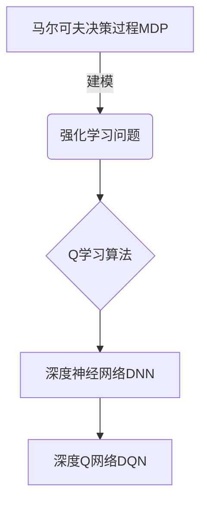

# 一切皆是映射：深度强化学习DQN在虚拟现实中的同步应用

## 1. 背景介绍

### 1.1 问题的由来

在过去的几十年里，人工智能领域取得了长足的进步。从最初的专家系统到现在的深度学习模型,AI技术已经渗透到我们生活的方方面面。然而,传统的AI系统大多基于有监督学习,需要大量标注好的训练数据,这在很多实际应用场景中难以获取。

强化学习(Reinforcement Learning, RL)作为一种全新的人工智能范式,为解决这一问题提供了新的思路。RL系统通过与环境交互并获取反馈信号(reward)来学习,无需事先标注的训练数据,使其在很多领域具有广阔的应用前景。

虚拟现实(Virtual Reality, VR)技术近年来也取得了飞速发展,逐渐被应用于游戏、教育、医疗等多个领域。将强化学习与虚拟现实相结合,可以为训练智能体提供一个安全、可控的模拟环境,避免了在真实环境中训练可能带来的风险和成本。

深度强化学习(Deep Reinforcement Learning, DRL)是将深度神经网络引入强化学习框架中的一种方法,使得智能体能够直接从原始的高维观测数据(如图像、视频等)中学习策略,大大拓展了强化学习的应用范围。其中,深度Q网络(Deep Q-Network, DQN)是DRL领域的一个里程碑式算法,为后续的许多算法奠定了基础。

### 1.2 研究现状  

近年来,DQN及其变体算法在许多领域取得了卓越的成绩,如Atari视频游戏、国际象棋、围棋等。然而,大多数研究都集中在离散动作空间的问题上,对于连续动作空间的应用还存在一些挑战。

同时,虽然有一些研究探索了在虚拟环境中应用DQN算法,但大多数工作都局限于简单的模拟场景,如机器人手臂控制等。将DQN应用到更加复杂、逼真的虚拟现实环境中,并与其他技术(如计算机图形学、物理引擎等)相结合,是一个值得深入研究的课题。

### 1.3 研究意义

将深度强化学习与虚拟现实技术相结合,可以为训练智能体提供一个安全、可控的模拟环境,避免了在真实环境中训练可能带来的风险和成本。同时,虚拟现实技术也可以为强化学习算法提供更加丰富、真实的观测数据,有助于提高算法的泛化能力。

此外,在虚拟现实环境中应用DQN算法,不仅可以探索其在连续动作空间的应用,还可以与其他技术(如计算机图形学、物理引擎等)相结合,为未来的智能系统开发提供新的思路和方法。

### 1.4 本文结构

本文将首先介绍深度强化学习DQN算法的核心概念和原理,包括马尔可夫决策过程、Q学习和深度神经网络等。接下来,将详细阐述DQN算法的具体实现步骤,包括经验回放、目标网络等关键技术。

然后,本文将构建DQN算法的数学模型,并推导出相关公式,同时通过实例对模型和公式进行详细说明。

在此基础上,本文将介绍如何在虚拟现实环境中应用DQN算法,包括开发环境的搭建、代码实现细节等,并展示算法在特定场景下的运行结果。

最后,本文将讨论DQN算法在虚拟现实中的实际应用场景,并对未来的发展趋势和面临的挑战进行展望。

## 2. 核心概念与联系

在深入探讨DQN算法之前,我们需要先了解一些核心概念,包括马尔可夫决策过程(Markov Decision Process, MDP)、Q学习(Q-Learning)和深度神经网络(Deep Neural Network, DNN)等。

### 2.1 马尔可夫决策过程

马尔可夫决策过程是强化学习问题的数学模型,用于描述智能体(Agent)与环境(Environment)之间的交互过程。它由以下几个要素组成:

- 状态集合(State Space) $\mathcal{S}$
- 动作集合(Action Space) $\mathcal{A}$
- 转移概率(Transition Probability) $\mathcal{P}_{ss'}^a = \mathcal{P}(s'|s, a)$
- 奖励函数(Reward Function) $\mathcal{R}: \mathcal{S} \times \mathcal{A} \rightarrow \mathbb{R}$
- 折扣因子(Discount Factor) $\gamma \in [0, 1)$

在每个时间步,智能体根据当前状态 $s_t$ 选择一个动作 $a_t$,然后环境根据转移概率 $\mathcal{P}_{ss'}^a$ 转移到下一个状态 $s_{t+1}$,同时给出相应的奖励 $r_{t+1} = \mathcal{R}(s_t, a_t)$。智能体的目标是学习一个策略 $\pi: \mathcal{S} \rightarrow \mathcal{A}$,使得累积奖励的期望值最大化:

$$
\max_\pi \mathbb{E}_\pi \left[ \sum_{t=0}^\infty \gamma^t r_{t+1} \right]
$$

### 2.2 Q学习算法

Q学习是一种基于价值函数的强化学习算法,它试图直接学习状态-动作对的价值函数 $Q(s, a)$,即在状态 $s$ 下选择动作 $a$ 后可获得的期望累积奖励。根据贝尔曼方程,最优的Q函数应该满足:

$$
Q^*(s, a) = \mathbb{E}_{s' \sim \mathcal{P}_{ss'}^a} \left[ r + \gamma \max_{a'} Q^*(s', a') \right]
$$

Q学习算法通过不断更新Q函数,使其逼近最优的Q函数 $Q^*$。更新规则如下:

$$
Q(s_t, a_t) \leftarrow Q(s_t, a_t) + \alpha \left[ r_{t+1} + \gamma \max_{a'} Q(s_{t+1}, a') - Q(s_t, a_t) \right]
$$

其中 $\alpha$ 是学习率。

### 2.3 深度神经网络

深度神经网络是一种强大的机器学习模型,具有近似任意连续函数的能力。在强化学习领域,我们可以使用深度神经网络来近似Q函数,即 $Q(s, a) \approx Q(s, a; \theta)$,其中 $\theta$ 是网络的参数。

通过梯度下降等优化算法,我们可以不断调整网络参数 $\theta$,使得 $Q(s, a; \theta)$ 逼近真实的Q函数。这种结合了Q学习和深度神经网络的方法,就是深度Q网络(DQN)算法。

## 3. 核心算法原理 & 具体操作步骤  

### 3.1 算法原理概述

深度Q网络(DQN)算法的核心思想是使用深度神经网络来近似Q函数,并通过经验回放(Experience Replay)和目标网络(Target Network)等技术来提高算法的稳定性和收敛性。

具体来说,DQN算法包含以下几个关键步骤:

1. 初始化一个评估网络(Evaluation Network) $Q(s, a; \theta)$ 和一个目标网络(Target Network) $\hat{Q}(s, a; \theta^-)$,两个网络的参数初始时相同。
2. 在每一个时间步,智能体根据评估网络输出的Q值选择动作,并将交互过程存储到经验回放池(Experience Replay Buffer)中。
3. 从经验回放池中采样一批数据,计算目标Q值 $y = r + \gamma \max_{a'} \hat{Q}(s', a'; \theta^-)$,并使用梯度下降法最小化损失函数 $\mathcal{L}(\theta) = \mathbb{E}_{(s, a, r, s') \sim D} \left[ (y - Q(s, a; \theta))^2 \right]$,更新评估网络的参数 $\theta$。
4. 每隔一定步数,将评估网络的参数复制到目标网络,即 $\theta^- \leftarrow \theta$。

通过上述步骤,DQN算法可以有效地解决传统Q学习算法中的不稳定性问题,并且能够直接从高维观测数据(如图像)中学习策略。

### 3.2 算法步骤详解

下面我们将详细介绍DQN算法的具体实现步骤:

#### 3.2.1 初始化

1. 初始化评估网络 $Q(s, a; \theta)$ 和目标网络 $\hat{Q}(s, a; \theta^-)$,两个网络的参数初始时相同,即 $\theta^- \leftarrow \theta$。
2. 初始化经验回放池 $D$,用于存储智能体与环境的交互数据。
3. 初始化其他超参数,如学习率 $\alpha$、折扣因子 $\gamma$、目标网络更新频率 $C$ 等。

#### 3.2.2 交互过程

对于每一个时间步 $t$:

1. 根据当前状态 $s_t$,选择动作 $a_t = \arg\max_a Q(s_t, a; \theta)$,并执行该动作。
2. 观测环境反馈的下一个状态 $s_{t+1}$ 和奖励 $r_{t+1}$。
3. 将转移过程 $(s_t, a_t, r_{t+1}, s_{t+1})$ 存储到经验回放池 $D$ 中。

#### 3.2.3 经验回放与网络更新

每隔一定步数,从经验回放池 $D$ 中采样一批数据 $(s, a, r, s')$,进行网络参数的更新:

1. 计算目标Q值:
   $$
   y = r + \gamma \max_{a'} \hat{Q}(s', a'; \theta^-)
   $$
2. 计算损失函数:
   $$
   \mathcal{L}(\theta) = \mathbb{E}_{(s, a, r, s') \sim D} \left[ (y - Q(s, a; \theta))^2 \right]
   $$
3. 使用优化算法(如梯度下降)最小化损失函数,更新评估网络的参数 $\theta$:
   $$
   \theta \leftarrow \theta - \alpha \nabla_\theta \mathcal{L}(\theta)
   $$
4. 每隔 $C$ 步,将评估网络的参数复制到目标网络:
   $$
   \theta^- \leftarrow \theta
   $$

#### 3.2.4 算法终止条件

算法将持续运行,直到满足某些终止条件,如:

- 达到最大训练步数
- 智能体的表现达到预期水平
- 其他自定义的终止条件

### 3.3 算法优缺点

#### 优点:

1. **无需监督数据**: DQN算法属于强化学习范畴,无需事先标注的训练数据,只需与环境交互即可学习策略。
2. **端到端学习**: DQN算法能够直接从原始的高维观测数据(如图像)中学习,无需手工设计特征。
3. **经验回放增强数据利用率**: 通过经验回放技术,DQN算法可以有效利用过去的交互数据,提高数据利用率。
4. **目标网络提高稳定性**: 引入目标网络机制,可以有效避免Q值的不稳定性,提高算法的收敛性。

#### 缺点:

1. **样本效率低下**: 尽管有经验回放技术,但DQN算法的样本效率仍然较低,需要大量的交互数据来训练。
2. **离散动作空间限制**: 原始DQN算法只适用于离散动作空间,对于连续动作空间的问题需要进行一些改进和扩展。
3. **超参数敏感性**: DQN算法的性能受多个超参数(如学习率、折扣因子等)的影响较大,需要进行细致的调参。
4. **潜在不稳定性**: 尽管引入了目标网络,但DQN算法在某些情况下仍可能出现不稳定的现象。

### 3.4 算法