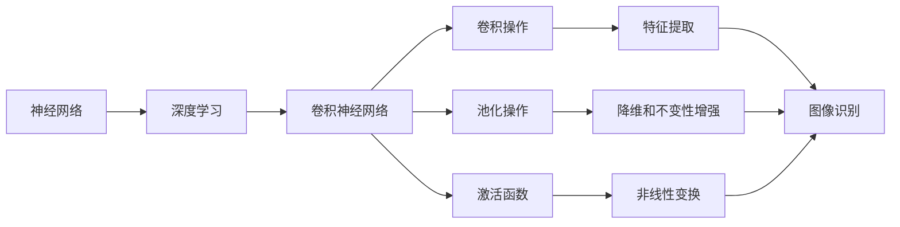

# 一切皆是映射：神经网络在图像识别中的应用案例

## 1. 背景介绍

### 1.1 问题的由来

在当今数字时代，图像数据无处不在。从个人照片到卫星遥感图像，从医学影像诊断到自动驾驶系统，图像处理和识别技术已经渗透到我们生活的方方面面。然而，对于人类来说，解读和理解图像内容是一个自然而然的过程，但是对于计算机系统来说，这却是一个极具挑战的任务。

传统的图像处理算法依赖于手工设计的特征提取器和分类器，这种方法需要大量的领域知识和人工干预。随着数据量的激增和问题复杂性的提高，传统方法在准确性和可扩展性方面都暴露出了明显的不足。因此，我们迫切需要一种新的范式来解决图像识别问题。

### 1.2 研究现状

近年来，深度学习技术在计算机视觉领域取得了令人瞩目的成就。作为机器学习的一个分支，深度学习旨在通过构建深层次的神经网络模型来自动学习数据的特征表示。这种基于数据驱动的方法不再依赖于人工设计的特征提取器，而是让神经网络自己从大量的训练数据中学习最优的特征表示。

在图像识别任务中，卷积神经网络(Convolutional Neural Networks, CNN)已经成为主导模型。CNN 通过多层卷积和池化操作来自动提取图像的局部特征，并通过全连接层进行高层次的特征融合和分类。凭借其强大的特征学习能力和端到端的训练方式，CNN 在多个公开的图像识别竞赛中取得了压倒性的优势，超越了传统的机器学习方法。

### 1.3 研究意义

图像识别技术在许多领域都有着广泛的应用前景。准确的图像识别可以帮助自动驾驶系统识别道路标志和行人，提高交通安全；可以在医学影像诊断中辅助医生发现疾病症状，提高诊断准确率；可以在安防监控系统中实时检测潜在威胁，提高公共安全水平；还可以在零售业中识别商品，优化库存管理等。

然而，尽管神经网络在图像识别领域取得了巨大的进展，但仍然存在一些挑战和局限性。例如，神经网络模型通常需要大量的训练数据和计算资源，对于一些小数据集或特殊领域的任务可能表现不佳。此外，神经网络的"黑箱"特性也使得其决策过程缺乏透明度和可解释性，这在一些安全敏感的应用场景中可能会引发隐患。

因此，深入探讨神经网络在图像识别中的应用案例，剖析其核心原理和算法细节，分析其优缺点和面临的挑战，对于推动这一领域的发展具有重要意义。

### 1.4 本文结构

本文将全面探讨神经网络在图像识别中的应用。首先介绍图像识别任务的背景和研究现状，阐明研究的重要意义。接下来详细阐述卷积神经网络的核心概念和基本原理，包括网络架构、前向传播和反向传播等。然后深入剖析卷积神经网络在图像识别中的核心算法，如卷积操作、池化操作和激活函数等，并给出具体的数学模型和公式推导过程。

此外，本文还将提供一个实际的项目案例，包括开发环境搭建、代码实现细节和运行结果展示，帮助读者更好地理解卷积神经网络的实践应用。最后，本文将总结神经网络在图像识别领域的发展趋势和面临的挑战，并给出一些工具和资源推荐，以供读者进一步学习和探索。

## 2. 核心概念与联系

在深入探讨卷积神经网络的算法细节之前，让我们先了解一些核心概念和它们之间的联系。

**神经网络(Neural Network)**是一种受生物神经系统启发而设计的计算模型。它由大量的人工神经元(节点)组成,这些节点通过加权连接进行信息传递和处理。神经网络的目标是通过学习大量训练数据,自动发现数据内在的模式和规律,从而对新的输入数据进行预测或分类。

**深度学习(Deep Learning)**是机器学习的一个分支,它的核心思想是使用具有多个隐藏层的深层次神经网络模型来自动学习数据的特征表示。与传统的浅层神经网络相比,深度学习模型具有更强的特征学习能力,可以从原始数据中自动提取多层次的抽象特征,从而更好地解决复杂的任务。

**卷积神经网络(Convolutional Neural Network, CNN)**是深度学习中专门用于处理图像和视频数据的一种网络结构。CNN 的核心思想是通过卷积操作和池化操作来自动提取图像的局部特征,并通过多层次的特征组合和非线性变换来学习更高层次的抽象特征。CNN 在图像识别、目标检测和语义分割等计算机视觉任务中表现出色。

**卷积(Convolution)**是CNN中最关键的操作之一。它通过在输入图像上滑动一个小窗口(卷积核),对窗口内的像素值进行加权求和,从而提取局部特征。卷积操作可以自动学习不同的特征检测器,如边缘检测器、纹理检测器等,从而捕捉图像中的重要模式。

**池化(Pooling)**是CNN中另一个重要的操作。它通过在输入特征图上滑动一个小窗口,对窗口内的值进行下采样(如取最大值或平均值),从而实现特征图的降维和不变性增强。池化操作可以减少计算量,提高网络的鲁棒性,并捕捉图像的大尺度特征。

**激活函数(Activation Function)**是神经网络中引入非线性的关键环节。常用的激活函数包括Sigmoid、Tanh和ReLU等。激活函数的作用是对神经元的输出进行非线性变换,增强网络的表达能力,并引入稀疏性,从而更好地捕捉数据的复杂模式。

这些核心概念相互关联,共同构建了卷积神经网络的基本框架。神经网络提供了基本的计算模型,深度学习赋予了网络自动学习特征的能力,卷积操作和池化操作使网络能够高效地处理图像数据,而激活函数则引入了非线性,增强了网络的表达能力。通过这些概念的有机结合,卷积神经网络成为了图像识别领域的主导模型。

## 3. 核心算法原理 & 具体操作步骤

### 3.1 算法原理概述

卷积神经网络的核心算法原理可以概括为以下几个关键步骤:

1. **卷积操作(Convolution)**: 通过在输入图像上滑动卷积核,对局部像素区域进行加权求和,从而提取局部特征。卷积操作可以自动学习不同的特征检测器,如边缘检测器、纹理检测器等,从而捕捉图像中的重要模式。

2. **激活函数(Activation Function)**: 对卷积层的输出应用非线性激活函数,如ReLU、Sigmoid或Tanh等,以增强网络的表达能力和稀疏性,从而更好地捕捉数据的复杂模式。

3. **池化操作(Pooling)**: 在卷积层的输出特征图上滑动小窗口,对窗口内的值进行下采样(如取最大值或平均值),从而实现特征图的降维和不变性增强。池化操作可以减少计算量,提高网络的鲁棒性,并捕捉图像的大尺度特征。

4. **全连接层(Fully Connected Layer)**: 将多个卷积层和池化层的输出展平,并通过全连接层进行高层次的特征融合和分类。全连接层可以学习到更抽象和全局的特征表示。

5. **反向传播(Backpropagation)**: 根据输出层的预测结果和真实标签计算损失函数,并通过反向传播算法调整网络中所有可训练参数的权重,使得损失函数最小化,从而实现网络的端到端训练。

6. **模型评估和优化**: 在训练过程中,通过监控验证集上的性能指标(如准确率、精确率、召回率等),评估模型的泛化能力。根据评估结果,可以调整超参数(如学习率、正则化强度等)或采用一些优化策略(如数据增强、模型集成等),以进一步提高模型的性能。

这些步骤按照特定的网络架构(如AlexNet、VGGNet、ResNet等)进行组合和堆叠,构建出完整的卷积神经网络模型。通过大量的训练数据和反向传播算法,网络可以自动学习最优的特征表示,从而实现准确的图像识别。

### 3.2 算法步骤详解

接下来,我们将详细解释卷积神经网络算法的具体操作步骤。

#### 3.2.1 卷积操作

卷积操作是卷积神经网络中最关键的步骤之一。它通过在输入图像上滑动一个小窗口(卷积核),对窗口内的像素值进行加权求和,从而提取局部特征。具体操作步骤如下:

1. 初始化卷积核权重。卷积核是一个小矩阵,其中的元素值就是需要学习的权重参数。

2. 在输入图像上滑动卷积核。每次滑动,卷积核会覆盖输入图像的一个局部区域。

3. 对卷积核覆盖的局部区域进行元素级别的乘积和求和操作,得到一个单一的输出值。这个输出值就代表了该局部区域的特征响应。

4. 将卷积核在输入图像上继续滑动,重复步骤3,直到覆盖整个输入图像。

5. 将所有的输出值组合成一个新的二维特征图(Feature Map)。

通过学习不同的卷积核权重,卷积层可以自动发现不同的特征检测器,如边缘检测器、纹理检测器等,从而捕捉图像中的重要模式。

#### 3.2.2 激活函数

激活函数是神经网络中引入非线性的关键环节。在卷积层的输出上应用非线性激活函数,可以增强网络的表达能力和稀疏性,从而更好地捕捉数据的复杂模式。常用的激活函数包括:

- **ReLU(Rectified Linear Unit)**: 对于输入值小于0的部分,ReLU函数直接将其置为0,否则保持不变。ReLU函数的数学表达式为: $f(x) = max(0, x)$。ReLU函数的优点是计算简单、收敛速度快,并且可以有效地解决梯度消失问题。

- **Sigmoid函数**: Sigmoid函数将输入值映射到(0,1)区间,常用于二分类任务的输出层。其数学表达式为: $f(x) = \frac{1}{1 + e^{-x}}$。

- **Tanh函数**: Tanh函数将输入值映射到(-1,1)区间,常用于多分类任务的输出层。其数学表达式为: $f(x) = \frac{e^x - e^{-x}}{e^x + e^{-x}}$。

激活函数的作用是引入非线性,增强网络的表达能力,并引入稀疏性,从而更好地捕捉数据的复杂模式。在卷积神经网络中,通常在卷积层和全连接层的输出上应用激活函数。

#### 3.2.3 池化操作

池化操作是卷积神经网络中另一个重要的步骤。它通过在输入特征图上滑动一个小窗口,对窗口内的值进行下采样(如取最大值或平均值),从而实现特征图的降维和不变性增强。具体操作步骤如下:

1.