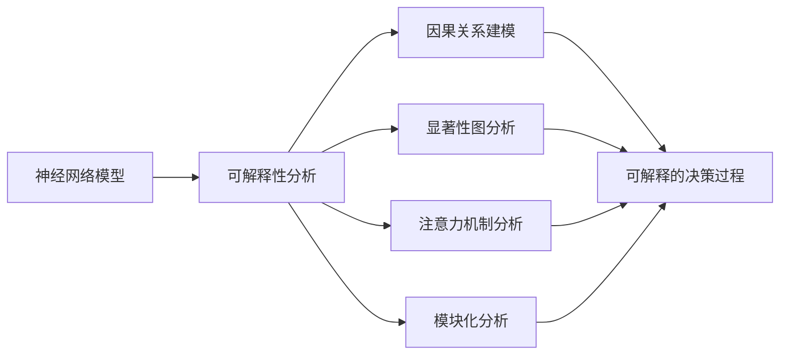

# 一切皆是映射：神经网络的可解释性问题

关键词：神经网络、可解释性、映射、黑盒模型、可视化、注意力机制、因果推理

## 1. 背景介绍 
### 1.1 问题的由来
近年来,深度学习和神经网络技术取得了巨大的进步,在计算机视觉、自然语言处理、语音识别等领域取得了突破性的成果。然而,尽管神经网络展现出了强大的性能,但其内部工作机制仍然是一个"黑盒子"。我们往往很难解释神经网络是如何得出特定的输出结果的。这种缺乏可解释性的问题,限制了神经网络在某些对决策过程有严格要求的领域(如医疗诊断、自动驾驶等)的应用。因此,研究神经网络的可解释性问题,对于深度学习技术的进一步发展和应用具有重要意义。

### 1.2 研究现状
目前,关于神经网络可解释性的研究主要集中在以下几个方面:

1. **后验解释方法**:通过对训练好的模型进行分析,来解释模型的决策过程,如通过可视化方法、显著性图等揭示神经元的激活模式与输入的关系。代表性工作有CAM、Grad-CAM等。

2. **注意力机制**:通过在神经网络中引入注意力机制,使网络能够关注输入中的关键区域,提高模型的可解释性。如Transformer中的自注意力机制。  

3. **模块化神经网络**:将复杂的任务分解为多个子任务,每个子任务由独立的模块完成,再将各模块的输出组合得到最终结果。每个模块的功能相对简单且独立,更容易解释。

4. **因果推理**:从因果关系的角度来分析神经网络,通过建立变量间的因果模型,研究输入变化对输出的影响,从而解释网络行为。代表性工作如CIU。

### 1.3 研究意义
神经网络可解释性研究对于以下几个方面具有重要意义:

1. 提高模型的可靠性和可信度,特别是在一些安全关键领域,决策过程的可解释性是应用的基本要求。

2. 帮助我们更好地理解神经网络的工作机制,为网络结构的改进和性能的提升提供启发。 

3. 便于发现和纠正模型存在的偏差和错误,提高模型的鲁棒性。

4. 探索通用人工智能的实现路径,因为可解释性和因果推理能力是智能系统必备的重要属性。

### 1.4 本文结构
本文将从以下几个方面对神经网络可解释性问题进行探讨:

1. 介绍可解释性问题的核心概念,以及与神经网络之间的联系。
2. 重点介绍几种主流的可解释性算法的原理和实现步骤。 
3. 介绍相关的数学模型和公式,并结合实例进行讲解。
4. 给出具体的代码实践案例。
5. 分析可解释性技术在实际场景中的应用情况。
6. 推荐相关的学习资源和工具。
7. 总结全文,并对未来的发展趋势和挑战进行展望。

## 2. 核心概念与联系
在讨论神经网络可解释性之前,我们首先要明确几个核心概念:

- **可解释性**:是指人们对智能系统如何得出某个决策的理解和解释的能力。一个可解释的模型不应该是一个"黑盒子",它的决策过程应该是透明的、可理解的。

- **黑盒模型**:是指对于给定的输入,我们可以得到相应的输出,但是无法了解输入和输出之间发生了什么。传统的深度神经网络通常被视为黑盒模型。

- **因果关系**:是指一个事件(原因)导致另一个事件(结果)发生的关系。在可解释性研究中,我们希望了解输入特征与输出决策之间的因果关系。

- **显著性图**:是指反映输入数据的不同部分对模型输出的重要程度的热力图。通过显著性图,我们可以直观地了解模型关注的区域。

- **注意力机制**:是一种模仿人类视觉注意力的机制,它可以使模型在做出决策时集中关注输入数据中的关键信息,而忽略次要的信息。

- **模块化**:是指将复杂系统分解为多个独立的、可复用的模块。每个模块负责一个特定的子任务。通过模块组合,可以构建出功能完整的系统。模块化有利于提高系统的可解释性。

神经网络,特别是深度神经网络,由于其复杂的结构和大量的参数,其内部决策过程对于人类来说是难以理解的。如果我们能够从可解释性的角度来分析神经网络,理解其内部工作机制,那么就可以更好地解释其行为,提高其可信度。下图展示了神经网络可解释性研究的一般思路:

总的来说,神经网络可解释性研究就是要从各个角度(如因果关系、显著性图、注意力机制、模块化等)来分析神经网络的内部工作机制,揭示其决策过程,使其从一个黑盒子变为一个可解释、可理解的白盒子。这对于神经网络技术的应用和发展具有重要意义。

## 3. 核心算法原理 & 具体操作步骤
### 3.1 算法原理概述
目前,针对神经网络可解释性问题,主要有以下几类算法:

1. **基于梯度的方法**:如Gradient、Gradient*Input、Integrated Gradients等,通过计算输入特征对输出的梯度,来衡量不同输入特征的重要性。

2. **基于反向传播的方法**:如LRP、DeepLIFT等,通过反向传播将输出的预测分数逐层分配到输入特征,从而得到每个输入特征的重要性。

3. **基于扰动的方法**:如Occlusion、LIME、SHAP等,通过在输入上进行局部扰动,观察输出的变化,来衡量输入特征的重要性。

4. **基于激活的方法**:如CAM、Grad-CAM等,通过可视化网络中间层的激活图,观察不同输入区域对输出的影响。

5. **基于注意力机制的方法**:在模型中加入注意力机制,通过可视化注意力权重,分析模型关注的输入区域。

6. **基于因果推理的方法**:通过构建因果模型,研究输入特征与输出之间的因果关系,从而解释模型行为。

这些方法从不同角度揭示了神经网络的决策过程,提高了模型的可解释性。下面我们重点介绍几种常用算法的原理和实现步骤。

### 3.2 算法步骤详解
#### 3.2.1 Grad-CAM
Grad-CAM(Gradient-weighted Class Activation Mapping)是一种用于理解CNN决策的可视化方法。其基本思想是:对于一个给定的类别,找到网络中最后一个卷积层中对该类别贡献最大的通道,并生成一个类激活图。具体步骤如下:

1. 将图像输入到训练好的CNN模型中,得到预测分数。
2. 对于目标类别,计算预测分数相对于最后一个卷积层特征图的梯度。
3. 对梯度进行全局平均池化,得到每个特征图通道的权重。
4. 用权重加权特征图,并对所有加权的特征图求和,得到类激活图。
5. 对类激活图应用ReLU,只保留正向激活。
6. 将类激活图上采样到输入图像的尺寸,并叠加到输入图像上可视化。

通过Grad-CAM,我们可以直观地看到图像中哪些区域对模型的决策起到了关键作用。

#### 3.2.2 SHAP
SHAP(SHapley Additive exPlanations)是一种基于博弈论中的Shapley值来解释模型预测的方法。其核心思想是:将模型预测值看作是各个输入特征的贡献之和,每个特征的贡献由其Shapley值决定。Shapley值衡量了每个特征在所有可能的特征组合中的平均边际贡献。SHAP的计算步骤如下:

1. 定义一个背景数据集,通常为所有样本的平均值。
2. 对于待解释的输入样本,考虑所有可能的特征子集。
3. 对每个特征子集,将其余特征替换为背景值,计算模型输出。
4. 对每个特征,计算其在所有特征子集中的边际贡献,并取平均值得到其Shapley值。
5. 将所有特征的Shapley值相加,得到模型输出。
6. 将Shapley值可视化,正值表示正向贡献,负值表示负向贡献。

SHAP提供了一种统一的、理论完善的解释框架,可以用于解释各种类型的模型,如树模型、神经网络等。

#### 3.2.3 IBA
IBA(Integrated Gradients, Attention and Bias Attribution)是一种结合了多种可解释性方法的综合性算法。其核心思路是同时考虑梯度、注意力和偏置对模型决策的影响。具体步骤如下:

1. 计算输入特征对模型输出的积分梯度(IG),衡量每个输入特征的重要性。
2. 提取模型中注意力机制的权重,反映模型关注的输入区域。
3. 计算模型中每层的偏置项,刻画了模型的先验知识。
4. 将IG、注意力权重和偏置项结合起来,综合考虑三者对模型决策的影响。
5. 生成最终的特征重要性分数,并以热力图的形式可视化。

IBA融合了多个角度,能够更全面地解释模型行为。

### 3.3 算法优缺点
以上几种可解释性算法各有优缺点:

- Grad-CAM的优点是实现简单,计算高效,可以用于大多数CNN模型。但其缺点是分辨率较低,对噪声敏感,且只关注正向激活。  

- SHAP的优点是理论基础完善,适用于多种模型,可以衡量个体特征贡献。缺点是计算复杂度高,对于高维数据和复杂模型难以应用。

- IBA的优点是融合了多种信息,更加全面。缺点是实现复杂,计算成本高。

总的来说,没有一种算法能够完美地解决可解释性问题,需要根据具体任务和模型来选择合适的方法。

### 3.4 算法应用领域
以上介绍的可解释性算法在以下领域有广泛应用:

- 计算机视觉:用于理解图像分类、目标检测等任务中CNN模型的决策过程,如医学影像诊断、自动驾驶等。

- 自然语言处理:用于分析文本分类、情感分析、机器翻译等任务中模型的行为,解释关键词和上下文的影响。

- 推荐系统:用于解释用户画像和物品属性对推荐结果的影响,提高推荐的可信度和准确性。

- 金融风控:用于解释风险评估模型的决策依据,识别关键风险因子,满足监管要求。

此外,在医疗、法律、教育等领域,可解释性也是AI应用的重要前提。可解释性算法为这些领域的智能化应用奠定了基础。

## 4. 数学模型和公式 & 详细讲解 & 举例说明
本节我们以SHAP为例,详细介绍其背后的数学模型和公式,并给出具体的案例解释。

### 4.1 数学模型构建
假设我们有一个模型$f$,它将特征向量$\boldsymbol{x} \in \mathbb{R}^M$映射到输出$f(\boldsymbol{x})$。我们的目标是解释$f(\boldsymbol{x})$与$\boldsymbol{x}$的每个分量$x_i$之间的关系。SHAP的核心思想是将模型输