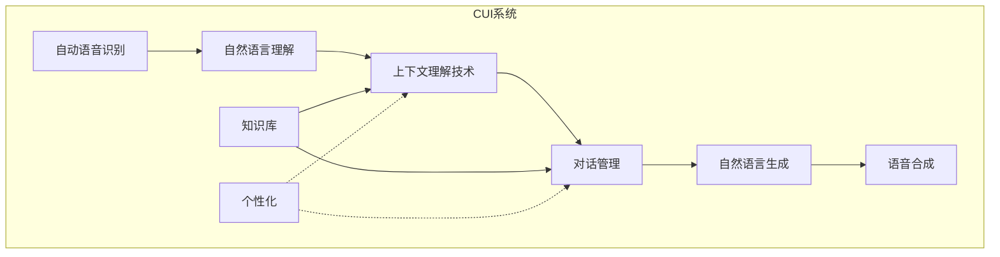

# 上下文理解技术在CUI中的实例

## 1. 背景介绍

### 1.1 问题的由来

随着人工智能和自然语言处理技术的不断发展,人机交互界面也在不断演进。传统的图形用户界面(GUI)虽然直观易用,但也存在一些局限性,例如需要使用鼠标和键盘进行操作,对于某些场景(如驾驶或残障人士)可能不太方便。因此,一种新型的人机交互方式——对话式用户界面(Conversational User Interface,简称CUI)应运而生。

CUI允许用户通过自然语言与系统进行交互,无需使用传统的输入设备,大大提高了交互的便利性和自然性。然而,要实现高质量的CUI体验,仅依赖简单的语音识别和命令解析是远远不够的。系统必须能够深入理解对话的上下文,才能做出合理的响应和决策。因此,**上下文理解技术**在CUI中扮演着至关重要的角色。

### 1.2 研究现状

上下文理解一直是自然语言处理领域的一个热点和难点问题。早期的研究工作主要集中在对话系统中的某些特定任务上,例如机场导航、餐馆预订等。随着深度学习技术的兴起,一些基于神经网络的上下文建模方法被提出并取得了不错的成绩。

近年来,随着大规模语料库和计算能力的提供,基于自注意力机制的语言模型(如Transformer、BERT等)在上下文理解任务上取得了突破性进展。这些模型能够有效捕捉长距离依赖关系,从而更好地理解上下文语义。同时,一些新的预训练范式(如对比学习、Prompting等)也为上下文建模提供了新的思路。

不过,现有的上下文理解技术在CUI场景下仍然面临一些挑战,例如需要处理多轮对话历史、跨领域知识整合、个性化理解偏好等。因此,将通用的上下文理解技术应用并优化到CUI场景中,是一个值得探索的重要课题。

### 1.3 研究意义

提升CUI系统的上下文理解能力,对于构建更智能、更人性化的人机交互界面具有重要意义:

1. **提高交互质量**:通过深入理解对话上下文,CUI系统能够做出更合理、更连贯的响应,避免产生语义歧义或逻辑错误,从而大幅提升用户体验。

2. **扩展应用场景**:强大的上下文理解能力使CUI系统能够胜任更加复杂的任务,如智能助理、客户服务、教育辅导等,极大拓宽了CUI的应用领域。

3. **促进无障碍交互**:对于残障人士或特殊场景下的用户,CUI提供了一种全新的无障碍交互方式,而上下文理解技术正是实现高质量CUI体验的关键。

4. **推动人工智能发展**:上下文理解是通向真正的人工通用智能(AGI)的重要一步。将先进的上下文理解技术应用于CUI场景,不仅能推动CUI系统的进化,也必将为AGI的实现贡献重要经验。

### 1.4 本文结构

本文将全面介绍上下文理解技术在CUI中的应用实例。首先阐述上下文理解在CUI中的核心概念及其与其他技术的关系。然后详细解析上下文理解的核心算法原理、数学模型和公式推导过程。接着通过一个完整的项目实践,展示如何将上下文理解技术应用到实际的CUI系统中。最后总结该技术的发展趋势和面临的挑战,并给出相关的学习资源推荐。

## 2. 核心概念与联系

要充分理解上下文理解技术在CUI中的应用,我们首先需要了解以下几个核心概念:

1. **上下文(Context)**:指对话中的相关背景信息,包括对话历史、场景信息、知识库等,这些信息都有助于正确理解当前的语句语义。

2. **语义理解(Semantic Understanding)**:指从自然语言中准确提取语义信息的过程,是实现上下文理解的基础。

3. **对话管理(Dialogue Management)**:指控制对话流程、决策响应内容的模块,需要依赖上下文理解的结果。

4. **知识库(Knowledge Base)**:指存储领域知识的数据库,为上下文理解提供背景知识支持。

5. **个性化(Personalization)**:指根据用户的个人特征(如偏好、习惯等)对上下文进行个性化理解和响应。

上下文理解技术与以上概念密切相关,并与CUI系统中的其他模块相互依赖、相辅相成,如下图所示:

其中,上下文理解技术在整个CUI系统中扮演着纽带的作用,将自然语言理解的结果与知识库和个性化信息相结合,为对话管理模块提供所需的上下文语义,最终指导系统做出合理的响应。

## 3. 核心算法原理 & 具体操作步骤

### 3.1 算法原理概述

上下文理解技术的核心算法原理可以概括为:基于深度学习的语义表示模型,融合对话历史、知识库和个性化信息,捕捉上下文语义,为对话管理提供决策依据。

具体来说,该算法主要包括以下几个关键步骤:

1. **语义编码**:使用预训练语言模型(如BERT)对当前语句进行编码,获取其语义表示。

2. **上下文融合**:将对话历史、知识库信息等上下文特征融合到语义表示中。

3. **个性化建模**:根据用户个人特征,对语义表示进行个性化调整。

4. **上下文表示**:将融合了多源上下文信息的语义表示,作为当前语句的上下文表示。

5. **对话决策**:将上下文表示输入到对话管理模块,作为决策的重要依据。

该算法的优势在于能够有效融合多源异构上下文信息,并通过端到端的神经网络模型自动学习上下文语义表示,避免了传统方法中的人工特征工程。同时,它也具有很好的可解释性和可扩展性。

### 3.2 算法步骤详解

接下来,我们对上述算法的每个步骤进行详细解释:

#### 3.2.1 语义编码

语义编码的目标是将自然语言转换为机器可以理解的语义表示。常用的方法是基于预训练语言模型(如BERT)对输入文本进行编码:

$$\boldsymbol{h}_i = \text{BERT}(x_i)$$

其中,$x_i$是当前语句的词序列,$\boldsymbol{h}_i$是对应的上下文化词向量序列。我们可以使用$\boldsymbol{h}_i$的最后一个向量作为句子的语义表示$\boldsymbol{s}_i$。

#### 3.2.2 上下文融合

为了融合对话历史和知识库信息,我们首先需要对它们进行编码:

- 对话历史编码:$\boldsymbol{h}_{c} = \text{BERT}(x_{c})$
- 知识库编码:$\boldsymbol{h}_{k} = \text{BERT}(x_{k})$

其中,$x_c$是对话历史文本,$x_k$是相关知识库条目。

然后,我们可以使用注意力机制将这些上下文信息融合到当前语句的语义表示中:

$$\boldsymbol{s}_i' = \boldsymbol{s}_i + \alpha_c \boldsymbol{h}_{c} + \alpha_k \boldsymbol{h}_{k}$$

其中,$\alpha_c$和$\alpha_k$是通过训练学习得到的注意力权重,用于控制对话历史和知识库信息的重要程度。

#### 3.2.3 个性化建模

为了实现个性化理解,我们需要构建用户画像向量$\boldsymbol{u}$,其中编码了用户的偏好、习惯等个人特征。然后,将$\boldsymbol{u}$与上下文语义表示$\boldsymbol{s}_i'$相结合:

$$\boldsymbol{s}_i'' = \boldsymbol{s}_i' + \gamma \boldsymbol{u}$$

其中,$\gamma$是个性化强度的控制参数,可通过训练学习得到。

#### 3.2.4 上下文表示

经过上述步骤,我们得到了融合了对话历史、知识库和个性化信息的上下文语义表示$\boldsymbol{s}_i''$,它能够全面反映当前语句在上下文中的语义。

#### 3.2.5 对话决策

最后,我们将$\boldsymbol{s}_i''$输入到对话管理模块中,作为生成系统响应的重要依据。对话管理模块通常也会结合其他特征(如对话状态、任务目标等),综合做出最终的决策。

### 3.3 算法优缺点

上述上下文理解算法具有以下优点:

1. **信息融合**:能够自动融合对话历史、知识库和个性化信息,全面捕捉上下文语义。
2. **端到端学习**:基于深度学习的端到端模型,无需人工设计复杂的特征工程。
3. **可解释性**:通过注意力机制,模型的决策过程具有一定的可解释性。
4. **可扩展性**:算法框架具有很好的扩展性,可以方便地集成其他上下文信息源。

不过,该算法也存在一些需要改进的地方:

1. **参数量大**:预训练语言模型和注意力机制导致参数量较大,对计算资源要求较高。
2. **长期依赖建模**:目前的注意力机制在捕捉长期对话历史依赖关系方面仍有不足。
3. **知识库利用**:如何更好地利用结构化知识库中的信息,仍是一个挑战。
4. **个性化数据瓶颈**:获取足够的个性化数据是实现个性化建模的主要瓶颈。

### 3.4 算法应用领域

上下文理解技术在CUI系统中的应用非常广泛,包括但不限于:

1. **智能助理**:如Siri、Alexa等,需要理解用户的命令和意图上下文。
2. **客户服务**:如在线客服系统,需要理解用户的问题和投诉上下文。
3. **教育辅导**:如在线教育平台,需要理解学生的提问和学习上下文。
4. **健康咨询**:如医疗对话系统,需要理解患者的症状和病史上下文。
5. **车载交互**:如车载语音助手,需要理解驾驶员的指令和场景上下文。

除了CUI场景,上下文理解技术在其他自然语言处理任务中也有广泛应用,如机器阅读理解、对话式问答、文本摘要等。

## 4. 数学模型和公式 & 详细讲解 & 举例说明

### 4.1 数学模型构建

为了形式化描述上下文理解算法,我们构建了一个基于注意力机制的数学模型。该模型的目标是学习一个函数$f$,将当前语句$x_i$、对话历史$x_c$、知识库$x_k$和用户画像$u$映射到上下文语义表示$s_i''$:

$$s_i'' = f(x_i, x_c, x_k, u; \theta)$$

其中,$\theta$是模型的可学习参数。

具体来说,函数$f$可以分解为以下几个步骤:

1. 语义编码:
   $$s_i = \text{BERT}_\text{enc}(x_i; \theta_\text{enc})$$
   $$h_c = \text{BERT}_\text{enc}(x_c; \theta_\text{enc})$$
   $$h_k = \text{BERT}_\text{enc}(x_k; \theta_\text{enc})$$

2. 上下文融合:
   $$\alpha_c = \text{Attention}(s_i