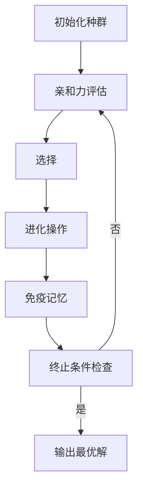

# 人工免疫算法(Artificial Immune Systems) - 原理与代码实例讲解

## 1. 背景介绍

### 1.1 问题的由来

在自然界中,生物体内存在着一种复杂而高效的免疫系统,能够识别和消除入侵的病原体。这种免疫系统具有自我组织、自我学习、自我适应和记忆等特性,为生物体提供了强大的防御机制。受此启发,人工免疫算法(Artificial Immune Systems, AIS)应运而生,旨在模拟生物免疫系统的原理和机制,解决复杂的计算问题。

### 1.2 研究现状

人工免疫算法作为一种新兴的计算智能技术,近年来受到了广泛关注和研究。研究人员不断探索和发展新的人工免疫算法模型,并将其应用于多个领域,如模式识别、数据挖掘、计算机安全、优化问题等。然而,由于生物免疫系统的复杂性,人工免疫算法的理论基础和应用实践仍存在一些挑战和局限性。

### 1.3 研究意义

人工免疫算法具有自适应性强、鲁棒性好、分布式计算等优点,在解决复杂问题方面展现出巨大潜力。深入研究人工免疫算法的原理和实现方法,不仅有助于我们更好地理解生物免疫系统的奥秘,还可以为解决实际问题提供有力的计算工具。

### 1.4 本文结构

本文将全面介绍人工免疫算法的核心概念、原理、数学模型、算法实现和应用场景。首先阐述人工免疫算法的基本概念和与其他算法的联系;然后详细讲解算法的原理、数学模型和公式推导;接着通过代码实例演示算法的具体实现;最后探讨算法的应用场景、发展趋势和面临的挑战。

## 2. 核心概念与联系

人工免疫算法借鉴了生物免疫系统的多种机制,其核心概念包括:

1. **抗原(Antigen)**: 表示需要被识别和处理的问题或模式。
2. **抗体(Antibody)**: 表示问题的潜在解决方案或模式识别器。
3. **亲和力(Affinity)**: 衡量抗体与抗原之间的匹配程度。
4. **免疫记忆(Immune Memory)**: 保存有效抗体的机制,用于加快后续问题的解决。

人工免疫算法与其他计算智能算法有一定的联系,例如:

- 与遗传算法(Genetic Algorithms)类似,都采用种群进化的思想。
- 与人工神经网络(Artificial Neural Networks)相似,都具有自适应和学习的能力。
- 与蚁群算法(Ant Colony Optimization)相近,都模拟了自然界中的集体智能行为。

然而,人工免疫算法更加侧重于动态、分布式和自适应的特性,在处理动态变化的问题时表现出独特的优势。

## 3. 核心算法原理 & 具体操作步骤

### 3.1 算法原理概述

人工免疫算法的核心原理是模拟生物免疫系统中的免疫反应过程。算法维护一个抗体种群,通过进化操作不断优化种群,最终获得能够有效识别和处理抗原的优秀抗体。主要过程包括:

1. **初始化**: 随机生成一个初始抗体种群。
2. **亲和力评估**: 计算每个抗体与抗原之间的亲和力,作为适应度的衡量标准。
3. **选择**: 根据亲和力,选择适应度较高的抗体进入下一代种群。
4. **进化操作**: 对选择的抗体执行进化操作,如克隆、变异和重组,产生新的抗体。
5. **免疫记忆**: 保存具有较高亲和力的抗体,用于加快后续问题的解决。
6. **终止条件检查**: 若满足终止条件(如达到最大迭代次数或找到满意解),则算法结束;否则返回步骤2,进行下一轮迭代。

该算法通过模拟免疫系统的自适应性和记忆性,能够有效解决动态变化的优化和识别问题。

### 3.2 算法步骤详解

1. **初始化**

   初始化过程是随机生成一个初始抗体种群,每个抗体表示问题的一个潜在解。抗体的编码方式取决于具体问题,常见的编码方式包括二进制编码、实数编码和符号编码等。

2. **亲和力评估**

   亲和力评估是计算每个抗体与抗原之间的匹配程度,作为抗体适应度的衡量标准。评估函数的设计需要根据具体问题,通常采用目标函数或相似度度量等方法。

3. **选择**

   选择操作根据抗体的亲和力(适应度)值,从当前种群中选择一部分较优秀的抗体,进入下一代种群。常见的选择方法包括轮盘赌选择、排名选择、锦标赛选择等。

4. **进化操作**

   进化操作是人工免疫算法的核心,用于产生新的抗体,主要包括以下三种操作:

   - **克隆(Cloning)**: 对具有较高亲和力的抗体进行克隆,产生多个克隆体。
   - **变异(Mutation)**: 对克隆体进行变异操作,引入一定的随机扰动,增加种群的多样性。
   - **重组(Recombination)**: 在克隆体之间进行重组操作,交换部分编码,产生新的抗体。

5. **免疫记忆**

   免疫记忆机制用于保存具有较高亲和力的抗体,以加快后续问题的解决过程。当遇到类似的问题时,可以直接从记忆中调用相关抗体,而不必从头开始进化。

6. **终止条件检查**

   终止条件检查是判断算法是否应该结束的标准,常见的终止条件包括:

   - 达到最大迭代次数
   - 找到满足要求的解
   - 连续多代种群无明显改进

   如果满足终止条件,则输出当前最优解;否则返回亲和力评估步骤,进行下一轮迭代。

### 3.3 算法优缺点

**优点**:

- 自适应性强,能够有效处理动态变化的问题。
- 具有分布式计算的特性,适合并行计算。
- 免疫记忆机制有助于加快问题的解决速度。
- 具有一定的鲁棒性,不易陷入局部最优解。

**缺点**:

- 算法参数较多,参数设置对算法性能影响较大。
- 计算复杂度较高,对于大规模问题可能效率较低。
- 理论基础相对薄弱,缺乏统一的建模框架。
- 对于某些特定问题,可能不如其他算法有效。

### 3.4 算法应用领域

人工免疫算法由于其自适应性和鲁棒性,在多个领域展现出良好的应用前景:

- **模式识别**: 用于图像识别、数据挖掘和异常检测等。
- **优化问题**: 应用于组合优化、路径规划和调度问题等。
- **计算机安全**: 用于入侵检测、病毒检测和网络安全等。
- **机器学习**: 用于特征选择、聚类分析和分类问题等。
- **控制系统**: 应用于自适应控制和智能控制等领域。
- **其他领域**: 如蛋白质结构预测、信号处理和机器人路径规划等。

## 4. 数学模型和公式 & 详细讲解 & 举例说明

### 4.1 数学模型构建

人工免疫算法的数学模型主要包括以下几个方面:

1. **抗体编码**

   将问题的潜在解编码为抗体,常见的编码方式包括二进制编码、实数编码和符号编码等。编码方式的选择取决于具体问题的特点。

2. **亲和力计算**

   亲和力衡量抗体与抗原之间的匹配程度,通常采用目标函数或相似度度量等方法计算。对于优化问题,亲和力可以直接使用目标函数值;对于模式识别问题,可以使用相似度度量或分类准确率等指标。

   设抗体为 $\vec{x}$,抗原为 $\vec{y}$,则亲和力函数 $f(\vec{x}, \vec{y})$ 可以定义为:

   $$f(\vec{x}, \vec{y}) = \begin{cases}
   g(\vec{x}, \vec{y}), & \text{优化问题} \\
   h(\vec{x}, \vec{y}), & \text{模式识别问题}
   \end{cases}$$

   其中 $g(\vec{x}, \vec{y})$ 表示目标函数, $h(\vec{x}, \vec{y})$ 表示相似度度量或其他指标。

3. **进化操作建模**

   克隆操作通常采用简单的复制方式,将优秀抗体复制多份。变异操作可以使用高斯扰动、均匀扰动或其他随机扰动方式。重组操作常采用单点交叉或多点交叉等方式。

   设抗体 $\vec{x}$ 经过变异操作后得到新抗体 $\vec{x}'$,变异算子可表示为:

   $$\vec{x}' = \vec{x} + \Delta\vec{x}$$

   其中 $\Delta\vec{x}$ 是随机扰动向量,可以根据具体问题采用不同的分布。

4. **免疫记忆建模**

   免疫记忆通常采用一个独立的存储空间,保存具有较高亲和力的抗体。在每一代进化后,将新产生的优秀抗体添加到记忆空间中,同时可以根据一定策略删除旧的或重复的抗体,以控制记忆空间的大小。

### 4.2 公式推导过程

下面以一个简单的数值优化问题为例,推导人工免疫算法的公式:

**问题描述**:

给定一个目标函数 $f(x)$,求 $x \in [a, b]$ 使得 $f(x)$ 取得最小值。

**步骤1: 抗体编码**

将 $x$ 编码为实数抗体,即 $\vec{x} = x$。

**步骤2: 亲和力计算**

由于是优化问题,可以直接将目标函数值作为亲和力:

$$f(\vec{x}, \vec{y}) = f(x) = g(x)$$

其中 $\vec{y}$ 为虚拟抗原,可忽略不计。

**步骤3: 进化操作建模**

- 克隆: 对具有较小目标函数值(较高亲和力)的抗体进行复制。
- 变异: 采用高斯扰动,即 $\vec{x}' = \vec{x} + \mathcal{N}(0, \sigma^2)$,其中 $\sigma$ 为变异强度参数。
- 重组: 采用单点交叉,对两个父代抗体 $\vec{x}_1$ 和 $\vec{x}_2$ 进行如下重组:

  $$\vec{x}_1' = (\vec{x}_1[1], \vec{x}_1[2], \ldots, \vec{x}_1[k], \vec{x}_2[k+1], \ldots, \vec{x}_2[n])$$
  $$\vec{x}_2' = (\vec{x}_2[1], \vec{x}_2[2], \ldots, \vec{x}_2[k], \vec{x}_1[k+1], \ldots, \vec{x}_1[n])$$

  其中 $k$ 是随机选择的交叉点位置。

**步骤4: 免疫记忆建模**

维护一个记忆空间 $M$,用于保存具有较小目标函数值的抗体。每一代进化后,将新产生的优秀抗体添加到 $M$ 中,同时删除重复的抗体,以控制 $M$ 的大小。

通过上述公式推导,我们可以构建出人工免疫算法的数学模型,为算法的实现和分析奠定理论基础。

### 4.3 案例分