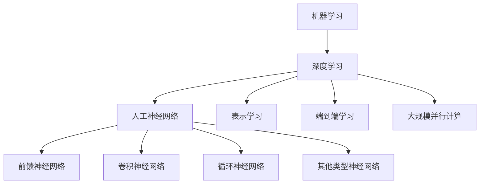
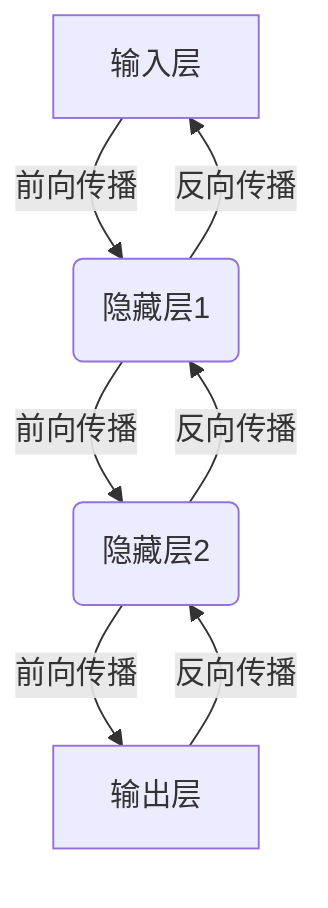

好的,我明白了您的要求。以下是题为《人工智能的深度学习方法》的技术博客文章正文:

# 人工智能的深度学习方法

## 1. 背景介绍

### 1.1 问题的由来

在过去的几十年里,人工智能(AI)已经取得了长足的进步,并在诸多领域展现出了巨大的潜力和价值。然而,传统的人工智能方法如机器学习、专家系统等在处理高维度复杂数据时往往会遇到瓶颈,难以有效地捕捉数据内在的深层次特征和规律。因此,如何突破这一瓶颈,设计出更加强大的人工智能算法成为了当前研究的重点和难点。

### 1.2 研究现状  

近年来,深度学习(Deep Learning)作为一种全新的机器学习范式逐渐兴起并引起了广泛关注。深度学习是一种试图通过数据驱动的方式来构建多层次人工神经网络,从而模拟人脑神经元的层次结构和信息处理方式,自动从大规模数据中学习出有用的特征表示和模式。与传统的机器学习算法相比,深度学习具有自动学习数据特征的能力,不需要人工设计特征,能够从海量数据中自动发现内在的深层次抽象特征。

目前,深度学习技术已经在计算机视觉、自然语言处理、语音识别、推荐系统等诸多领域取得了突破性的进展,展现出了巨大的应用前景。例如,基于深度卷积神经网络(CNN)的图像识别系统能够达到超过人类的识别精度;基于循环神经网络(RNN)的语音识别系统已经被广泛应用于智能语音助手等产品;基于注意力机制的Transformer模型在自然语言处理任务上也取得了卓越的成绩。

### 1.3 研究意义

深度学习作为一种有潜力彻底改变人工智能的新范式,其研究对于推动人工智能技术的发展、提高人类生产生活的智能化水平具有重要的理论意义和现实意义:

- 理论意义:深度学习为构建更加强大、灵活和通用的人工智能系统提供了新的思路和方法,能够自动从大数据中学习出有用的特征表示,从而更好地解决高维度复杂问题。深入研究深度学习的理论基础和算法原理,有助于拓展人工智能的理论边界。

- 现实意义:深度学习技术在计算机视觉、自然语言处理、语音识别、推荐系统等诸多领域展现出了巨大的应用潜力和价值。深入研究和发展深度学习算法及其应用,将为智能制造、智能交通、智能医疗、智能家居等多个行业带来革命性的变革。

### 1.4 本文结构

本文将全面深入地介绍深度学习的核心概念、算法原理、数学模型以及在实际项目中的应用。具体来说,本文的结构安排如下:

- 第2部分将介绍深度学习的核心概念和基本原理,并阐述与其他机器学习方法的联系和区别。
- 第3部分将深入探讨深度学习中几种核心算法的原理和具体操作步骤,并分析它们的优缺点和适用场景。
- 第4部分将详细阐述深度学习算法所依赖的数学基础,包括模型构建、公式推导,并结合实例进行讲解和分析。
- 第5部分将通过一个实际项目案例,展示如何利用深度学习算法和框架进行开发,并对代码进行解读和分析。
- 第6部分将介绍深度学习在计算机视觉、自然语言处理等领域的实际应用现状,并对未来的应用前景进行展望。  
- 第7部分将为读者推荐一些有价值的学习资源、开发工具和相关论文,以帮助读者更好地学习和实践深度学习技术。
- 第8部分将总结深度学习的研究成果,分析其未来发展趋势和面临的挑战,并对未来的研究方向进行展望。
- 第9部分是附录,将解答一些常见的问题和困惑。

通过对上述内容的全面讲解和分析,读者能够全面深入地理解和掌握深度学习的方方面面,为将来在相关领域的研究和实践奠定扎实的基础。

## 2. 核心概念与联系

深度学习(Deep Learning)是机器学习(Machine Learning)的一个分支,它的核心思想是通过构建具有多层非线性变换的人工神经网络模型,从大量数据中自动学习出有用的特征表示,从而解决复杂的任务。与传统的机器学习方法相比,深度学习有以下几个核心概念和特点:

1. **人工神经网络(Artificial Neural Network)**: 深度学习算法的数学模型和计算模型本质上是一种多层次的人工神经网络结构,包括前馈神经网络、卷积神经网络、循环神经网络等多种类型。这些网络结构旨在模拟生物神经系统的信息传递和处理方式。

2. **表示学习(Representation Learning)**: 深度学习的一个重要优势在于能够自动从大规模数据中学习出有用的特征表示,而不需要人工设计特征。通过训练多层神经网络模型,深度学习算法能够自动从低层次的原始数据(如像素值)抽象出高层次的复杂特征表示。

3. **端到端学习(End-to-End Learning)**: 传统的机器学习算法通常需要分多个阶段处理,包括数据预处理、特征提取、模型训练等,每个阶段都需要人工设计和参与。而深度学习则能够直接从原始数据端到端地训练整个系统,无需人工干预中间环节,从而简化了系统设计和优化的复杂度。

4. **大规模并行计算**: 深度神经网络模型通常包含大量的参数,需要基于海量数据进行训练,这对计算能力有着极高的要求。深度学习的发展和应用离不开GPU、TPU等高性能并行计算硬件的支持,以及分布式并行计算框架的支持。

5. **层次特征抽象**: 深度学习的核心在于通过构建深层次的神经网络模型,对原始输入数据进行层层抽象和非线性变换,逐层提取出更加抽象和复杂的特征表示,从而能够更好地表征输入数据的内在本质。

6. **泛化能力强**: 与其他机器学习算法相比,深度学习模型由于学习的是数据的层次特征表示,因此具有更强的泛化能力,能够更好地应对未见过的新数据,避免过拟合问题。

总的来说,深度学习是机器学习领域的一个重大突破,它提供了一种全新的数据驱动的范式,能够自动从大规模数据中学习出有用的层次特征表示,从而解决复杂的人工智能任务。深度学习与传统的机器学习方法相比,具有自动化、端到端、并行化等优势,是构建通用人工智能系统的有力工具和手段。

## 3. 核心算法原理 & 具体操作步骤  

### 3.1 算法原理概述

深度学习中有多种核心算法,包括前馈神经网络、卷积神经网络、循环神经网络等。这些算法虽然在具体结构和应用场景上有所区别,但是都遵循着一些共同的基本原理:

1. **网络结构**:所有深度学习算法的模型都是一种多层次的人工神经网络结构,由输入层、隐藏层和输出层组成。每一层由多个神经元节点构成,节点之间通过加权连接进行信息传递。

2. **前向传播**:在给定输入数据的情况下,信息从输入层经过隐藏层层层传递,每个节点根据上一层输入和连接权重进行加权求和,再通过激活函数(如Sigmoid、ReLU等)进行非线性变换,将结果传递到下一层。最终在输出层得到对应的输出结果。

3. **反向传播**:通过比较输出层的结果与期望输出之间的差异(损失函数),计算出每个权重对最终误差的敏感程度(梯度),然后沿着与前向传播相反的方向,逐层对网络中的连接权重进行调整和更新,使得整个网络输出结果逐渐逼近期望输出。

4. **优化算法**:权重的更新调整需要遵循一定的优化算法规则,如梯度下降、随机梯度下降等,以确保网络能够收敛到一个期望的最优解。常用的优化算法还包括动量优化、RMSProp、Adam等。

5. **正则化**:为防止过拟合,通常需要对网络模型进行正则化处理,如L1/L2正则、Dropout、BN层等,以提高模型的泛化能力。  

6. **超参数调优**:深度学习模型中存在诸多超参数,如学习率、批量大小、网络层数等,需要通过大量实验对这些超参数进行调优,以获得最佳性能。

上述原理适用于所有深度学习算法,但不同算法在具体的网络结构和应用场景上会有所区别,下面将分别介绍几种核心算法。

### 3.2 算法步骤详解

#### 3.2.1 前馈神经网络(Feedforward Neural Network)

前馈神经网络是深度学习中最基础和最简单的一种网络结构,也被称为多层感知器(Multilayer Perceptron)。它的基本原理如下:

1. **网络结构**:前馈神经网络由输入层、隐藏层和输出层组成,每层由多个神经元节点构成。各层节点之间通过全连接的方式相连,即上一层的每个节点与下一层的所有节点相连。

2. **前向传播**:给定输入数据$\boldsymbol{x}$,在输入层将其传递到第一个隐藏层,对于隐藏层的第$j$个节点$h_j$,其输入为:

$$h_j = \phi\left(\sum_{i}w_{ij}x_i + b_j\right)$$

其中$w_{ij}$为连接权重,$b_j$为偏置项,$\phi$为激活函数(如Sigmoid、ReLU等)。
然后将隐藏层的输出作为下一层的输入,重复上述计算,直至到达输出层获得最终输出$\boldsymbol{\hat{y}}$。

3. **反向传播**:通过比较输出$\boldsymbol{\hat{y}}$与期望输出$\boldsymbol{y}$之间的差异(损失函数$\mathcal{L}$),计算出每个权重对最终误差的敏感度(梯度):

$$\frac{\partial \mathcal{L}}{\partial w_{ij}} = \frac{\partial \mathcal{L}}{\partial \hat{y}_k}\frac{\partial \hat{y}_k}{\partial h_j}\frac{\partial h_j}{\partial w_{ij}}$$

然后沿着与前向传播相反的方向,逐层对网络中的连接权重进行调整和更新,使得整个网络输出结果逐渐逼近期望输出。

4. **优化算法**:常用的优化算法有梯度下降、随机梯度下降、动量优化等,用于根据梯度信息更新网络权重,使得损失函数不断减小。

5. **正则化**:为防止过拟合,可以对网络进行L1/L2正则化、Dropout等处理,提高泛化能力。

前馈神经网络结构简单,是深度学习的基础,但也存在一些缺陷,如无法很好地处理序列数据、难以捕捉数据的局部特征等。因此衍