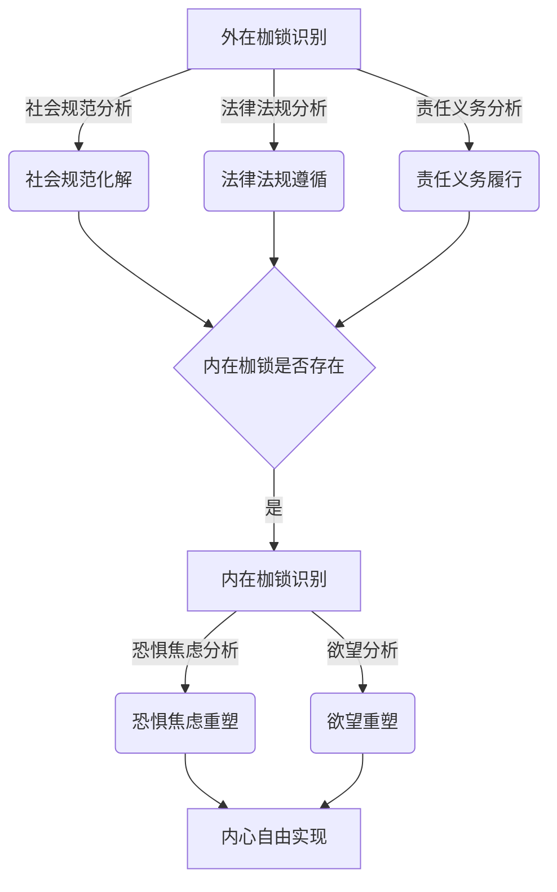

# 人生而自由，却无往不在枷锁之中

## 1. 背景介绍

### 1.1 问题的由来

自由是人类生而拥有的权利,但在现实生活中,我们往往发现自己被各种枷锁所束缚。这些枷锁可能来自于社会规范、家庭责任、工作压力等外在因素,也可能源于个人的恐惧、焦虑、欲望等内在驱动力。无论是外在还是内在,这些枷锁都在一定程度上限制了我们的自由。

### 1.2 研究现状

关于自由与枷锁的矛盾,哲学家、心理学家、社会学家等都有过深入探讨。存在主义哲学家如萨特认为,人生而具有绝对自由,但同时也承担着巨大的责任和焦虑。而佛教则强调通过放下执念和欲望,才能获得内心的自由。

在信息时代,新的技术发展也带来了新的枷锁。例如,社交媒体让我们可以自由表达,但也容易受到网络舆论的影响;大数据分析可以提高生活效率,但也可能侵犯个人隐私。

### 1.3 研究意义

探讨自由与枷锁的矛盾,有助于我们重新审视生活方式,认清影响自由的因素,从而有意识地追求内心的自由和平静。同时,在技术发展的今天,我们也需要思考如何在自由和安全之间寻求平衡。

### 1.4 本文结构

本文将从哲学、心理学和社会学的角度,深入探讨自由与枷锁的矛盾。首先阐述核心概念,分析二者的关系;接着介绍影响自由的内外因素;然后探讨在信息时代下如何平衡自由和安全;最后总结未来的发展趋势和挑战。

## 2. 核心概念与联系

自由(Freedom)是指个人拥有独立思考和行动的权利,不受外界的非法限制和约束。而枷锁(Shackle)则指那些限制个人自由的因素,可以是物质的也可以是心理的。

自由和枷锁是一对矛盾统一体。一方面,完全的自由是不存在的,因为我们生存在一个有规则的社会中;另一方面,过度的枷锁也会扼杀个人的创造力和发展空间。因此,我们需要在二者之间寻求平衡,既要遵守必要的规则,又要为个人留有自由发展的空间。

哲学家萨特将这种矛盾概括为"被投入"和"超越"的辩证关系。我们一方面被投入到既定的环境中,另一方面也要不断超越现状,追求自由。这种持续的张力推动着人的发展和进步。

## 3. 核心算法原理 & 具体操作步骤

### 3.1 算法原理概述

影响个人自由的因素可以概括为外在枷锁和内在枷锁两大类。外在枷锁包括社会规范、法律法规、家庭责任、工作压力等;内在枷锁包括恐惧、焦虑、欲望等心理因素。

我们可以设计一种双层算法,首先识别和化解外在枷锁,为个人自由腾出空间;然后通过心理重塑,化解内在枷锁,真正实现内心的自由。



### 3.2 算法步骤详解

1. **外在枷锁识别**：通过数据分析,识别影响个人自由的外在因素,包括社会规范、法律法规、责任义务等。

2. **社会规范化解**：遵守必要的社会规范,但也要有所突破,不被过度约束。可以通过理性分析和公众参与,促进规范的合理调整。

3. **法律法规遵循**：遵守国家法律法规,维护良好的社会秩序。同时,也要关注法律的公平性,在必要时通过合法途径推动修订。

4. **责任义务履行**：履行作为家庭成员、社会公民、工作职员等应尽的责任和义务,但不能被过度占据生活空间。

5. **内在枷锁识别**：通过心理测试和自我反省,识别内在的恐惧、焦虑、欲望等因素。

6. **恐惧焦虑重塑**：通过认知行为疗法等方式,重塑对恐惧和焦虑的认知,建立积极乐观的心态。

7. **欲望重塑**：通过冥想、禅修等方式,放下对物质和虚荣的执念,培养高尚的精神追求。

8. **内心自由实现**：在化解了内外枷锁后,个人可以真正做到独立思考,自主选择,实现内心的自由和解放。

### 3.3 算法优缺点

**优点**：

- 全面考虑了外在和内在两方面的因素,有助于彻底解决问题
- 融合了哲学、心理学、社会学等多学科知识,视野开阔
- 操作步骤清晰,易于实施和推广

**缺点**：

- 算法过程较为复杂,需要多方面的支持和配合
- 部分步骤涉及个人意识的重塑,需要长期坚持
- 不同文化背景下,具体实施方式可能有所差异

### 3.4 算法应用领域

该算法可应用于以下领域:

- 个人成长:帮助个人认清生活中的枷锁,追求内心自由
- 心理咨询:为焦虑、恐惧等心理问题提供治疗方案 
- 社会管理:促进社会规范、法律法规的合理调整
- 企业管理:平衡工作自由和企业利益,提高员工幸福感
- 教育培养:培养学生独立思考和创新能力

## 4. 数学模型和公式 & 详细讲解 & 举例说明

### 4.1 数学模型构建

为了量化分析自由和枷锁的关系,我们可以构建如下数学模型:

设个人的自由度为 $F$,外在枷锁为 $E$,内在枷锁为 $I$,则有:

$$F = 1 - \alpha E - \beta I$$

其中, $\alpha$ 和 $\beta$ 分别为外在和内在枷锁的权重系数,满足 $\alpha + \beta = 1$。

这个模型说明,自由度由外在和内在枷锁的大小共同决定,且二者的影响程度由权重系数控制。

### 4.2 公式推导过程

我们可以将自由度 $F$ 视为一个区间 $[0, 1]$ 上的变量。其中 $F = 1$ 表示完全自由, $F = 0$ 表示完全没有自由。

外在枷锁 $E$ 和内在枷锁 $I$ 也被规范化为 $[0, 1]$ 区间。其中 $E = 0$ 和 $I = 0$ 表示完全没有相应的枷锁。

由于枷锁会限制自由,因此自由度应该随着枷锁的增加而减小。我们可以假设自由度与外在枷锁成反比,与内在枷锁也成反比,即:

$$F \propto \frac{1}{E}, F \propto \frac{1}{I}$$

将二者相乘,可得:

$$F \propto \frac{1}{EI}$$

为了使 $F$ 的值在 $[0, 1]$ 区间内,我们可以引入两个权重系数 $\alpha$ 和 $\beta$,使之满足归一化条件:

$$F = 1 - \alpha E - \beta I$$

其中 $\alpha$ 和 $\beta$ 反映了外在和内在枷锁对自由度的影响程度,且有 $\alpha + \beta = 1$。

### 4.3 案例分析与讲解

**案例1**:一个人社会地位较高,经济条件优渥,外在枷锁 $E = 0.2$。但他内心有较重的焦虑和恐惧情绪,内在枷锁 $I = 0.7$。假设 $\alpha = 0.3, \beta = 0.7$,求他的自由度 $F$?

**解**:将数值代入公式,得:

$$\begin{aligned}
F &= 1 - \alpha E - \beta I \\
   &= 1 - 0.3 \times 0.2 - 0.7 \times 0.7 \\
   &= 0.49
\end{aligned}$$

可见,虽然这个人外在条件不错,但由于内在枷锁较重,他的自由度只有0.49,无法获得真正的自由。

**案例2**:一个人社会地位一般,经济条件一般,外在枷锁 $E = 0.5$。但他内心坦荡,几乎没有内在枷锁,设 $I = 0.1$。假设 $\alpha = 0.6, \beta = 0.4$,求他的自由度 $F$?

**解**:将数值代入公式,得:

$$\begin{aligned}
F &= 1 - \alpha E - \beta I\\
   &= 1 - 0.6 \times 0.5 - 0.4 \times 0.1\\
   &= 0.67
\end{aligned}$$

可见,虽然这个人外在条件一般,但由于内心足够自由,他的自由度高达0.67,比案例1中的人更加自由。

### 4.4 常见问题解答

**Q1:为什么要将自由度、外在枷锁和内在枷锁都规范化到 $[0, 1]$ 区间?**

A1:这样做是为了便于计算和比较。将它们规范化到同一区间,可以消除量纲的影响,使公式计算更加通用。

**Q2:为什么要引入权重系数 $\alpha$ 和 $\beta$?**

A2:不同个体对外在和内在枷锁的敏感程度不同。引入权重系数可以体现这种差异,使模型更加贴近现实。

**Q3:模型中是否考虑了枷锁之间的相互影响?**

A3:目前的模型将外在和内在枷锁看作是相互独立的。实际上,二者可能会互相影响,比如外在压力会加重内在焦虑。将来可以进一步完善模型,考虑枷锁之间的耦合作用。

**Q4:如何确定 $\alpha$ 和 $\beta$ 的具体值?**

A4:可以通过大量的心理测试和行为数据,对不同群体的 $\alpha$ 和 $\beta$ 值进行统计分析,得到经验值。也可以让个体根据自身情况进行自我评估。

## 5. 项目实践:代码实例和详细解释说明

为了便于大家理解和实践上述算法,我们提供了一个基于 Python 的代码实例。

### 5.1 开发环境搭建

本项目使用 Python 3.8.5,并引入了以下第三方库:

- numpy: 用于数值计算
- matplotlib: 用于数据可视化
- tkinter: 用于构建简单的GUI界面

你可以使用任何Python集成开发环境(IDE)来运行和调试代码,也可以使用命令行方式。确保已正确安装上述第三方库。

### 5.2 源代码详细实现

```python
import numpy as np
import matplotlib.pyplot as plt
from tkinter import *

# 计算自由度的函数
def freedom_score(E, I, alpha, beta):
    return 1 - alpha * E - beta * (1 - E)

# GUI界面代码
window = Tk()
window.title('自由度计算器')

frame = Frame(window)
frame.pack()

label_E = Label(frame, text="外在枷锁(0-1):")
label_E.grid(row=0, column=0, padx=5, pady=5)
entry_E = Entry(frame)
entry_E.grid(row=0, column=1, padx=5, pady=5)

label_I = Label(frame, text="内在枷锁(0-1):")
label_I.grid(row=1, column=0, padx=5, pady=5)
entry_I = Entry(frame)
entry_I.grid(row=1, column=1,