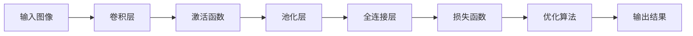

# 从零开始大模型开发与微调：PyTorch中的卷积函数实现详解

关键词：大模型开发、模型微调、PyTorch、卷积函数、深度学习

## 1. 背景介绍
### 1.1 问题的由来
随着人工智能技术的不断发展,深度学习已经成为当前最为热门和有前景的研究方向之一。在深度学习模型中,卷积神经网络(Convolutional Neural Network, CNN)以其强大的特征提取和抽象能力,在计算机视觉、语音识别、自然语言处理等领域取得了广泛的应用和突破性的进展。

然而,对于很多初学者和非专业人士来说,从零开始构建和训练一个卷积神经网络模型仍然是一个具有挑战性的任务。虽然目前已经有很多优秀的深度学习框架如TensorFlow、Keras、PyTorch等,提供了高层次的封装和便捷的工具,但要真正掌握其内部原理和实现细节,还需要对底层算法和数学理论有深入的理解。

### 1.2 研究现状
目前,卷积神经网络已经成为计算机视觉、模式识别等领域的主流模型。从LeNet、AlexNet到VGGNet、GoogLeNet、ResNet等,一系列里程碑式的CNN模型不断刷新着图像分类、目标检测、语义分割等任务的性能指标。

在工业界,谷歌、微软、Facebook等科技巨头纷纷开源了自己的深度学习框架和预训练模型,极大地推动了CNN技术的普及和应用。在学术界,顶级会议如CVPR、ICCV、NIPS等也涌现出大量基于CNN的前沿研究成果。

### 1.3 研究意义
深入理解卷积神经网络的内部原理和实现细节,对于我们开发出性能更优、泛化能力更强的模型具有重要意义。通过剖析卷积、池化等关键操作的前向传播和反向传播过程,我们可以更好地把控模型的结构设计和超参数调优。

此外,掌握深度学习框架的底层API和实现机制,也可以帮助我们更灵活地开发出适用于特定场景的定制化模型,或者对主流模型进行二次开发和微调,从而进一步提升模型在实际任务中的表现。

### 1.4 本文结构
本文将以PyTorch为例,详细介绍如何从零开始实现一个完整的卷积神经网络模型。内容涵盖了卷积、池化、激活函数、损失函数、优化算法等CNN的核心组件,并给出了详细的数学推导和代码实现。

全文结构如下:

- 第2部分介绍卷积神经网络的核心概念与组件之间的联系。
- 第3部分重点剖析卷积运算的原理、步骤和优化技巧。
- 第4部分系统阐述CNN所涉及的数学模型和公式,并给出详细的推导过程和案例分析。
- 第5部分通过一个实际的图像分类项目,演示如何使用PyTorch搭建CNN模型的完整代码实现。
- 第6部分讨论卷积神经网络的典型应用场景及未来的发展趋势。
- 第7部分推荐一些学习CNN所需的工具、资源和文献。
- 第8部分总结全文的主要内容,并对CNN技术的发展前景和面临的挑战进行了展望。
- 第9部分的附录给出了一些常见问题的解答,帮助读者进一步消化和吸收文章的核心知识点。

## 2. 核心概念与联系
卷积神经网络是一种特殊的多层感知机,其核心是卷积(convolution)运算。与传统的全连接(fully-connected)神经网络不同,CNN通过局部连接和权值共享,大大减少了网络的参数数量,使得模型可以更深、更宽,从而具有更强的特征提取和抽象能力。

一个典型的卷积神经网络由以下几个关键组件构成:

- 卷积层(Convolutional Layer):通过卷积运算提取局部特征。
- 池化层(Pooling Layer):对特征图进行降采样,减少参数量并提高鲁棒性。
- 激活函数(Activation Function):引入非线性变换,增强模型的表达能力。常见的有ReLU、Sigmoid、Tanh等。
- 全连接层(Fully-Connected Layer):对卷积和池化后的特征进行分类或回归预测。
- 损失函数(Loss Function):衡量模型预测值与真实值之间的差异,常用的有交叉熵、均方误差等。
- 优化算法(Optimization Algorithm):通过最小化损失函数来更新模型参数,如SGD、Adam等。

下图展示了这些组件在卷积神经网络中的连接关系:



可以看出,卷积层和池化层负责特征提取,全连接层负责分类或回归,激活函数增加非线性,损失函数和优化算法驱动模型学习。这些组件相互配合,共同构成了一个完整的卷积神经网络模型。

理解了这些核心概念之间的联系,我们就可以更好地设计CNN的网络结构,调整超参数,并根据具体任务的特点选择合适的组件和训练策略,从而构建出性能优越的模型。

## 3. 核心算法原理 & 具体操作步骤
### 3.1 算法原理概述
卷积运算是卷积神经网络的核心,其本质是一种特殊的线性变换。对于一个二维图像输入,卷积运算就是用一个卷积核(kernel或filter)在图像上滑动,对覆盖区域内的像素值进行加权求和,得到输出特征图(feature map)上的一个像素值。

数学上,对于输入图像$I$和卷积核$K$,卷积运算可以表示为:

$$
(I * K)(i,j) = \sum_m \sum_n I(i+m, j+n) K(m, n)
$$

其中$*$表示卷积操作,$i,j$为输出特征图上像素的坐标,$m,n$为卷积核的坐标。

通过卷积运算,CNN可以自动学习到图像中的局部特征模式,如边缘、纹理、形状等。同时,卷积核的权值在整个图像上共享,大大减少了参数数量,使得网络可以更深更宽。此外,卷积运算还具有平移不变性(translation invariance),即物体出现在图像中的任何位置,都可以被相同的卷积核检测到。

### 3.2 算法步骤详解
以一个具体的例子来说明卷积运算的步骤。假设我们有一个3x3的灰度图像,和一个2x2的卷积核,如下所示:

```
Image:
1 2 3
4 5 6
7 8 9

Kernel:
1 0
0 1
```

1. 将卷积核的中心对准图像的左上角,卷积核的范围覆盖图像的前2x2个像素。逐个相乘并求和,得到输出特征图的第一个像素值:

$$
1*1 + 2*0 + 4*0 + 5*1 = 1 + 0 + 0 + 5 = 6
$$

2. 将卷积核向右滑动一个像素,重复上述过程,得到输出特征图的第二个像素值:

$$
2*1 + 3*0 + 5*0 + 6*1 = 2 + 0 + 0 + 6 = 8
$$

3. 继续向右滑动,直到卷积核的右边界与图像右边界对齐。然后换到下一行,从左到右重复上述过程。

4. 最终得到一个2x2的输出特征图:

```
6 8
8 9
```

可见,卷积运算可以提取图像的局部特征,比如这里的卷积核实际上起到了一个单位矩阵的作用,提取了图像的原始像素值。在实际应用中,卷积核的权值是通过反向传播学习到的,可以自动提取出图像中有判别性的纹理、边缘等特征。

### 3.3 算法优缺点
卷积运算的优点主要有:

- 局部连接:每个神经元只与前一层的一个局部区域连接,大大减少了参数数量和计算复杂度。
- 权值共享:同一个卷积核在整个图像上滑动,检测相同的特征模式,减少了参数数量。
- 平移不变性:物体出现在图像的任何位置,都可以被相同的卷积核检测到。
- 特征层次化:通过多层卷积和池化的堆叠,CNN可以自动学习到图像的层次化特征表示,从低级的边缘到高级的语义。

卷积运算的缺点主要有:

- 感受野有限:标准卷积运算的感受野随网络加深而线性增大,难以捕捉到全局的上下文信息。需要引入空洞卷积(dilated convolution)等变体来扩大感受野。
- 平移不变性的局限:虽然平移不变性是卷积的一大优势,但有时我们希望网络对物体的位置也敏感,需要引入位置编码(position embedding)等机制。
- 计算和存储开销大:卷积运算涉及大量的乘加操作和内存访问,对计算资源和存储空间要求较高。需要采用im2col、Winograd、FFT等加速算法进行优化。

### 3.4 算法应用领域
卷积神经网络已经在计算机视觉的各个领域取得了广泛应用,主要包括:

- 图像分类:如ImageNet大规模图像分类竞赛,各种CNN模型不断刷新性能记录。
- 目标检测:如RCNN、SSD、YOLO等算法,可以同时检测图像中多个目标的位置和类别。
- 语义分割:如FCN、SegNet、U-Net等算法,可以对图像中的每个像素进行类别标注。
- 人脸识别:如DeepFace、FaceNet等算法,在人脸验证、识别、聚类等任务上表现出色。
- 行为识别:如双流网络、3D卷积等算法,可以对视频中的人体行为进行分类。
- 医学影像分析:如用CNN进行肿瘤检测、器官分割、疾病诊断等。
- 遥感图像解译:如用CNN进行地物分类、变化检测、目标提取等。
- 自动驾驶:如用CNN进行交通标志检测、车道线分割、障碍物识别等。

此外,卷积神经网络的思想也被引入到图像风格迁移、图像生成、超分辨率等领域,以及语音识别、自然语言处理等非视觉领域。可以说,CNN是当前人工智能的一项核心技术,在学术界和工业界都有着广阔的应用前景。

## 4. 数学模型和公式 & 详细讲解 & 举例说明
### 4.1 数学模型构建
为了深入理解卷积神经网络的原理,我们需要建立其数学模型。考虑一个输入为$W \times H \times C$的图像,其中$W$为宽度,$H$为高度,$C$为通道数。假设卷积层有$N$个大小为$F \times F$的卷积核,padding为$P$,stride为$S$。那么输出特征图的尺寸为:

$$
W' = \lfloor \frac{W-F+2P}{S} \rfloor + 1 \\
H' = \lfloor \frac{H-F+2P}{S} \rfloor + 1 \\
C' = N
$$

其中$\lfloor \cdot \rfloor$表示向下取整。可见输出特征图的宽高由输入尺寸、卷积核大小、padding和stride共同决定,通道数等于卷积核的数量。

对于第$k$个卷积核,其参数为$\mathbf{W}_k \in \mathbb{R}^{F \times F \times C}$和$b_k \in \mathbb{R}$,输出特征图为$\mathbf{F}_k \in \mathbb{R}^{W' \times H'}$。那么卷积运算可以表示为:

$$
\mathbf{F}_k(i,j) = \sum_{c=1}^C \sum_{m=1}^F \sum_{n=1}^F \mathbf{W}_k(m,n,c) \cdot \math