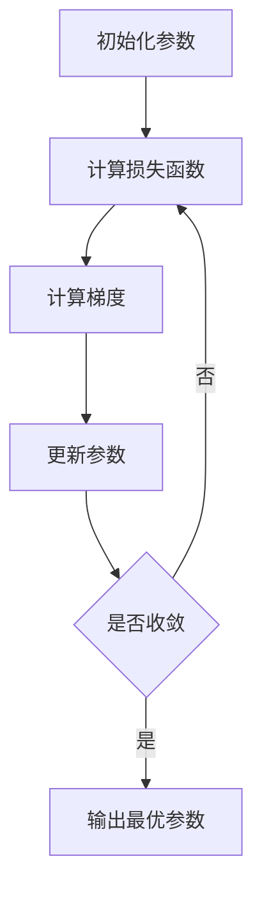

# 从零开始大模型开发与微调：最小二乘法的梯度下降算法及其Python实现

## 1. 背景介绍

### 1.1 问题的由来

在机器学习和深度学习领域中,最小二乘法是一种广泛应用的优化算法,用于寻找最佳拟合参数以最小化损失函数。然而,传统的最小二乘法算法通常需要计算复杂的矩阵求逆运算,当数据维度较高时,计算效率会大幅下降。因此,我们需要一种更高效的优化算法来解决这个问题。

梯度下降算法作为一种迭代优化算法,可以有效地求解最小二乘问题,而无需计算矩阵求逆。它通过不断朝着损失函数梯度的反方向更新参数,逐步逼近最优解。梯度下降算法在处理高维数据时表现出色,并广泛应用于深度学习模型的训练过程中。

### 1.2 研究现状

目前,梯度下降算法在深度学习领域中被广泛使用,成为训练神经网络模型的标准优化算法之一。然而,对于大规模数据集和复杂模型,传统的梯度下降算法可能会遇到一些挑战,例如收敛速度较慢、容易陷入局部最优解等问题。

为了解决这些挑战,研究人员提出了多种改进的梯度下降算法变体,如动量梯度下降、RMSProp、Adam等。这些优化算法通过引入动量项、自适应学习率等策略,可以加快收敛速度,提高优化效果。

### 1.3 研究意义

梯度下降算法在机器学习和深度学习领域扮演着重要角色,是训练大型神经网络模型的关键算法之一。深入理解梯度下降算法的原理和实现细节,对于开发和优化深度学习模型至关重要。

本文将从最小二乘法的角度出发,详细介绍梯度下降算法的理论基础、数学推导过程,并提供Python代码实现示例。通过实践案例,读者可以更好地掌握梯度下降算法的应用,为未来的深度学习模型开发和优化奠定坚实基础。

### 1.4 本文结构

本文将按照以下结构展开:

1. 背景介绍
2. 核心概念与联系
3. 核心算法原理与具体操作步骤
4. 数学模型和公式及详细讲解与举例说明
5. 项目实践:代码实例和详细解释说明
6. 实际应用场景
7. 工具和资源推荐
8. 总结:未来发展趋势与挑战
9. 附录:常见问题与解答

## 2. 核心概念与联系

在介绍梯度下降算法之前,我们需要先了解以下几个核心概念:

1. **最小二乘法(Least Squares)**: 最小二乘法是一种数学优化技术,旨在寻找能够最小化预测值与观测值之间平方差之和的最佳拟合参数。它广泛应用于回归分析、曲线拟合等领域。

2. **损失函数(Loss Function)**: 损失函数用于衡量模型预测值与真实值之间的差距,是机器学习和深度学习中优化目标的核心。最小二乘法中常用的损失函数是均方误差(Mean Squared Error, MSE)。

3. **梯度下降(Gradient Descent)**: 梯度下降是一种基于梯度的优化算法,通过不断朝着损失函数梯度的反方向更新参数,逐步逼近最优解。它是解决最小二乘问题的有效方法之一。

4. **学习率(Learning Rate)**: 学习率是梯度下降算法中的一个重要超参数,它控制了每次迭代时参数更新的步长大小。合适的学习率可以加快算法收敛,但过大或过小的学习率都会影响算法的性能。

这些概念之间紧密相关,共同构成了梯度下降算法在解决最小二乘问题中的理论基础和实践应用。下一节将详细介绍梯度下降算法的原理和具体操作步骤。

## 3. 核心算法原理与具体操作步骤

### 3.1 算法原理概述

梯度下降算法是一种迭代优化算法,用于求解最小二乘问题。它的基本思想是:从一个初始参数值出发,不断朝着损失函数梯度的反方向更新参数,直到收敛到最小值点。

具体来说,假设我们有一个线性回归模型 $y = \theta_0 + \theta_1x$,其中 $\theta_0$ 和 $\theta_1$ 是待求的参数。我们定义损失函数为均方误差(MSE):

$$J(\theta_0, \theta_1) = \frac{1}{2m}\sum_{i=1}^{m}(h_\theta(x^{(i)}) - y^{(i)})^2$$

其中 $m$ 是训练样本数量, $h_\theta(x^{(i)})$ 是模型对第 $i$ 个样本的预测值, $y^{(i)}$ 是第 $i$ 个样本的真实值。

我们的目标是找到 $\theta_0$ 和 $\theta_1$ 的值,使得损失函数 $J(\theta_0, \theta_1)$ 最小。梯度下降算法通过不断沿着梯度的反方向更新参数,逐步逼近最优解:

$$\theta_j := \theta_j - \alpha \frac{\partial}{\partial \theta_j}J(\theta_0, \theta_1)$$

其中 $\alpha$ 是学习率,控制每次更新的步长。$\frac{\partial}{\partial \theta_j}J(\theta_0, \theta_1)$ 是损失函数关于参数 $\theta_j$ 的偏导数,也称为梯度。

通过不断迭代更新参数,直到梯度接近于0,算法收敛到最小值点。这个过程可以用下面的流程图表示:

### 3.2 算法步骤详解

梯度下降算法的具体步骤如下:

1. **初始化参数**:首先,我们需要为模型参数 $\theta_0$ 和 $\theta_1$ 赋予初始值,通常可以随机初始化或设置为0。

2. **计算损失函数**:使用当前参数值,计算损失函数 $J(\theta_0, \theta_1)$ 的值。

3. **计算梯度**:计算损失函数关于每个参数的偏导数,即梯度 $\frac{\partial}{\partial \theta_j}J(\theta_0, \theta_1)$。对于线性回归模型,梯度可以通过以下公式计算:

$$\begin{aligned}
\frac{\partial}{\partial \theta_0}J(\theta_0, \theta_1) &= \frac{1}{m}\sum_{i=1}^{m}(h_\theta(x^{(i)}) - y^{(i)}) \\
\frac{\partial}{\partial \theta_1}J(\theta_0, \theta_1) &= \frac{1}{m}\sum_{i=1}^{m}(h_\theta(x^{(i)}) - y^{(i)})x^{(i)}
\end{aligned}$$

4. **更新参数**:使用梯度和学习率 $\alpha$,根据下面的公式更新参数:

$$\theta_j := \theta_j - \alpha \frac{\partial}{\partial \theta_j}J(\theta_0, \theta_1)$$

5. **检查收敛条件**:判断算法是否已经收敛,即梯度接近于0或损失函数值小于预设阈值。如果未收敛,则返回步骤2,继续迭代;如果已收敛,则输出最优参数值。

通过不断迭代上述步骤,梯度下降算法可以逐步找到最小化损失函数的参数值,从而得到最佳拟合模型。

### 3.3 算法优缺点

梯度下降算法具有以下优点:

1. **简单高效**:算法原理简单,易于理解和实现,计算效率较高。
2. **无需计算复杂的矩阵求逆**:与传统的最小二乘法相比,梯度下降算法无需计算矩阵求逆,可以有效处理高维数据。
3. **广泛应用**:梯度下降算法不仅可以用于线性回归,还可以应用于逻辑回归、神经网络等各种机器学习和深度学习模型的训练过程中。

然而,梯度下降算法也存在一些缺点:

1. **可能陷入局部最优解**:由于梯度下降是一种基于梯度的局部搜索算法,它可能会陷入局部最优解而无法找到全局最优解。
2. **收敛速度较慢**:在处理高维数据或复杂模型时,梯度下降算法可能需要大量迭代才能收敛,收敛速度较慢。
3. **需要合适的学习率**:学习率的选择对算法的收敛性能有重大影响。过大的学习率可能导致发散,而过小的学习率则会使算法收敛缓慢。

为了克服这些缺点,研究人员提出了多种改进的梯度下降算法变体,如动量梯度下降、RMSProp、Adam等,这些算法通过引入动量项、自适应学习率等策略,可以加快收敛速度,提高优化效果。

### 3.4 算法应用领域

梯度下降算法广泛应用于机器学习和深度学习领域,包括但不限于以下场景:

1. **线性回归**:梯度下降算法可以用于求解线性回归模型的最佳参数,从而实现最小二乘拟合。
2. **逻辑回归**:在二分类问题中,梯度下降算法可以用于训练逻辑回归模型,最小化交叉熵损失函数。
3. **神经网络训练**:梯度下降算法是训练深度神经网络模型的关键算法之一,通过反向传播计算梯度,不断更新网络权重和偏置参数。
4. **支持向量机(SVM)**:在训练支持向量机模型时,可以使用梯度下降算法来最小化SVM的凸优化目标函数。
5. **推荐系统**:在协同过滤推荐算法中,梯度下降算法可以用于优化矩阵分解模型的参数,提高推荐精度。
6. **自然语言处理**:在词嵌入、语言模型等自然语言处理任务中,梯度下降算法被广泛用于模型参数的优化和训练。

总的来说,梯度下降算法是一种通用的优化算法,可以应用于各种机器学习和深度学习模型的训练过程中,为解决实际问题提供了有力的算法支持。

## 4. 数学模型和公式及详细讲解与举例说明

### 4.1 数学模型构建

在介绍梯度下降算法的数学模型和公式之前,我们先来构建一个简单的线性回归问题。假设我们有一个数据集 $\mathcal{D} = \{(x^{(i)}, y^{(i)}); i = 1, 2, \dots, m\}$,其中 $x^{(i)}$ 是输入特征,  $y^{(i)}$ 是对应的目标值。我们的目标是找到一个线性模型 $h_\theta(x) = \theta_0 + \theta_1x$,使得模型预测值 $h_\theta(x^{(i)})$ 与真实值 $y^{(i)}$ 之间的差距最小。

为了衡量模型的预测效果,我们定义损失函数(Loss Function)为均方误差(Mean Squared Error, MSE):

$$J(\theta_0, \theta_1) = \frac{1}{2m}\sum_{i=1}^{m}(h_\theta(x^{(i)}) - y^{(i)})^2$$

其中 $m$ 是训练样本数量,  $\theta_0$ 和 $\theta_1$ 是待求的模型参数。我们的目标是找到 $\theta_0$ 和 $\theta_1$ 的值,使得损失函数 $J(\theta_0, \theta_1)$ 最小。

### 4.2 公式推导过程

梯度下降算法的核心思想是通过不断朝着损失函数梯度的反方向更新参数,逐步逼近最优解。为了实现这一目标,我们需要计算损失函数关于每个参数的