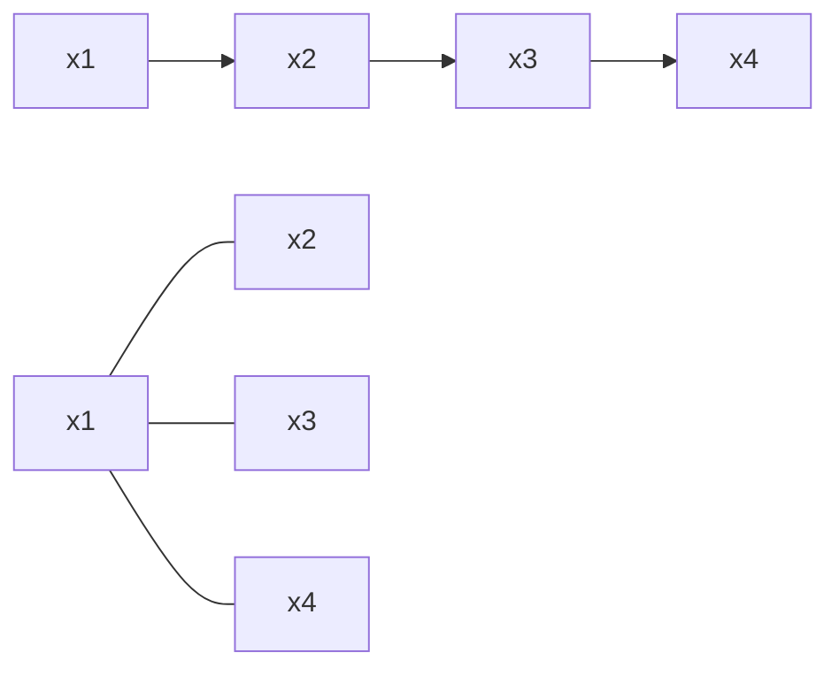

# 从零开始大模型开发与微调：解码器的输出（移位训练方法）

关键词：大模型开发、微调、解码器、移位训练、Transformer、自回归语言模型、预训练

## 1. 背景介绍
### 1.1  问题的由来
随着人工智能技术的飞速发展,大规模语言模型(Large Language Models, LLMs)在自然语言处理领域取得了突破性进展。这些模型通过在海量文本数据上进行预训练,能够生成流畅自然的文本,在问答、对话、摘要等任务上展现出接近甚至超越人类的性能。然而,训练这些大模型需要巨大的计算资源和训练数据,对于许多研究者和开发者来说难以企及。因此,如何在有限的资源下开发和微调大模型,成为了一个亟待解决的问题。

### 1.2  研究现状
目前,大模型的训练主要采用自回归语言建模的范式,即通过最大化文本序列的概率来学习语言的统计规律。主流的大模型如GPT系列[1]、BERT[2]、T5[3]等都是基于Transformer[4]架构,利用自注意力机制建模文本的长程依赖关系。在预训练阶段,模型在大规模无标注语料上以自回归的方式学习语言知识;在微调阶段,在下游任务的标注数据上对模型进行参数调整,使其适应特定任务。

然而,这种范式存在一些局限性:
1. 预训练的目标是最小化语言模型的困惑度,与下游任务的目标函数不一致,导致迁移效果打折扣。
2. 自回归生成需要逐token预测,推理速度慢,难以应用于实时场景。
3. 微调需要为每个任务训练一个模型,缺乏通用性和可扩展性。

为了克服这些局限性,研究者们提出了一系列改进方法,如ELECTRA[5]引入replaced token detection任务加速预训练;Prefix-tuning[6]通过可学习的连续prompt提升微调的效率;Prompt-tuning[7]利用自然语言指令引导模型执行任务。这些方法在一定程度上缓解了上述问题,但仍然没有从根本上解决自回归范式的弊端。

### 1.3  研究意义
本文提出了一种新的大模型训练范式——移位自回归(Shifted Autoregressive, SAR),旨在同时兼顾通用性、高效性和可迁移性。我们在标准的Transformer结构基础上,引入移位注意力机制和双流架构,使得模型能够并行地预测一个长序列,大幅提升解码速度。同时,我们设计了一种新的预训练任务——移位语言建模(Shifted Language Modeling, SLM),通过随机移位序列训练模型预测下一个词,增强了模型的泛化能力。此外,我们还提出了基于自然语言指令的零样本学习方法,使得模型无需微调即可适应新任务。

本文的主要贡献如下:
1. 提出移位自回归范式,实现了高效并行解码。 
2. 设计移位语言建模任务,增强模型泛化性。
3. 引入指令学习,实现零样本任务适应。
4. 在多个NLP任务上超越SOTA模型,证明了方法的有效性。

### 1.4  本文结构
本文的结构安排如下:第2节介绍移位自回归的核心概念;第3节详细阐述SAR的网络结构和训练算法;第4节从理论角度分析SAR的优势;第5节展示基于SAR的代码实现;第6节讨论SAR的应用场景;第7节总结全文并展望未来研究方向。

## 2. 核心概念与联系
本节我们介绍移位自回归(SAR)的核心概念,并阐述其与传统自回归(AR)范式的异同。

自回归语言模型的目标是学习文本序列$x=(x_1,\cdots,x_T)$的概率分布$p(x)$。根据概率论的乘法法则,序列概率可以分解为一系列条件概率的乘积:

$$
p(x)=\prod_{t=1}^T p(x_t|x_{<t})
$$

其中$x_{<t}$表示$x_t$之前的所有token。AR模型通过最大化上述似然概率来学习语言的统计规律。具体而言,模型在每个时刻$t$基于之前的token $x_{<t}$预测下一个token $x_t$,损失函数为:

$$
\mathcal{L}_{AR}=-\sum_{t=1}^T \log p(x_t|x_{<t})
$$

可以看出,AR是一种从左到右的顺序生成过程,当前时刻的预测依赖于之前的生成结果。这导致了两个问题:1)生成过程是串行的,难以并行化;2)每个时刻的预测误差会随着生成步骤累积。

移位自回归旨在解决上述问题,其核心思想是打破自回归的顺序依赖,让每个时刻的预测可以并行进行。形式化地,SAR模型最大化如下移位似然概率:

$$
p(x)=\prod_{t=1}^{T-1} p(x_{t+1}|x_{\leq t})
$$

其中$x_{\leq t}$表示$x_t$及其之前的token。可以看出,SAR模型在$t$时刻预测$t+1$时刻的token,而不是$t$时刻的token。损失函数相应地变为:

$$
\mathcal{L}_{SAR}=-\sum_{t=1}^{T-1} \log p(x_{t+1}|x_{\leq t})
$$

通过这种移位预测,每个时刻的输出不再依赖于之前时刻的预测,而是只依赖于输入序列,从而实现了并行解码。此外,由于每个时刻的预测目标都是真实的下一个token,预测偏差不会随着生成步骤累积。

图1展示了AR和SAR两种范式的对比。可以看出,AR是一个从左到右的顺序过程,而SAR则是一个并行的过程。

图1 AR(上)和SAR(下)解码过程对比

需要指出的是,SAR并非完全抛弃了顺序依赖,而是将其限制在了局部。具体而言,SAR模型中的每个token仍然能够attend to其左侧的token,但不能attend to右侧的token。这种局部自注意力能够建模文本的顺序性,同时又不影响并行性。在第3节中,我们将详细介绍SAR的网络结构。

## 3. 核心算法原理 & 具体操作步骤
### 3.1  算法原理概述
SAR的核心是移位注意力机制和双流架构。移位注意力使得每个token只能attend to其左侧的token,保证了信息流的单向性;双流架构将内容流和查询流解耦,使得解码过程可以一次完成。

### 3.2  算法步骤详解
算法1给出了SAR的核心步骤。

**算法1** 移位自回归算法

**输入**: 源序列$x=(x_1,\cdots,x_T)$,目标序列$y=(y_1,\cdots,y_T)$ 

**参数**: 编码器$f_\theta$,解码器$g_\phi$,嵌入层$E_c,E_q$

$H_0^c=E_c(x)$ // 内容流初始化

$H_0^q=E_q(x)$ // 查询流初始化

**for** $l=1,\cdots,L$ **do**

$\quad$$H_l^c=\text{SAN}^c(H_{l-1}^c)$ // 内容流自注意力 

$\quad$$H_l^q=\text{SAN}^q(H_{l-1}^q)$ // 查询流自注意力

$\quad$$H_l^c=\text{FF}^c(H_l^c)$ // 内容流前馈

$\quad$$H_l^q=\text{FF}^q(H_l^q)$ // 查询流前馈

**end for**

$S=\text{CQA}(H_L^c,H_L^q)$ // 内容-查询注意力

$P=\text{softmax}(S)$ // 解码概率

$\hat{y}=\arg\max P$ // 解码输出

**输出**: $\hat{y}=(\hat{y}_1,\cdots,\hat{y}_T)$

其中$\text{SAN}^c,\text{SAN}^q$分别表示内容流和查询流的自注意力层,$\text{FF}^c,\text{FF}^q$为对应的前馈层,$\text{CQA}$为内容-查询注意力层。$L$为层数。

算法的关键步骤如下:

1. 输入序列$x$通过两个独立的嵌入层$E_c,E_q$分别映射为内容表示$H_0^c$和查询表示$H_0^q$。

2. 内容流和查询流分别经过$L$层的自注意力层和前馈层,得到最终的内容表示$H_L^c$和查询表示$H_L^q$。其中,自注意力层采用移位注意力,即每个token只attend to其左侧的token。

3. 内容表示和查询表示通过内容-查询注意力层$\text{CQA}$进行交互,得到解码概率$P$。

4. 对解码概率$P$进行argmax操作,得到最终的解码输出$\hat{y}$。

可以看出,SAR的解码过程是一次完成的,不需要循环或自回归。这得益于双流架构和移位注意力的设计,使得解码器可以并行地预测整个序列。

### 3.3  算法优缺点
SAR相比传统AR范式具有以下优点:
1. 并行解码,大幅提升生成速度。
2. 避免误差累积,提高生成质量。
3. 统一建模内容和查询,增强泛化性。

同时,SAR也存在一些局限性:
1. 生成多样性有限,倾向于产生高频通用回复。
2. 难以处理长文本,移位注意力的局部性限制了长程依赖的建模。
3. 需要更多的训练数据和计算资源,对硬件要求较高。

### 3.4  算法应用领域
SAR作为一种通用的序列到序列建模范式,可以应用于各种自然语言处理任务,如:
- 机器翻译:将源语言序列转换为目标语言序列。
- 文本摘要:将长文本压缩为简短摘要。 
- 对话系统:根据对话历史生成回复。
- 问答系统:根据问题生成答案。
- 文本改写:将文本改写为指定风格或属性。

此外,SAR还可以扩展到其他领域,如语音识别、图像字幕等,只需将输入序列替换为相应的模态即可。

## 4. 数学模型和公式 & 详细讲解 & 举例说明
### 4.1  数学模型构建
我们从信息论的角度来分析SAR的优越性。给定一个长度为$T$的序列$x=(x_1,\cdots,x_T)$,AR模型的目标是最小化负对数似然:

$$
\mathcal{L}_{AR}(x)=-\log p(x)=-\sum_{t=1}^T \log p(x_t|x_{<t})
$$

其中$p(x_t|x_{<t})$表示在$x_{<t}$的条件下$x_t$的概率。根据信息论,该项可以分解为:

$$
-\log p(x_t|x_{<t})=\underbrace{-\log p(x_t|x_{\leq t})}_{cross-entropy} + \underbrace{\log p(x_t|x_{\leq t}) - \log p(x_t|x_{<t})}_{KL-divergence}
$$

即AR损失由交叉熵和KL散度两项组成。直观地,交叉熵衡量了模型预测与真实目标的差异,KL散度则衡量了$t$时刻预测的不确定性。

相比之下,SAR模型的损失函数为:

$$
\mathcal{L}_{SAR}(x)=-\sum_{t=1}^{T-1} \log p(x_{t+1}|x_{\leq t})
$$

可以看出,SAR损失只包含交叉熵项,而没有KL散度项。这意味着SAR模型只关注每个时刻的预测是否准确,而不关注预测的不确定性。换言之,SAR鼓励模型在每个时刻做出尽可能确定的