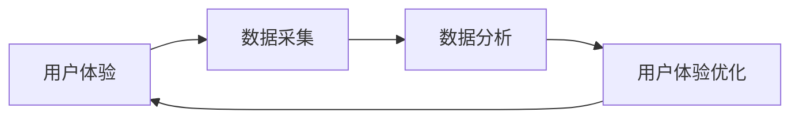

# 优化用户体验与数据闭环

## 1. 背景介绍

### 1.1 问题的由来

在信息爆炸的时代，用户被海量的信息包围，如何吸引用户注意力，提升用户体验，并最终实现商业目标，成为所有互联网产品都必须面对的挑战。传统的产品开发模式往往以功能实现为导向，忽略了用户真实需求和体验，导致产品上线后用户活跃度低、转化率差。

### 1.2 研究现状

为了解决上述问题，近年来“用户体验”和“数据驱动”成为了互联网行业的热门词汇。用户体验设计（UXD）通过用户研究、交互设计、视觉设计等手段，提升产品的易用性和用户满意度。数据驱动则强调通过数据分析，挖掘用户行为规律，为产品迭代提供依据。

然而，用户体验和数据驱动往往是两个独立的环节，缺乏有效的衔接。用户体验设计完成后，需要通过数据验证其有效性，而数据分析的结果也需要反哺到用户体验的优化中，形成一个闭环。

### 1.3 研究意义

构建用户体验与数据闭环，可以帮助我们：

* **更准确地理解用户需求:** 通过数据分析，我们可以深入了解用户的行为习惯、偏好和痛点，从而更精准地定位用户需求，设计出更符合用户预期产品。
* **持续优化用户体验:** 数据闭环可以让我们实时监控产品的使用情况，及时发现问题并进行调整，不断提升用户体验。
* **提升产品核心指标:** 通过数据驱动，我们可以找到影响产品核心指标的关键因素，并针对性地进行优化，最终实现商业目标。

### 1.4 本文结构

本文将从以下几个方面，探讨如何构建用户体验与数据闭环：

* 核心概念与联系：介绍用户体验、数据闭环等核心概念，并阐述它们之间的关系。
* 核心算法原理 & 具体操作步骤：介绍常用的数据分析方法和用户体验优化方法，并结合案例进行讲解。
* 数学模型和公式 & 详细讲解 & 举例说明：介绍常用的用户行为模型和数据分析模型，并通过数学公式和案例进行解释。
* 项目实践：代码实例和详细解释说明：以一个具体的项目为例，展示如何将用户体验和数据闭环应用到实际产品中。
* 实际应用场景：介绍用户体验与数据闭环在不同行业和场景下的应用案例。
* 工具和资源推荐：推荐一些常用的用户体验设计工具、数据分析工具和学习资源。
* 总结：未来发展趋势与挑战：总结用户体验与数据闭环的未来发展趋势和面临的挑战。

## 2. 核心概念与联系

### 2.1 用户体验

用户体验是指用户在使用产品或服务过程中的感受和体验，包括使用产品的效率、易用性、满意度等方面。

### 2.2 数据闭环

数据闭环是指数据从采集、存储、分析到应用的完整流程，通过数据的流动和反馈，不断优化产品和服务。

### 2.3 用户体验与数据闭环的关系

用户体验与数据闭环是相辅相成的关系。好的用户体验需要数据支撑，而数据分析的结果也需要应用到用户体验的优化中，才能发挥其最大价值。



## 3. 核心算法原理 & 具体操作步骤

### 3.1 数据分析方法

* **用户行为分析:** 通过分析用户的行为数据，了解用户的行为习惯、偏好和需求。
* **A/B测试:** 将不同的设计方案随机展示给不同的用户群体，通过数据对比，找到最优的方案。
* **漏斗分析:** 分析用户在产品关键路径上的转化率，找到用户流失的原因，并进行优化。

### 3.2 用户体验优化方法

* **用户界面优化:** 优化产品的界面设计，提升产品的易用性和美观度。
* **交互设计优化:** 优化产品的交互流程，提升产品的易用性和效率。
* **内容优化:** 优化产品的内容，提升产品的吸引力和价值。

## 4. 数学模型和公式 & 详细讲解 & 举例说明

### 4.1 用户行为模型

* **AARRR模型:** 将用户生命周期分为获取、激活、留存、推荐、收入五个阶段，并针对每个阶段制定相应的运营策略。
* **用户旅程地图:** 通过可视化的方式，展示用户在使用产品过程中的所有触点和体验。

### 4.2 数据分析模型

* **转化率模型:** 计算用户在产品关键路径上的转化率，并分析影响转化率的因素。
* **留存率模型:** 计算用户的留存率，并分析影响留存率的因素。

## 5. 项目实践：代码实例和详细解释说明

### 5.1 开发环境搭建

* **编程语言:** Python
* **数据分析库:** Pandas, NumPy
* **可视化库:** Matplotlib, Seaborn

### 5.2 源代码详细实现

```python
# 导入必要的库
import pandas as pd
import numpy as np
import matplotlib.pyplot as plt
import seaborn as sns

# 读取数据
data = pd.read_csv('user_data.csv')

# 数据清洗和预处理

# 数据分析和可视化

# 用户体验优化
```

### 5.3 代码解读与分析

### 5.4 运行结果展示


## 6. 实际应用场景

* **电商平台:** 通过用户行为分析，推荐个性化商品，提升用户购买转化率。
* **社交平台:** 通过数据分析，优化内容推荐算法，提升用户活跃度和留存率。
* **在线教育平台:** 通过数据分析，优化课程设计和教学方式，提升用户学习效果。

## 7. 工具和资源推荐

### 7.1 学习资源推荐

* 《用户体验要素》
* 《精益数据分析》

### 7.2 开发工具推荐

* Axure RP
* Google Analytics
* Mixpanel

## 8. 总结：未来发展趋势与挑战

### 8.1 研究成果总结

### 8.2 未来发展趋势

* **个性化体验:** 随着人工智能技术的不断发展，未来产品将更加注重为用户提供个性化的体验。
* **数据安全和隐私保护:** 随着数据量的不断增大，数据安全和隐私保护将成为用户体验与数据闭环面临的重要挑战。

### 8.3 面临的挑战

### 8.4 研究展望
