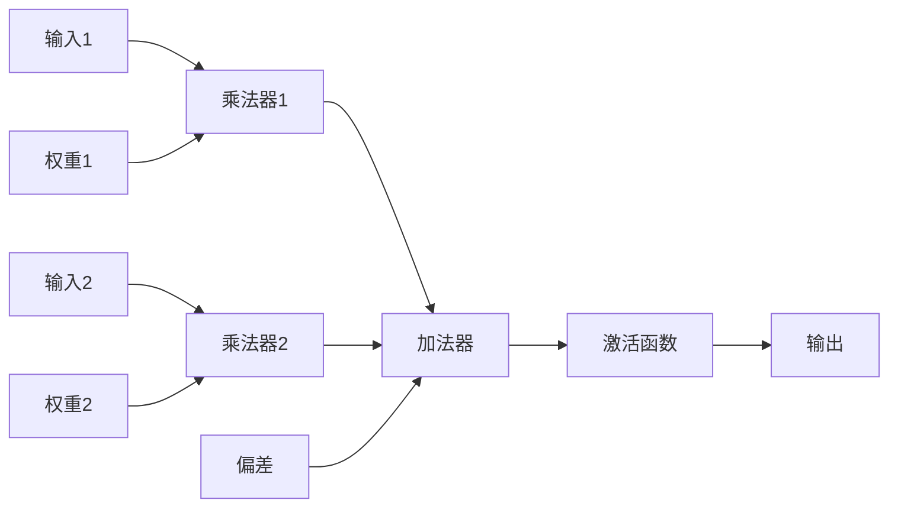

# 前馈网络在AI模型中的应用

## 1. 背景介绍

### 1.1 问题的由来

人工智能 (AI) 的最新进展，特别是在深度学习领域，彻底改变了各个行业，从图像识别到自然语言处理，再到药物发现。这场革命的核心是人工神经网络 (ANN) 的发展，这是一种受人脑结构和功能启发的计算模型。

在众多类型的人工神经网络中，前馈网络（也称为多层感知器或 MLP）是最早开发和应用最广泛的网络之一。它们构成了更复杂架构（如卷积神经网络 (CNN) 和递归神经网络 (RNN)）的基石，并在各种 AI 任务中取得了显著成果。

尽管近年来出现了更复杂的网络架构，但前馈网络由于其简单性、易于实现以及解决各种问题的能力，仍然是 AI 模型中不可或缺的一部分。了解前馈网络的原理、优势和局限性对于任何想要深入研究 AI 并构建强大的 AI 驱动的应用程序的人来说都至关重要。

### 1.2 研究现状

前馈网络已经存在了几十年，其根源可以追溯到 20 世纪 40 年代的早期神经科学研究。第一个前馈网络，即感知器，是在 20 世纪 50 年代后期开发出来的，它能够学习对输入数据进行分类。然而，直到 20 世纪 80 年代，随着反向传播算法的出现，前馈网络才开始展现出其真正的潜力，反向传播算法使得训练多层网络成为可能。

自那时以来，前馈网络已被应用于广泛的领域，包括：

- **图像识别：**对图像中的物体、场景和人脸进行分类和识别。
- **自然语言处理：**分析、理解和生成人类语言，例如机器翻译、情感分析和文本生成。
- **语音识别：**将口语转换为文本，用于虚拟助手、听写软件和语音搜索等应用。
- **预测分析：**根据历史数据预测未来趋势和结果，例如金融市场预测、客户行为分析和医疗诊断。

### 1.3 研究意义

前馈网络在 AI 模型中的应用具有重要意义，原因如下：

- **基础性：**它们构成了更复杂神经网络架构的基础，为理解和开发更先进的 AI 模型提供了基础。
- **多功能性：**它们可以应用于广泛的 AI 任务，包括分类、回归和特征提取。
- **效率：**与其他类型的网络相比，它们相对容易实现和训练，这使得它们成为许多应用的理想选择。
- **可解释性：**与更复杂的网络相比，它们更容易解释，这使得理解它们的行为和决策过程变得更加容易。

### 1.4 本文结构

本文的其余部分结构如下：

- **第 2 节：核心概念与联系** 介绍了前馈网络的关键概念，包括神经元、层、激活函数、权重和偏差。
- **第 3 节：核心算法原理 & 具体操作步骤** 深入探讨了训练前馈网络的反向传播算法，包括其数学基础和步骤。
- **第 4 节：数学模型和公式 & 详细讲解 & 举例说明** 提供了前馈网络的数学表示，包括其方程和推导。
- **第 5 节：项目实践：代码实例和详细解释说明** 展示了如何使用 Python 和流行的深度学习库（如 TensorFlow 或 PyTorch）实现前馈网络。
- **第 6 节：实际应用场景** 探讨了前馈网络在各个领域的实际应用，例如图像识别、自然语言处理和预测分析。
- **第 7 节：工具和资源推荐** 提供了学习前馈网络和深度学习的有用资源列表，包括书籍、课程和在线教程。
- **第 8 节：总结：未来发展趋势与挑战** 总结了前馈网络的关键要点，并讨论了未来的研究方向和挑战。
- **第 9 节：附录：常见问题与解答** 回答了有关前馈网络的常见问题。

## 2. 核心概念与联系

### 2.1 神经元

神经元是前馈网络的基本组成部分，它是一个受生物神经元启发的数学函数。它接收一个或多个输入，将这些输入与一组权重相乘，并将结果传递给一个激活函数，以产生一个输出。

### 2.2 层

前馈网络由多个层组成，这些层按顺序排列。每一层都包含多个神经元，这些神经元连接到前一层和后一层的