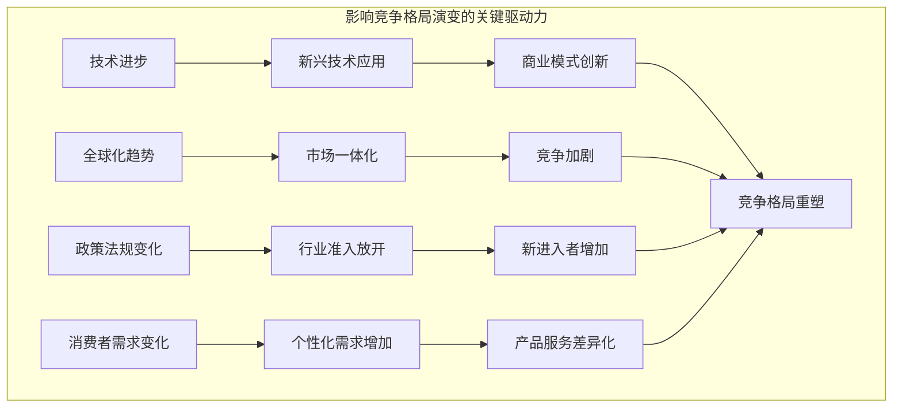

# 商业领域的竞争格局演变

## 1. 背景介绍

### 1.1 问题的由来

在当今快节奏的商业环境中,企业面临着前所未有的挑战和机遇。随着全球化和技术进步的加速,市场竞争日趋白热化,传统的商业模式和竞争策略已经难以为继。企业必须适应这种新的竞争格局,重新思考如何在动态环境中保持竞争优势。

商业竞争的根源在于有限的市场需求和资源。企业为了争夺有限的客户和利润,不得不相互竞争。传统上,企业主要依赖产品创新、价格战、营销策略等手段来赢得竞争。然而,当前的商业环境已经发生了翻天覆地的变化,企业不得不调整战略以适应新的竞争格局。

### 1.2 研究现状  

学术界和商业实践中对商业竞争格局的研究主要集中在以下几个方面:

1. **竞争战略理论**:包括迈克尔·波特的"五力模型"、基于资源的视角等,分析企业如何在特定行业环境中制定竞争战略。

2. **蓝海战略**:探讨企业如何开拓新的未被开垦的市场空间,摆脱传统行业的激烈竞争。

3. **商业模式创新**:研究企业如何通过创新的商业模式重塑行业竞争格局,实现可持续竞争优势。

4. **生态系统战略**:探讨企业如何构建自身的商业生态系统,形成护城河,抵御竞争对手的进攻。

5. **数字化转型**:分析企业如何利用新兴技术重塑商业流程,提高运营效率,增强竞争力。

这些研究为我们理解当前商业竞争格局的变化提供了有价值的见解,但仍有许多领域有待进一步探索和深入研究。

### 1.3 研究意义

深入研究商业竞争格局的演变具有重要的理论和实践意义:

1. **理论意义**:有助于丰富和发展战略管理、创新管理、营销学等学科的理论体系,为企业制定竞争战略提供新的分析框架和方法论。

2. **实践意义**:可以为企业管理者提供宝贵的决策参考,帮助企业更好地把握商业环境的变化,制定有效的竞争战略,保持持续的竞争优势。

3. **社会意义**:有利于促进市场公平竞争,优化资源配置,推动经济可持续发展。

### 1.4 本文结构

本文将从以下几个方面深入探讨商业领域竞争格局的演变:

1. 核心概念与联系
2. 新兴竞争模式及其特点
3. 影响竞争格局演变的关键驱动力
4. 企业应对新竞争格局的战略举措
5. 未来竞争格局的发展趋势和挑战

在详细阐述上述内容的同时,本文还将结合实际案例,使分析更具体、生动和说服力。最后,本文将总结研究成果,并对未来的发展方向提出建议和展望。

## 2. 核心概念与联系

为了深入理解商业竞争格局的演变,我们首先需要明确几个核心概念及其内在联系:

1. **竞争**
   - 定义:在有限的市场空间内,企业之间为获取更多利润而展开的一场较量。
   - 表现形式:价格竞争、产品竞争、服务竞争、渠道竞争等。

2. **竞争优势**  
   - 定义:企业相对于竞争对手而言所具有的独特的优势因素。
   - 来源:低成本、差异化、专有资源、核心能力等。

3. **竞争战略**
   - 定义:企业为获取和维持竞争优势而制定和实施的一系列行动方案。
   - 主要类型:成本领先战略、差异化战略、集中战略等。

4. **竞争格局**
   - 定义:特定行业内企业之间竞争的态势和格局。
   - 影响因素:行业结构、技术变革、政策环境、消费者需求等。

这些概念相互关联、相互影响。企业的竞争战略旨在获取和保持竞争优势,而竞争优势的来源和持续性则受到行业竞争格局的制约。同时,企业的竞争行为也会反过来影响和重塑行业的竞争格局。

## 3. 新兴竞争模式及其特点

随着技术进步和商业环境的变迁,传统的竞争模式正在发生深刻的变革,出现了一些新的竞争模式。这些新兴竞争模式具有鲜明的特点,对企业的竞争战略提出了新的挑战。

### 3.1 平台竞争模式

**3.1.1 平台竞争模式概述**

平台竞争模式是指企业通过构建数字平台,整合各种资源和参与者,形成生态系统,从而获取价值的一种新型竞争模式。在这种模式下,平台企业不再单纯依赖内部资源,而是利用网络效应和数据优势,吸引更多的参与者加入平台,形成"赢者通吃"的格局。

典型案例包括苹果的 iOS 生态系统、亚马逊的电商平台、微信的生活服务平台等。

**3.1.2 平台竞争模式的特点**

1. **网络效应**:平台的价值随着参与者数量的增加而成倍增长。
2. **数据优势**:平台企业可以获取大量用户数据,用于优化产品和服务。
3. **生态系统锁定**:用户和合作伙伴难以轻易离开已加入的平台生态系统。
4. **规模经济效应**:平台规模越大,单位成本越低,竞争力越强。
5. **赢者通吃**:平台市场往往形成少数巨头垄断的格局。

### 3.2 共享经济模式

**3.2.1 共享经济模式概述**  

共享经济模式是指通过互联网平台,实现闲置资源的高效对接和共享,从而降低交易成本、提高资源利用率的一种新型商业模式。在这种模式下,企业不再拥有全部资源,而是依赖众包和共享,实现供需的精准匹配。

典型案例包括滴滴打车、Airbnb 民宿、Uber 网约车等。

**3.2.2 共享经济模式的特点**

1. **去中介化**:直接连接供需双方,降低交易成本。
2. **资源共享**:充分利用闲置资源,提高资源利用率。
3. **灵活就业**:为大众提供灵活的就业和收入机会。
4. **信任机制**:依赖评价体系和信任机制来确保交易质量。
5. **平台赢家通吃**:存在明显的网络效应和规模经济效应。

### 3.3 个性化定制模式

**3.3.1 个性化定制模式概述**

个性化定制模式是指企业利用大数据、人工智能等新技术,根据用户的个性化需求,提供量身定制的产品和服务的一种新型竞争模式。在这种模式下,企业不再追求规模化生产,而是实现大规模个性化定制,以满足消费者日益多样化的需求。

典型案例包括 Nike 的个性化定制运动鞋、Stitchfix 的个性化服装订阅等。

**3.3.2 个性化定制模式的特点**

1. **大数据驱动**:依赖大数据分析用户偏好,实现精准营销。
2. **灵活生产**:采用智能制造技术,实现柔性化生产和大规模定制。
3. **体验至上**:注重为用户提供极致的个性化体验。
4. **长期粘性**:与用户建立长期的个性化关系,增强用户粘性。
5. **差异化竞争**:通过个性化定制实现产品和服务的差异化。

### 3.4 其他新兴竞争模式

除了上述三种主要的新兴竞争模式外,还有一些其他新型竞争模式值得关注,如:

1. **生态系统竞争模式**:企业通过构建自身的商业生态系统,形成护城河,增强核心竞争力。
2. **开放式创新模式**:企业通过与外部合作伙伴协作,实现创新资源的整合和利用。
3. **订阅模式**:企业将产品和服务转变为订阅形式,实现收入的持续化。
4. **体验经济模式**:企业将重心从产品转移到为顾客提供独特的体验上。

这些新兴竞争模式与传统模式相比,具有鲜明的特色和优势,对企业的商业模式、组织形态、运营方式等提出了全新的要求。

## 4. 影响竞争格局演变的关键驱动力

商业竞争格局的演变并非偶然,而是受到多种因素的深刻影响和推动。这些关键驱动力既包括技术进步等内在动力,也包括全球化、政策环境等外部环境变化。

### 4.1 技术进步

技术进步是推动竞争格局演变的根本驱动力。新兴技术的不断涌现,如大数据、人工智能、物联网、5G、区块链等,为企业带来了全新的商业机遇,也加剧了行业内部的竞争。

企业需要紧跟技术发展步伐,将新技术融入商业模式和运营流程中,以提高效率、优化体验、开拓新业务。同时,新技术的应用也孕育了平台经济、共享经济、个性化定制等新兴竞争模式,重塑了行业的竞争格局。

### 4.2 全球化趋势

全球化进程的不断深入,使得全球市场日趋一体化,企业面临来自世界各地的竞争对手。跨国公司凭借规模优势和资源整合能力,在全球范围内开展激烈竞争。

与此同时,本土企业也可以借助全球化的东风,拓展海外市场,实现规模扩张。无论是跨国公司还是本土企业,都需要制定全球化战略,应对日趋激烈的全球竞争。

### 4.3 政策法规变化  

政策法规的变化会直接影响行业的竞争格局。例如,行业准入政策的放开,会吸引更多新进入者加入,加剧行业内部的竞争;而反垄断法规的实施,则会遏制行业巨头的垄断行为,促进公平竞争。

此外,税收政策、贸易政策、环保法规等也会影响企业的成本结构和运营方式,从而改变企业之间的竞争格局。企业需要密切关注政策法规的变化,及时调整战略应对。

### 4.4 消费者需求变化

消费者需求的变迁是塑造竞争格局的另一个重要驱动力。当代消费者追求个性化、体验化的产品和服务,传统的标准化、规模化生产模式已难以满足这种需求。

企业需要采用大数据、人工智能等新技术,实现精准营销和个性化定制,以满足消费者日益多样化的需求。同时,消费者对品质、体验的重视,也推动企业加大创新力度,不断优化产品和服务。

## 5. 企业应对新竞争格局的战略举措

面对商业竞争格局的深刻变革,企业需要采取积极有效的战略举措,以保持和增强自身的竞争优势。这些战略举措涉及商业模式创新、组织变革、生态系统构建等多个层面。

### 5.1 商业模式创新

**5.1.1 平台化转型**

企