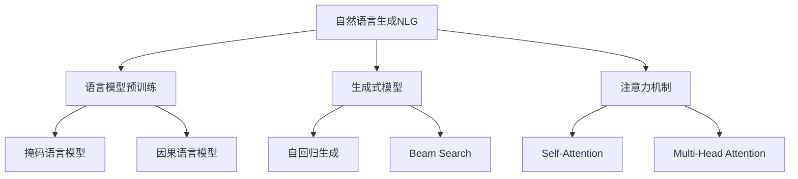

# 基于AI大模型的自然语言生成：写作的未来

## 1. 背景介绍

### 1.1 问题的由来

在当今信息时代,数据和内容的生产速度正以前所未有的规模快速增长。无论是个人博客、新闻报道、营销文案还是技术文档,各行各业都亟需高质量的文字内容来满足不断扩大的需求。然而,传统的写作方式已经难以跟上这种需求的增长速度,因为它依赖于人工的创作能力,效率低下且成本高昂。

为了解决这一问题,自然语言生成(NLG)技术应运而生。NLG旨在利用人工智能算法自动生成人类可读的自然语言文本,从而大幅提高写作效率,降低成本。尽管早期的NLG系统主要局限于结构化数据到文本的转换,但随着深度学习和大规模语言模型的兴起,NLG的能力得到了极大的提升,开始能够生成更加自然流畅、语义丰富的长文本。

### 1.2 研究现状

近年来,以GPT(Generative Pre-trained Transformer)为代表的大型语言模型取得了令人瞩目的进展,展现出强大的自然语言生成能力。这些模型通过在海量文本数据上进行预训练,学习了丰富的语言知识,能够生成看似人类水平的高质量文本。

随着模型规模和训练数据的不断扩大,大模型的性能也在不断提升。以GPT-3为例,它拥有1750亿个参数,是当前最大的语言模型。GPT-3不仅能够生成流畅的长文本,还展现出一定的推理和分析能力,可以回答复杂的问题、撰写文章、编写代码等。

除了GPT系列,还有许多其他优秀的大型语言模型,如谷歌的LaMDA、OpenAI的InstructGPT、DeepMind的Chinchilla等。这些模型在生成质量、计算效率、多语种支持等方面都有不同的侧重点,为NLG的发展提供了多种选择。

### 1.3 研究意义

基于大模型的自然语言生成技术具有重要的理论意义和应用价值:

- 理论意义:大模型为自然语言处理提供了一种全新的范式,它们展现出了强大的语言理解和生成能力,为探索人类语言的本质提供了新的视角和方法。研究大模型的内在机制和知识表示形式,有助于揭示语言的深层规律。

- 应用价值:自然语言生成技术可以极大地提高写作效率,降低内容生产的成本。它在新闻写作、文案创作、文档撰写、对话系统等多个领域都有广阔的应用前景。此外,NLG还可以辅助教育、翻译、无障碍访问等,造福社会。

### 1.4 本文结构

本文将全面介绍基于大模型的自然语言生成技术。首先阐述核心概念和技术原理,包括语言模型预训练、生成式模型、注意力机制等。然后深入探讨关键算法细节,如Transformer结构、自回归生成等。接着介绍数学模型和公式推导,并结合案例进行讲解。之后通过实战项目演示开发流程和代码实现。最后总结现状、分析趋势和挑战,并给出工具和资源推荐。

## 2. 核心概念与联系

自然语言生成(NLG)是指利用人工智能算法自动生成人类可读的自然语言文本。它是自然语言处理(NLP)的一个重要分支,与自然语言理解(NLU)相对应。

NLG的核心是语言模型,即对语言的概率分布进行建模。通过学习大量文本数据,语言模型可以捕捉语言的统计规律,从而生成新的文本序列。

语言模型预训练是现代NLG的关键技术。它通过自监督学习的方式,在大规模无标注语料上训练语言模型,获得通用的语言表示能力。常见的预训练方法包括掩码语言模型(如BERT)和因果语言模型(如GPT)。

生成式模型是NLG的主要模型范式。与判别式模型(如分类、序列标注等)不同,生成式模型直接对文本序列的概率分布进行建模,通过自回归(Autoregressive)的方式逐个生成词元。常用的搜索算法包括贪婪搜索、Beam Search等。

注意力机制是近年来NLG的核心创新,尤其是Transformer模型中的Self-Attention和Multi-Head Attention,能够有效捕捉长距离依赖关系,大大提高了生成质量。

## 3. 核心算法原理 & 具体操作步骤

### 3.1 算法原理概述

基于大模型的自然语言生成主要依赖于两个核心算法:Transformer和自回归生成(Autoregressive Generation)。

Transformer是一种全新的基于注意力机制的序列模型,由谷歌在2017年提出,主要用于机器翻译任务。它完全抛弃了RNN和CNN等传统架构,使用Self-Attention来建模序列内部的长程依赖关系,大大提高了并行计算能力。

自回归生成则是Transformer等生成式模型进行文本生成的主要策略。它的基本思想是将文本序列看作一个标记的马尔可夫链,在给定前缀的情况下,模型会预测下一个最可能出现的标记,从而逐个生成整个序列。

### 3.2 算法步骤详解

#### 3.2.1 Transformer模型

Transformer模型主要由编码器(Encoder)和解码器(Decoder)两个子模块组成。

1. **编码器(Encoder)**

编码器的主要作用是将输入序列(如源语言文本)映射为一系列的向量表示。

- 位置编码(Positional Encoding):由于Self-Attention无法直接获取序列的位置信息,因此需要在输入嵌入上加入位置编码,赋予每个词元位置的相对信息。
- 多头注意力(Multi-Head Attention):对输入序列进行Self-Attention操作,捕捉不同位置词元之间的长程依赖关系。
- 前馈网络(Feed-Forward Network):对注意力的结果进行线性变换,为每个位置的表示增加非线性映射。
- 层归一化(Layer Normalization):对上述操作的结果进行归一化,以避免梯度消失/爆炸。

编码器堆叠多个这样的编码器层,最终输出一个序列的向量表示。

2. **解码器(Decoder)**

解码器的作用是根据编码器的输出,生成目标序列(如目标语言文本)。

- 掩码多头注意力(Masked Multi-Head Attention):在Self-Attention时,对序列的后续位置进行掩码,确保每个位置的词元只能关注之前的词元。
- 编码器-解码器注意力(Encoder-Decoder Attention):将编码器的输出与解码器的输出进行注意力计算,融合源序列和目标序列之间的依赖关系。
- 前馈网络和层归一化:与编码器类似。

解码器也是堆叠多个解码器层,最终输出预测的目标序列。

#### 3.2.2 自回归生成

在得到Transformer模型后,我们可以使用自回归生成策略进行文本生成。具体步骤如下:

1. 给定一个起始符(如<BOS>)作为输入。
2. 将输入传入解码器,解码器会输出一个概率分布,表示下一个词元的预测概率。
3. 根据一定的搜索策略(如贪婪搜索或Beam Search),从概率分布中采样出一个词元。
4. 将这个词元附加到已生成的序列末尾,作为新的输入传入解码器。
5. 重复步骤2~4,直到生成终止符(如<EOS>)或达到最大长度。

通过这种自回归的方式,模型可以逐个生成文本序列。注意在训练阶段,模型使用的是teacher forcing策略,即以真实的目标序列作为输入,而在生成时则使用自回归。

### 3.3 算法优缺点

基于Transformer和自回归生成的NLG算法具有以下优缺点:

**优点**:

1. 并行计算能力强,可以充分利用GPU/TPU等加速硬件,提高训练和生成效率。
2. 注意力机制能够有效建模长程依赖关系,生成质量显著优于RNN等传统模型。
3. 预训练语言模型可以学习通用的语言知识,降低了任务数据的需求量。
4. 生成的文本质量高,在流畅性、连贯性和语义合理性等方面表现优异。

**缺点**:

1. 训练成本高昂,需要大量计算资源和海量训练数据。
2. 生成效率较低,需要逐个预测词元,无法做到一次性生成整个序列。
3. 生成的文本可能存在不确定性,难以完全控制输出内容。
4. 存在潜在的安全隐患,如生成虚假信息、有害内容等。
5. 知识的来源和内在机制缺乏透明度,存在"黑箱"问题。

### 3.4 算法应用领域

基于大模型的自然语言生成技术具有广泛的应用前景:

1. **内容创作**:可用于新闻写作、营销文案、故事创作、诗歌创作等,极大提高内容生产效率。
2. **文档撰写**:可辅助编写技术文档、报告、演讲稿、知识库等,提高写作质量。
3. **对话系统**:生成自然的人机对话响应,为智能助手、客服机器人等提供支持。
4. **文本续写**:根据已有文本,自动生成下文,用于小说、剧本等创作延续。
5. **文本摘要**:自动生成文档的摘要和概述,提高信息获取效率。
6. **数据到文本**:将结构化数据(如表格、数据库等)转换为自然语言文本。
7. **机器翻译**:与编码器-解码器模型结合,提供高质量的机器翻译服务。

## 4. 数学模型和公式 & 详细讲解 & 举例说明

### 4.1 数学模型构建

我们将自然语言生成问题建模为一个条件概率分布 $P(Y|X)$,其中 $X$ 表示输入序列, $Y$ 表示需要生成的目标序列。根据贝叶斯公式:

$$P(Y|X) = \frac{P(X|Y)P(Y)}{P(X)}$$

由于分母 $P(X)$ 是个常数,对于给定的输入 $X$ 是固定的,因此我们只需最大化分子部分 $P(X|Y)P(Y)$ 即可。这里 $P(Y)$ 是语言模型,用于建模目标序列 $Y$ 的概率分布。而 $P(X|Y)$ 则是编码器-解码器模型,它将输入 $X$ 和输出 $Y$ 的关系建模为条件概率分布。

在Transformer中,我们使用Self-Attention机制来计算 $P(Y)$ 和 $P(X|Y)$。具体来说,对于长度为 $T$ 的序列 $Y=\{y_1,y_2,...,y_T\}$,我们有:

$$\begin{aligned}
P(Y) &= \prod_{t=1}^{T}P(y_t|y_1,y_2,...,y_{t-1}) \\
     &= \prod_{t=1}^{T}\text{Softmax}(f(y_1,y_2,...,y_{t-1}))
\end{aligned}$$

其中 $f$ 是Transformer解码器模型,它使用Self-Attention和前馈网络对序列进行编码,得到每个位置的向量表示,再经过线性投影和Softmax得到概率分布。

对于条件概率 $P(X|Y)$,我们同样使用Transformer编码器-解码器模型进行计算:

$$P(X|Y) = \prod_{t=1}^{T}P(x_t|x_1,x_2,...,x_{t-1},Y)$$

编码器首先将输入序