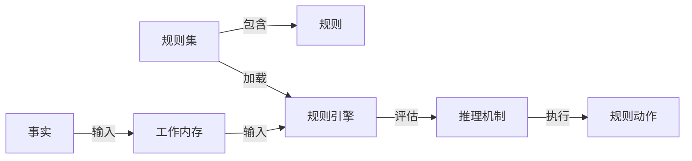

# 基于Java的智能家居设计：使用Java为智能家居编写自定义规则引擎

## 1. 背景介绍

### 1.1 问题的由来

随着科技的不断发展和人们生活水平的提高,智能家居系统已经成为现代生活中不可或缺的一部分。智能家居系统旨在通过集成各种智能设备和传感器,实现对家居环境的自动化控制和优化,从而提高生活质量和能源利用效率。然而,由于每个家庭的需求和偏好都不尽相同,因此需要一种灵活、可扩展的方式来定制和管理智能家居系统的行为。

### 1.2 研究现状 

目前,大多数智能家居系统都采用了基于规则的方法来控制设备行为。规则引擎作为一种常见的软件组件,可以根据预定义的规则集合对输入数据进行评估,并作出相应的决策或执行操作。传统的规则引擎通常使用特定的规则语言或领域特定语言(DSL)来定义规则,这种方式虽然可以满足基本需求,但缺乏灵活性和可扩展性。

### 1.3 研究意义

本文旨在探讨如何使用Java编程语言开发一个自定义的规则引擎,用于智能家居系统的控制和管理。通过使用通用编程语言(如Java)来定义规则,我们可以充分利用其丰富的语法和语义,实现更加复杂和动态的规则逻辑。同时,自定义规则引擎还可以与现有的智能家居系统无缝集成,提供更加灵活和可扩展的解决方案。

### 1.4 本文结构

本文将首先介绍规则引擎在智能家居系统中的作用和核心概念,然后详细阐述自定义规则引擎的设计和实现过程,包括算法原理、数学模型、代码实例等。接下来,我们将探讨规则引擎在实际应用场景中的使用,以及相关工具和资源的推荐。最后,本文将总结研究成果,并对未来的发展趋势和挑战进行展望。

## 2. 核心概念与联系

在深入探讨自定义规则引擎的细节之前,我们需要先了解一些核心概念和它们之间的关系。

1. **规则(Rule)**: 规则是一种条件-动作对,用于描述在满足特定条件时应该执行的操作。规则通常由条件部分(IF)和动作部分(THEN)组成。

2. **规则集(RuleSet)**: 规则集是一组相关规则的集合,用于解决特定的问题领域或场景。

3. **事实(Fact)**: 事实是指描述当前系统状态的数据,它们将作为规则引擎的输入,用于评估规则条件。

4. **工作内存(Working Memory)**: 工作内存是一个临时存储区域,用于存放事实数据,并在规则评估过程中进行修改和更新。

5. **规则引擎(Rule Engine)**: 规则引擎是一种软件组件,负责加载规则集、接收事实数据、评估规则条件、执行规则动作等任务。它是整个规则系统的核心部分。

6. **推理机制(Inference Mechanism)**: 推理机制是规则引擎中用于评估规则条件和执行规则动作的算法。常见的推理机制包括正向链推理(Forward Chaining)和反向链推理(Backward Chaining)。

这些核心概念之间的关系如下所示:

在智能家居系统中,规则引擎可以根据来自各种传感器和设备的事实数据(如温度、光线、运动等),评估预定义的规则集,并执行相应的动作,如控制灯光、调节空调温度、开启安防系统等。通过自定义规则引擎,我们可以更加灵活地定制和管理这些规则,以满足不同家庭的特定需求。

## 3. 核心算法原理 & 具体操作步骤

### 3.1 算法原理概述

自定义规则引擎的核心算法原理基于**正向链推理(Forward Chaining)**机制。正向链推理是一种自底向上的推理方式,它从已知的事实出发,不断应用规则,推导出新的事实,直到达到目标或无法继续推导为止。

在规则引擎中,正向链推理的基本流程如下:

1. 将初始事实加载到工作内存中。
2. 匹配工作内存中的事实与规则条件,找出所有可以执行的规则。
3. 执行所有可执行规则的动作部分,并将产生的新事实添加到工作内存中。
4. 重复步骤2和3,直到无法继续推导出新的事实或达到目标为止。

这种推理机制具有高效、灵活和可扩展的优点,非常适合应用于智能家居系统的规则管理。

### 3.2 算法步骤详解

下面我们将详细解释自定义规则引擎的算法步骤:

1. **加载规则集**

   首先,我们需要将预定义的规则集加载到规则引擎中。规则集可以通过编程方式动态构建,也可以从外部文件或数据库中读取。

2. **创建工作内存**

   创建一个工作内存对象,用于存储初始事实和推导出的新事实。

3. **插入初始事实**

   将初始事实数据插入到工作内存中,作为推理的起点。

4. **匹配规则**

   遍历规则集,将工作内存中的事实与每条规则的条件部分进行匹配。如果一条规则的所有条件都满足,则将该规则标记为可执行规则。

5. **执行规则动作**

   对于所有可执行规则,执行它们的动作部分。动作可能包括插入新事实、修改或删除现有事实等操作。

6. **更新工作内存**

   根据规则动作的执行结果,更新工作内存中的事实数据。

7. **重复匹配和执行**

   重复步骤4、5和6,直到无法继续推导出新的事实或达到目标为止。

8. **返回结果**

   最终,工作内存中的事实数据就是推理的结果,可以根据需要进行进一步处理或展示。

### 3.3 算法优缺点

**优点:**

- **灵活性强**: 通过编程方式定义规则,可以实现任意复杂的逻辑,并且易于维护和扩展。
- **可解释性好**: 规则的条件-动作形式易于理解,有助于系统的透明性和可解释性。
- **高效性**: 正向链推理算法具有较好的性能,适合处理大量事实和规则。
- **可扩展性强**: 可以轻松地添加、修改或删除规则,满足不断变化的需求。

**缺点:**

- **规则冲突**: 当多条规则同时满足时,可能会出现规则冲突的情况,需要引入冲突解决策略。
- **规则维护**: 随着规则数量的增加,规则集的维护和管理会变得更加复杂。
- **性能瓶颈**: 在某些极端情况下,如果事实数量和规则数量都非常大,可能会导致性能下降。

### 3.4 算法应用领域

正向链推理算法在许多领域都有广泛的应用,包括但不限于:

- **专家系统**: 用于模拟人类专家的决策过程,如医疗诊断、金融决策等。
- **业务规则管理**: 在企业应用中管理和执行业务规则。
- **事件驱动系统**: 根据发生的事件触发相应的操作。
- **机器人控制**: 根据环境信息和预定义的规则控制机器人的行为。
- **网络安全**: 检测和响应网络安全威胁。

在智能家居系统中,正向链推理算法可以用于根据传感器数据和用户偏好来控制家居设备,实现自动化和个性化的家居环境管理。

## 4. 数学模型和公式 & 详细讲解 & 举例说明

### 4.1 数学模型构建

为了更好地理解和优化规则引擎的性能,我们可以将其建模为一个**生产系统(Production System)**。生产系统是一种形式化的知识表示方法,由一组规则和一个全局数据库(工作内存)组成。

在生产系统中,规则可以表示为如下形式:

$$
r_i: \text{IF } c_i \text{ THEN } a_i
$$

其中:

- $r_i$ 表示第 $i$ 条规则
- $c_i$ 是规则的条件部分,描述了触发规则执行的条件
- $a_i$ 是规则的动作部分,描述了在条件满足时应执行的操作

工作内存可以表示为一个集合 $WM$,其中包含了当前系统的所有事实数据。

在每个循环迭代中,规则引擎需要执行以下步骤:

1. 匹配: 对于每条规则 $r_i$,检查其条件部分 $c_i$ 是否在当前工作内存 $WM$ 中满足。
2. 冲突集构建: 将所有满足条件的规则加入冲突集 $C$。
3. 冲突解决: 根据预定义的策略从冲突集 $C$ 中选择一条规则 $r_j$ 执行。
4. 执行: 执行选择的规则 $r_j$ 的动作部分 $a_j$,更新工作内存 $WM$。

这个过程将不断重复,直到无法继续推导出新的事实或达到目标为止。

### 4.2 公式推导过程

为了量化规则引擎的性能,我们可以引入以下符号:

- $N$: 规则集中规则的总数
- $M$: 工作内存中事实的总数
- $k$: 每条规则的平均条件数
- $t_m$: 匹配一条规则与一个事实所需的时间
- $t_a$: 执行一条规则的动作所需的时间

在每个循环迭代中,匹配规则的时间复杂度为 $O(N \times M \times k)$,因为需要对每条规则的每个条件与所有事实进行匹配。

假设在每个循环中有 $n_c$ 条规则满足条件,则冲突集构建和冲突解决的时间复杂度为 $O(n_c)$。

执行规则动作的时间复杂度为 $O(n_c \times t_a)$。

因此,每个循环迭代的总时间复杂度为:

$$
T_{iter} = O(N \times M \times k \times t_m) + O(n_c) + O(n_c \times t_a)
$$

如果我们假设 $t_m$ 和 $t_a$ 是常数,并且 $n_c \ll N$,则可以近似为:

$$
T_{iter} \approx O(N \times M \times k)
$$

在最坏情况下,如果每次迭代都会产生新的事实,并且所有规则都需要重新评估,那么总时间复杂度将是:

$$
T_{total} = O(N \times M \times k \times I)
$$

其中 $I$ 是迭代次数。

通过这些公式,我们可以分析规则引擎的性能瓶颈,并针对性地进行优化,如减少无关规则的匹配、优化冲突解决策略等。

### 4.3 案例分析与讲解

为了更好地理解数学模型和公式,让我们来看一个具体的案例。假设我们要为一个智能家居系统设计一个规则引擎,用于控制灯光、温度和安防系统。

规则集包含以下规则:

1. 如果房间内有人运动,且当前时间在 6:00 - 22:00 之间,则打开灯光。
2. 如果房间内没有人运动,且当前时间在 22:00 - 6:00 之间,则关闭灯光。
3. 如果室内温度高于 25°C,且有人在房间内,则打开空调制冷模式。
4. 如果室内温度低于 20°C,且有人在房间内,则打开空调制热模式。
5. 如果所有人离开房间,且当前时间在 22:00 - 6:00 之间,则启动安防系统。

我们可以将这