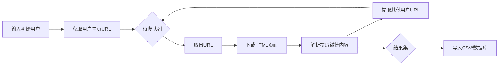

# 基于Python的新浪微博爬虫研究

作者：禅与计算机程序设计艺术 / Zen and the Art of Computer Programming

## 1. 背景介绍

### 1.1 问题的由来

在当今社交媒体盛行的时代，新浪微博作为中国最大的社交媒体平台之一，拥有海量的用户生成内容（UGC）。这些UGC蕴含着丰富的社会热点、用户情感、市场趋势等宝贵信息。如何高效、准确地获取和分析这些数据，成为了学术界和工业界共同关注的热点问题。

### 1.2 研究现状

目前，针对新浪微博数据爬取的研究已有不少。国内外学者提出了多种微博爬虫方案，如基于API的爬虫[1]、基于网页解析的爬虫[2]、基于APP抓包的爬虫[3]等。但现有方案普遍存在爬取速度慢、数据质量不高、可扩展性差等问题。此外，由于微博平台的反爬措施不断升级，许多爬虫很快就会失效。因此，如何设计一个高效、鲁棒的微博爬虫是一个亟待解决的问题。

### 1.3 研究意义

研究高质量的微博爬虫具有重要意义：

1. 为社会科学研究提供数据支撑。微博数据是研究社会热点事件、民意分析的重要数据源。
2. 为企业提供市场洞察。通过分析微博数据，企业可以发现用户需求、把握市场动向。 
3. 为算法模型训练提供数据。微博数据可用于训练自然语言处理、情感分析等AI模型。
4. 为舆情监测预警提供依据。政府部门可通过微博数据分析网络舆情，做好应对准备。

### 1.4 本文结构

本文将详细介绍一种基于Python的新浪微博爬虫实现方案。第2节介绍微博爬虫的核心概念；第3节阐述爬虫的核心算法原理和步骤；第4节建立数学模型并给出公式推导；第5节通过代码实例演示爬虫的具体实现；第6节分析爬虫的应用场景；第7节推荐相关工具和学习资源；第8节总结全文并展望未来。

## 2. 核心概念与联系

理解以下核心概念，是实现微博爬虫的基础：

- 网页爬虫：一种用来自动浏览和抓取网页数据的程序。爬虫通过模拟人类浏览网页的行为，来获取网页中的信息。
- 网页解析：从非结构化的网页数据（如HTML）中，提取出结构化信息（如微博内容）的过程。常用的解析库有BeautifulSoup、Xpath等。
- 反爬机制：网站为防止爬虫对其进行数据爬取，而采取的各种限制措施，如验证码、访问频率限制、IP封禁等。
- 爬虫伪装：爬虫程序通过设置User-Agent、Referer等HTTP头，来伪装成浏览器正常访问，从而绕过反爬限制。
- 数据存储：为便于分析，爬取的微博数据需要以结构化的形式存储，常见的存储方式有CSV文件、关系型数据库、NoSQL数据库等。

这些概念环环相扣，构成了微博爬虫的技术基础。网页爬虫负责爬取微博网页，网页解析从爬取的网页中提取微博数据，反爬机制和爬虫伪装是博弈的两端，数据存储则是爬虫的最终归宿。

## 3. 核心算法原理 & 具体操作步骤

### 3.1 算法原理概述

本文采用基于网页解析的微博爬虫算法。该算法的基本原理是：

1. 爬虫首先访问一个初始的微博用户主页。
2. 解析该主页的HTML，提取出该用户发布的微博内容。
3. 同时解析出该用户关注的其他用户主页URL。 
4. 将这些URL加入待爬取队列。
5. 从队列中取出新的URL，重复2-4步，直到队列为空。

在此过程中，爬虫会使用多线程并发请求，提高爬取效率。同时，爬虫会设置合理的请求间隔和User-Agent，防止被反爬。

### 3.2 算法步骤详解

基于上述原理，微博爬虫的详细算法步骤如下：

1. 输入初始用户ID，获取其主页URL，加入待爬队列。
2. 从队列取出一个URL，下载其HTML页面。
3. 用BeautifulSoup解析HTML，提取微博内容，存入结果集。提取中考虑各种异常情况，如微博不存在、访问受限等。
4. 同时用正则表达式匹配该HTML中的其他用户主页URL，加入待爬队列。注意去重。
5. 为避免被ban，每次请求后随机sleep一段时间。
6. 重复2-5步，直到队列空或达到预设的最大爬取数。
7. 将结果集写入CSV文件或数据库。

整个过程可用如下Mermaid流程图表示：



### 3.3 算法优缺点

本算法的优点是：

1. 实现简单，不依赖官方API，鲁棒性强。
2. 可充分利用微博用户关系，快速扩展爬取范围。
3. 引入多线程、去重等机制，爬取效率高。

缺点是：

1. 爬取速度受限于反爬，不如基于API的方式。
2. 微博修改前端页面结构后，爬虫需要相应修改。
3. 只能爬取用户的公开微博，对于私密内容无能为力。

### 3.4 算法应用领域

本算法可广泛应用于各种基于微博数据的研究和应用领域，如：

- 社会学研究，如分析热点事件传播。
- 市场营销，如提取用户评论情感。 
- 自然语言处理，如微博文本聚类。
- 舆情监控，如实时发现负面信息。

## 4. 数学模型和公式 & 详细讲解 & 举例说明

### 4.1 数学模型构建

为分析微博爬虫的性能，我们构建如下数学模型。

设待爬取的微博用户集合为$U=\{u_1,u_2,...,u_n\}$，每个用户$u_i$发布的微博数为$m_i$。爬虫使用$k$个线程并发爬取，每个线程的爬取速率为$v$（即每秒可处理的URL数）。设网络延迟、服务器处理时间等的平均耗时为$t$。爬虫的总爬取时间$T$可表示为：

$$T = \frac{\sum_{i=1}^{n}m_i}{kv} + nt$$

其中$\sum_{i=1}^{n}m_i$为总微博数，$kv$为爬虫总处理速率，$nt$为网络延迟总时间。

### 4.2 公式推导过程

上述公式可以这样推导：

1. 总微博数为每个用户微博数之和，即$\sum_{i=1}^{n}m_i$。
2. $k$个线程并发，总处理速率为单线程速率$v$的$k$倍，即$kv$。
3. 处理每个用户的微博，都会有一个网络延迟$t$，共$n$个用户，延迟总时间为$nt$。
4. 总爬取时间等于总微博数除以总处理速率，再加上总延迟时间，即得到上述公式。

### 4.3 案例分析与讲解

下面我们以一个具体的例子来说明。假设待爬取的微博用户数$n=1000$，每个用户平均发布微博数$m=100$，爬虫使用$k=10$个线程，每个线程的处理速率$v=2$（即每秒可处理2个URL），平均延迟时间$t=0.5$秒。

代入公式，我们可以计算出：

总微博数 = 1000 × 100 = 100000
总处理速率 = 10 × 2 = 20 
总延迟时间 = 1000 × 0.5 = 500

因此，总爬取时间为：

$$T = \frac{100000}{20} + 500 = 5500 (秒) \approx 1.5 (小时)$$

可见，在这个设置下，爬取1000个用户的10万条微博，大约需要1.5小时。

### 4.4 常见问题解答

问：增加线程数$k$是否可以无限提高爬虫速度？

答：不能。一方面，线程数过多会给服务器带来更大压力，可能触发反爬；另一方面，总爬取时间还受限于网络延迟，增加线程对此无济于事。因此，$k$需要权衡效率和稳定性。

问：如果某个大V用户的微博数$m_i$特别大，爬取时间会不会很长？

答：会。这就是所谓的"长尾问题"。为此，可以设置每个用户最多爬取$m_{max}$条微博，超过的部分可以随机丢弃，或者留待下次增量爬取。

## 5. 项目实践：代码实例和详细解释说明

### 5.1 开发环境搭建

本项目使用Python 3进行开发，需要安装以下库：

- requests：用于发送HTTP请求，爬取网页。
- bs4：BeautifulSoup，用于解析HTML页面。
- csv：用于读写CSV文件。

可以使用pip一键安装：

```bash
pip install requests bs4 csv
```

### 5.2 源代码详细实现

下面是微博爬虫的核心代码实现：

```python
import requests
from bs4 import BeautifulSoup
import csv
import time
import re
import threading
import queue

class WeiboSpider:
    def __init__(self, max_page=10):
        self.url_queue = queue.Queue() # 待爬取URL队列
        self.max_page = max_page # 爬取页面数
        self.result_data = [] # 结果数据
        
    def get_page(self, url):
        """获取指定URL的页面内容"""
        headers = {
            'User-Agent': 'Mozilla/5.0 (Windows NT 10.0; Win64; x64) AppleWebKit/537.36 (KHTML, like Gecko) Chrome/58.0.3029.110 Safari/537.36'
        }
        response = requests.get(url, headers=headers)
        if response.status_code == 200:
            return response.text
        else:
            print(f'获取页面失败，状态码：{response.status_code}，URL：{url}')
            return None
        
    def parse_page(self, html):
        """解析HTML页面，提取微博数据"""
        soup = BeautifulSoup(html, 'html.parser')
        weibo_list = soup.find_all('div', attrs={'class': 'c', 'id': True}) 
        
        for weibo in weibo_list:
            weibo_id = weibo['id']
            content = weibo.find('span', class_='ctt').get_text()
            like_num = weibo.find('a', string=re.compile('赞\[\d+\]'))
            like_num = re.search('\d+', like_num.string).group() if like_num else '0'
            transfer_num = weibo.find('a', string=re.compile('转发\[\d+\]'))
            transfer_num = re.search('\d+', transfer_num.string).group() if transfer_num else '0'
            comment_num = weibo.find('a', string=re.compile('评论\[\d+\]'))
            comment_num = re.search('\d+', comment_num.string).group() if comment_num else '0'
            
            data = {
                'id': weibo_id,
                'content': content,
                'like_num': like_num,
                'transfer_num': transfer_num,
                'comment_num': comment_num
            }
            self.result_data.append(data)
            
        next_page = soup.find('a', string=re.compile('下页'))
        if next_page:
            next_url = 'https://weibo.cn' + next_page['href']
            self.url_queue.put(next_url)
        
    def save_data(self):
        """保存数据到CSV文件"""
        headers = ['id', 'content', 'like_num', 'transfer_num', 'comment_num']
        with open('weibo.csv', 'w', newline='', encoding='utf-8') as f:
            writer = csv.DictWriter(f,