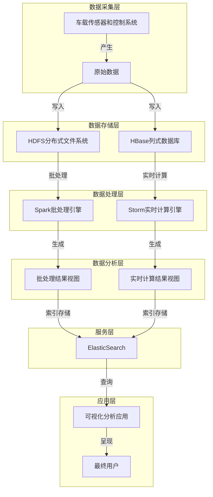

# 基于大数据的汽车数据分析系统设计与实现

## 1. 背景介绍

### 1.1 问题的由来

随着汽车行业的快速发展和汽车智能化水平的不断提高,汽车上安装的各种传感器和控制系统产生了大量的数据。这些数据包括车辆状态数据(如发动机转速、油耗、轮胎压力等)、驾驶行为数据(如车速、加速度、制动力等)以及环境数据(如温度、湿度、道路状况等)。这些海量的汽车大数据蕴含着丰富的价值信息,但由于数据量巨大、种类繁多、格式不统一等特点,使得传统的数据处理和分析方法难以满足需求。因此,迫切需要一种高效、可扩展的大数据分析系统来处理和挖掘这些汽车大数据中蕴含的价值。

### 1.2 研究现状

目前,已有一些公司和研究机构开始关注汽车大数据分析的重要性,并提出了一些解决方案。例如,特斯拉公司利用车载传感器收集的大数据,对驾驶行为进行分析,从而优化自动驾驶算法;通用汽车公司则利用大数据分析技术预测车辆故障,提高维修效率。但是,现有的大数据分析系统通常是通用型的,无法很好地满足汽车行业的特殊需求。因此,需要设计一种专门针对汽车大数据的分析系统。

### 1.3 研究意义

设计和实现一个基于大数据的汽车数据分析系统,可以为汽车制造商、维修服务商和车主带来以下重要意义:

1. **提高汽车产品质量**:通过分析汽车大数据,可以发现设计缺陷、生产缺陷和使用缺陷,从而优化产品设计和制造流程,提高汽车产品质量。

2. **优化维修服务**:基于对车辆状态数据的分析,可以提前预测故障发生,实现预防性维修,降低维修成本,延长汽车使用寿命。

3. **改善驾驶体验**:通过分析驾驶行为数据,可以为驾驶员提供个性化的驾驶建议,优化驾驶策略,提高驾驶安全性和舒适性。

4. **促进智能网联发展**:汽车大数据分析系统可以为智能网联汽车提供强有力的数据支持,推动智能网联汽车技术的发展和应用。

### 1.4 本文结构

本文将详细介绍基于大数据的汽车数据分析系统的设计与实现。文章首先阐述系统的核心概念和架构,然后深入探讨关键算法原理和数学模型,并通过实际项目实践展示代码实现细节。最后,讨论系统的应用场景、发展趋势和面临的挑战。全文共分为以下几个部分:

1. 核心概念与架构
2. 关键算法原理与数学模型
3. 项目实践:代码实例与解释
4. 应用场景与发展趋势
5. 总结与展望

## 2. 核心概念与架构

在设计基于大数据的汽车数据分析系统之前,我们需要先了解一些核心概念,并确定系统的整体架构。

### 2.1 核心概念

#### 2.1.1 汽车大数据

汽车大数据指由汽车上安装的各种传感器和控制系统产生的海量数据,包括:

- **车辆状态数据**:发动机转速、油耗、轮胎压力、电池电量等,反映车辆当前运行状态。
- **驾驶行为数据**:车速、加速度、制动力、方向盘角度等,描述驾驶员的操作行为。
- **环境数据**:温度、湿度、道路状况、交通信息等,反映车辆所处的外部环境。

汽车大数据具有**海量**、**多源异构**和**实时性**等特点,需要采用大数据技术进行存储、处理和分析。

#### 2.1.2 大数据分析

大数据分析是指对海量、异构、快速增长的数据进行捕获、存储、管理、处理和分析,从中发现隐藏的知识、规律和价值信息的过程。在汽车大数据分析中,主要包括以下几个步骤:

1. **数据采集**:从各种车载传感器和系统中收集汽车大数据。
2. **数据存储**:将采集到的数据存储到分布式文件系统或NoSQL数据库中。
3. **数据预处理**:对原始数据进行清洗、转换、集成和规范化等预处理操作。
4. **数据分析**:利用机器学习、数据挖掘等算法对预处理后的数据进行分析,发现有价值的模式和规律。
5. **可视化呈现**:将分析结果以图表、报告等形式直观地呈现给用户。

#### 2.1.3 Lambda架构

Lambda架构是一种通用的大数据处理架构,由三个层次组成:

1. **批处理层(Batch Layer)**: 用于对历史数据进行批量处理,生成视图,支持随机查询。
2. **实时计算层(Speed Layer)**: 用于对新到达的数据进行实时计算,补充批处理层的结果。
3. **服务层(Serving Layer)**: 对批处理层和实时计算层的结果进行索引和存储,为查询提供快速响应。

Lambda架构能够很好地平衡批处理和实时处理之间的矛盾,满足大数据场景下的低延迟查询和高吞吐量写入需求。

### 2.2 系统架构

基于上述核心概念,我们设计了一种基于Lambda架构的汽车大数据分析系统,整体架构如下图所示:

该系统架构主要包括以下几个层次:

1. **数据采集层**: 从车载传感器和控制系统中采集原始的汽车大数据。
2. **数据存储层**: 将采集到的原始数据分别存储到分布式文件系统(HDFS)和列式数据库(HBase)中,为后续的批处理和实时计算做准备。
3. **数据处理层**: 利用Spark进行批处理,对历史数据进行全量处理;利用Storm进行实时计算,对新到达的数据进行增量处理。
4. **数据分析层**: 基于Spark和Storm的处理结果,生成批处理结果视图和实时计算结果视图。
5. **服务层**: 利用ElasticSearch对结果视图进行索引和存储,为查询提供快速响应。
6. **应用层**: 通过可视化分析应用查询ElasticSearch中的数据,并将分析结果呈现给最终用户。

该架构能够有效地处理海量的汽车大数据,实现批处理和实时处理的有机结合,为汽车大数据分析提供强有力的支持。

## 3. 关键算法原理与数学模型

在汽车大数据分析系统中,关键算法主要包括异常检测算法、故障预测算法和驾驶行为分析算法等。这些算法的原理和数学模型如下。

### 3.1 异常检测算法

#### 3.1.1 算法原理概述

异常检测算法旨在从大量的车辆状态数据中发现异常值,这些异常值可能预示着车辆故障或其他问题。常用的异常检测算法包括基于统计的方法、基于聚类的方法、基于深度学习的方法等。

其中,**基于统计的异常检测算法**是最简单和最常用的方法之一。它假设正常数据服从某种已知的概率分布(如高斯分布),而异常数据则不服从该分布。具体来说,算法首先根据历史数据估计概率分布的参数(如均值和方差),然后计算新数据与该分布的偏差。如果偏差超过一定阈值,则将该数据点标记为异常。

#### 3.1.2 算法步骤详解

1. **数据预处理**:对原始车辆状态数据进行清洗、标准化等预处理,消除噪声和异常值的影响。
2. **估计概率分布参数**:基于预处理后的历史数据,估计正常数据服从的概率分布(如高斯分布)的参数,包括均值$\mu$和标准差$\sigma$。
3. **计算偏差**:对于新到达的数据点$x$,计算其与概率分布的偏差,即$z$分数:

$$z = \frac{x - \mu}{\sigma}$$

4. **判断异常**:如果$z$分数的绝对值大于预设的阈值$\alpha$,则将$x$标记为异常值,否则视为正常值。阈值$\alpha$通常取值为3,这样异常值的概率约为0.3%。
5. **异常处理**:对于检测到的异常值,可以发出警报、记录日志,或者将其过滤掉。

该算法简单高效,适用于服从已知概率分布的数据。但是,如果数据的分布未知或者分布发生变化,该算法的效果将受到影响。

#### 3.1.3 算法优缺点

**优点**:

- 算法原理简单,易于理解和实现。
- 计算效率高,适合实时异常检测。
- 对于服从已知概率分布的数据,检测效果良好。

**缺点**:

- 需要预先假设数据的概率分布,如果分布未知或发生变化,效果将受到影响。
- 对于高维数据,估计概率分布参数的难度会增加。
- 无法很好地处理数据中的噪声和离群点。

#### 3.1.4 算法应用领域

基于统计的异常检测算法广泛应用于各种领域,如网络入侵检测、信用卡欺诈检测、制造业质量控制等。在汽车大数据分析中,它可以用于检测车辆状态数据中的异常值,如发动机转速异常、油耗异常、轮胎压力异常等,为故障诊断和预防性维护提供支持。

### 3.2 故障预测算法

#### 3.2.1 算法原理概述

故障预测算法旨在基于车辆的历史状态数据,预测未来某个时间点车辆是否会出现故障。这是一个典型的时间序列分类问题,可以使用机器学习和深度学习等方法来解决。

其中,**长短期记忆网络(Long Short-Term Memory, LSTM)**是一种常用的深度学习模型,能够很好地捕捉时间序列数据中的长期依赖关系,因此被广泛应用于故障预测等序列建模任务。

LSTM是一种特殊的递归神经网络(Recurrent Neural Network, RNN),它通过引入门控机制和记忆单元,有效解决了传统RNN存在的梯度消失和梯度爆炸问题。LSTM的核心思想是selectively记住和遗忘信息,以更好地建模长期依赖关系。

#### 3.2.2 算法步骤详解

1. **数据预处理**:对原始车辆状态数据进行清洗、标准化、切分等预处理,将其转换为LSTM可接受的输入格式。
2. **构建LSTM模型**:定义LSTM网络的层数、神经元数量、激活函数等超参数,构建LSTM模型。
3. **模型训练**:使用带有故障标签的历史数据训练LSTM模型,通过反向传播算法优化模型参数,使其能够学习到车辆状态数据与故障之间的映射关系。
4. **模型评估**:在测试