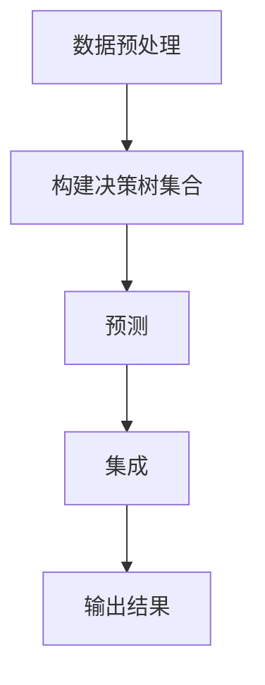

# 基于机器学习的银行信贷评分模型研究

## 1. 背景介绍

### 1.1 问题的由来

银行业的核心业务之一是发放贷款,而贷款的风险评估是银行业务中至关重要的一个环节。传统的信贷评分模型通常依赖人工经验判断和统计模型,存在一定的主观性和滞后性。随着大数据时代的到来和机器学习技术的不断发展,如何利用机器学习算法构建更加准确、高效的信贷评分模型,已经成为银行业亟待解决的重要课题。

### 1.2 研究现状

目前,国内外已有不少学者开展了基于机器学习的信贷评分模型研究。常见的机器学习算法包括逻辑回归、决策树、随机森林、支持向量机、神经网络等。这些模型在一定程度上提高了评分的准确性,但仍存在一些不足,如对异常值敏感、可解释性差、模型复杂度高等问题。

### 1.3 研究意义

构建高效、可解释的信贷评分模型,对于银行业的风险管理、资源配置等具有重要意义。本文将探讨如何利用机器学习算法,结合特征工程、模型集成等技术,构建准确性高、可解释性强的信贷评分模型,为银行业的风险决策提供有力支持。

### 1.4 本文结构

本文首先介绍信贷评分的基本概念和机器学习在其中的应用,然后详细阐述几种常用的机器学习算法原理及其在信贷评分中的应用,并对这些模型的优缺点进行分析。接下来,探讨特征工程、模型集成等技术在提高模型性能中的作用。最后,总结研究成果,并对未来的发展方向进行展望。

## 2. 核心概念与联系

信贷评分(Credit Scoring)是指通过量化的统计模型或机器学习算法,对借款人的信用状况进行评估,从而预测其违约风险的过程。信贷评分模型的输入通常包括借款人的人口统计学信息、财务状况、信用历史等数据,输出则是一个分数或等级,反映了借款人违约的可能性。

机器学习算法在信贷评分中的应用,主要包括以下几个方面:

1. **分类算法**: 将借款人划分为"违约"和"未违约"两类,如逻辑回归、决策树、随机森林等。
2. **回归算法**: 直接预测借款人的违约概率,如线性回归、神经网络等。
3. **无监督学习**: 用于发现数据中的潜在模式,如聚类分析。
4. **特征工程**: 从原始数据中提取有价值的特征,提高模型性能。
5. **模型集成**: 将多个基础模型的预测结果进行集成,以提高泛化能力。

上述各个方面相互关联、相辅相成,构成了完整的基于机器学习的信贷评分模型体系。

## 3. 核心算法原理 & 具体操作步骤

### 3.1 算法原理概述

#### 3.1.1 逻辑回归

逻辑回归是一种广泛应用的分类算法,它通过对数几率回归(Logistic Regression)将输入特征映射到0到1之间的值,表示样本属于正类的概率。逻辑回归的优点是模型简单、易于理解和实现,缺点是对于线性不可分的数据,分类性能较差。

#### 3.1.2 决策树

决策树是一种树形结构的监督学习算法,它通过对特征的条件判断,将样本空间划分为多个区域,每个区域对应一个类别。常用的决策树算法包括ID3、C4.5和CART等。决策树的优点是可解释性强,缺点是容易过拟合。

#### 3.1.3 随机森林

随机森林是一种基于决策树的集成学习算法,它通过构建多棵决策树,并将它们的预测结果进行投票或平均,从而提高了模型的泛化能力。随机森林不仅具有较高的分类精度,而且对异常值的鲁棒性也较好。

#### 3.1.4 支持向量机

支持向量机(SVM)是一种基于统计学习理论的分类算法,它通过构造最大间隔超平面,将不同类别的样本分开。SVM的优点是理论基础扎实、泛化能力强,缺点是对于非线性数据,需要引入核函数,计算复杂度较高。

#### 3.1.5 神经网络

神经网络是一种模拟生物神经网络的机器学习模型,它通过多层神经元的连接和激活函数,对输入数据进行非线性映射。常用的神经网络模型包括前馈神经网络、卷积神经网络和递归神经网络等。神经网络的优点是对非线性数据有很强的拟合能力,缺点是可解释性差、训练过程复杂。

### 3.2 算法步骤详解

以随机森林算法为例,其主要步骤如下:

1. **数据预处理**: 对原始数据进行清洗、标准化、编码等预处理,将其转换为算法可识别的格式。
2. **构建决策树集合**: 通过有放回的方式从原始数据中抽取若干个样本集,并在每个样本集上构建一棵决策树。构建决策树时,在每个节点上只从所有特征中随机选择一部分特征,以引入随机性。
3. **预测**: 对于新的样本,将其输入到每棵决策树中,得到每棵树的预测结果。
4. **集成**: 对于分类问题,通过投票的方式确定最终的类别;对于回归问题,则取所有树的预测结果的平均值作为最终预测。

上述步骤可以用以下Mermaid流程图表示:



### 3.3 算法优缺点

#### 3.3.1 优点

1. **准确性高**: 通过集成多个基础模型,随机森林能够显著提高预测的准确性。
2. **鲁棒性强**: 随机森林对异常值的鲁棒性较好,不易受到个别样本的影响。
3. **可解释性较好**: 决策树作为基础模型,具有较好的可解释性,有利于理解模型的决策过程。

#### 3.3.2 缺点

1. **训练时间较长**: 需要构建多棵决策树,训练时间相对较长。
2. **占用内存较大**: 需要存储多棵决策树的结构,对内存占用较大。
3. **对特征缩放敏感**: 如果特征的尺度差异较大,可能会影响模型的性能。

### 3.4 算法应用领域

随机森林算法不仅可以应用于信贷评分领域,在其他领域如计算机视觉、自然语言处理、推荐系统等也有广泛的应用。由于其优良的性能和可解释性,随机森林已成为机器学习中最常用的算法之一。

## 4. 数学模型和公式 & 详细讲解 & 举例说明

### 4.1 数学模型构建

在信贷评分中,我们通常将问题建模为二分类问题,即将借款人划分为"违约"和"未违约"两类。设样本空间为$\mathcal{X}$,标记空间为$\mathcal{Y} = \{0, 1\}$,其中1表示"违约",0表示"未违约"。我们的目标是学习一个分类函数$f: \mathcal{X} \rightarrow \mathcal{Y}$,使得对于任意输入$x \in \mathcal{X}$,都能正确预测其标记$y \in \mathcal{Y}$。

为了量化模型的性能,我们引入损失函数(Loss Function)的概念。对于每个样本$(x, y)$,其损失定义为:

$$
L(y, f(x)) = \begin{cases}
    1, & \text{if } y \neq f(x)\\
    0, & \text{if } y = f(x)
\end{cases}
$$

即当模型预测错误时,损失为1,否则为0。我们希望学习到的模型能够使总体损失最小化,即:

$$
\min_{f} \mathbb{E}_{(x, y) \sim \mathcal{D}}[L(y, f(x))]
$$

其中$\mathcal{D}$表示样本的真实分布。由于真实分布未知,我们通常使用经验风险(Empirical Risk)来近似:

$$
\min_{f} \frac{1}{N} \sum_{i=1}^{N} L(y_i, f(x_i))
$$

这就是机器学习算法的基本思路:通过最小化经验风险,学习一个在训练数据上表现良好的模型,并期望它能够很好地泛化到未见过的新数据。

### 4.2 公式推导过程

以逻辑回归为例,我们将推导其模型公式的过程。

逻辑回归模型假设输出$y$服从伯努利分布,即:

$$
P(y=1|x) = \pi(x), \quad P(y=0|x) = 1 - \pi(x)
$$

其中$\pi(x)$是一个未知的函数,我们希望通过学习得到它的近似。引入对数几率(Logit)函数:

$$
\text{logit}(\pi(x)) = \log \frac{\pi(x)}{1 - \pi(x)}
$$

我们假设对数几率是输入$x$的线性函数:

$$
\text{logit}(\pi(x)) = w^T x + b
$$

其中$w$和$b$是待学习的参数。解析上式可得:

$$
\pi(x) = \frac{e^{w^T x + b}}{1 + e^{w^T x + b}}
$$

这就是逻辑回归模型的公式,也被称为Sigmoid函数。

为了学习参数$w$和$b$,我们需要最小化经验风险,即最小化负对数似然函数:

$$
\begin{aligned}
J(w, b) &= -\frac{1}{N} \sum_{i=1}^{N} \big[ y_i \log \pi(x_i) + (1 - y_i) \log (1 - \pi(x_i)) \big] \\
        &= -\frac{1}{N} \sum_{i=1}^{N} \big[ y_i \log \frac{1}{1 + e^{-(w^T x_i + b)}} + (1 - y_i) \log \frac{1}{1 + e^{w^T x_i + b}} \big]
\end{aligned}
$$

通过梯度下降等优化算法,我们可以求解出最优参数$w^*$和$b^*$,从而得到逻辑回归模型。

### 4.3 案例分析与讲解

为了更好地理解机器学习在信贷评分中的应用,我们以一个真实的数据集为例进行案例分析。这个数据集包含了德国银行的1000名借款人的信息,包括人口统计学数据、就业情况、信用历史等特征,以及是否违约的二元标记。我们将使用Python中的scikit-learn库进行建模和分析。

首先,我们导入所需的库并加载数据:

```python
import pandas as pd
from sklearn.model_selection import train_test_split
from sklearn.preprocessing import StandardScaler
from sklearn.linear_model import LogisticRegression
from sklearn.tree import DecisionTreeClassifier
from sklearn.ensemble import RandomForestClassifier
from sklearn.metrics import accuracy_score, roc_auc_score

# 加载数据
data = pd.read_csv('german_credit_data.csv')
X = data.drop('default', axis=1)
y = data['default']

# 划分训练集和测试集
X_train, X_test, y_train, y_test = train_test_split(X, y, test_size=0.2, random_state=42)

# 标准化数据
scaler = StandardScaler()
X_train = scaler.fit_transform(X_train)
X_test = scaler.transform(X_test)
```

接下来,我们分别使用逻辑回归、决策树和随机森林三种算法进行建模,并评估它们的性能:

```python
# 逻辑回归
lr = LogisticRegression()
lr.fit(X_train, y_train)
y_pred_lr = lr.predict(X_test)
acc_lr = accuracy_score(y_test, y_pred_lr)
auc_lr = roc_auc_score(y_test, lr.predict_proba(X_test)[:, 1])
print(f'Logistic Regression: Accuracy = {acc_lr:.4f}, AUC = {auc_lr:.4f}')

# 决策树
dt = DecisionTreeClassifier