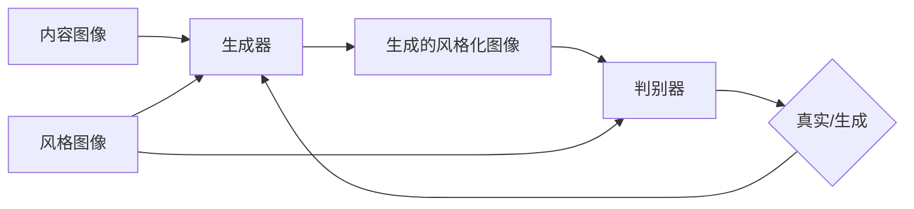

# 基于生成对抗网络的图像风格迁移在广告设计中的应用

## 1. 背景介绍
### 1.1  问题的由来
随着计算机视觉和深度学习技术的飞速发展,图像风格迁移技术逐渐成为了一个热门的研究方向。图像风格迁移是指将一幅图像的风格迁移到另一幅图像上,同时保留原图像的内容不变。这种技术在很多领域都有广泛的应用前景,例如艺术创作、图像编辑、广告设计等。

特别是在广告设计领域,利用图像风格迁移技术可以快速生成具有艺术感和创意的广告图片,大大提高广告设计的效率和质量。传统的广告设计流程需要专业的设计师,耗时耗力,而且创意有限。引入图像风格迁移技术后,可以利用各种经典画作、照片等素材,自动生成千变万化的艺术化广告图,为广告注入新的创意灵感。

### 1.2  研究现状
目前,图像风格迁移主要有两大类方法:基于纹理合成的方法和基于深度学习的方法。基于纹理合成的方法通过匹配纹理特征,将风格图像的纹理特征迁移到内容图像中,代表工作有 Image Analogies、Image Quilting 等。这类方法一般计算效率较高,但生成图像质量和语义一致性较差。

基于深度学习的方法利用卷积神经网络提取图像的内容特征和风格特征,通过优化目标函数使生成图像在内容和风格上都与目标接近,代表工作有 Neural Style、Fast Neural Style 等。这类方法生成图像质量较高,但计算效率偏低。

近年来,生成对抗网络(GAN)在图像生成领域取得了突破性进展。研究者尝试将 GAN 应用到图像风格迁移中,取得了不错的效果。基于 GAN 的风格迁移方法通过训练一个生成网络和一个判别网络,生成网络负责生成风格化的图像,判别网络负责判断生成图像是否在目标风格上足够逼真,两个网络互相博弈,最终使生成图像在保留内容的同时,风格上与目标风格接近。代表工作有 CycleGAN、DualGAN、StarGAN 等。

### 1.3  研究意义
将基于 GAN 的图像风格迁移技术应用到广告设计领域,具有重要的研究意义和应用价值:

1. 提高广告设计效率和创意:利用图像风格迁移技术,可以快速批量生成具有艺术感的创意广告图像,解放设计师的生产力,激发更多创意灵感。

2. 个性化定制广告:根据不同受众的喜好,定制个性化风格的广告图像,提升广告投放精准度和转化率。

3. 降低广告设计成本:自动化生成创意广告,减少对专业设计师的依赖,节约人力成本。 

4. 探索新的商业模式:利用风格迁移模型,可以开发出创意广告设计工具,面向广告公司和设计师提供服务,开拓新的商业模式。

5. 学术上的探索:将 GAN 这一前沿的深度学习技术应用到广告设计领域,探索新的研究方向,促进计算机视觉、深度学习、艺术设计等多学科的交叉融合。

### 1.4  本文结构
本文将重点介绍如何利用基于生成对抗网络的图像风格迁移技术,在广告设计中的应用。内容安排如下:

第二部分介绍图像风格迁移和生成对抗网络的核心概念和联系。第三部分重点介绍基于 GAN 的风格迁移算法原理和具体步骤。第四部分从数学角度对相关模型和公式进行推导和讲解。第五部分通过实例代码,演示风格迁移模型在广告图生成中的应用。第六部分讨论该技术在实际广告设计中的应用场景。第七部分推荐相关学习资源和工具。第八部分总结全文,并对未来研究方向进行展望。

## 2. 核心概念与联系
图像风格迁移和生成对抗网络是两个密切相关的概念。图像风格迁移的目标是将一张风格图像的风格迁移到另一张内容图像上,生成一张融合了内容图像内容和风格图像风格的新图像。风格通常指色彩、笔触、纹理等视觉元素,内容指图像中的物体、场景等语义信息。风格迁移的核心是如何有效地分离并重组图像的内容和风格表征。

生成对抗网络(GAN)是一种用于生成任务的深度学习模型,由生成器(Generator)和判别器(Discriminator)两部分组成。生成器负责生成假样本以尽可能欺骗判别器,判别器负责判断输入样本是真实样本还是生成的假样本。两个网络在训练过程中互相博弈,最终使生成器能生成接近真实样本的假样本。GAN 在图像生成、图像翻译、图像编辑等任务上取得了广泛成功。

将 GAN 应用于图像风格迁移,可以让生成器学习如何生成指定风格的图像,判别器判断生成图像在风格上是否接近目标风格。通过两个网络的对抗训练,可以使生成图像在保留内容图像内容的同时,风格上接近风格图像。与传统的风格迁移方法相比,基于 GAN 的方法可以生成更加逼真、艺术感更强的风格化图像。同时 GAN 具有端到端的训练方式,可以实现快速高效的风格迁移。

下图展示了图像风格迁移和生成对抗网络的关系:

## 3. 核心算法原理 & 具体操作步骤
### 3.1  算法原理概述
基于 GAN 的图像风格迁移算法,主要由生成器网络 G 和判别器网络 D 组成。生成器 G 接收内容图像 c 和风格图像 s,生成风格化图像 G(c,s)。判别器 D 接收生成图像 G(c,s) 和真实风格图像 s,判断 G(c,s) 在风格上是否接近 s。

训练过程中,生成器 G 努力生成在内容上接近 c、风格上接近 s 的图像,以欺骗判别器 D。而判别器 D 努力区分生成图像和真实风格图像。两个网络互相对抗,交替训练,最终使生成器 G 学会生成内容保留、风格逼真的风格化图像。

该算法的目标函数包含三个部分:对抗损失、内容损失和风格损失。对抗损失使生成图像在风格上尽可能逼真,内容损失使生成图像在内容上尽可能接近内容图像,风格损失使生成图像在风格上尽可能接近风格图像。三个损失通过权重系数平衡,共同指导模型训练。

### 3.2  算法步骤详解
算法主要分为训练阶段和测试阶段两部分。

训练阶段:
1. 准备内容图像和风格图像数据集,进行必要的预处理。
2. 初始化生成器 G 和判别器 D 的网络结构和参数。
3. 在每个训练批次中:
   - 从数据集中采样一批内容图像 c 和风格图像 s
   - 生成器 G 生成风格化图像 G(c,s)
   - 判别器 D 对 G(c,s) 和 s 进行真假判断
   - 计算生成器和判别器的损失函数,包括对抗损失、内容损失和风格损失  
   - 反向传播,更新生成器 G 和判别器 D 的网络参数
4. 重复步骤 3,直到模型收敛或达到预设的训练轮数。

测试阶段:
1. 加载训练好的生成器 G 的网络参数。
2. 对于待转换风格的内容图像 c 和目标风格图像 s,输入生成器 G。
3. 生成器 G 生成风格化图像 G(c,s)。
4. 输出生成的风格化图像。

### 3.3  算法优缺点
优点:
- 端到端的训练方式,无需预训练的特征提取网络,训练高效。  
- 可以灵活适应不同风格,生成多样化的风格化图像。
- 生成图像质量高,保留内容清晰,风格逼真。
- 通过调节损失函数权重,可以平衡内容保留和风格化的程度。

缺点:  
- 需要大量的内容图像和风格图像进行训练,对数据量要求较高。
- 训练过程计算量大,对硬件要求较高。  
- 泛化能力有待提高,模型易过拟合到训练数据。
- 对抽象风格图像的建模能力有限。

### 3.4  算法应用领域
- 艺术风格化:将普通照片转换成各种艺术风格,如油画、水彩画等。
- 图像增强:通过风格化,提升图像的视觉质量和艺术感。  
- 游戏场景生成:快速生成不同风格的游戏场景和资源。
- 虚拟试妆:根据参考风格图像,生成个性化的虚拟化妆效果。
- 广告设计:为广告图片赋予多样化的创意风格。

## 4. 数学模型和公式 & 详细讲解 & 举例说明
### 4.1  数学模型构建
基于 GAN 的风格迁移模型,其数学模型可以表示为:

$$\min_{G} \max_{D} \mathcal{L}_{GAN}(G,D) + \lambda_c \mathcal{L}_{content}(G) + \lambda_s \mathcal{L}_{style}(G)$$

其中,$G$ 和 $D$ 分别表示生成器和判别器。$\mathcal{L}_{GAN}$, $\mathcal{L}_{content}$ 和 $\mathcal{L}_{style}$ 分别表示对抗损失、内容损失和风格损失。$\lambda_c$ 和 $\lambda_s$ 为平衡三个损失的权重系数。

对抗损失 $\mathcal{L}_{GAN}$ 表示为:

$$\mathcal{L}_{GAN}(G,D) = \mathbb{E}_{s \sim p_{data}(s)}[\log D(s)] + \mathbb{E}_{c \sim p_{data}(c)}[\log (1-D(G(c,s)))]$$

其中,$\mathbb{E}$ 表示期望,$p_{data}$ 表示真实数据分布。该损失函数衡量了判别器 $D$ 对真实风格图像 $s$ 的判别能力,以及生成器 $G$ 生成的风格化图像 $G(c,s)$ 欺骗判别器 $D$ 的能力。

内容损失 $\mathcal{L}_{content}$ 表示为:

$$\mathcal{L}_{content}(G) = \mathbb{E}_{c \sim p_{data}(c),s \sim p_{data}(s)}[\| f(c) - f(G(c,s)) \|_2^2]$$

其中,$f$ 表示预训练的特征提取网络(如 VGG)。该损失函数衡量了生成图像 $G(c,s)$ 与内容图像 $c$ 在特征空间的 L2 距离,使生成图像在内容上尽可能接近内容图像。

风格损失 $\mathcal{L}_{style}$ 表示为:

$$\mathcal{L}_{style}(G) = \mathbb{E}_{c \sim p_{data}(c),s \sim p_{data}(s)}[\sum_{i=1}^L \| G(\phi_i(s)) - \phi_i(G(c,s)) \|_2^2]$$

其中,$\phi_i$ 表示 VGG 网络的第 $i$ 个卷积层。该损失函数衡量了生成图像 $G(c,s)$ 与风格图像 $s$ 在不同卷积层特征的 Gram 矩阵差异,使生成图像在风格上尽可能接近风格图像。

### 4.2  公式推导过程
以上数学模型的推导过程如下:

首先