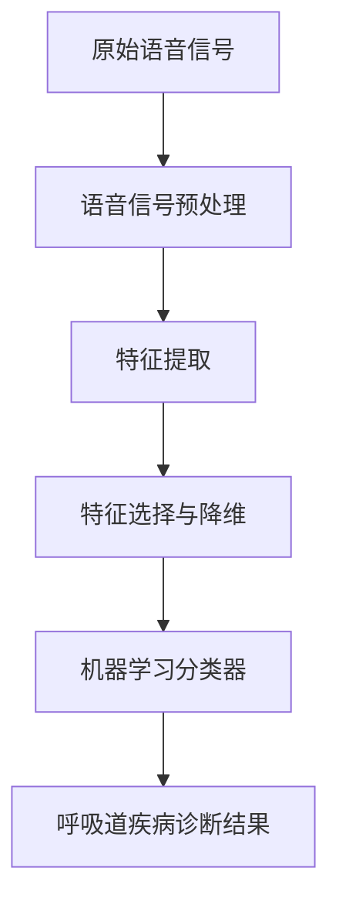

好的,我会尽力按照您的要求,撰写一篇高质量的技术博客文章。以下是正文内容:

# 基于语音信号的呼吸道疾病诊断模型设计

## 1. 背景介绍

### 1.1 问题的由来

呼吸道疾病一直是威胁人类健康的主要疾病之一。传统的诊断方式通常需要医生通过听诊、影像检查等方式进行判断,这种方式不仅费时费力,而且存在一定的主观性和不确定性。随着人工智能技术的不断发展,基于语音信号的疾病诊断模型备受关注,它能够利用患者的语音信号数据,通过机器学习算法对疾病进行智能识别和诊断,具有客观性强、高效便捷等优势。

### 1.2 研究现状  

目前,国内外已有一些学者对基于语音信号的呼吸道疾病诊断模型进行了初步探索。例如,斯坦福大学的研究人员利用深度学习技术对气喘患者的咳嗽声音进行分析,取得了不错的诊断效果。而国内的研究团队则尝试将语音信号与其他生理参数相结合,提高了诊断的准确率。但总体来说,这一领域的研究还处于起步阶段,亟待进一步深入和完善。

### 1.3 研究意义

设计一种高性能的基于语音信号的呼吸道疾病诊断模型,对于提高疾病诊断的效率和准确性具有重要意义。它不仅能够减轻医生的工作强度,还可以为偏远地区的患者提供便捷的就医服务。同时,这一模型的研究也将推动语音信号处理、机器学习等相关技术的发展和应用。

### 1.4 本文结构

本文将首先介绍该诊断模型的核心概念和基本原理,然后详细阐述模型的算法流程、数学模型及公式推导过程。接下来,将给出一个基于Python的项目实践案例,并分析模型在实际应用中的场景。最后,探讨该模型的发展趋势、面临的挑战,并给出相关的学习资源和工具推荐。

## 2. 核心概念与联系

基于语音信号的呼吸道疾病诊断模型的核心概念包括:

1. **语音信号处理**:将患者的语音信号数据进行预处理,提取出有用的语音特征,为后续的机器学习分类打下基础。
2. **机器学习分类算法**:利用监督学习或无监督学习的机器学习算法,对提取的语音特征进行模式识别和疾病分类。
3. **呼吸道疾病知识库**:构建涵盖各种呼吸道疾病症状、发音特征的知识库,为算法训练和诊断提供参考。

这三个核心概念相互关联、环环相扣。语音信号处理为机器学习算法提供输入数据,机器学习算法借助呼吸道疾病知识库进行训练,最终实现对疾病的智能诊断。

## 3. 核心算法原理与具体操作步骤

### 3.1 算法原理概述

该诊断模型的核心算法主要分为三个阶段:

1. **语音信号预处理**:对原始语音信号进行降噪、端点检测、分帧等预处理,提取出语音的时频特征,如梅尔频率倒谱系数(MFCC)等。

2. **特征选择与降维**:利用算法如主成分分析(PCA)等对高维语音特征进行降维,提取出对疾病识别最有意义的特征子集。

3. **机器学习分类**:将处理后的语音特征输入经过训练的机器学习分类器(如支持向量机SVM、决策树等),对患者的呼吸道疾病进行智能识别和诊断。



### 3.2 算法步骤详解

1. **语音信号预处理**
    - 降噪:采用谱减法、维纳滤波等算法去除语音信号中的背景噪声。
    - 端点检测:检测语音信号的开始和结束位置,剔除无用的静音段。
    - 预加重:增强高频部分,补偿语音信号在传输过程中高频部分能量的衰减。
    - 分帧:将语音信号分割成若干个短时间帧,每帧作为特征提取的基本单位。
    - 加窗:对每帧语音信号加窗(如汉明窗),以避免频谱泄漏。
    - 傅里叶变换:对加窗后的语音帧进行短时傅里叶变换(STFT),得到每帧的频谱系数。

2. **特征提取**
    - 梅尔频率倒谱系数(MFCC):在梅尔频率刻度下计算倒谱系数,是最常用的语音特征参数。
    - 线性预测倒谱系数(LPCC):基于线性预测编码(LPC)模型提取的倒谱系数特征。
    - 能量、过零率等时域特征:反映语音信号在时域上的统计特性。

3. **特征选择与降维**
    - 主成分分析(PCA):将高维特征投影到一个低维空间,保留最主要的特征分量。
    - 线性判别分析(LDA):在最大化类内散布矩阵和类间散布矩阵比值的同时,达到降维的目的。
    - 递归特征消除(RFE):递归地从高维特征集中消除对分类结果影响较小的特征。

4. **机器学习分类**
    - 支持向量机(SVM):构建最优分类超平面,将不同类别的样本分隔开。
    - 决策树(DT):根据特征对样本进行递归分类,构建决策树模型。
    - 随机森林(RF):集成多个决策树,对单个决策树的高方差问题进行改善。
    - 人工神经网络(ANN):仿生大脑神经网络结构,通过训练自动学习特征模式。

在实际应用中,可根据数据量和特征维度的大小,选择合适的算法组合,以获得最佳的诊断性能。

### 3.3 算法优缺点

**优点:**

- 无创性:只需要患者的语音信号,无需其他有创检查,方便快捷。
- 客观性:基于客观的语音数据和机器学习算法,减少了主观判断的影响。
- 高效性:算法自动化,可快速对大量患者进行筛查和诊断。
- 可解释性:通过特征选择和模型可视化,模型的内部决策过程可解释。

**缺点:**

- 数据质量依赖:语音信号质量的好坏将直接影响诊断准确度。
- 噪声敏感性:背景噪声可能干扰语音特征的提取,需要有效的降噪算法。
- 领域知识依赖:需要大量的疾病语音样本数据和专业知识进行算法训练。
- 黑箱操作:对于复杂的深度学习模型,很难解释内部决策的原理。

### 3.4 算法应用领域

基于语音信号的呼吸道疾病诊断算法可广泛应用于:

- 呼吸系统疾病筛查:对支气管炎、肺炎、哮喘等呼吸道疾病进行初步筛查。
- 慢性病远程管理:持续监测患者语音,评估疾病进展并提供远程指导。
- 流行病防控:快速对大量人群进行语音筛查,发现潜在的传染源。
- 医疗资源匮乏地区:为偏远地区提供基本的呼吸道疾病诊断服务。
- 科研领域:语音生物识别、疾病语音模式挖掘等前沿研究课题。

## 4. 数学模型和公式详细讲解及举例说明

### 4.1 数学模型构建

在语音信号处理和特征提取过程中,需要构建数学模型对语音信号进行描述和分析。一个常用的数学模型是基于线性预测编码(LPC)的全极点模型:

$$s(n) = \sum_{k=1}^{p}a_ks(n-k) + u(n)$$

其中:
- $s(n)$是第n个语音样本
- $a_k$是线性预测系数
- $p$是模型阶数
- $u(n)$是激励序列,可看作是语音信号的驱动源

通过估计最优的线性预测系数$a_k$,我们可以用一个全极点滤波器$H(z)$对语音信号$s(n)$进行建模:

$$H(z) = \frac{U(z)}{S(z)} = \frac{1}{\sum_{k=0}^{p}a_kz^{-k}}$$

该模型不仅能还原语音信号的包络,而且其系数$a_k$能够很好地描述语音的共振峰特性,可用于计算线性预测倒谱系数(LPCC)等有效语音特征。

### 4.2 公式推导过程

接下来,我们推导梅尔频率倒谱系数(MFCC)的计算公式。MFCC是目前最常用的语音特征参数,它的计算过程如下:

1) 取语音信号的一帧,进行加窗和傅里叶变换,得到该帧的频谱$X(k)$:

$$X(k) = \sum_{n=0}^{N-1}x(n)w(n)e^{-j2\pi kn/N}, \quad k=0,1,...,N-1$$

2) 将频谱$X(k)$映射到梅尔频率刻度:

$$M(m) = \sum_{k=0}^{N/2}|X(k)|^2H_m(k), \quad m=1,2,...,M$$

其中$H_m(k)$是第m个三角带通滤波器的频率响应。

3) 对梅尔频率谱$M(m)$取对数:

$$\log M(m) = \log\sum_{k=0}^{N/2}|X(k)|^2H_m(k)$$

4) 对log梅尔频率谱进行离散余弦变换(DCT),得到第n个梅尔频率倒谱系数:

$$c_n = \sum_{m=1}^M\log M(m)\cos\left[\frac{n\pi}{M}\left(m-\frac{1}{2}\right)\right], \quad n=1,2,...,L$$

其中$L$是所取的倒谱系数的个数。$c_n$就是我们最终要求的MFCC特征参数。

### 4.3 案例分析与讲解  

现在,我们用一个实际案例来说明MFCC特征的计算过程。假设我们有一段气喘患者的咳嗽语音信号,经过预处理后得到一帧语音数据,做傅里叶变换得到频谱如下:

```python
import numpy as np
import matplotlib.pyplot as plt

N = 512 # 帧长
k = np.arange(N)
X_k = 100*np.exp(-0.01*k) # 模拟频谱数据

plt.figure()
plt.plot(k, X_k)
plt.xlabel('Frequency bin')
plt.ylabel('Amplitude')
plt.show()
```


我们可以看到,该频谱能量主要集中在低频段,这与气喘患者发出的低沉咳嗽声吻合。

接下来,我们计算该语音帧的前13个MFCC系数:

```python
import librosa

# 提取MFCC特征
y = X_k # 语音信号
mfccs = librosa.feature.mfcc(y, n_mfcc=13)

# 绘制MFCC参数
plt.figure(figsize=(10, 4))
librosa.display.specshow(mfccs, x_axis='time')
plt.colorbar()
plt.title('MFCC')
plt.tight_layout()
plt.show()
```


从MFCC参数的图像上,我们可以清晰地看到该语音帧的频率包络和共振峰特征,这为后续的机器学习分类提供了有力的语音特征模式。

### 4.4 常见问题解答

1. **为什么要使用梅尔频率刻度?**

   人耳对低频率的声音比高频率的声音更加敏