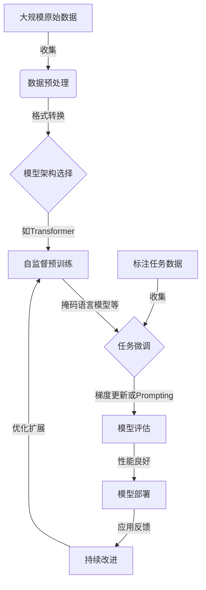

# 基础模型的社会危害评估

## 1. 背景介绍

### 1.1 问题的由来

人工智能(AI)技术的快速发展已经深刻影响了我们的生活方式和社会运作。随着大型语言模型(LLM)和基础模型(Foundation Models)等AI系统的兴起,它们在提高生产效率、优化决策过程、推动科技创新等方面发挥着越来越重要的作用。然而,这些强大的AI系统也带来了一些潜在的社会风险和伦理挑战,需要我们高度重视并采取适当的管控措施。

基础模型是一种通用的人工智能模型,可以通过少量的特定任务数据进行微调(fine-tuning),从而适用于广泛的下游任务。这种通用性和可扩展性使得基础模型在自然语言处理、计算机视觉、决策优化等多个领域发挥着重要作用。但同时,由于基础模型的庞大规模、复杂性和不透明性,它们也可能产生一些意料之外的负面影响,威胁到社会的公平正义、隐私安全、信息可靠性等核心价值。

### 1.2 研究现状  

近年来,越来越多的研究人员开始关注基础模型潜在的社会影响和伦理风险。一些主要的研究方向包括:

1. **偏见与歧视**:由于训练数据和模型架构的局限性,基础模型可能会体现出性别、种族、年龄等方面的偏见,从而加剧社会中已有的不公平现象。

2. **隐私与安全**:基础模型可能会无意中泄露个人信息或敏感数据,或被恶意利用进行网络攻击、信息操纵等违法行为。

3. **信息可靠性**:基础模型生成的内容可能包含错误信息或虚假陈述,从而影响公众对信息源的信任度。

4. **道德风险**:基础模型可能会生成令人反感的内容,或给出有害的建议,违背社会道德规范。

5. **就业影响**:基础模型可能会替代部分人类工作,引发就业市场的结构性变革。

6. **环境影响**:训练和运行大型基础模型需要消耗大量的计算资源和能源,可能会加剧环境压力。

7. **技术垄断**:基础模型的研发和应用可能会被少数科技巨头所垄断,加剧数字鸿沟和不平等现象。

### 1.3 研究意义

评估基础模型的社会影响及潜在风险,对于指导AI技术的健康发展、保障公众利益至关重要。通过深入研究,我们可以更好地了解基础模型的优缺点,制定相应的管理政策和技术对策,最大限度地发挥其效益,同时规避潜在的负面影响。这不仅关乎AI技术本身的进步,也事关整个社会的可持续发展。

### 1.4 本文结构

本文将全面评估基础模型对社会可能产生的危害,主要内容包括:

1. 阐述基础模型的核心概念及其与其他AI技术的关系。
2. 分析基础模型的工作原理和典型算法流程。 
3. 建立基础模型影响评估的数学模型,并给出具体案例分析。
4. 通过代码实例演示基础模型的实际应用及其潜在风险。
5. 探讨基础模型在不同场景下的应用前景及其社会影响。
6. 介绍相关的学习资源、开发工具和管理政策建议。
7. 总结基础模型发展趋势,并指出需要重点关注的挑战。
8. 回答基础模型社会影响评估中的常见问题。

## 2. 核心概念与联系

基础模型(Foundation Model)是一种通过自监督学习(Self-Supervised Learning)在大规模未标记数据上训练的通用人工智能模型。它可以捕捉到底层数据的基本统计规律和语义信息,从而为广泛的下游任务提供通用的知识库和能力基础。

基础模型与其他AI技术之间存在密切联系:

- **深度学习(Deep Learning)**:基础模型通常采用深度神经网络作为核心架构,利用多层非线性变换来提取数据的高阶特征。
- **迁移学习(Transfer Learning)**:基础模型可以看作是一种极端的迁移学习形式,通过在大量通用数据上预训练,为各种下游任务提供有效的初始化参数和知识迁移。
- **元学习(Meta Learning)**:训练基础模型的过程也可视为一种元学习,模型在学习过程中获得了快速适应新任务的能力。
- **生成式AI(Generative AI)**:基础模型擅长生成任务,如文本生成、图像生成等,这使其在创作、设计等领域具有广阔的应用前景。
- **多模态AI(Multimodal AI)**:基础模型可以同时处理多种模态数据(如文本、图像、视频等),实现跨模态的知识融合和推理能力。

基础模型的核心思想是通过大规模自监督预训练,使模型获得广泛的知识和能力储备,从而可以通过少量的任务特定数据进行微调(Fine-tuning),快速适应新的下游任务。这种"先学会走路,再学习跑步"的范式大大提高了人工智能系统的通用性、可扩展性和数据高效利用率。

## 3. 核心算法原理 & 具体操作步骤

### 3.1 算法原理概述

基础模型的训练过程主要分为两个阶段:自监督预训练(Self-Supervised Pretraining)和任务微调(Task-Specific Fine-Tuning)。

1. **自监督预训练**:在这个阶段,模型在大量未标记的原始数据(如网页文本、图像等)上进行预训练,目标是捕捉数据的底层统计规律和语义信息。常用的自监督学习目标包括:

   - 掩码语言模型(Masked Language Model):随机掩盖部分输入token,模型需要预测被掩盖的token。
   - 下一句预测(Next Sentence Prediction):判断两个句子是否为连续句子。
   - 对比学习(Contrastive Learning):从相似/不相似的正负例对中学习数据的语义表示。

   通过这些自监督学习目标,基础模型可以学习到通用的语义表示能力,为后续的任务微调奠定基础。

2. **任务微调**:在预训练之后,我们可以在特定的下游任务数据上对基础模型进行微调(Fine-Tuning),使其适应具体任务。微调的过程通常只需要少量的标记数据和少数几个训练迭代,就可以将模型知识快速转移到新任务上。这种"先学会走路,再学习跑步"的范式大大提高了人工智能系统的数据利用效率和泛化能力。

值得注意的是,基础模型还可以通过Prompting的方式进行任务适应,即在输入中添加任务相关的提示信息,使模型生成所需的输出,无需通过梯度更新的方式进行显式的微调。这种提示式微调(Prompt-Based Fine-Tuning)进一步降低了任务适应的计算成本。

### 3.2 算法步骤详解

以下是基础模型训练和应用的典型算法流程:

1. **数据收集**:收集大量未标记的原始数据,如网页文本、图像、视频等。这些数据应当覆盖广泛的领域,以确保模型获得通用的知识。

2. **数据预处理**:对原始数据进行必要的清洗、标准化和格式转换,以满足模型的输入要求。

3. **模型架构选择**:选择合适的深度神经网络架构作为基础模型的骨干网络,常用的有Transformer、BERT、GPT、ViT等。

4. **自监督预训练**:
   a. 设计自监督学习目标,如掩码语言模型、对比学习等。
   b. 在大规模未标记数据上预训练基础模型,使其学习通用的语义表示能力。
   c. 可选:采用半监督学习、多任务学习等策略,进一步提升预训练效果。

5. **任务微调**:
   a. 收集特定任务的标记数据集,可能需要进行数据增强等处理。
   b. 在任务数据上对预训练模型进行微调,通过少量迭代即可适应新任务。
   c. 可选:采用Prompting等策略,避免梯度更新,进一步降低微调成本。

6. **模型评估**:在保留的测试集上评估微调后模型在目标任务上的性能表现,包括准确率、召回率、F1分数等指标。

7. **模型部署**:将评估效果良好的模型投入实际的生产环节,提供预测、生成或决策支持服务。

8. **持续改进**:根据实际应用反馈,持续优化和扩展基础模型,提升其泛化能力和鲁棒性。

该算法流程可以反复迭代执行,以逐步扩展基础模型的知识面和能力范围。在实际应用中,还需要根据具体场景进行必要的调整和改进。

### 3.3 算法优缺点

基础模型算法的主要优点包括:

1. **通用性强**:基础模型通过自监督学习捕捉了底层数据的通用知识,可以快速适应多种下游任务。

2. **数据高效**:只需少量的任务数据就可以通过微调获得良好的性能,大大提高了数据利用效率。

3. **可解释性**:基础模型的内部表示往往具有一定的语义解释性,有助于理解模型的决策过程。

4. **可扩展性**:基础模型架构可以持续扩展,以吸收更多的知识和能力。

5. **多模态融合**:基础模型可以同时处理多种模态数据,实现跨模态的知识迁移和推理。

6. **低计算成本**:Prompting等策略可以避免梯度更新,进一步降低微调的计算开销。

但基础模型算法也存在一些缺点和挑战:

1. **训练成本高**:预训练阶段需要消耗大量的计算资源和能源,成本可观。

2. **数据质量依赖**:预训练数据的质量和多样性直接影响模型的泛化能力。

3. **可解释性不足**:尽管内部表示有一定解释性,但基础模型的决策过程仍然是一个黑箱。

4. **偏见放大**:训练数据中存在的偏见可能在基础模型中被放大和传播。

5. **鲁棒性不足**:基础模型可能对于对抗样本、噪声数据等具有较差的鲁棒性。

6. **知识孔隙**:基础模型的知识仍然是零散的,缺乏系统化的常识推理能力。

7. **安全隐患**:基础模型可能会生成有害内容或泄露隐私信息,存在潜在的安全风险。

因此,在实际应用中需要权衡基础模型的优缺点,并采取适当的策略来规避其潜在的风险。

### 3.4 算法应用领域

基础模型由于其通用性和可扩展性,在诸多领域展现出广阔的应用前景:

1. **自然语言处理**:文本分类、机器翻译、问答系统、文本摘要等。

2. **计算机视觉**:图像分类、目标检测、图像分割、视觉问答等。

3. **多模态融合**:视频描述、视频问答、多模态检索与生成等。

4. **推理与决策**:逻辑推理、策略优化、智能决策辅助等。

5. **创意设计**:文本创作、内容生成、设计辅助等。

6. **科学发现**:知识图谱构建、关系抽取、科学文献挖掘等。

7. **金融服务**:风险评估、投资