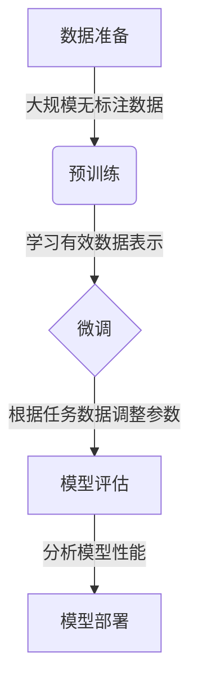

# 基础模型的视觉处理能力

## 1. 背景介绍

### 1.1 问题的由来

随着人工智能技术的不断发展,计算机视觉领域取得了长足的进步。然而,传统的计算机视觉模型往往需要大量的人工标注数据和复杂的网络结构,这使得它们在实际应用中存在一些局限性。因此,如何设计一种通用且高效的视觉处理模型,成为了当前研究的热点问题。

### 1.2 研究现状  

近年来,基于大规模预训练的基础模型(Foundation Model)在自然语言处理、计算机视觉等多个领域展现出了强大的能力。这些模型通过在大量无标注数据上进行预训练,学习到了丰富的知识表示,从而能够在下游任务上获得良好的泛化性能。尤其是最新的一些多模态基础模型,如CLIP、ALIGN等,展现出了在视觉理解任务上的卓越表现。

### 1.3 研究意义

基础模型的出现为视觉处理任务带来了新的发展机遇。通过探索基础模型在视觉领域的应用,我们可以更好地理解它们的视觉处理能力,并进一步推动计算机视觉技术的发展。同时,研究基础模型在视觉任务中的优缺点和局限性,也将为未来模型的改进提供重要的参考。

### 1.4 本文结构

本文将全面探讨基础模型在视觉处理任务中的应用。我们将首先介绍基础模型的核心概念和原理,然后详细分析其在图像分类、目标检测、语义分割等视觉任务中的应用,并对模型的性能和局限性进行评估。此外,我们还将讨论基础模型在视觉领域的发展趋势和未来挑战。

## 2. 核心概念与联系

基础模型是一种通过在大量无标注数据上进行预训练,学习到通用知识表示的模型。它们通常采用自监督学习或自回归等方法,在预训练阶段捕获输入数据的内在规律和统计特征。预训练后的模型可以在下游任务上进行微调,从而获得良好的泛化性能。

在视觉领域,基础模型主要分为两大类:单模态视觉模型和多模态视觉语言模型。

**单模态视觉模型**,如BEiT、MAE等,专注于从大量图像数据中学习视觉表示。这些模型通常采用掩码自编码或对比学习等方法,在预训练阶段学习到图像的局部和全局特征表示。

**多模态视觉语言模型**,如CLIP、ALIGN等,则同时利用图像和文本数据进行预训练。这些模型通过构建视觉和语言之间的对应关系,学习到跨模态的语义表示,从而能够更好地理解图像内容和文本描述之间的关联。

无论是单模态还是多模态,基础模型都展现出了强大的视觉理解能力。它们能够从大量数据中自主学习到有效的视觉表示,并在下游任务上获得良好的泛化性能,避免了传统模型对大量人工标注数据的依赖。

## 3. 核心算法原理 & 具体操作步骤

### 3.1 算法原理概述

基础模型的核心算法原理主要包括以下几个方面:

1. **自监督学习**: 基础模型通常采用自监督学习的方式进行预训练,利用大量无标注数据自主学习到有效的数据表示。常见的自监督学习方法包括掩码自编码、对比学习等。

2. **自注意力机制**: 基础模型广泛采用了自注意力机制,能够有效捕获输入数据中的长程依赖关系,提高模型的表示能力。

3. **跨模态对齐**: 多模态基础模型通过构建视觉和语言之间的对应关系,实现了跨模态的语义对齐,从而能够更好地理解图像内容和文本描述之间的关联。

4. **大规模预训练**: 基础模型通常在海量数据上进行大规模预训练,使得模型能够学习到丰富的知识表示,从而在下游任务上获得良好的泛化性能。

5. **微调策略**: 在下游任务上,基础模型通常采用微调的方式进行迁移学习,利用预训练模型的参数作为初始化,并根据任务数据进行进一步调整。

### 3.2 算法步骤详解

基础模型的训练和应用过程通常包括以下几个主要步骤:

1. **数据准备**:首先需要准备大量的无标注数据,如图像、文本等,用于模型的预训练。对于多模态模型,还需要准备包含图像和文本描述的数据对。

2. **预训练**:采用自监督学习或自回归等方法,在大规模无标注数据上对模型进行预训练。预训练的目标是使模型学习到有效的数据表示,捕获输入数据的内在规律和统计特征。

3. **微调**:在下游任务上,将预训练模型的参数作为初始化,并根据任务数据进行进一步微调。微调过程中,模型参数会逐渐适应特定任务,提高模型在该任务上的性能。

4. **模型评估**:在测试集上评估微调后模型的性能,并与其他基线模型进行对比,分析模型的优缺点和局限性。

5. **模型部署**:将训练好的模型部署到实际应用系统中,用于解决实际问题。

在整个过程中,还需要注意一些关键细节,如数据预处理、超参数调整、模型优化等,以确保模型的性能和稳定性。

### 3.3 算法优缺点

基础模型在视觉处理任务中具有以下优点:

1. **数据高效利用**:基础模型能够从大量无标注数据中自主学习到有效的数据表示,避免了对大量人工标注数据的依赖,提高了数据利用效率。

2. **泛化能力强**:通过在大规模数据上预训练,基础模型学习到了丰富的知识表示,因此在下游任务上具有良好的泛化性能。

3. **多任务适用**:基础模型的通用性使其能够应用于多种视觉任务,如图像分类、目标检测、语义分割等,提高了模型的灵活性和可扩展性。

4. **跨模态理解**:多模态基础模型能够同时理解视觉和语言信息,实现了跨模态的语义对齐,为视觉理解任务带来了新的发展机遇。

然而,基础模型也存在一些局限性:

1. **计算资源需求高**:基础模型通常采用了大规模的网络结构和参数量,因此在训练和推理过程中需要消耗大量的计算资源。

2. **解释性差**:基础模型的内部机制通常是一个黑箱,缺乏对模型决策过程的解释性,这可能会影响模型在一些关键领域的应用。

3. **数据偏差风险**:由于基础模型是在大规模数据上训练的,因此可能会继承数据集中存在的偏差和噪声,导致模型在特定场景下表现不佳。

4. **对抗攻击风险**:基础模型可能存在对抗攻击的风险,即通过对输入数据进行微小扰动,就能够误导模型的预测结果。

5. **知识迁移困难**:虽然基础模型具有良好的泛化能力,但是如何有效地将预训练模型中学习到的知识迁移到特定任务上,仍然是一个挑战。

### 3.4 算法应用领域

基础模型在计算机视觉领域具有广泛的应用前景,包括但不限于以下几个主要领域:

1. **图像分类**:基础模型能够从大量图像数据中学习到有效的视觉表示,因此在图像分类任务上表现出色。

2. **目标检测**:通过对预训练模型进行微调,基础模型能够应用于目标检测任务,实现对图像中多个目标的定位和识别。

3. **语义分割**:基础模型可以用于像素级别的语义分割任务,将图像中的每个像素分配到相应的语义类别。

4. **视觉问答**:多模态基础模型能够同时理解图像和文本信息,因此可以应用于视觉问答任务,根据图像内容回答相关问题。

5. **图像描述生成**:基础模型还可以用于图像描述生成任务,根据输入图像自动生成对应的文本描述。

6. **图像编辑**:通过对基础模型进行微调,可以实现图像编辑任务,如图像上色、风格迁移、图像修复等。

7. **医疗影像分析**:基础模型在医疗影像分析领域也有着广阔的应用前景,如病理图像分类、肿瘤检测和分割等。

8. **遥感图像分析**:基础模型可以应用于遥感图像分析任务,如土地利用分类、建筑物检测、变化检测等。

总的来说,基础模型为计算机视觉领域带来了新的发展机遇,并将在更多领域发挥重要作用。

## 4. 数学模型和公式 & 详细讲解 & 举例说明

### 4.1 数学模型构建

基础模型通常采用自注意力机制来捕获输入数据中的长程依赖关系,提高模型的表示能力。自注意力机制的核心思想是允许每个输入元素与其他元素进行交互,从而学习到更加丰富的表示。

假设我们有一个输入序列 $X = (x_1, x_2, \dots, x_n)$,其中 $x_i \in \mathbb{R}^{d_x}$ 表示第 $i$ 个输入元素。我们希望计算一个新的表示序列 $Z = (z_1, z_2, \dots, z_n)$,其中每个 $z_i$ 都是基于 $X$ 中所有元素的加权和。具体地,我们有:

$$z_i = \sum_{j=1}^{n} \alpha_{ij}(x_j W^V)$$

其中 $W^V \in \mathbb{R}^{d_x \times d_z}$ 是一个可学习的权重矩阵,用于将输入元素 $x_j$ 映射到值空间 $\mathbb{R}^{d_z}$。注意力权重 $\alpha_{ij}$ 决定了 $x_j$ 对 $z_i$ 的贡献程度,它是通过计算查询 $q_i$ 和键 $k_j$ 之间的相似性得到的:

$$\alpha_{ij} = \frac{\exp(q_i^{\top}k_j)}{\sum_{l=1}^{n}\exp(q_i^{\top}k_l)}$$

其中 $q_i = x_iW^Q$、$k_j = x_jW^K$,分别表示查询和键的线性映射,而 $W^Q \in \mathbb{R}^{d_x \times d_k}$、$W^K \in \mathbb{R}^{d_x \times d_k}$ 是可学习的权重矩阵。

通过这种机制,模型能够自适应地为每个输出元素 $z_i$ 分配不同的注意力权重,从而捕获输入序列中的重要信息。

### 4.2 公式推导过程

在基础模型中,自注意力机制通常与其他组件结合使用,如多头注意力、前馈网络等,形成了更加复杂的网络结构。下面我们将推导多头自注意力的公式。

假设我们有 $h$ 个不同的注意力头,每个头都会独立计算一个注意力表示。对于第 $i$ 个注意力头,我们有:

$$\text{head}_i = \text{Attention}(XW_i^Q, XW_i^K, XW_i^V)$$

其中 $W_i^Q \in \mathbb{R}^{d_x \times d_k}$、$W_i^K \in \mathbb{R}^{d_x \times d_k}$、$W_i^V \in \mathbb{R}^{d_x \times d_v}$ 分别表示该头的查询、键和值的线性映