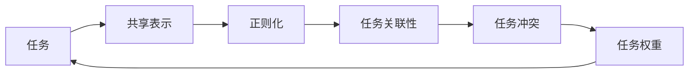

# 多任务学习 (Multi-Task Learning) 原理与代码实例讲解

## 1. 背景介绍

### 1.1 问题的由来

在传统的机器学习中,我们通常会针对每个任务单独训练一个模型。然而,在现实世界中,不同的任务往往存在着一些相关性和内在联系。如果能够利用这些任务之间的关联性,同时学习多个相关任务,那么就可以提高每个任务的学习效果。这就是多任务学习(Multi-Task Learning, MTL)的核心思想。

多任务学习的概念最早可以追溯到20世纪90年代中期,当时的研究主要集中在神经网络领域。随着深度学习的兴起,多任务学习也得到了广泛的关注和应用。在计算机视觉、自然语言处理等领域,多任务学习已经取得了许多令人瞩目的成就。

### 1.2 研究现状

目前,多任务学习在各个领域都有广泛的应用,包括但不限于:

- **计算机视觉**: 同时进行目标检测、语义分割、深度估计等任务。
- **自然语言处理**: 同时进行机器翻译、文本摘要、情感分析等任务。
- **推荐系统**: 同时预测用户的兴趣和评分。
- **医疗健康**: 同时诊断多种疾病,预测患者风险。
- **金融**: 同时预测股票价格、交易量等指标。

多任务学习的研究主要集中在以下几个方面:

1. **任务关联性建模**: 如何有效地捕捉和利用不同任务之间的关联性。
2. **模型结构设计**: 设计合适的神经网络结构,共享部分参数或特征,实现多任务学习。
3. **优化策略**: 如何平衡不同任务的损失函数,避免任务之间的冲突和负面影响。
4. **任务传递**: 利用已学习的任务知识,快速适应新的相关任务。
5. **隐私保护**: 在多任务学习中保护个人隐私和敏感信息。

### 1.3 研究意义

多任务学习的主要意义和优势包括:

1. **数据效率**: 通过共享参数和特征,可以更有效地利用有限的数据,提高每个任务的学习效果。
2. **泛化能力**: 多任务学习可以捕捉任务之间的内在关联,从而提高模型的泛化能力。
3. **知识传递**: 已学习的任务知识可以转移到新的相关任务,加速新任务的学习过程。
4. **解释性**: 多任务学习可以揭示不同任务之间的关系,提高模型的可解释性。
5. **鲁棒性**: 多任务学习可以提高模型对噪声和缺失数据的鲁棒性。

### 1.4 本文结构

本文将全面介绍多任务学习的原理、算法和实践。具体内容包括:

1. 多任务学习的核心概念和基本原理。
2. 多任务学习中常用的算法和模型结构。
3. 多任务学习的数学模型和公式推导。
4. 使用Python和PyTorch实现多任务学习的代码示例。
5. 多任务学习在不同领域的实际应用场景。
6. 多任务学习的发展趋势、挑战和未来展望。

## 2. 核心概念与联系

多任务学习的核心概念包括:

1. **任务**: 指需要学习和预测的目标,如图像分类、机器翻译等。
2. **共享表示**: 不同任务共享部分参数或特征,捕捉任务之间的关联性。
3. **正则化**: 通过引入正则项,鼓励不同任务之间的参数或特征相似,实现知识共享。
4. **任务关联性**: 不同任务之间存在的内在联系,如语义相关性、数据分布相似性等。
5. **任务冲突**: 由于任务之间的差异,导致学习目标发生冲突,影响整体性能。
6. **任务权重**: 控制不同任务在总损失函数中的权重,平衡任务之间的重要性。

这些概念之间存在着紧密的联系,如下图所示:

在多任务学习中,我们首先确定需要学习的任务集合。然后,通过设计合适的模型结构,让不同任务共享部分参数或特征,捕捉任务之间的关联性。为了鼓励知识共享,我们可以引入正则项,使得不同任务的参数或特征更加相似。

同时,我们需要考虑任务之间可能存在的冲突,通过调整任务权重来平衡不同任务的重要性。最终,多任务学习的目标是利用任务之间的关联性,提高每个任务的学习效果和泛化能力。

## 3. 核心算法原理 & 具体操作步骤

### 3.1 算法原理概述

多任务学习的核心思想是利用不同任务之间的关联性,共享部分参数或特征,从而提高每个任务的学习效果。具体来说,多任务学习算法通常包括以下几个关键步骤:

1. **任务建模**: 确定需要学习的任务集合,并定义每个任务的损失函数。
2. **共享表示学习**: 设计合适的神经网络结构,使得不同任务共享部分参数或特征,捕捉任务之间的关联性。
3. **正则化**: 引入正则项,鼓励不同任务之间的参数或特征相似,实现知识共享。
4. **任务权重调整**: 根据任务的重要性和性能,动态调整每个任务在总损失函数中的权重。
5. **联合优化**: 将所有任务的损失函数加权求和,构建总损失函数,并进行联合优化。

在实际应用中,我们还需要考虑任务之间可能存在的冲突,以及如何平衡不同任务的重要性。此外,如何有效地利用已学习的任务知识,快速适应新的相关任务,也是多任务学习需要解决的重要问题。

### 3.2 算法步骤详解

下面我们详细介绍多任务学习算法的具体步骤:

1. **任务建模**

假设我们有 $K$ 个任务 $\{T_1, T_2, \dots, T_K\}$,每个任务 $T_k$ 都有对应的训练数据 $\mathcal{D}_k = \{(x_i^k, y_i^k)\}_{i=1}^{N_k}$,其中 $x_i^k$ 是输入数据, $y_i^k$ 是标签。我们定义每个任务的损失函数为 $\mathcal{L}_k(\theta_k)$,其中 $\theta_k$ 是任务 $T_k$ 的模型参数。

2. **共享表示学习**

我们设计一个神经网络模型 $f(x; \Theta)$,其中 $\Theta$ 是所有参数的集合。该模型包含两部分:

- 共享部分 $f_s(x; \Theta_s)$: 不同任务共享的参数或特征。
- 任务特定部分 $f_k(f_s(x); \Theta_k)$: 每个任务 $T_k$ 独有的参数或特征。

对于任务 $T_k$,我们有:

$$
y_k = f_k(f_s(x); \Theta_k)
$$

通过共享部分 $f_s$,不同任务可以捕捉相关性和共享知识。

3. **正则化**

为了鼓励不同任务之间的参数或特征相似,我们引入正则项 $\Omega(\Theta)$,例如:

$$
\Omega(\Theta) = \sum_{k \neq k'} \left\Vert \Theta_k - \Theta_{k'} \right\Vert_2^2
$$

该正则项使得不同任务的参数趋于相似,实现知识共享。

4. **任务权重调整**

我们为每个任务 $T_k$ 分配一个权重 $\alpha_k$,用于控制该任务在总损失函数中的重要性。权重 $\alpha_k$ 可以是固定值,也可以根据任务的性能动态调整。

5. **联合优化**

我们构建总损失函数:

$$
\mathcal{L}(\Theta) = \sum_{k=1}^K \alpha_k \mathcal{L}_k(\Theta_k) + \lambda \Omega(\Theta)
$$

其中 $\lambda$ 是正则化系数,用于平衡任务损失和正则项。我们使用优化算法(如梯度下降)最小化总损失函数 $\mathcal{L}(\Theta)$,实现多任务联合学习。

在实际应用中,我们还需要考虑任务之间可能存在的冲突,并采取相应的策略(如对抗训练、梯度修剪等)来缓解冲突。此外,如果有新的相关任务加入,我们可以利用已学习的知识,快速适应新任务(即任务传递)。

### 3.3 算法优缺点

多任务学习算法的主要优点包括:

1. **数据效率**: 通过共享参数和特征,可以更有效地利用有限的数据,提高每个任务的学习效果。
2. **泛化能力**: 捕捉任务之间的关联性,提高模型的泛化能力。
3. **知识传递**: 已学习的任务知识可以转移到新的相关任务,加速新任务的学习过程。
4. **可解释性**: 多任务学习可以揭示不同任务之间的关系,提高模型的可解释性。
5. **鲁棒性**: 多任务学习可以提高模型对噪声和缺失数据的鲁棒性。

但是,多任务学习算法也存在一些缺点和挑战:

1. **任务冲突**: 由于任务之间的差异,可能导致学习目标发生冲突,影响整体性能。
2. **负面传递**: 如果任务之间的关联性不强,共享参数可能会导致负面知识传递,降低性能。
3. **优化困难**: 多任务联合优化往往比单任务优化更加复杂和困难。
4. **任务权重选择**: 合理选择任务权重对性能影响很大,但缺乏通用的方法。
5. **计算开销**: 多任务学习通常需要更大的模型和更多的计算资源。

### 3.4 算法应用领域

多任务学习算法已经在多个领域取得了广泛的应用,包括但不限于:

1. **计算机视觉**: 同时进行目标检测、语义分割、深度估计等任务。
2. **自然语言处理**: 同时进行机器翻译、文本摘要、情感分析等任务。
3. **推荐系统**: 同时预测用户的兴趣和评分。
4. **医疗健康**: 同时诊断多种疾病,预测患者风险。
5. **金融**: 同时预测股票价格、交易量等指标。
6. **机器人控制**: 同时学习运动规划、路径规划等任务。
7. **增强学习**: 同时学习多个相关的控制策略。

在这些领域中,多任务学习算法已经显示出了优于单任务学习的性能,并且具有更好的数据利用效率和泛化能力。

## 4. 数学模型和公式 & 详细讲解 & 举例说明

### 4.1 数学模型构建

在多任务学习中,我们需要构建一个数学模型来描述多个任务之间的关系,并定义总损失函数用于优化。

假设我们有 $K$ 个任务 $\{T_1, T_2, \dots, T_K\}$,每个任务 $T_k$ 都有对应的训练数据 $\mathcal{D}_k = \{(x_i^k, y_i^k)\}_{i=1}^{N_k}$,其中 $x_i^k$ 是输入数据, $y_i^k$ 是标签。我们定义每个任务的损失函数为 $\mathcal{L}_k(\theta_k)$,其中 $\theta_k$ 是任务 $T_k$ 的模型参数。

我们设计一个神经网络模型 $f(x; \Theta)$,其中 $\Theta$ 是所有参数的集合。该模型包含两部分:

- 共享部分 $f_s(x; \Theta_s)$: 不同任务共享的参数或特征。
- 任务