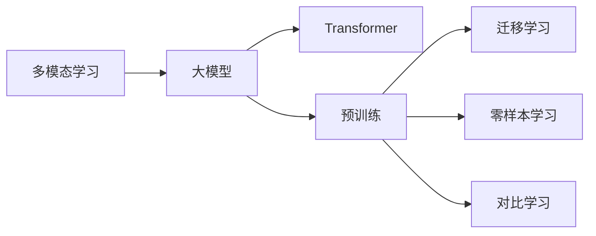
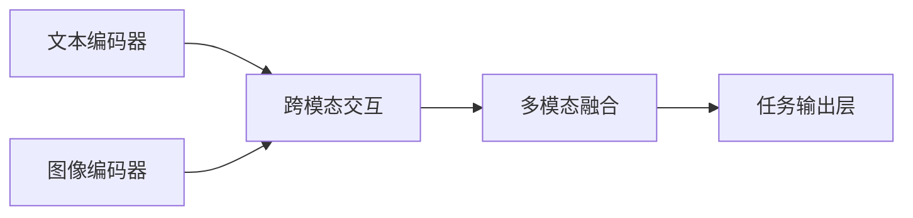

# 多模态大模型：技术原理与实战 GPT技术的发展历程

关键词：多模态大模型, GPT, Transformer, 自然语言处理, 计算机视觉, 语音识别, 迁移学习, 零样本学习, 自监督学习, 对比学习

## 1. 背景介绍
### 1.1 问题的由来
近年来,随着人工智能技术的飞速发展,大模型(Large Model)在自然语言处理(NLP)、计算机视觉(CV)、语音识别(ASR)等领域取得了突破性进展。尤其是以GPT(Generative Pre-trained Transformer)为代表的生成式预训练模型,在多个NLP任务上实现了超越人类的性能,引起了学术界和工业界的广泛关注。

然而,现有的大模型大多仅专注于单一模态(如文本、图像或语音),缺乏对多模态信息的有效融合与理解能力。在实际应用中,人类感知世界往往涉及多种感官信息的综合,如视觉、听觉、触觉等。因此,如何构建能够处理多模态信息、实现跨模态理解与生成的大模型,成为当前人工智能领域的重要研究课题。

### 1.2 研究现状 
目前,学术界已经开始探索多模态大模型的构建方法。一些代表性工作包括:

- ViLBERT[1]:将文本和图像编码器分别预训练,然后通过co-attention机制实现跨模态融合,在VQA等任务上取得了不错的效果。

- LXMERT[2]:在ViLBERT基础上引入了物体检测模块,通过object-level和word-level的跨模态交互,进一步提升了模型性能。

- UNITER[3]:采用统一的Transformer架构对文本和图像进行联合编码,通过Masked Language Modeling和Masked Region Modeling等预训练任务,实现了更强的跨模态表示能力。

- M6[4]:阿里巴巴提出的通用多模态大模型,支持文本、图像、视频、音频等模态的理解与生成,在多个跨模态任务上取得了SOTA效果。

尽管已有一些有益的探索,但多模态大模型仍面临诸多挑战,如模态异构性、数据稀疏性、模态噪声等,亟需更多的理论和实践创新。

### 1.3 研究意义
多模态大模型的研究具有重要的理论价值和应用前景:

- 理论价值:有助于揭示人类多模态感知、理解、学习的认知机理,推动人工智能向着更接近人类智能的方向发展。多模态大模型为探索机器common sense、因果推理、知识表示等提供了新的视角。

- 应用前景:多模态大模型可应用于智能客服、医疗诊断、教育培训、虚拟助手等诸多领域。通过融合文本、图像、语音等多源异构信息,多模态系统能够提供更自然、高效、人性化的人机交互体验。

### 1.4 本文结构
本文将重点探讨多模态大模型的技术原理与实战,内容安排如下:

- 第2节介绍多模态大模型涉及的核心概念及其内在联系。 
- 第3节系统阐述多模态大模型的核心算法原理与具体操作步骤。
- 第4节建立多模态大模型的数学模型,并结合实例对关键公式进行推导与讲解。
- 第5节给出多模态大模型的代码实现,并详细解释说明。
- 第6节分析多模态大模型的实际应用场景。
- 第7节推荐相关的学习资源、开发工具和文献资料。
- 第8节总结全文,展望多模态大模型的未来发展趋势与面临的挑战。
- 第9节列举多模态大模型的常见问题,并给出解答。

## 2. 核心概念与联系
多模态大模型涉及以下核心概念:

- 多模态学习(Multimodal Learning):旨在利用多种模态信息(如文本、图像、音频等)进行联合建模,挖掘不同模态数据之间的内在联系,实现跨模态的理解、检索、生成等任务[5]。

- 大模型(Large Model):通过在大规模数据上进行预训练,构建具有海量参数的深度神经网络模型。大模型能够学习到丰富的语义表示,具有强大的泛化能力和迁移能力[6]。

- Transformer:一种基于自注意力机制(Self-attention)的神经网络架构[7]。不同于传统的RNN和CNN,Transformer通过Self-attention建模任意两个位置之间的长距离依赖,在并行性和记忆容量上具有优势。Transformer已成为NLP领域的主流模型。

- 预训练(Pre-training):在大规模无监督数据上进行自监督学习,使模型掌握通用的语言知识和表示能力。常见的预训练任务包括语言模型、去噪自编码器等。预训练模型可应用于下游任务,大幅提升模型性能[8]。

- 迁移学习(Transfer Learning):将源领域学习到的知识迁移到目标领域,提高目标任务的学习效率和性能[9]。大模型蕴含丰富的语义知识,可作为通用的特征提取器应用于不同任务,体现了迁移学习的思想。

- 零样本学习(Zero-shot Learning):模型在没有看到目标类别样本的情况下,仅根据类别描述就能对新类别进行识别或生成[10]。大模型通过对大规模文本的预训练,可建立文本与其他模态之间的关联,实现零样本的跨模态推理。

- 对比学习(Contrastive Learning):通过最小化正样本对的距离、最大化负样本对的距离,学习到判别性的特征表示[11]。对比学习可用于跨模态表示的对齐,提升模型的泛化能力。

这些概念之间存在着紧密的内在联系:

多模态学习是大模型的应用场景之一,大模型通过Transformer架构和预训练范式,可学习到跨模态的通用表示。预训练使大模型具备迁移学习、零样本学习的能力,对比学习则可提升跨模态表示的一致性。这些技术的结合,为构建强大的多模态大模型奠定了基础。

## 3. 核心算法原理 & 具体操作步骤
### 3.1 算法原理概述
多模态大模型的核心是将不同模态数据映射到一个共享的语义空间,实现跨模态的表示与理解。其基本架构可概括为:

- 文本编码器:将文本输入转换为语义向量表示,常用的模型有BERT、RoBERTa等。
- 图像编码器:将图像输入转换为视觉特征表示,常用的模型有ResNet、ViT等。
- 跨模态交互:通过注意力机制建模文本和图像之间的对齐关系,常见的方法有Co-attention、Cross-attention等。
- 多模态融合:将不同模态的特征进行融合,生成一个联合的多模态表示,常用的方法有Concatenation、Addition、Gating等。
- 任务输出层:根据具体任务(如分类、生成等)设计输出层,对多模态表示进行预测。

多模态大模型的训练通常分为两个阶段:预训练和微调。

- 预训练阶段:在大规模多模态语料上进行自监督学习,训练目标是重建被掩码的文本或图像区域,使模型学习到通用的跨模态表示。常用的预训练任务有:
  - Masked Language Modeling(MLM):随机掩码文本词tokens,让模型根据上下文和图像线索预测掩码词。
  - Masked Region Modeling(MRM):随机掩码图像区域,让模型根据上下文和文本线索预测掩码区域。
  - Image-Text Matching(ITM):判断文本和图像是否匹配。

- 微调阶段:在下游任务的标注数据上对预训练模型进行微调,使其适应特定任务。常见的下游任务包括:
  - Visual Question Answering(VQA):根据图像和问题,预测答案。
  - Image Caption:根据图像生成描述文本。
  - Cross-modal Retrieval:根据一个模态的查询,从另一模态的候选中检索出相关样本。

### 3.2 算法步骤详解
以ViLBERT[1]为例,详细阐述多模态大模型的训练步骤:

**Step1:输入表示**
- 文本输入:将文本转换为token序列,添加[CLS]和[SEP]标记,再通过词嵌入、位置嵌入、段嵌入的相加得到文本输入表示。
- 图像输入:将图像划分为均匀的区域,每个区域提取视觉特征,再添加位置嵌入得到图像输入表示。

**Step2:模态独立编码**
- 文本编码器:使用Transformer的多层自注意力模块对文本输入进行编码,得到上下文相关的文本表示。
- 图像编码器:使用另一个Transformer的多层自注意力模块对图像输入进行编码,得到上下文相关的图像表示。

**Step3:跨模态交互**
- 协同注意力(Co-attention):首先计算文本到图像的注意力,将文本表示作为query,图像表示作为key和value,得到图像到文本的注意力表示。然后计算图像到文本的注意力,将图像表示作为query,文本表示作为key和value,得到文本到图像的注意力表示。
- 交替交互:多次堆叠协同注意力模块,使文本和图像表示能充分交互,捕获跨模态的对齐关系。

**Step4:多模态融合**
- 将最后一层协同注意力的文本表示和图像表示拼接,再通过前馈神经网络得到多模态融合表示。

**Step5:预训练任务**
- MLM:随机掩码文本tokens,让模型根据图像线索预测掩码词。将多模态融合表示输入到MLM头,计算掩码位置的词的概率分布。
- MRM:随机掩码图像区域,让模型根据文本线索预测掩码区域。将多模态融合表示输入到MRM头,计算掩码区域的视觉特征。
- ITM:将多模态融合表示输入到ITM头,通过二分类判断文本和图像是否匹配。

**Step6:微调任务**
- 将预训练模型的多模态融合表示输入到特定任务的输出层,在标注数据上进行微调,如VQA、Image Caption等。

### 3.3 算法优缺点
多模态大模型的优点包括:

- 通过预训练学习跨模态的通用表示,可显著提升下游任务性能,实现更强的泛化和迁移能力。
- 利用Transformer的自注意力机制,可建模文本和图像的长距离依赖,挖掘深层次的语义关联。 
- 引入跨模态交互,能更好地对齐不同模态表示,实现跨模态推理。
- 支持多种下游任务,具有广泛的应用前景。

多模态大模型的缺点包括:

- 模型参数量巨大,训练和推理成本高。
- 对大规模高质量的多模态语料有较大依赖。
- 对模态差异性和噪声鲁棒性有待提高。
- 可解释性和可控性有待加强,存在一定的偏见风险。

### 3.4 算法应用领域
多模态大模型可应用于以下领域:

- 智能问答:根据图像内容回答用户提问,如VQA。
- 智能搜索:跨模态信息检索,如以图搜文、以文搜图等。
- 内容生成:根据图像/文本生成另一模态内容,如图像描述、文本插图等。
- 多模态对话:融合图像、文本等模态进行对话交互,提供更自然、丰富的用户体验。
- 医学诊断:联合分析医学影像和病历,辅助疾病诊断和治疗。 
- 教育培训:构建多模态智能助教系