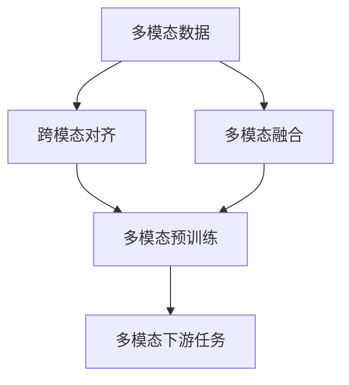

# 多模态大模型：技术原理与实战 多模态大模型的应用图谱

关键词：多模态大模型、跨模态对齐、多模态融合、多模态预训练、多模态下游任务

## 1. 背景介绍
### 1.1  问题的由来
随着人工智能技术的飞速发展,单一模态的大模型已经难以满足日益复杂的应用需求。在现实世界中,信息通常以多种模态形式存在,如文本、图像、音频和视频等。如何有效地利用和融合这些多模态信息,构建更加智能和全面的人工智能系统,成为了一个亟待解决的问题。多模态大模型应运而生,旨在通过对多种模态数据的联合建模和学习,实现更加准确、高效、灵活的人工智能应用。

### 1.2  研究现状
目前,多模态大模型已经成为人工智能领域的研究热点。谷歌、微软、OpenAI等科技巨头和研究机构纷纷投入大量资源,致力于多模态大模型的研究和应用。一些代表性的多模态大模型如CLIP、DALL-E、Flamingo等,在图文匹配、图像生成、视觉问答等任务上取得了令人瞩目的成果。这些模型通过对海量的多模态数据进行预训练,学习到了丰富的跨模态表征和映射关系,展现出了强大的泛化能力和创造力。

### 1.3  研究意义 
多模态大模型的研究具有重要的理论和实践意义。从理论角度来看,多模态大模型可以帮助我们更好地理解人类认知的机制,探索不同感官信息的整合和交互过程。通过对多模态数据的联合建模,我们可以发现不同模态之间的内在联系和互补性,揭示人类智能的本质。从实践角度来看,多模态大模型可以应用于各种现实场景,如智能搜索、内容生成、智能助理等,极大地提升人机交互的自然性和效率。多模态大模型的发展将推动人工智能向更加智能化、人性化的方向迈进。

### 1.4  本文结构
本文将全面探讨多模态大模型的技术原理与实战应用。首先,我们将介绍多模态大模型的核心概念与关键技术。然后,我们将深入剖析多模态大模型的核心算法原理和具体操作步骤。接下来,我们将通过数学模型和公式的详细讲解,帮助读者深入理解多模态大模型的理论基础。在项目实践部分,我们将提供详细的代码实例和解释说明,引导读者动手实现多模态大模型。此外,我们还将探讨多模态大模型的实际应用场景,并推荐相关的工具和学习资源。最后,我们将总结多模态大模型的未来发展趋势与挑战,为读者提供前瞻性的思考。

## 2. 核心概念与联系

多模态大模型涉及了多个核心概念,包括:

- 多模态数据(Multimodal Data):指包含多种感官信息或表现形式的数据,如文本、图像、音频、视频等。不同模态的数据具有各自的特点和表达方式。
- 跨模态对齐(Cross-modal Alignment):指在不同模态数据之间建立语义上的对应关系。通过将不同模态映射到一个共同的语义空间,实现模态之间的信息融合和交互。
- 多模态融合(Multimodal Fusion):指将多个模态的信息进行有效整合,形成一个统一的多模态表征。常见的融合方式包括早期融合、晚期融合和混合融合等。
- 多模态预训练(Multimodal Pre-training):指在大规模多模态数据上进行无监督或自监督的预训练,学习通用的跨模态表征。预训练可以捕捉不同模态之间的内在联系,为下游任务提供良好的初始化。
- 多模态下游任务(Multimodal Downstream Tasks):指基于多模态大模型进行的具体应用任务,如图文匹配、图像生成、视觉问答等。通过微调预训练模型,可以快速适应不同的任务需求。

这些核心概念之间存在着紧密的联系。多模态数据是多模态大模型的基础,提供了丰富的信息来源。跨模态对齐和多模态融合是实现多模态大模型的关键技术,它们通过将不同模态映射到共同的语义空间,实现了模态之间的信息交互和整合。多模态预训练则是构建通用多模态表征的有效途径,通过在海量数据上的自监督学习,模型可以掌握跨模态的语义关联。最终,这些技术和表征可以应用于各种多模态下游任务,展现出多模态大模型的强大能力。

下图展示了多模态大模型的核心概念与联系:

## 3. 核心算法原理 & 具体操作步骤
### 3.1  算法原理概述
多模态大模型的核心算法主要包括两个方面:跨模态对齐和多模态融合。跨模态对齐旨在学习不同模态之间的语义映射关系,将它们映射到一个共同的语义空间。常见的跨模态对齐方法包括对比学习、对偶学习等。多模态融合则是将不同模态的信息进行有效整合,形成一个统一的多模态表征。常见的融合方式包括早期融合、晚期融合和混合融合。

### 3.2  算法步骤详解
1. 数据准备:收集和预处理多模态数据,如文本、图像等,进行数据清洗和标注。
2. 特征提取:针对不同模态的数据,使用相应的特征提取器提取模态特征。如使用CNN提取图像特征,使用Transformer提取文本特征。
3. 跨模态对齐:通过对比学习或对偶学习等方法,学习不同模态之间的语义映射关系。优化目标是最小化正样本对之间的距离,最大化负样本对之间的距离。
4. 多模态融合:将对齐后的多模态特征进行融合,常见的融合方式包括拼接、注意力机制、双线性池化等。融合后的特征将不同模态的信息整合在一起。
5. 预训练:在大规模多模态数据上进行无监督或自监督的预训练,学习通用的跨模态表征。常见的预训练任务包括掩码语言建模、图像-文本匹配等。
6. 微调:针对特定的下游任务,在预训练模型的基础上进行微调。通过引入任务特定的损失函数和训练数据,调整模型参数以适应任务需求。
7. 推理与应用:使用训练好的多模态大模型进行推理,完成图文匹配、图像生成、视觉问答等多模态任务。模型可以根据输入的多模态信息,生成相应的输出结果。

### 3.3  算法优缺点
多模态大模型的优点包括:
- 能够有效利用和融合多种模态的信息,提供更全面和准确的理解。
- 通过预训练学习到通用的跨模态表征,具有良好的泛化能力和迁移性。
- 可以应用于各种多模态任务,展现出强大的性能和创造力。

多模态大模型的缺点包括:
- 训练需要大量的多模态数据和计算资源,对数据和算力要求较高。
- 模型复杂度高,调参和优化难度较大,需要精细的超参数调整。
- 对于某些特定领域的任务,可能需要引入领域知识和先验信息,泛化能力有限。

### 3.4  算法应用领域
多模态大模型可以应用于各种涉及多模态信息的任务,包括但不限于:
- 图文匹配与检索:根据文本描述检索相关的图像,或根据图像生成对应的文本描述。
- 图像生成与编辑:根据文本提示生成逼真的图像,或对图像进行语义级别的编辑。
- 视觉问答:根据图像和文本问题,生成准确的自然语言答案。
- 多模态对话:融合文本、图像、语音等多模态信息,实现更自然和交互的对话系统。
- 多模态推荐:根据用户的多模态行为数据,提供个性化的内容推荐。

## 4. 数学模型和公式 & 详细讲解 & 举例说明
### 4.1  数学模型构建
多模态大模型的数学模型可以用以下公式表示:

$$
\begin{aligned}
\mathbf{z}_i &= f_i(\mathbf{x}_i), \quad i \in \{1, 2, ..., M\} \\
\mathbf{h} &= g(\mathbf{z}_1, \mathbf{z}_2, ..., \mathbf{z}_M) \\
\hat{\mathbf{y}} &= d(\mathbf{h})
\end{aligned}
$$

其中,$\mathbf{x}_i$表示第$i$种模态的输入数据,$f_i$表示第$i$种模态的特征提取器,$\mathbf{z}_i$表示第$i$种模态提取的特征。$g$表示多模态融合函数,将不同模态的特征融合为一个统一的多模态表征$\mathbf{h}$。$d$表示下游任务的预测器,根据多模态表征$\mathbf{h}$生成最终的预测结果$\hat{\mathbf{y}}$。

### 4.2  公式推导过程
以图文匹配任务为例,我们可以使用对比学习的方式进行跨模态对齐。给定一个图像-文本对$(I, T)$,我们希望最大化它们之间的相似度,同时最小化与其他无关图像或文本的相似度。

令$\mathbf{z}_I=f_I(I)$表示图像特征,$\mathbf{z}_T=f_T(T)$表示文本特征。我们可以定义图像-文本对的相似度函数为:

$$
s(I, T) = \frac{\exp(\mathbf{z}_I^T \mathbf{z}_T / \tau)}{\sum_{T' \in \mathcal{T}} \exp(\mathbf{z}_I^T \mathbf{z}_{T'} / \tau)}
$$

其中,$\tau$是温度超参数,$\mathcal{T}$是文本特征的集合。对比学习的目标是最大化正样本对$(I, T)$的相似度,最小化负样本对$(I, T')$的相似度:

$$
\mathcal{L} = -\log s(I, T)
$$

通过优化上述损失函数,模型可以学习到跨模态的对齐表征。

### 4.3  案例分析与讲解
以图像生成任务为例,我们可以使用文本提示生成对应的图像。给定一个文本描述$T$,我们希望生成一个与之匹配的图像$\hat{I}$。

首先,我们将文本描述$T$通过文本特征提取器$f_T$编码为文本特征$\mathbf{z}_T$。然后,我们使用生成模型$g$根据文本特征$\mathbf{z}_T$生成图像特征$\mathbf{z}_{\hat{I}}$:

$$
\mathbf{z}_{\hat{I}} = g(\mathbf{z}_T)
$$

接下来,我们使用图像解码器$d$将图像特征$\mathbf{z}_{\hat{I}}$解码为生成的图像$\hat{I}$:

$$
\hat{I} = d(\mathbf{z}_{\hat{I}})
$$

生成的图像$\hat{I}$应该与文本描述$T$在语义上匹配。我们可以使用重建损失和对抗损失来优化生成模型,使其生成逼真且匹配的图像。

### 4.4  常见问题解答
1. 问:多模态大模型的预训练需要多大规模的数据集?
   答:预训练通常需要大规模的多模态数据集,数据量越大,模型学习到的表征就越丰富和鲁棒。一般需要数百万到数千万级别的图文对、视频片段等多模态数据。
   
2. 问:多模态融合有哪些常见的方式?
   答:常见的多模态融合方式包括早期融合(特征拼接)、晚期融合(分别提取特征再融合)和混合融合(多层次融合