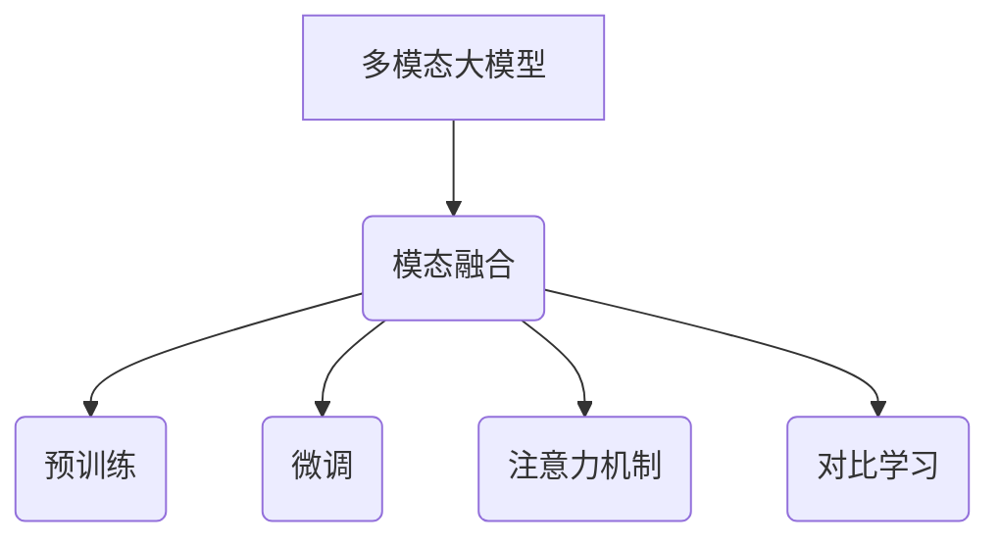

# 多模态大模型：技术原理与实战 部署环境准备

## 1. 背景介绍

### 1.1 问题的由来

在过去几年中，自然语言处理(NLP)和计算机视觉(CV)等人工智能领域取得了长足的进步。然而,这些任务通常是独立处理的,缺乏跨模态的理解和交互能力。为了更好地模拟人类的认知过程,需要一种能够融合多种模态信息(如文本、图像、视频等)的人工智能模型。

多模态大模型(Multimodal Large Model)应运而生,旨在统一处理多种模态数据,实现跨模态的理解、推理和生成能力。这种模型具有更强的泛化能力,可以在多个领域发挥作用,如智能助手、内容创作、教育等,为人工智能的发展开辟了新的可能性。

### 1.2 研究现状

目前,多模态大模型的研究主要集中在以下几个方面:

1. **模型架构设计**: 探索如何有效地融合不同模态的信息,包括早期融合、晚期融合和双流融合等方式。
2. **预训练任务设计**: 设计能够捕获跨模态关联的预训练任务,如视觉问答、图像文本对比等。
3. **高效计算**: 由于模型规模庞大,需要优化计算效率,如模型压缩、分布式训练等技术。
4. **数据集构建**: 构建高质量的多模态数据集,用于模型的训练和评估。

虽然多模态大模型取得了一些进展,但仍面临诸多挑战,如模态融合的有效性、计算资源的需求、数据质量等。

### 1.3 研究意义

多模态大模型的研究对于推进人工智能的发展具有重要意义:

1. **提升人机交互体验**: 多模态模型能够更好地理解和生成多种模态信息,为智能助手、交互式系统等提供更自然、更富表现力的人机交互方式。
2. **促进跨领域应用**: 由于其强大的泛化能力,多模态模型可应用于多个领域,如教育、医疗、内容创作等,推动人工智能在各个领域的落地。
3. **模拟人类认知过程**: 多模态模型更接近于模拟人类的认知过程,有助于深入理解人类智能的本质,为发展通用人工智能(AGI)奠定基础。

### 1.4 本文结构

本文将全面介绍多模态大模型的技术原理和实战部署。首先阐述多模态模型的核心概念和算法原理,包括模态融合方式、预训练任务设计等。接着详细讲解模型的数学基础,如注意力机制、对比学习等。然后通过实际代码示例,演示如何搭建开发环境、训练和部署多模态模型。最后,探讨多模态模型在实际应用场景中的使用,以及未来的发展趋势和挑战。

## 2. 核心概念与联系

多模态大模型的核心概念包括:

1. **模态(Modality)**: 指不同类型的数据表示形式,如文本、图像、视频、音频等。
2. **模态融合(Modal Fusion)**: 将不同模态的信息有效融合的过程,是多模态模型的关键。
3. **预训练(Pre-training)**: 在大规模多模态数据集上进行自监督学习,获得初始化参数。
4. **微调(Fine-tuning)**: 在特定下游任务上,对预训练模型进行进一步训练和调整。
5. **注意力机制(Attention Mechanism)**: 捕捉不同模态之间的相关性和依赖关系。
6. **对比学习(Contrastive Learning)**: 通过最大化正例对的相似性,最小化负例对的相似性,学习有区分性的表示。

这些概念相互关联,共同构建了多模态大模型的理论基础和技术框架。模态融合是核心,决定了模型如何处理多模态输入;预训练和微调提供了有效的参数初始化和调整方式;注意力机制和对比学习则是实现模态融合和学习有区分性表示的关键技术手段。

## 3. 核心算法原理 & 具体操作步骤

### 3.1 算法原理概述

多模态大模型的核心算法原理可概括为以下几个关键步骤:

1. **模态编码(Modal Encoding)**: 将不同模态的原始数据(如文本、图像等)转换为对应的特征表示,通常使用预训练模型(如BERT、ResNet等)进行编码。
2. **模态融合(Modal Fusion)**: 将不同模态的特征表示进行融合,获得统一的多模态表示。常见的融合方式包括早期融合、晚期融合和双流融合等。
3. **自监督预训练(Self-Supervised Pre-training)**: 在大规模多模态数据集上进行自监督学习,通过预训练任务(如视觉问答、图像文本对比等)获得初始化参数。
4. **微调(Fine-tuning)**: 在特定下游任务上,对预训练模型进行进一步训练和调整,获得针对性的模型参数。
5. **推理(Inference)**: 使用微调后的模型对新的多模态输入进行推理,生成所需的输出(如文本、图像等)。

在这个过程中,注意力机制和对比学习等技术被广泛应用,以提高模态融合的效果和学习有区分性的表示。

### 3.2 算法步骤详解

1. **模态编码(Modal Encoding)**

   不同模态的原始数据需要转换为对应的特征表示,以便进行后续的融合和建模。常见的编码方式包括:

   - 文本编码: 使用预训练语言模型(如BERT、GPT等)对文本进行编码,获得文本特征表示。
   - 图像编码: 使用预训练视觉模型(如ResNet、ViT等)对图像进行编码,获得图像特征表示。
   - 视频编码: 使用预训练视频模型(如I3D、SlowFast等)对视频进行编码,获得视频特征表示。
   - 音频编码: 使用预训练音频模型(如Wave2Vec、HuBERT等)对音频进行编码,获得音频特征表示。

2. **模态融合(Modal Fusion)**

   模态融合是多模态模型的核心,决定了如何将不同模态的信息有效融合。常见的融合方式包括:

   - **早期融合(Early Fusion)**: 在编码阶段就将不同模态的原始数据拼接,然后使用单一编码器进行编码,获得融合后的表示。
   - **晚期融合(Late Fusion)**: 先分别对不同模态进行编码,然后将编码后的特征表示拼接或加权求和,获得融合后的表示。
   - **双流融合(Dual-Stream Fusion)**: 使用两个独立的编码器分别对不同模态进行编码,然后使用注意力机制或其他融合模块将两个模态的表示进行融合。

   不同的融合方式各有优缺点,需要根据具体任务和数据特点进行选择和调整。

3. **自监督预训练(Self-Supervised Pre-training)**

   在大规模多模态数据集上进行自监督学习,通过设计合适的预训练任务,获得初始化参数。常见的预训练任务包括:

   - **视觉问答(Visual Question Answering, VQA)**: 给定一张图像和一个相关的问题,模型需要根据图像内容回答问题。
   - **图像文本对比(Image-Text Contrastive)**: 给定一组图像-文本对,模型需要判断它们是否匹配。
   - **视频理解(Video Understanding)**: 给定一段视频,模型需要回答与视频内容相关的问题或进行行为识别。
   - **多模态生成(Multimodal Generation)**: 给定一种模态的输入,模型需要生成另一种模态的输出,如图像描述、图像生成等。

   这些预训练任务旨在捕获不同模态之间的关联,使模型学习到有效的多模态表示。

4. **微调(Fine-tuning)**

   在特定下游任务上,对预训练模型进行进一步训练和调整,获得针对性的模型参数。常见的微调方式包括:

   - **全模型微调(Full Model Fine-tuning)**: 对整个预训练模型的所有参数进行微调。
   - **前馈适配(Prompt Tuning)**: 只微调模型的前馈层(Feed-Forward Layer),保持其他层参数不变。
   - **前缀微调(Prefix Tuning)**: 在模型的输入端添加一个可训练的前缀(Prefix),对前缀进行微调。

   不同的微调方式在计算开销和效果上有所差异,需要根据具体情况进行选择和权衡。

5. **推理(Inference)**

   使用微调后的模型对新的多模态输入进行推理,生成所需的输出。根据任务的不同,输出可以是文本、图像、视频或其他模态的数据。

在整个算法过程中,注意力机制和对比学习等技术被广泛应用,以提高模态融合的效果和学习有区分性的表示,将在后续章节详细阐述。

### 3.3 算法优缺点

**优点**:

1. **强大的泛化能力**: 多模态大模型能够处理多种模态的输入,具有强大的泛化能力,可应用于多个领域。
2. **更接近人类认知**: 通过融合多模态信息,多模态模型更接近于模拟人类的认知过程,有助于发展通用人工智能。
3. **提升人机交互体验**: 多模态模型能够更自然地理解和生成多种模态信息,为智能助手、交互式系统等提供更佳的人机交互体验。

**缺点**:

1. **计算资源需求高**: 由于模型规模庞大,训练和推理过程需要大量的计算资源,如GPU、TPU等。
2. **数据需求量大**: 训练高质量的多模态模型需要大规模的多模态数据集,数据的获取和标注成本高。
3. **模态融合的挑战**: 如何有效地融合不同模态的信息,捕获模态之间的关联和依赖关系,是一个挑战。
4. **解释性较差**: 由于模型复杂度高,多模态模型的决策过程往往缺乏透明度和可解释性。

### 3.4 算法应用领域

多模态大模型由于其强大的泛化能力,可应用于多个领域,包括但不限于:

1. **智能助手**: 多模态模型可以更自然地理解和生成多种模态信息,为智能助手提供更佳的人机交互体验。
2. **内容创作**: 利用多模态模型生成图像、视频、文本等多种形式的内容,如新闻报道、广告、艺术作品等。
3. **教育**: 多模态模型可用于开发交互式教学系统,通过融合文本、图像、视频等多种模态,提供更生动、更有趣的学习体验。
4. **医疗**: 结合医学影像、病历、检查报告等多模态数据,多模态模型可用于辅助诊断、治疗方案制定等。
5. **机器人**: 多模态模型可以赋予机器人更强的感知和交互能力,实现更自然的人机协作。
6. **安全监控**: 利用多模态模型融合视频、音频、文本等信息,提高安全监控的准确性和效率。

总的来说,多模态大模型为人工智能在多个领域的应用提供了新的可能性和机遇。

## 4. 数学模型和公式 & 详细讲解 & 举例说明

### 4.1 数学模型构建

多模态大模型的数学模型通常基于transformer架构,融合了注意力机制和对比学习等技术。我们以一个双流融合的多模态transformer模型为例,阐述其数学原理。

假设我们有两种模态输入,分别为文本序列$X=\{x_1, x_2, \dots, x_n\}$和图像$I$。我们首先使用预训练的文本编码器(如BERT)和图像编码器(如ResNet)分别对两种模态进行编码,获得文本特征序列$H^X=\{h_1^X, h_2^X, \dots, h_n^X\}$和图像特