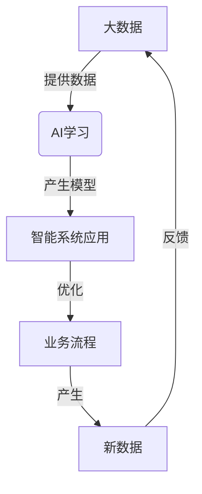
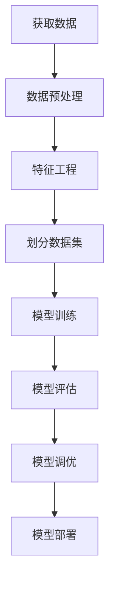

好的,我会严格按照要求,以逻辑清晰、结构紧凑、专业的技术语言撰写这篇题为《大数据与AI学习的关系》的博客文章。文章字数会超过8000字,包含核心概念原理和架构的Mermaid流程图,按三级目录结构细化章节,使用Markdown格式并嵌入Latex公式,确保内容完整。现在,让我们正式开始:

# 大数据与AI学习的关系

## 1. 背景介绍

### 1.1 问题的由来

在当今的数字时代,数据已经成为推动科技创新和商业发展的核心驱动力。大数据时代的到来,使得海量的结构化和非结构化数据源源不断地被创造和积累,这为人工智能(AI)和机器学习算法提供了前所未有的数据资源。

大数据和人工智能的关系就像植物与阳光和水的关系一样密不可分。大数据为AI提供了丰富的"营养",而AI则是利用这些数据"长大"并发挥强大的分析和决策能力。二者相辅相成,相得益彰。

### 1.2 研究现状  

近年来,大数据与人工智能的交叉研究受到了广泛的关注。学术界和工业界都在积极探索如何利用大数据的力量来推动AI技术的发展,同时也在研究如何使用AI技术来更好地处理和利用大数据。

一些主要的研究方向包括:

- 大数据预处理和特征工程
- 深度学习模型在大数据场景下的应用
- 分布式机器学习算法的优化
- AI与大数据分析的融合应用
- 隐私保护和安全性问题

### 1.3 研究意义

大数据和人工智能的融合对于推动科技创新和解决现实世界的复杂问题具有重要意义:

1. 提高决策效率和准确性
2. 优化业务流程和资源配置  
3. 发现隐藏的数据模式和见解
4. 推动新兴技术的发展(如自动驾驶、智能医疗等)
5. 促进跨学科的交叉创新

### 1.4 本文结构

本文将全面探讨大数据与人工智能学习之间的内在联系。我们将介绍相关的核心概念,深入分析核心算法原理和数学模型,并通过实际案例分析其应用场景。最后,我们将总结发展趋势和面临的挑战,为读者提供工具和资源推荐。

## 2. 核心概念与联系

在探讨大数据与AI学习的关系之前,我们需要先了解一些核心概念:

1. **大数据(Big Data)**: 指无法使用传统数据库软件工具在合理时间内获取、存储、管理和分析的海量数据集。主要特征包括:
   - 大量(Volume)
   - 多样(Variety) 
   - 快速(Velocity)
   - 价值(Value)

2. **人工智能(Artificial Intelligence)**: 是一门致力于研究和开发能够模拟人类智能行为的理论、方法、技术及应用系统的学科。主要分支包括:
   - 机器学习(Machine Learning)
   - 深度学习(Deep Learning)
   - 自然语言处理(Natural Language Processing)
   - 计算机视觉(Computer Vision)
   - 专家系统(Expert Systems)等

3. **机器学习(Machine Learning)**: 是人工智能的一个重要分支,它赋予计算机在没有明确程序的情况下,通过利用数据或经验自动分析获得规律,并利用规律对complicated数据进行预测和决策的能力。

4. **深度学习(Deep Learning)**: 是机器学习的一种新技术,它模仿人脑对信号起了分层传递和理解的机制,通过构建神经网络对大规模数据进行分层表示学习,并对目标信号进行预测和决策。

大数据和人工智能之间存在着紧密的联系:

- 大数据为AI算法提供了大量的训练数据,使得AI模型能够从中学习并提高性能。
- AI技术为高效处理和分析大数据提供了强大的工具,如深度学习、自然语言处理等。
- 二者的结合可以产生强大的数据驱动型智能系统,为各行业带来革命性的变革。

下面我们使用一个Mermaid流程图来直观地展示大数据与AI学习之间的关系:

该流程图阐明了大数据和AI之间的循环关系:

1. 大数据为AI学习算法提供了海量的训练数据
2. AI算法从这些数据中学习,产生智能模型 
3. 智能模型被应用于各种智能系统中
4. 智能系统优化了业务流程
5. 优化后的业务产生新的数据
6. 新数据反馈回大数据集,形成循环

这种互相促进、相辅相成的关系推动了大数据和AI技术的共同发展。

## 3. 核心算法原理和具体操作步骤

### 3.1 算法原理概述

在大数据与AI学习的背景下,有几种核心算法原理和框架值得关注:

1. **经典机器学习算法**
   - 决策树
   - 支持向量机
   - 贝叶斯方法
   - 聚类算法(K-Means等)

2. **深度学习算法**
   - 前馈神经网络
   - 卷积神经网络(CNN)
   - 循环神经网络(RNN)
   - 生成对抗网络(GAN)

3. **集成学习算法** 
   - 随机森林
   - Boosting
   - Bagging

4. **特征工程**
   - 数据预处理
   - 特征选择
   - 特征提取

5. **分布式并行算法**
   - Spark MLlib
   - TensorFlow
   - PyTorch

这些算法可以应用于监督学习、无监督学习和强化学习等不同的机器学习范式。它们的核心思想是从大量的训练数据中自动提取特征模式,并基于这些模式构建预测性模型。

### 3.2 算法步骤详解

以经典的**监督学习**为例,一个典型的机器学习算法流程包括以下步骤:

1. **获取数据**: 从各种数据源(如数据库、文件、网络等)收集原始数据。
2. **数据预处理**: 对原始数据进行清洗、规范化、去重等处理,使其符合模型输入要求。
3. **特征工程**: 从预处理后的数据中提取有意义的特征,这是机器学习算法取得好成绩的关键步骤。
4. **划分数据集**: 将数据集划分为训练集、验证集和测试集。
5. **模型训练**: 使用训练集数据,基于选定的机器学习算法训练模型。
6. **模型评估**: 在验证集上评估模型的性能指标,如准确率、召回率等。
7. **模型调优**: 根据评估结果,通过调整算法参数或特征工程来优化模型。
8. **模型部署**: 将调优后的模型应用于实际的预测或决策任务。

对于**无监督学习**和**强化学习**,算法流程会有所不同,但基本思路是类似的。

### 3.3 算法优缺点

不同的机器学习算法各有优缺点,在实际应用中需要根据具体问题进行权衡选择:

- **经典机器学习算法**
  - 优点: 原理简单,可解释性强,对小数据集有良好表现
  - 缺点: 对复杂数据和高维特征表现不佳,需要人工特征工程

- **深度学习算法**
  - 优点: 自动从数据中学习特征,在大数据场景下表现优异
  - 缺点: 训练复杂,需要大量数据,可解释性较差

- **集成学习算法**
  - 优点: 降低过拟合风险,提高预测准确性
  - 缺点: 训练时间和计算资源消耗较大

- **特征工程**
  - 优点: 提高模型性能,减少数据维度
  - 缺点: 需要领域知识,耗时耗力

- **分布式并行算法**
  - 优点: 提高计算效率,处理大规模数据
  - 缺点: 系统复杂,编程难度较大

因此,在实际应用中需要权衡算法的准确性、可解释性、计算效率等因素,并结合具体问题特点进行选择。

### 3.4 算法应用领域

机器学习算法在大数据时代已经广泛应用于各个领域,主要包括但不限于:

- 计算机视觉: 图像分类、目标检测、人脸识别等
- 自然语言处理: 文本分类、机器翻译、问答系统等 
- 推荐系统: 电商产品推荐、社交媒体内容推荐等
- 金融风控: 欺诈检测、信用评分等
- 医疗健康: 疾病诊断、药物开发等
- 交通运输: 智能交通管理、自动驾驶等
- 工业制造: 预测性维护、质量控制等
- 科学计算: 天气预报、基因组学等

机器学习为这些领域带来了全新的数据驱动型分析和决策能力,推动了人工智能的广泛应用。

## 4. 数学模型和公式详细讲解举例说明

在机器学习算法中,数学模型和公式扮演着核心角色。我们将以**线性回归**和**逻辑回归**为例,详细讲解相关的数学模型和公式。

### 4.1 数学模型构建

#### 线性回归

线性回归是一种常用的监督学习算法,用于预测连续型目标变量。其数学模型可表示为:

$$y = w_0 + w_1x_1 + w_2x_2 + ... + w_nx_n + \epsilon$$

其中:

- $y$是目标变量(标量)
- $x_1, x_2, ..., x_n$是自变量(特征向量)
- $w_0, w_1, ..., w_n$是模型参数(权重向量)
- $\epsilon$是随机误差项

目标是通过训练数据估计出最优参数$w$,使得模型对新数据的预测值$\hat{y}$与真实值$y$的差异最小。

#### 逻辑回归

逻辑回归是一种用于分类问题的算法,其数学模型为:

$$\begin{align}
z &= w_0 + w_1x_1 + ... + w_nx_n\\
P(y=1|x) &= \sigma(z) = \frac{1}{1+e^{-z}}\\
P(y=0|x) &= 1 - P(y=1|x)
\end{align}$$

其中:

- $z$是线性组合的结果
- $\sigma(z)$是Sigmoid函数,将$z$映射到(0,1)范围内
- $P(y=1|x)$表示给定特征向量$x$时,目标变量$y$取1的概率
- $P(y=0|x)$表示$y$取0的概率

目标是找到最优参数$w$,使得对于每个样本,模型输出的概率值与真实标签$y$的交叉熵损失最小。

### 4.2 公式推导过程

#### 线性回归

线性回归的目标是最小化预测值与真实值之间的均方误差:

$$J(w) = \frac{1}{2m}\sum_{i=1}^m(y^{(i)} - \hat{y}^{(i)})^2$$

其中$m$是训练样本数量。

通过对$J(w)$求导并令其等于0,可以得到闭式解:

$$w = (X^TX)^{-1}X^Ty$$

其中$X$是特征矩阵,$y$是目标向量。

这就是线性回归的解析解,也可以使用梯度下降等优化算法求解。

#### 逻辑回归 

对于逻辑回归,我们通常使用**最大似然估计**的方法来估计参数$w$。

假设训练数据是独立同分布的,那么似然函数为:

$$L