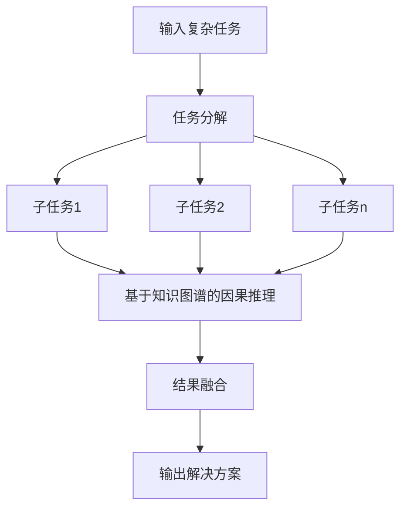

# 大模型产品怎样逐渐延伸到能够去处理一些更长链路的复杂任务

## 1. 背景介绍

### 1.1 问题的由来

随着人工智能技术的不断发展,大型语言模型已经在自然语言处理、机器翻译、对话系统等领域取得了令人瞩目的成就。然而,现有的大型语言模型主要关注于单个任务或短期交互,很难处理涉及多个步骤、跨越不同领域知识的复杂任务。

复杂任务通常需要模型具备以下能力:

1. 长期记忆和推理能力,能够跟踪和整合来自多个步骤的信息。
2. 多领域知识整合能力,能够灵活地将不同领域的知识相结合。
3. 多模态理解能力,能够处理包括文本、图像、视频等多种形式的输入。
4. 自我监控和纠错能力,能够检测和纠正自身的错误。

现有的大型语言模型在处理这些复杂任务时存在诸多挑战,亟需突破性的技术创新。

### 1.2 研究现状

目前,一些研究团队已经开始探索大型语言模型处理复杂任务的方法,主要包括:

1. **基于记忆的方法**:增强模型的长期记忆能力,如利用外部存储器或注意力机制来存储和检索相关信息。
2. **基于规划的方法**:将复杂任务分解为多个子任务,并使用规划算法生成解决方案。
3. **基于交互的方法**:允许模型与用户或其他系统进行交互,以获取额外的信息和反馈。
4. **基于多模态的方法**:融合视觉、语音等多种模态的信息,以更好地理解和处理复杂任务。

然而,这些方法仍然存在一些局限性,如记忆容量有限、规划算法效率低下、交互成本高昂等,因此需要进一步的研究和创新。

### 1.3 研究意义

能够处理复杂任务的大型语言模型将极大地推动人工智能技术的发展,为各个领域带来革命性的变革。具体来说,它们可以应用于:

1. **智能助手**:提供更加智能和个性化的服务,如旅行规划、医疗咨询等。
2. **决策支持系统**:辅助人类进行复杂决策,如金融投资、应急管理等。
3. **教育智能tutor**:根据学生的实际情况提供个性化的教学方案。
4. **科学发现**:整合跨领域知识,发现新的科学规律和理论。

因此,研究大型语言模型处理复杂任务具有重要的理论意义和应用价值。

### 1.4 本文结构

本文将全面探讨大型语言模型处理复杂任务的挑战、方法和前景。具体内容安排如下:

1. 介绍复杂任务的特点及大型语言模型面临的挑战。
2. 分析现有的基于记忆、规划、交互和多模态的处理方法。
3. 提出一种新的基于知识图谱和因果推理的处理框架。
4. 介绍相关的数学模型、算法原理和代码实现。
5. 讨论实际应用场景和未来发展趋势。

## 2. 核心概念与联系

处理复杂任务涉及多个核心概念,包括:

1. **长期记忆**:指模型能够存储和检索跨越多个步骤的相关信息。
2. **推理能力**:指模型能够基于已有知识和新信息进行逻辑推理。
3. **知识图谱**:用于表示结构化知识的语义网络。
4. **因果推理**:推断事物之间的因果关系。
5. **多模态融合**:将不同模态(文本、图像等)的信息进行融合。

这些概念相互关联、相辅相成。具体来说:

- 长期记忆为推理提供了必要的信息基础。
- 推理能力有助于从已有知识中发现新的知识。
- 知识图谱以结构化的形式存储知识,方便长期记忆和推理。
- 因果推理是一种重要的推理方式,有助于理解复杂系统。
- 多模态融合能够提供更加全面的信息,提高推理的准确性。

因此,这些概念的有机结合对于处理复杂任务至关重要。

## 3. 核心算法原理 & 具体操作步骤

### 3.1 算法原理概述

为了使大型语言模型能够处理复杂任务,我们提出了一种新的基于知识图谱和因果推理的处理框架。该框架的核心思想是:

1. 构建一个包含多领域知识的大规模知识图谱。
2. 将输入的复杂任务分解为一系列相互关联的子任务。
3. 对每个子任务,基于知识图谱进行多步骤的因果推理。
4. 将各子任务的推理结果进行融合,得到最终的任务解决方案。

该框架的优势在于:

- 知识图谱为长期记忆和推理提供了知识基础。
- 多步骤因果推理能够处理复杂的因果关系。
- 任务分解简化了推理的复杂度。
- 模块化设计便于扩展和优化各个模块。

算法的具体流程如下所示:

### 3.2 算法步骤详解

1. **任务分解**

   输入的复杂任务首先被分解为多个相互关联的子任务。分解的原则是将整体任务划分为若干个具有明确目标和边界的子任务,并确保子任务之间存在明确的依赖关系。

   分解可以基于任务的语义结构进行,也可以利用机器学习方法自动完成。分解的粒度需要平衡子任务的复杂度和数量,确保单个子任务可以被高效处理,同时子任务的数量不会过多导致组合复杂度激增。

2. **基于知识图谱的因果推理**

   对于每个子任务,算法基于知识图谱进行多步骤的因果推理,以得到该子任务的解决方案。

   具体来说,算法首先从知识图谱中检索与当前子任务相关的事实和规则,然后基于这些知识通过因果推理得到新的中间结论。该过程会重复进行,直到得到足以解决当前子任务的结论为止。

   在推理过程中,算法需要处理好多种类型的因果关系,如必然因果、概率因果、反身因果等。同时还需要合理地处理不完全信息和不确定性。

3. **结果融合**

   最后,算法将各个子任务的解决方案进行融合,得到复杂任务的整体解决方案。

   融合过程需要考虑子任务之间的依赖关系,合理地传递和整合各子任务的结果。同时还需要处理可能存在的冲突和矛盾,确保融合结果的一致性和合理性。

### 3.3 算法优缺点

**优点**:

1. 将复杂任务分解为多个子任务,降低了单个推理过程的复杂度。
2. 基于知识图谱的推理,能够充分利用已有的结构化知识。
3. 多步骤因果推理能够处理复杂的因果关系。
4. 模块化设计便于算法的扩展和优化。

**缺点**:

1. 构建大规模高质量知识图谱的成本较高。
2. 任务分解和结果融合可能会引入新的错误。
3. 因果推理过程可能受到不完全信息和不确定性的影响。
4. 算法的计算复杂度仍然较高,需要进一步优化。

### 3.4 算法应用领域

该算法可以广泛应用于需要处理复杂任务的各个领域,如:

1. **智能助手**:处理涉及多个步骤的复杂查询和任务,如旅行规划、购物决策等。
2. **决策支持系统**:为复杂决策提供决策依据,如投资决策、医疗诊断等。
3. **自动化工作流**:自动化执行跨越多个系统和环节的复杂工作流程。
4. **科学发现**:整合多领域知识,发现新的科学规律和理论。
5. **教育智能tutor**:根据学生的实际情况,制定个性化的教学方案。

总的来说,任何需要处理多步骤、多领域知识融合的复杂任务,都可以考虑应用该算法。

## 4. 数学模型和公式 & 详细讲解 & 举例说明

### 4.1 数学模型构建

为了形式化描述算法,我们构建了一个数学模型。首先定义一些基本概念:

- 令 $T$ 表示输入的复杂任务
- $T$ 可以分解为 $n$ 个子任务 $\{t_1, t_2, \cdots, t_n\}$
- 令 $\mathcal{K}$ 表示知识图谱,包含一系列事实 $\mathcal{F}$ 和规则 $\mathcal{R}$
- 每个子任务 $t_i$ 的解为一个命题 $p_i$,表示该子任务的解决方案

我们的目标是找到一个命题 $P$,使得 $P$ 蕴含了所有子任务的解,即:

$$P \models \bigwedge_{i=1}^n p_i$$

其中 $\models$ 表示逻辑蕴含关系。

为了得到 $P$,我们对每个子任务 $t_i$ 进行因果推理,得到解 $p_i$。具体来说,对于子任务 $t_i$,我们从知识库 $\mathcal{K}$ 中选取一个事实集 $\mathcal{F}_i \subseteq \mathcal{F}$ 和规则集 $\mathcal{R}_i \subseteq \mathcal{R}$,使得基于 $\mathcal{F}_i$ 和 $\mathcal{R}_i$ 可以推导出 $p_i$:

$$\mathcal{F}_i, \mathcal{R}_i \models p_i$$

然后,我们将所有子任务的解 $\{p_1, p_2, \cdots, p_n\}$ 进行合取,得到最终的解决方案 $P$:

$$P = \bigwedge_{i=1}^n p_i$$

在实际推理过程中,我们采用 Prolog 语言作为推理引擎,将知识库 $\mathcal{K}$ 表示为一系列 Prolog 子句,将规则 $\mathcal{R}$ 表示为 Prolog 规则,将事实 $\mathcal{F}$ 表示为 Prolog 事实。然后,对于每个子任务 $t_i$,我们构造一个 Prolog 查询,并基于知识库 $\mathcal{K}$ 进行推理,得到解 $p_i$。

### 4.2 公式推导过程

下面我们对上述数学模型的一些关键公式进行推导:

**推导1**: 证明对于任意子任务 $t_i$,如果存在 $\mathcal{F}_i \subseteq \mathcal{F}$ 和 $\mathcal{R}_i \subseteq \mathcal{R}$,使得 $\mathcal{F}_i, \mathcal{R}_i \models p_i$,那么 $\mathcal{K} \models p_i$。

**证明**:
由于 $\mathcal{F}_i \subseteq \mathcal{F}$ 且 $\mathcal{R}_i \subseteq \mathcal{R}$,所以 $\mathcal{F}_i, \mathcal{R}_i$ 是知识库 $\mathcal{K}$ 的一个子集。根据逻辑推理的单调性质,如果从一个前提集 $\Gamma$ 可以推出结论 $\varphi$,那么加入任何其他前提后,仍然可以推出 $\varphi$。因此,如果 $\mathcal{F}_i, \mathcal{R}_i \models p_i$,那么 $\mathcal{K} \models p_i$。

**推导2**: 证明如果对于每个子任务 $t_i$,我们都有 $\mathcal{K} \models p_i$,