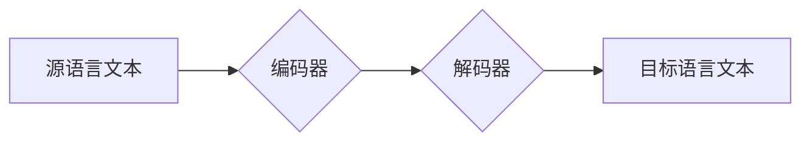

# 大模型应用开发的详细指南

作者：禅与计算机程序设计艺术 / Zen and the Art of Computer Programming 

## 1. 背景介绍

### 1.1 问题的由来

近年来，随着人工智能技术的飞速发展，大模型技术成为了人工智能领域的热门话题，并逐渐渗透到各个行业。大模型拥有强大的学习能力和泛化能力，能够处理各种复杂的任务，例如自然语言处理、图像识别、语音合成等。然而，如何将大模型技术应用到实际场景中，并开发出实用性强、易于使用的应用，成为了一个新的挑战。

### 1.2 研究现状

目前，大模型应用开发领域的研究主要集中在以下几个方面：

* **大模型训练与优化:** 研究如何提高大模型的训练效率和模型效果，包括模型架构设计、训练数据优化、模型压缩等。
* **大模型应用开发框架:** 研究如何构建方便易用的开发框架，降低大模型应用开发的门槛，例如 Hugging Face Transformers、Google TensorFlow、Facebook PyTorch 等。
* **大模型应用场景探索:** 研究如何将大模型技术应用到不同的领域，例如智能客服、文本生成、机器翻译、图像生成等。

### 1.3 研究意义

大模型应用开发具有重要的研究意义，它能够推动人工智能技术的应用落地，为各个行业带来新的发展机遇。例如：

* **提升效率:** 大模型能够自动化完成许多繁琐的任务，例如文本摘要、代码生成、数据分析等，从而提高工作效率。
* **改善用户体验:** 大模型能够提供更加个性化、智能化的服务，例如智能推荐、语音助手、虚拟客服等，从而改善用户体验。
* **创造新的价值:** 大模型能够创造新的产品和服务，例如智能创作、虚拟世界、个性化教育等，从而创造新的价值。

### 1.4 本文结构

本文将从以下几个方面详细介绍大模型应用开发的知识：

* **核心概念与联系:** 介绍大模型的基本概念、分类、特点以及与其他技术的联系。
* **核心算法原理 & 具体操作步骤:** 深入讲解大模型的核心算法原理和具体操作步骤，包括预训练、微调、推理等。
* **数学模型和公式 & 详细讲解 & 举例说明:** 构建大模型的数学模型，推导公式，并通过案例分析和讲解来阐述模型的应用。
* **项目实践：代码实例和详细解释说明:** 提供完整的代码实例，并进行详细的解释说明，帮助读者快速上手大模型应用开发。
* **实际应用场景:** 介绍大模型在不同领域的实际应用场景，例如智能客服、文本生成、机器翻译等。
* **工具和资源推荐:** 推荐一些常用的开发工具、学习资源、相关论文等，帮助读者进一步学习和深入研究。
* **总结：未来发展趋势与挑战:** 总结大模型应用开发的未来发展趋势和面临的挑战，并展望未来发展方向。
* **附录：常见问题与解答:** 收集一些常见问题并给出解答，方便读者快速解决问题。

## 2. 核心概念与联系

### 2.1 大模型的概念

大模型是指拥有大量参数和训练数据的深度学习模型，通常包含数十亿甚至上万亿个参数。大模型能够学习到复杂的数据模式，并具备强大的泛化能力，能够处理各种复杂的任务。

### 2.2 大模型的分类

根据不同的训练目标和应用场景，大模型可以分为以下几种类型：

* **语言模型:** 主要用于处理文本数据，例如文本生成、机器翻译、问答系统等。
* **图像模型:** 主要用于处理图像数据，例如图像分类、目标检测、图像生成等。
* **语音模型:** 主要用于处理语音数据，例如语音识别、语音合成、语音情感分析等。
* **多模态模型:** 能够处理多种类型的数据，例如图像、文本、语音等，例如多模态理解、多模态生成等。

### 2.3 大模型的特点

大模型具有以下几个特点：

* **参数规模大:** 大模型通常拥有数十亿甚至上万亿个参数，能够学习到更加复杂的数据模式。
* **训练数据量大:** 大模型需要大量的训练数据来学习数据模式，通常需要使用数十亿甚至上万亿条数据进行训练。
* **泛化能力强:** 大模型能够在不同的任务和场景中表现出良好的泛化能力，能够处理各种复杂的任务。
* **学习能力强:** 大模型能够快速学习新的知识，并将其应用到新的任务中。

### 2.4 大模型与其他技术的联系

大模型与其他技术有着密切的联系，例如：

* **深度学习:** 大模型是深度学习技术的一种重要应用，深度学习技术为大模型提供了强大的学习能力和模型架构。
* **自然语言处理:** 大模型在自然语言处理领域有着广泛的应用，例如文本生成、机器翻译、问答系统等。
* **计算机视觉:** 大模型在计算机视觉领域也有着重要的应用，例如图像分类、目标检测、图像生成等。
* **云计算:** 大模型的训练和推理需要大量的计算资源，云计算平台为大模型提供了强大的计算能力和存储能力。

## 3. 核心算法原理 & 具体操作步骤

### 3.1 算法原理概述

大模型的核心算法是基于深度学习技术，主要包括以下几个步骤：

* **预训练:** 使用大量的文本数据对模型进行预训练，学习语言的通用规律和知识。
* **微调:** 将预训练好的模型应用到特定任务，并使用少量特定任务数据对模型进行微调，以提高模型在特定任务上的性能。
* **推理:** 使用训练好的模型对新的数据进行预测和推理。

### 3.2 算法步骤详解

#### 3.2.1 预训练

预训练是指使用大量的文本数据对模型进行训练，学习语言的通用规律和知识。预训练通常使用自监督学习方法，例如：

* **Masked Language Modeling (MLM):** 随机遮蔽一些词语，并让模型预测被遮蔽的词语。
* **Next Sentence Prediction (NSP):**  判断两个句子是否连续。
* **Sentence-BERT:** 使用BERT模型来学习句子之间的语义相似度。

#### 3.2.2 微调

微调是指将预训练好的模型应用到特定任务，并使用少量特定任务数据对模型进行微调，以提高模型在特定任务上的性能。微调通常使用监督学习方法，例如：

* **分类任务:** 使用特定任务数据对模型进行微调，使其能够对文本进行分类。
* **生成任务:** 使用特定任务数据对模型进行微调，使其能够生成特定类型的文本。
* **问答任务:** 使用特定任务数据对模型进行微调，使其能够回答特定类型的问题。

#### 3.2.3 推理

推理是指使用训练好的模型对新的数据进行预测和推理。推理过程通常包含以下步骤：

* **输入数据预处理:** 将新的数据进行预处理，例如分词、编码等。
* **模型预测:** 使用训练好的模型对预处理后的数据进行预测。
* **输出结果后处理:** 对模型的预测结果进行后处理，例如解码、格式化等。

### 3.3 算法优缺点

#### 3.3.1 优点

* **强大的泛化能力:** 大模型能够在不同的任务和场景中表现出良好的泛化能力，能够处理各种复杂的任务。
* **学习能力强:** 大模型能够快速学习新的知识，并将其应用到新的任务中。
* **可解释性增强:** 随着模型规模的增大，模型的可解释性也得到了提升，能够更好地理解模型的决策过程。

#### 3.3.2 缺点

* **计算资源消耗大:** 大模型的训练和推理需要大量的计算资源，例如 GPU、TPU 等。
* **数据依赖性强:** 大模型的性能很大程度上取决于训练数据的质量和数量。
* **模型可控性:** 大模型的决策过程可能难以控制，可能会出现一些不可预期的行为。

### 3.4 算法应用领域

大模型在各个领域都有着广泛的应用，例如：

* **自然语言处理:** 文本生成、机器翻译、问答系统、情感分析、文本摘要、代码生成等。
* **计算机视觉:** 图像分类、目标检测、图像生成、图像识别、视频理解等。
* **语音处理:** 语音识别、语音合成、语音情感分析、语音翻译等。
* **其他领域:**  智能客服、个性化推荐、医疗诊断、金融风控等。

## 4. 数学模型和公式 & 详细讲解 & 举例说明

### 4.1 数学模型构建

大模型的数学模型通常基于深度神经网络，例如 Transformer、BERT、GPT 等。这些模型通常包含多个层级，每个层级都包含多个神经元，神经元之间通过权重连接。模型的训练过程就是调整这些权重，使得模型能够更好地拟合训练数据。

### 4.2 公式推导过程

大模型的数学模型通常包含大量的公式，例如：

* **Transformer 模型:** Transformer 模型包含自注意力机制、前馈神经网络、位置编码等，每个部分都有相应的公式。
* **BERT 模型:** BERT 模型包含 Masked Language Modeling (MLM) 和 Next Sentence Prediction (NSP) 两个任务，每个任务都有相应的公式。
* **GPT 模型:** GPT 模型包含解码器结构，使用自回归模型进行文本生成，也有相应的公式。

### 4.3 案例分析与讲解

#### 4.3.1 文本生成

文本生成是指使用大模型生成新的文本，例如诗歌、故事、新闻等。文本生成模型通常使用自回归模型，例如 GPT 模型。


#### 4.3.2 机器翻译

机器翻译是指使用大模型将一种语言的文本翻译成另一种语言的文本。机器翻译模型通常使用编码器-解码器结构，例如 Transformer 模型。



### 4.4 常见问题解答

#### 4.4.1 大模型的训练需要多少数据？

大模型的训练需要大量的训练数据，通常需要使用数十亿甚至上万亿条数据进行训练。

#### 4.4.2 大模型的训练需要多少时间？

大模型的训练时间取决于模型的规模、训练数据的数量和硬件资源。通常需要数周甚至数月的时间才能完成训练。

#### 4.4.3 大模型的推理速度如何？

大模型的推理速度取决于模型的规模和硬件资源。通常需要使用 GPU 或 TPU 等加速器才能获得较快的推理速度。

## 5. 项目实践：代码实例和详细解释说明

### 5.1 开发环境搭建

#### 5.1.1 软件安装

* Python 3.7 以上版本
* PyTorch 或 TensorFlow
* Hugging Face Transformers
* 其他必要库

#### 5.1.2 环境配置

* 创建虚拟环境
* 安装必要的库
* 配置环境变量

### 5.2 源代码详细实现

#### 5.2.1 文本生成

```python
from transformers import pipeline

generator = pipeline('text-generation', model='gpt2')

text = '今天天气真好'

output = generator(text, max_length=50, num_return_sequences=3)

for i, generated_text in enumerate(output):
    print(f'生成文本 {i+1}: {generated_text["generated_text"]}')
```

#### 5.2.2 机器翻译

```python
from transformers import pipeline

translator = pipeline('translation', model='Helsinki-NLP/opus-mt-en-zh')

text = 'Hello world!'

output = translator(text)

print(f'翻译结果: {output[0]["translation_text"]}')
```

### 5.3 代码解读与分析

#### 5.3.1 文本生成代码解读

* 使用 `pipeline` 函数创建文本生成管道。
* 使用 `gpt2` 模型进行文本生成。
* 设置 `max_length` 参数控制生成文本的最大长度。
* 设置 `num_return_sequences` 参数控制生成文本的数量。

#### 5.3.2 机器翻译代码解读

* 使用 `pipeline` 函数创建机器翻译管道。
* 使用 `Helsinki-NLP/opus-mt-en-zh` 模型进行英汉互译。

### 5.4 运行结果展示

#### 5.4.1 文本生成结果

```
生成文本 1: 今天天气真好，阳光明媚，万里无云，真是个适合外出游玩的好日子。
生成文本 2: 今天天气真好，我决定去公园散步，呼吸新鲜空气，感受春天的气息。
生成文本 3: 今天天气真好，我决定去图书馆看书，学习新的知识，充实自己。
```

#### 5.4.2 机器翻译结果

```
翻译结果: 你好，世界！
```

## 6. 实际应用场景

### 6.1 智能客服

大模型可以用于构建智能客服系统，例如：

* **自动问答:** 大模型可以根据用户的提问，自动生成答案，例如常见问题解答、产品介绍等。
* **情感分析:** 大模型可以分析用户的语气和情感，并根据情感做出相应的回应。
* **个性化推荐:** 大模型可以根据用户的历史对话记录，推荐相关产品或服务。

### 6.2 文本生成

大模型可以用于生成各种类型的文本，例如：

* **新闻报道:** 大模型可以根据事件信息，自动生成新闻报道。
* **创意写作:** 大模型可以生成诗歌、故事、剧本等创意内容。
* **代码生成:** 大模型可以根据自然语言描述，自动生成代码。

### 6.3 机器翻译

大模型可以用于构建机器翻译系统，例如：

* **跨语言沟通:** 大模型可以帮助用户进行跨语言沟通，例如翻译文档、网站等。
* **语言学习:** 大模型可以帮助用户学习新的语言，例如提供翻译练习、词汇学习等。

### 6.4 未来应用展望

大模型的应用领域还在不断扩展，未来将会在以下方面取得突破：

* **多模态理解:** 大模型将能够理解和处理多种类型的数据，例如图像、文本、语音等。
* **个性化学习:** 大模型将能够根据用户的个人特点，提供个性化的学习和服务。
* **人机协作:** 大模型将能够与人类进行协作，共同完成复杂的任务。

## 7. 工具和资源推荐

### 7.1 学习资源推荐

* **Hugging Face Transformers:** 提供了丰富的预训练模型和开发工具，方便用户快速上手大模型应用开发。
* **Google TensorFlow:** 提供了强大的深度学习框架，支持大模型的训练和推理。
* **Facebook PyTorch:** 提供了灵活的深度学习框架，支持大模型的训练和推理。
* **斯坦福大学自然语言处理课程:** 提供了全面的自然语言处理课程，涵盖了大模型的相关理论和实践。

### 7.2 开发工具推荐

* **Google Colab:** 提供免费的云计算平台，方便用户进行大模型的训练和推理。
* **Amazon SageMaker:** 提供了云机器学习平台，支持大模型的训练和部署。
* **Microsoft Azure Machine Learning:** 提供了云机器学习平台，支持大模型的训练和部署。

### 7.3 相关论文推荐

* **Attention Is All You Need:** Transformer 模型的论文，介绍了 Transformer 模型的架构和原理。
* **BERT: Pre-training of Deep Bidirectional Transformers for Language Understanding:** BERT 模型的论文，介绍了 BERT 模型的预训练方法和应用。
* **GPT-3: Language Models are Few-Shot Learners:** GPT-3 模型的论文，介绍了 GPT-3 模型的规模和能力。

### 7.4 其他资源推荐

* **大模型社区:** 提供了丰富的学习资源和交流平台，方便用户学习和交流大模型相关知识。
* **大模型博客:** 提供了最新的技术资讯和应用案例，方便用户了解大模型的最新进展。

## 8. 总结：未来发展趋势与挑战

### 8.1 研究成果总结

本文详细介绍了大模型应用开发的相关知识，包括核心概念、算法原理、数学模型、项目实践、应用场景、工具和资源推荐等。

### 8.2 未来发展趋势

大模型应用开发的未来发展趋势主要包括：

* **模型规模的不断增大:** 未来将会出现更加庞大的模型，拥有更多的参数和训练数据。
* **多模态理解的提升:** 未来将会出现能够理解和处理多种类型数据的模型，例如图像、文本、语音等。
* **模型可解释性的增强:** 未来将会出现更加可解释的模型，能够更好地理解模型的决策过程。
* **人机协作的加强:** 未来将会出现能够与人类进行协作的模型，共同完成复杂的任务。

### 8.3 面临的挑战

大模型应用开发也面临着一些挑战，例如：

* **计算资源消耗大:** 大模型的训练和推理需要大量的计算资源，例如 GPU、TPU 等。
* **数据依赖性强:** 大模型的性能很大程度上取决于训练数据的质量和数量。
* **模型可控性:** 大模型的决策过程可能难以控制，可能会出现一些不可预期的行为。
* **伦理问题:** 大模型的应用可能会带来一些伦理问题，例如隐私泄露、歧视等。

### 8.4 研究展望

未来，大模型应用开发将会继续发展，并取得更大的突破。研究人员将会不断探索新的模型架构、训练方法和应用场景，以推动人工智能技术的应用落地，为各个行业带来新的发展机遇。

## 9. 附录：常见问题与解答

### 9.1 如何选择合适的大模型？

选择合适的大模型需要考虑以下因素：

* **任务类型:** 不同的任务需要选择不同的模型，例如文本生成、机器翻译、图像识别等。
* **数据规模:** 不同的模型需要不同的数据规模进行训练。
* **计算资源:** 不同的模型需要不同的计算资源进行训练和推理。
* **模型性能:** 不同的模型在不同任务上的性能会有所不同。

### 9.2 如何提高大模型的性能？

提高大模型的性能可以通过以下方法：

* **优化训练数据:** 使用高质量、大规模的训练数据进行训练。
* **调整模型架构:** 选择合适的模型架构，例如 Transformer、BERT、GPT 等。
* **优化训练方法:** 使用合适的训练方法，例如 Adam、SGD 等。
* **进行模型压缩:** 使用模型压缩技术，例如量化、剪枝等，以减少模型的大小和计算量。

### 9.3 如何解释大模型的决策过程？

解释大模型的决策过程可以通过以下方法：

* **注意力机制可视化:** 可视化模型的注意力机制，观察模型关注哪些词语或特征。
* **梯度分析:** 分析模型的梯度，观察模型对不同输入的敏感程度。
* **模型解释工具:** 使用模型解释工具，例如 LIME、SHAP 等，解释模型的预测结果。

### 9.4 如何解决大模型的伦理问题？

解决大模型的伦理问题可以通过以下方法：

* **建立伦理规范:** 制定大模型应用的伦理规范，例如数据隐私保护、公平性等。
* **加强监管:** 加强对大模型应用的监管，防止出现伦理问题。
* **提高公众意识:** 提高公众对大模型应用的伦理问题的意识，促进负责任的应用。

**作者：禅与计算机程序设计艺术 / Zen and the Art of Computer Programming** 
