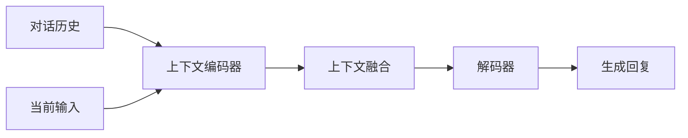

# 大模型问答机器人如何处理上下文

## 1. 背景介绍
### 1.1  问题的由来
在人工智能的发展历程中,对话系统一直是一个重要的研究方向。传统的对话系统大多基于规则或模板,难以处理复杂多变的对话场景。随着深度学习的兴起,特别是 Transformer 等预训练语言模型的出现,大规模语言模型逐渐成为构建对话系统的主流技术。

然而,单纯使用大模型进行问答还存在一些局限性,其中最突出的就是上下文理解和记忆能力的缺失。在多轮对话中,用户的当前问题往往依赖于之前的对话内容。如何让机器人理解并记住先前的对话信息,进而根据上下文生成连贯且合理的回复,是大模型问答机器人亟需解决的关键问题。

### 1.2  研究现状
目前学术界和工业界都在积极探索大模型问答机器人的上下文处理技术。主要有以下几类方法:

1. 基于 Prompt 的上下文引入:通过在输入中添加一些特定的提示信息,引导模型关注先前的对话内容。
2. 基于外部知识库的上下文管理:构建一个外部知识库存储对话历史,并在生成回复时检索相关信息。
3. 基于 Transformer 改进的上下文建模:在 Transformer 结构中引入新的组件和机制,增强模型对长程依赖的捕捉能力。
4. 基于 RL 的上下文学习:将对话看作一个序列决策过程,通过强化学习优化模型的上下文理解和应对策略。

一些代表性的研究工作包括:DialoGPT[1], Meena[2], BlenderBot[3], ConvBERT[4] 等。但总的来说,大模型的上下文处理依然面临诸多挑战,离人类水平的多轮对话还有不小差距。

### 1.3  研究意义
探索大模型问答机器人的上下文处理技术,对于推动对话系统的进一步发展具有重要意义:

1. 提升对话系统的连贯性和合理性,使机器人的回复更加自然、贴切。
2. 拓展对话系统的应用场景,使其能够胜任更加复杂的任务,如客服、助手、陪伴等。
3. 加深对人类语言交互规律的认识,为认知科学、心理学等学科提供新的视角。
4. 推动人机交互体验的优化,为人工智能走向大众应用奠定基础。

### 1.4  本文结构
本文将围绕大模型问答机器人的上下文处理展开讨论。第2节介绍相关的核心概念;第3节重点阐述主流的上下文处理算法原理和步骤;第4节给出一些典型的数学模型和公式推导;第5节通过代码实例演示具体的实现细节;第6节分析潜在的应用场景;第7节推荐一些学习资源和工具;第8节总结全文并展望未来;第9节列举常见问题解答。

## 2. 核心概念与联系
在讨论大模型问答机器人的上下文处理之前,有必要先明确一些相关的核心概念:

- **对话(Dialogue)**: 两个或多个主体之间交互式的语言交流过程。在人机对话中,对话由用户和机器人轮流发言构成。
- **上下文(Context)**: 对话发生的背景信息,包括先前的对话内容、说话人的身份、对话发生的时间地点等。上下文对于理解当前话语至关重要。
- **多轮对话(Multi-turn Dialogue)**: 一次完整对话由多个发言回合组成,每个回合又称为一轮(Turn)。多轮对话是上下文理解的主要场景。
- **语境(Context of situation)**: 对话发生时的外部环境和条件,如物理环境、社交关系、文化背景等。语境与上下文既有联系又有区别。
- **共指(Coreference)**: 多个指代对象指向同一个实体。上下文中的代词消解需要用到共指消解技术。 
- **指代消解(Anaphora Resolution)**: 确定代词或其他指示语的指代对象。在上下文分析中,需要追踪先行词并建立指代链。
- **篇章关系(Discourse Relation)**: 上下文中各个语句之间的逻辑关系,如因果、转折、并列等。把握篇章关系有助于理清对话脉络。
- **知识库(Knowledge Base)**: 以结构化的形式存储世界知识或特定领域知识,可用于辅助对话理解和信息检索。
- **对话状态(Dialogue State)**: 对话进行到某一时刻时的完整状态表示,囊括了当前的对话主题、用户意图、槽位填充情况等信息。

这些概念之间相互关联,共同构成了丰富的对话语境。大模型要想在多轮对话中表现出色,必须充分利用上下文信息,深入理解对话的语义和用户意图,同时结合背景知识给出合理恰当的回复。因此,上下文处理可以说是大模型问答机器人的一项核心技术。

## 3. 核心算法原理 & 具体操作步骤
### 3.1 算法原理概述
大模型问答机器人的上下文处理大致分为三个主要步骤:上下文编码、上下文融合和上下文利用。下面我们对每个步骤的算法原理进行概述。

**上下文编码**:将先前的对话内容转化为数值化的向量表示,以便后续的模型处理。主要采用的编码模型包括:

- RNN 系列模型:如 LSTM[5]、GRU[6] 等,通过迭代更新隐藏状态来编码上下文信息。
- Transformer 系列模型:如 GPT[7]、BERT[8] 等,利用自注意力机制和位置编码捕捉上下文依赖。
- 图网络模型:如 GCN[9]、GAT[10] 等,以图的形式建模对话结构,通过消息传递更新节点表示。

**上下文融合**:将编码后的上下文向量与当前对话轮的输入进行融合,形成完整的输入表示。常见的融合方式有:

- 拼接:直接将上下文向量和当前输入拼接在一起。
- 注意力:通过注意力机制动态地聚合上下文信息。
- 门控:利用门控单元控制上下文信息的流动。

**上下文利用**:在生成回复时,充分利用融合后的上下文信息,以提高回复的连贯性和合理性。主要的利用策略包括:

- 上下文感知的解码:在解码每个词时,都考虑上下文向量对当前预测的影响。
- 上下文相关的重排序:根据与上下文的相关性对候选回复进行重新排序。
- 基于上下文的检索:从外部知识库中检索与当前上下文最相关的信息,用于辅助回复生成。

### 3.2 算法步骤详解
下面我们以一个基于 Transformer 的上下文处理模型为例,详细说明其处理步骤。模型架构如下图所示:

**步骤1:上下文编码**

1. 将对话历史按照发言顺序排列,形成一个序列 $\mathbf{H}=\{x_1,x_2,\cdots,x_n\}$,其中 $x_i$ 表示第 $i$ 个发言。
2. 对每个发言 $x_i$ 进行词嵌入,得到词嵌入向量序列 $\mathbf{E}=\{e_1,e_2,\cdots,e_n\}$。
3. 在词嵌入中加入位置编码,表示每个词在序列中的位置信息。位置编码可以采用正弦函数或学习得到。
4. 将加入位置编码的词嵌入序列输入到 Transformer 的编码器中,通过自注意力机制和前馈网络,得到上下文编码 $\mathbf{C}=\{c_1,c_2,\cdots,c_n\}$。

**步骤2:上下文融合**

1. 对当前对话轮的输入 $q$ 进行词嵌入,得到嵌入向量序列 $\mathbf{Q}=\{q_1,q_2,\cdots,q_m\}$。
2. 将当前输入嵌入 $\mathbf{Q}$ 与上下文编码 $\mathbf{C}$ 拼接在一起,得到融合后的表示 $\mathbf{F}=[\mathbf{C};\mathbf{Q}]$。
3. 对融合后的表示 $\mathbf{F}$ 再次进行自注意力计算和前馈变换,得到最终的融合表示 $\mathbf{U}$。

**步骤3:上下文利用**

1. 将融合表示 $\mathbf{U}$ 输入到 Transformer 的解码器中,通过自注意力和编码-解码注意力机制,逐词生成回复序列 $\mathbf{R}=\{r_1,r_2,\cdots,r_k\}$。
2. 在生成每个词 $r_i$ 时,都利用上下文信息 $\mathbf{U}$ 进行预测,从而得到与上下文相关的回复。
3. 可以在生成过程中引入一些额外的策略,如 Beam Search、核采样等,以提高回复质量。
4. 最终得到的回复序列 $\mathbf{R}$ 即为模型生成的上下文相关的回复。

以上就是一个典型的基于 Transformer 的上下文处理模型的主要步骤。通过编码、融合和利用三个阶段,模型能够充分挖掘对话历史中的上下文信息,生成连贯、合理的多轮对话回复。

### 3.3 算法优缺点
上述基于 Transformer 的上下文处理算法具有以下优点:

1. 通过自注意力机制,能够捕捉上下文中的长距离依赖,对全局信息进行建模。
2. 采用位置编码,使模型能够区分不同位置的上下文信息,提高编码质量。
3. 利用多头注意力,从不同角度对上下文进行理解,增强语义表示能力。
4. 引入前馈网络,增加模型的非线性表达能力,提高特征抽取的效果。

但该算法也存在一些局限性:

1. 模型参数量大,训练和推理的计算开销较高,对硬件要求较高。
2. 位置编码通常采用固定的函数,难以灵活建模位置信息。
3. 在处理较长对话时,自注意力计算的复杂度较高,影响模型效率。
4. 缺乏显式的知识管理机制,难以充分利用外部知识辅助对话。

### 3.4 算法应用领域
基于 Transformer 的上下文处理算法在多个领域得到了广泛应用,如:

- 智能客服:通过多轮对话理解用户需求,提供连贯、个性化的服务。
- 虚拟助手:根据上下文信息为用户提供及时、准确的信息和建议。
- 聊天机器人:通过上下文感知,使聊天更加自然、贴近人类交流方式。
- 问答系统:结合问题和上下文线索,给出切题、详尽的答案。

未来,随着预训练语言模型的不断发展,上下文处理技术有望在更多场景得到应用,为人机交互带来更好的体验。

## 4. 数学模型和公式 & 详细讲解 & 举例说明
### 4.1 数学模型构建
为了形式化地描述上下文处理的过程,我们可以建立如下数学模型。

首先,定义一些基本符号:
- $\mathcal{D}=\{(q_i,r_i)\}_{i=1}^N$:表示由 $N$ 组问答对 $(q_i,r_i)$ 组成的对话数据集。
- $\mathbf{H}_i=(x_1,\cdots,x_{n_i})$:表示对话 $i$ 的历史发言序列,共 $n_i$ 轮。
- $\mathbf{E}_i=(e_1,\cdots,e_{n_i})$:表示对话 $i$ 的上下文编码,每