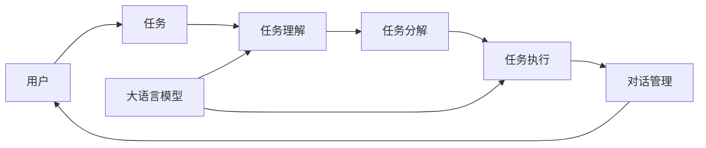

# 大模型问答机器人的任务处理

## 1. 背景介绍
### 1.1 问题的由来
随着人工智能技术的飞速发展,特别是近年来大语言模型的突破性进展,基于大模型的智能问答机器人开始在各个领域崭露头角。相比传统的基于规则或检索的问答系统,大模型赋予了机器人更强大的自然语言理解和生成能力,使其能够更好地理解用户意图,给出更加精准、连贯、富有洞见的回答。然而,要实现一个高质量的大模型问答机器人,仍面临诸多技术挑战,其中一个核心问题就是如何高效地处理和执行用户提出的各种复杂任务。

### 1.2 研究现状
目前业界主流的大模型问答机器人,如 ChatGPT、Claude 等,在任务处理上主要采用 Prompt 工程的方式,即通过精心设计的提示语引导模型生成期望的输出。这种方式虽然取得了不错的效果,但仍存在一些局限性:
1. Prompt 设计需要大量的人工参与,工作量大,难以扩展;
2. Prompt 通常针对特定任务设计,通用性和迁移能力较弱;
3. 模型对 Prompt 的理解存在偏差,容易产生 hallucination 等问题。

因此,研究一种更加智能化、自动化的任务处理机制,减少人工参与,提高模型理解和执行任务的能力,是当前大模型问答机器人亟需解决的关键问题。

### 1.3 研究意义 
研究大模型问答机器人的任务处理,具有重要的理论和实践意义:
1. 推动自然语言理解和任务导向型对话的研究,揭示语言和行为的内在联系;
2. 探索大模型在复杂认知任务中的应用潜力,拓展其应用场景和边界;
3. 提升问答机器人的实用性和用户体验,为智能助理、智能客服等应用提供更好的技术支持;
4. 为通用人工智能的实现提供思路和借鉴,推动人工智能从感知智能向认知智能的跨越。

### 1.4 本文结构
本文将围绕大模型问答机器人的任务处理展开深入探讨,内容组织如下:
第2节介绍相关的核心概念;
第3节阐述核心算法原理和操作步骤;
第4节建立数学模型并给出公式推导;
第5节通过代码实例演示具体实现;
第6节分析实际应用场景;
第7节推荐相关工具和学习资源;
第8节总结全文,展望未来发展方向。

## 2. 核心概念与联系

在探讨大模型问答机器人的任务处理之前,首先需要明确几个核心概念:

**大语言模型(Large Language Model,LLM)**: 是一种基于海量文本语料训练的神经网络模型,具有强大的自然语言理解和生成能力,代表模型有 GPT-3、PaLM、GLM 等。LLM 是问答机器人的核心组件,其性能直接决定了机器人的回答质量。

**任务(Task)**: 泛指用户提出的各种需求或命令,可以是一个问题、一项操作、一个目标等。任务通常以自然语言文本的形式表达,具有一定的复杂性和开放性。

**任务理解(Task Understanding)**: 是指机器人根据用户输入的文本,准确把握其中蕴含的语义、意图、约束条件等关键信息的过程。任务理解是任务处理的基础,其效果直接影响后续执行的结果。

**任务分解(Task Decomposition)**: 由于用户任务可能比较复杂,包含多个子任务或步骤,因此需要将其进行合理拆分,以便机器人逐步求解。任务分解可以降低单次处理的难度,提高任务完成的效率和准确率。

**任务执行(Task Execution)**: 是指机器人根据理解和分解后的任务,进行信息检索、知识推理、方案规划、结果生成等一系列操作,最终输出符合用户预期的答案或行动。任务执行需要综合利用模型的记忆、理解、分析、创造等多种认知能力。

**对话管理(Dialogue Management)**: 在问答交互过程中,机器人需要根据对话历史和用户反馈,动态调整任务处理的策略和流程,以维持一个连贯、自然、高效的多轮对话。对话管理需要平衡任务导向和社交性,灵活处理用户插话、话题漂移等复杂情况。

以上核心概念环环相扣,共同构成了大模型问答机器人任务处理的基本框架,下图展示了它们之间的关系:



从图中可以看出,用户通过自然语言表达任务,机器人利用大语言模型对任务进行理解、分解、执行,再通过对话管理模块与用户进行多轮交互,形成一个闭环。因此,研究大模型问答机器人的任务处理,本质上就是研究如何设计和优化这个闭环流程,赋予机器人更强的认知和交互能力。

## 3. 核心算法原理 & 具体操作步骤
### 3.1 算法原理概述
大模型问答机器人的任务处理可以抽象为一个端到端的 Seq2Seq 问题,即将输入的用户任务序列,转换为输出的答案或行动序列。借助 LLM 强大的语言建模能力,我们可以将任务处理建模为一个自回归生成过程:
$$
P(y|x)=\prod_{i=1}^{n} P\left(y_{i} | x, y_{<i}\right)
$$
其中 $x$ 表示输入任务,$y$ 表示输出答案,$y_i$ 表示答案中的第 $i$ 个 token。模型根据输入 $x$ 和之前生成的 token $y_{<i}$,预测下一个 token $y_i$ 的概率。通过这种自回归方式,模型可以生成任意长度的答案序列。

为了提高任务处理的准确性和可控性,我们在生成过程中引入了一些关键技术:

**Prompt 设计**: 通过在输入中添加一些特殊的提示语(如任务描述、要求、格式等),引导模型生成期望的输出。一个典型的 Prompt 模板为:

```
任务: {task_description}
要求: {task_requirements}
格式: {output_format}

答案: {model_output}
```

**思维链推理(Chain-of-Thought,CoT)**: 在生成答案之前,先让模型输出一系列推理步骤,模拟人类思考的过程。这种显式推理有助于提高模型的可解释性和准确性,尤其在一些需要多步推理的复杂任务上效果明显。一个带 CoT 的生成过程为:

```
任务: {task_description}

思路:
1. {reasoning_step_1}
2. {reasoning_step_2} 
3. ...

答案: {model_output}
```

**迭代优化**: 由于模型一次生成的答案可能存在错误或遗漏,因此我们采用迭代优化的方式,通过多轮问答和反馈,引导模型不断修正和完善答案,直到满足用户需求。一个迭代优化的流程为:

```
用户: {initial_task}
助手: {initial_answer}

用户: {feedback_1}
助手: {refined_answer_1}

用户: {feedback_2}
助手: {refined_answer_2}

...
```

**知识增强**: 为了扩展模型的知识边界,我们在生成过程中引入外部知识(如搜索引擎、知识库等),让模型根据检索到的信息对答案进行补充和优化。一个知识增强的生成过程为:

```
任务: {task_description}

相关知识:
{knowledge_1}
{knowledge_2}
...

答案: {model_output}
```

以上就是大模型问答机器人任务处理的核心算法原理,通过 Prompt 设计、思维链推理、迭代优化、知识增强等技术,可以显著提升模型执行任务的效果。接下来,我们将详细介绍算法的具体操作步骤。

### 3.2 算法步骤详解
大模型问答机器人的任务处理可以分为以下几个关键步骤:

**Step 1: 任务理解**
- 对用户输入的任务文本进行预处理,如分词、词性标注、命名实体识别等;
- 利用预训练的 LLM 对任务文本进行 Embedding,提取其语义特征;
- 通过 Few-shot Prompt 等方式,引导模型对任务的关键元素(如意图、槽位、约束条件等)进行结构化表示;
- 根据任务理解的结果,生成后续步骤所需的 Prompt。

**Step 2: 任务分解**
- 判断任务是否可以直接执行,如果不能,则进行任务分解;
- 根据任务的复杂度和依赖关系,将其划分为若干子任务;
- 对每个子任务,递归执行任务理解和分解的过程;
- 将分解后的子任务按照一定的逻辑顺序组织成一个任务树或图。

**Step 3: 任务执行**
- 遍历任务树,对每个子任务节点,生成相应的 Prompt;
- 利用 LLM 对 Prompt 进行自回归生成,得到子任务的执行结果;
- 在生成过程中,通过 CoT 引导模型进行必要的推理和解释;
- 对于需要外部信息支持的任务,引入知识增强机制进行答案优化;
- 将各个子任务的执行结果进行整合,形成最终的任务输出。

**Step 4: 对话管理**
- 将模型生成的任务输出返回给用户,同时记录当前的对话状态;
- 获取用户对任务输出的反馈,判断是否满足预期;
- 如果用户对当前输出不满意,则开启迭代优化流程:
  - 生成引导用户进一步澄清需求的 Prompt;
  - 获取用户的补充输入,更新任务理解结果;
  - 重复任务执行步骤,生成修正后的任务输出;
- 如果用户对当前输出满意,则将对话状态更新为完成,等待下一轮任务输入。

**Step 5: 持续学习**
- 将每一轮用户的任务输入和反馈记录下来,形成一个对话日志数据集;
- 利用对话日志数据对 LLM 进行持续的微调和增量训练;
- 不断优化 Prompt 设计、CoT 推理、知识检索等策略;
- 定期评估模型的任务处理性能,进行必要的模型迭代和升级。

以上就是大模型问答机器人任务处理的主要算法步骤,贯穿了任务的理解、分解、执行、反馈等全生命周期,并引入了持续学习机制,使得机器人的能力可以随着时间和数据的积累不断提升。

### 3.3 算法优缺点
大模型问答机器人的任务处理算法具有以下优点:
1. 端到端的生成式建模,无需复杂的人工特征工程,减少了人力成本;
2. 基于大规模语料预训练,具有强大的语言理解和生成能力,可以处理开放域的任务;
3. 通过 Prompt 设计和思维链推理,提高了模型执行任务的可控性和可解释性;
4. 支持多轮对话和迭代优化,可以根据用户反馈动态调整任务处理策略;
5. 引入外部知识增强,扩展了模型的知识边界,提高了应答的信息丰富度。

同时,该算法也存在一些局限性:
1. 模型的生成结果受 Prompt 设计的影响较大,需要大量的 Prompt 工程;
2. 模型容易生成幻觉(hallucination),即虚构一些不存在或不正确的信息;
3. 模型对任务的理解和执行能力仍有限,尤其在一些需要复杂推理和常识的任务上表现不佳;
4. 模型的计算开销大,推理速度慢,难以应用于实时性要求高的场景;
5. 模型的训练需要