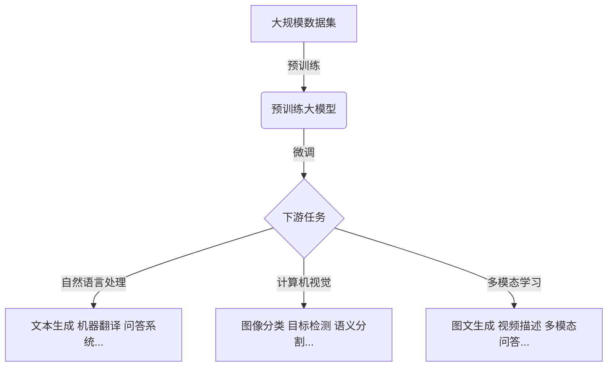

# 大模型：商业智能的未来方向

## 1. 背景介绍

### 1.1 问题的由来

在过去的几年里,人工智能(AI)和机器学习(ML)技术取得了长足的进步,尤其是大型语言模型和多模态模型的出现,为各行业带来了革命性的变化。这些大型AI模型被称为"大模型"(Large Models),能够处理海量数据,并在各种任务上展现出超人的性能表现。

大模型的兴起源于深度学习算法、硬件加速和大数据的融合。通过在大规模数据集上进行预训练,这些模型能够学习到丰富的知识表示,并在下游任务中表现出惊人的泛化能力。著名的大模型包括GPT-3、BERT、DALL-E等,它们在自然语言处理、计算机视觉、多模态等领域展现出了强大的能力。

然而,训练和部署这些大模型需要大量的计算资源、存储空间和能源消耗,这对于大多数企业来说是一个巨大的挑战。此外,大模型的可解释性、公平性、隐私和安全性等问题也引发了广泛关注。因此,如何高效利用大模型,并将其应用于实际的商业场景,成为了当前研究的热点话题。

### 1.2 研究现状

目前,大模型在多个领域已经取得了令人瞩目的成就。在自然语言处理领域,GPT-3等大型语言模型能够生成高质量的文本内容,并在机器翻译、文本摘要、问答系统等任务中表现出色。在计算机视觉领域,DALL-E等大型多模态模型能够根据文本描述生成逼真的图像,为内容创作带来了全新的可能性。

除了学术界的研究,一些科技巨头也在积极布局大模型的商业应用。例如,OpenAI推出了基于GPT-3的文本生成API,为企业提供了强大的文本生成能力。谷歌也在探索将大模型应用于搜索引擎、语音助手等产品中。微软则与OpenAI达成合作,将大模型技术融入其云计算服务。

然而,大模型的应用仍然面临着诸多挑战。首先,大模型的训练和部署成本高昂,需要大量的计算资源和存储空间。其次,大模型的可解释性和公平性问题亟待解决,以确保其在实际应用中的可靠性和安全性。此外,大模型的知识来源和更新机制也需要进一步优化,以保持其知识的准确性和时效性。

### 1.3 研究意义

大模型代表了人工智能领域的一个重要发展方向,它们展现出了强大的能力,并为各行业带来了巨大的变革潜力。探索大模型的商业应用意义重大,可以为企业带来以下几个方面的价值:

1. **提高效率和生产力**:大模型能够自动完成诸多任务,如文本生成、图像处理、数据分析等,从而大幅提高企业的工作效率和生产力。

2. **创新产品和服务**:利用大模型的强大能力,企业可以开发出全新的产品和服务,为客户带来前所未有的体验。

3. **优化决策过程**:大模型能够从海量数据中提取有价值的见解,为企业的决策过程提供有力支持。

4. **降低成本**:通过自动化和智能化,大模型可以帮助企业节省人力和其他资源,从而降低运营成本。

5. **保持竞争优势**:掌握大模型技术将有助于企业在未来的竞争中占据有利地位,抢占先机。

然而,要真正实现大模型在商业领域的大规模应用,还需要解决诸多技术和非技术挑战。本文将深入探讨大模型的核心概念、原理和实践,为企业利用这一前沿技术提供指导和建议。

### 1.4 本文结构

本文将从以下几个方面全面介绍大模型及其在商业领域的应用:

1. 核心概念与联系
2. 核心算法原理与具体操作步骤
3. 数学模型、公式推导及案例分析
4. 项目实践:代码实例和详细解释
5. 实际应用场景和未来展望
6. 工具和学习资源推荐
7. 总结:未来发展趋势与挑战

通过对上述内容的深入探讨,读者将全面了解大模型的本质、原理和实践,从而能够更好地把握大模型在商业智能领域的发展方向,并为企业制定相应的技术战略提供参考。

## 2. 核心概念与联系

在深入探讨大模型的算法原理和实践之前,我们有必要先了解一些核心概念,以及它们之间的联系。这将有助于我们建立对大模型的整体认识。

### 2.1 人工神经网络

人工神经网络(Artificial Neural Network,ANN)是大模型的基础。它是一种受生物神经系统启发而设计的计算模型,由大量互连的节点(神经元)组成。每个节点接收来自其他节点的输入,经过加权求和和非线性激活函数的处理,产生输出传递给下一层节点。

神经网络的核心思想是通过学习调整连接权重,使网络能够从训练数据中提取有用的特征表示,并对新的输入数据做出正确的预测或决策。随着层数的增加,神经网络能够学习到越来越抽象和复杂的特征表示,从而解决更加困难的任务。

### 2.2 深度学习

深度学习(Deep Learning)是机器学习的一个分支,它利用了多层神经网络模型来自动从数据中学习特征表示。与传统的机器学习方法相比,深度学习不需要人工设计特征,而是能够自动从原始数据(如图像、文本等)中学习到有效的特征表示。

深度学习的关键在于利用大量的训练数据和强大的计算能力,通过反向传播算法优化多层神经网络的参数,使其能够逐层提取更加抽象和复杂的特征表示。随着模型规模和训练数据的不断增加,深度学习模型的性能也在不断提高,在多个领域取得了突破性的进展。

### 2.3 大模型

大模型(Large Model)通常指具有数十亿甚至上万亿参数的巨型神经网络模型。这些模型通过在大规模数据集上进行预训练,能够学习到丰富的知识表示,并在下游任务中展现出惊人的泛化能力。

大模型的优势在于其巨大的参数空间,能够捕获更加复杂的模式和表示。同时,在大规模数据集上的预训练,使得模型能够学习到通用的知识表示,从而在各种下游任务中表现出良好的迁移能力。

然而,训练和部署大模型需要大量的计算资源、存储空间和能源消耗,这对于大多数企业来说是一个巨大的挑战。此外,大模型的可解释性、公平性、隐私和安全性等问题也需要进一步探讨和解决。

### 2.4 自然语言处理

自然语言处理(Natural Language Processing,NLP)是人工智能的一个重要分支,旨在使计算机能够理解和生成人类语言。它涉及多个任务,如机器翻译、文本摘要、问答系统、情感分析等。

大模型在自然语言处理领域取得了巨大的成功,尤其是基于Transformer的大型语言模型(如GPT-3、BERT等)。这些模型能够从大规模文本数据中学习到丰富的语言知识表示,并在各种NLP任务上展现出卓越的性能。

未来,大模型有望进一步提升自然语言处理的能力,实现更加人性化、智能化的人机交互,为各行业带来革命性的变化。

### 2.5 计算机视觉

计算机视觉(Computer Vision)是人工智能的另一个重要分支,旨在使计算机能够理解和分析数字图像或视频。它涉及多个任务,如图像分类、目标检测、语义分割、图像生成等。

在计算机视觉领域,大模型也取得了令人瞩目的成就。例如,DALL-E等大型多模态模型能够根据文本描述生成逼真的图像,为内容创作带来了全新的可能性。此外,大模型还在目标检测、语义分割等传统任务上展现出了优异的性能。

未来,大模型有望进一步推动计算机视觉的发展,实现更加智能化的视觉理解和生成,为各行业带来新的应用场景。

### 2.6 多模态学习

多模态学习(Multimodal Learning)是指同时处理多种模态数据(如文本、图像、视频、音频等)的机器学习方法。它旨在利用不同模态之间的相关性和互补性,提高模型的学习能力和泛化性能。

大模型在多模态学习领域也展现出了巨大的潜力。例如,一些大型多模态模型能够同时处理文本和图像数据,实现跨模态的理解和生成。这为多模态人机交互、内容创作等领域带来了新的机遇。

未来,随着模型规模和训练数据的进一步扩大,大模型在多模态学习领域的能力有望得到进一步提升,推动人工智能系统向更加通用智能的方向发展。

### 2.7 迁移学习

迁移学习(Transfer Learning)是一种机器学习范式,它旨在利用在源域学习到的知识,来提高在目标域的学习效率和性能。

大模型通过在大规模数据集上进行预训练,能够学习到通用的知识表示,从而在各种下游任务中展现出良好的迁移能力。这种预训练-微调的范式已经成为利用大模型的主要方式。

未来,迁移学习将继续在大模型的应用中扮演重要角色。通过优化预训练策略、设计更好的微调方法,我们有望进一步提高大模型在各种任务上的性能,实现更加通用和高效的知识迁移。

### 2.8 概念联系总结

上述核心概念之间存在着密切的联系,它们共同构建了大模型的理论基础和应用框架。具体来说:

- 人工神经网络是大模型的基础模型,深度学习则提供了训练大型神经网络的方法和理论支持。
- 大模型通过在大规模数据集上进行预训练,能够学习到丰富的知识表示,从而在自然语言处理、计算机视觉等领域展现出卓越的性能。
- 多模态学习使得大模型能够同时处理多种模态数据,实现跨模态的理解和生成,为人机交互和内容创作带来新的可能性。
- 迁移学习则是利用大模型的关键范式,通过预训练-微调的方式,实现了知识的高效迁移和泛化。

通过对这些核心概念的深入理解,我们可以更好地把握大模型的本质,并为其在商业智能领域的应用奠定坚实的理论基础。

## 3. 核心算法原理 & 具体操作步骤

在探讨大模型的具体算法原理和操作步骤之前,我们先来了解一下大模型训练和应用的整体流程:

如上图所示,大模型的训练和应用通常分为两个阶段:预训练和微调。在预训练阶段,我们利用大规模数据集(如网络文本、图像等)对大模型进行通用的预训练,使其学习到丰富的知识表示。而在微调阶段,我们则根据具体的下游任务(如自然语言处理、计算机视觉、多模态学习等),对预训练模型进行进一步的微调,以提高其在特定任务上的性能表现。

接下来,我们将分别介绍大模型预训练和微调的核心算法原理和具体操作步骤。

### 3.1 算法原理概述

#### 3.1.1 预训练算法原理