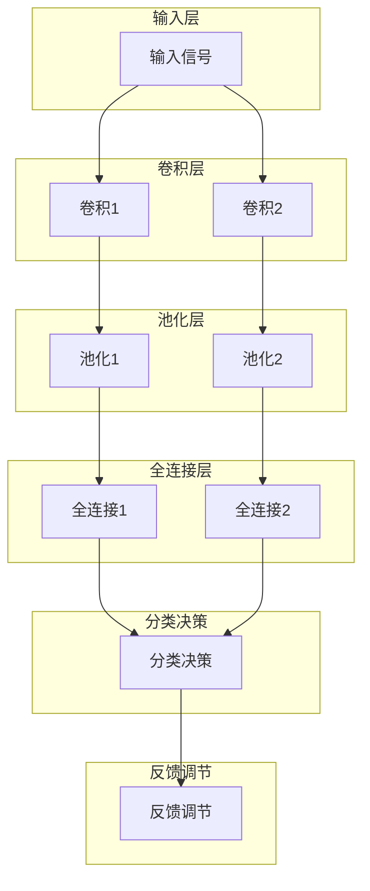
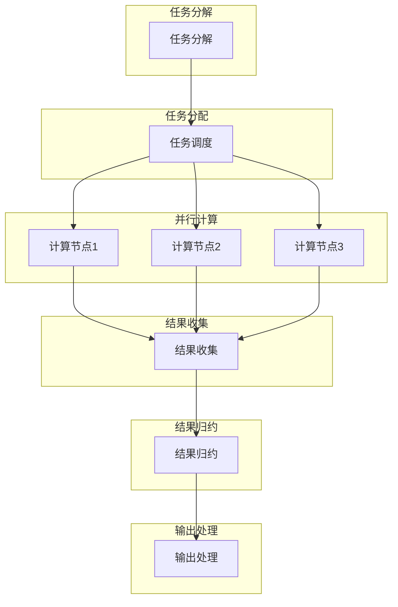

# 大脑与超级计算机的比较

## 1. 背景介绍

### 1.1 问题的由来

自古以来，人类一直对大脑的奥秘充满好奇和敬畏。大脑是人类最复杂、最神奇的器官,控制着我们的思维、情感、行为和生理功能。随着科技的飞速发展,超级计算机的计算能力不断提高,人工智能技术也日新月异,人们不禁开始思考:大脑和超级计算机之间到底有何异同?它们在信息处理、计算能力、存储容量等方面如何比较?

### 1.2 研究现状

对大脑和计算机进行比较研究一直是神经科学、认知科学、计算机科学等多个学科交叉研究的热点领域。科学家们从不同角度展开了大量研究,例如:

- 神经网络模型:借鉴大脑神经元网络的工作原理,构建人工神经网络模型
- 脑机接口技术:将大脑与计算机系统连接,实现意念控制等功能
- 计算理论研究:探讨大脑和计算机在计算复杂性、并行处理等方面的差异
- 认知架构研究:模拟大脑的认知过程,构建认知架构模型

### 1.3 研究意义

大脑与超级计算机的比较研究,不仅能够加深我们对大脑奥秘的认识,还可以为发展智能系统、构建更高效的计算架构提供借鉴和指导。具体意义包括:

1. 揭示大脑信息处理的奥秘,促进神经科学和认知科学的发展
2. 借鉴大脑高效并行处理的优势,设计新型高性能计算架构  
3. 模拟大脑的学习和自适应能力,提高人工智能系统的智能水平
4. 探索大脑与计算机融合的新型交互方式,开拓人机交互的新领域

### 1.4 本文结构

本文将从多个角度系统比较大脑和超级计算机,内容包括:

- 介绍大脑和超级计算机的核心概念及其联系
- 分析大脑和超级计算机在计算原理、信息处理等方面的异同
- 建立数学模型,定量比较两者在运算能力、存储容量等指标上的差距
- 通过实例分析两者在实际应用中的优缺点
- 探讨两者在未来的发展趋势,以及面临的挑战和机遇

## 2. 核心概念与联系

### 2.1 大脑的核心概念

#### 2.1.1 神经元及其连接

大脑由数十亿个神经元组成,神经元通过突触相互连接形成庞大的网络。每个神经元都能接收来自其他神经元的电脉冲信号,并根据一定的规则对信号进行整合、处理,最终决定是否产生自身的电脉冲输出信号。

#### 2.1.2 突触可塑性

神经元之间的连接强度(突触强度)并非固定不变,而是会随着时间和神经活动的变化而动态调整,这种现象称为突触可塑性。突触可塑性是大脑学习和记忆的神经生物学基础。

#### 2.1.3 功能区域

大脑可分为多个功能区域,如视觉皮层、运动皮层、语言区等,负责不同的认知功能。但各区域并非完全独立,存在着复杂的相互作用。

### 2.2 超级计算机的核心概念  

#### 2.2.1 并行计算

超级计算机通过大规模并行计算架构,将庞大的计算任务分解为无数个小任务,利用成千上万的处理单元同时执行,从而实现极高的计算能力。

#### 2.2.2 高速互连网络

为了支持海量处理单元之间的高效通信,超级计算机采用高速、高带宽的互连网络技术,如InfiniBand、三维环形网络等。

#### 2.2.3 高性能存储系统

超级计算机配备大容量、高速的存储系统,能够快速存取海量数据,满足大规模科学计算和数据处理的需求。

### 2.3 大脑与超级计算机的联系

虽然大脑和超级计算机在本质上存在着差异,但它们在信息处理和计算方面也存在一些相似之处:

- 都是通过大规模并行的方式来处理信息和执行计算
- 都需要高效的网络结构来支持大量计算单元之间的通信
- 都需要大容量的存储系统来存储和提取海量信息/数据

这些共同点为我们构建类脑计算机系统、设计生物启发算法提供了借鉴和指导。

## 3. 核心算法原理 & 具体操作步骤

### 3.1 算法原理概述

#### 3.1.1 大脑的信息处理原理

大脑的信息处理过程主要包括以下几个环节:

1. 感知输入:感受器(视觉、听觉等)接收外界刺激信号
2. 特征提取:初级感觉皮层对输入信号进行初步编码和特征提取
3. 模式识别:高级联合区对特征信息进行整合,识别出模式和对象
4. 认知加工:前额叶、顶叶等区域对模式信息进行进一步加工和决策
5. 反馈控制:运动皮层产生运动指令,控制行为输出

整个过程是一个自下而上和自上而下相互作用的并行分布式处理过程。

#### 3.1.2 超级计算机的计算原理

超级计算机的计算过程可概括为:

1. 任务分解:将大规模计算任务分解为大量子任务
2. 任务分配:将子任务分配给大量并行的计算单元(CPU/GPU等)
3. 并行计算:各计算单元同时执行子任务
4. 结果汇总:汇总各计算单元的中间结果
5. 后处理:对最终结果进行后续处理(可视化、存储等)

这是一个自上而下的任务分解和自下而上的结果汇总的过程。

### 3.2 算法步骤详解

#### 3.2.1 大脑信息处理算法

大脑的信息处理算法可视为一种分层的前馈神经网络,包含下面的主要步骤:

1. 输入层:感受器接收外界刺激信号,形成原始输入数据
2. 卷积层:初级感觉皮层对原始数据进行卷积操作,提取底层特征
3. 池化层:对卷积特征进行下采样,实现平移不变性
4. 全连接层:高级联合区对特征进行整合,形成模式表征 
5. 分类决策:前额叶等区域对模式表征进行分类和决策
6. 反馈调节:运动皮层根据决策结果发出运动控制指令

在整个过程中,各功能区域之间存在着复杂的反馈回路,实现自下而上和自上而下的交互作用。

#### 3.2.2 超级计算机并行算法 

超级计算机的并行计算算法主要步骤如下:

1. 任务分解:将计算任务分解为大量子任务
2. 任务分配:通过智能调度策略,将子任务分配到空闲计算节点
3. 数据分发:将相关数据分发到执行子任务的计算节点
4. 并行计算:各计算节点并行执行分配的子任务
5. 结果收集:收集各节点的中间计算结果
6. 结果归约:对中间结果进行归约操作,得到最终结果
7. 结果输出:可视化、存储或进一步处理最终结果

### 3.3 算法优缺点

#### 3.3.1 大脑信息处理算法

优点:
- 高度并行、分布式处理,具有极高的能效比
- 自适应性强,可以持续学习和优化
- 具备模式识别、推理决策等高级认知能力

缺点:
- 处理速度相对较慢,无法执行复杂的精确计算
- 可靠性和稳定性较差,容易受到噪声干扰
- 认知能力存在局限性,无法解决所有问题

#### 3.3.2 超级计算机并行算法

优点:
- 计算速度极快,能够高效处理大规模复杂任务
- 精度高,可以执行高精度的科学计算
- 可靠性强,按预定方式稳定运行

缺点: 
- 能效比较低,能耗和制冷成本很高
- 缺乏自主学习和自适应的能力
- 无法执行高级认知任务,如模式识别、决策等

### 3.4 算法应用领域

#### 3.4.1 大脑信息处理算法应用

- 计算机视觉:图像识别、目标检测等
- 自然语言处理:语音识别、机器翻译等
- 决策控制系统:无人驾驶、机器人控制等
- 推荐系统:个性化推荐、内容分析等

#### 3.4.2 超级计算机并行算法应用

- 科学计算:气象预报、气候模拟等
- 金融分析:风险建模、投资组合优化等 
- 密码分析:破译加密算法、密码攻击等
- 大数据处理:海量数据挖掘、深度学习等

## 4. 数学模型和公式 & 详细讲解 & 举例说明

### 4.1 数学模型构建

为了定量比较大脑和超级计算机的计算能力,我们构建如下数学模型:

#### 4.1.1 大脑计算模型

假设大脑由 $N$ 个神经元组成,每个神经元在单位时间内能够处理 $r$ 次操作,则大脑的理论计算能力为:

$$
C_{\text{brain}} = N \times r \quad (\text{ops/秒})
$$

其中 $r$ 可估计为每秒10-1000次操作。

#### 4.1.2 超级计算机计算模型

假设超级计算机由 $M$ 个计算节点组成,每个节点有 $n$ 个核心,主频为 $f$ GHz,每个核心每秒能执行 $s$ 条指令,则其理论计算能力为:

$$
C_{\text{computer}} = M \times n \times f \times 10^9 \times s \quad (\text{ops/秒})
$$

其中 $s$ 约为1-4,取决于指令类型和并行度。

### 4.2 公式推导过程

#### 4.2.1 大脑计算能力公式推导

设单个神经元的计算能力为 $c$ (ops/秒),则有:

$$
c = r
$$

由于大脑由 $N$ 个神经元并行工作,所以总计算能力为:

$$
\begin{aligned}
C_{\text{brain}} &= N \times c \\
                &= N \times r
\end{aligned}
$$

#### 4.2.2 超级计算机计算能力公式推导

设单个CPU核心的计算能力为 $c'$ (ops/秒),则有:

$$
c' = f \times 10^9 \times s  
$$

由于超级计算机由 $M