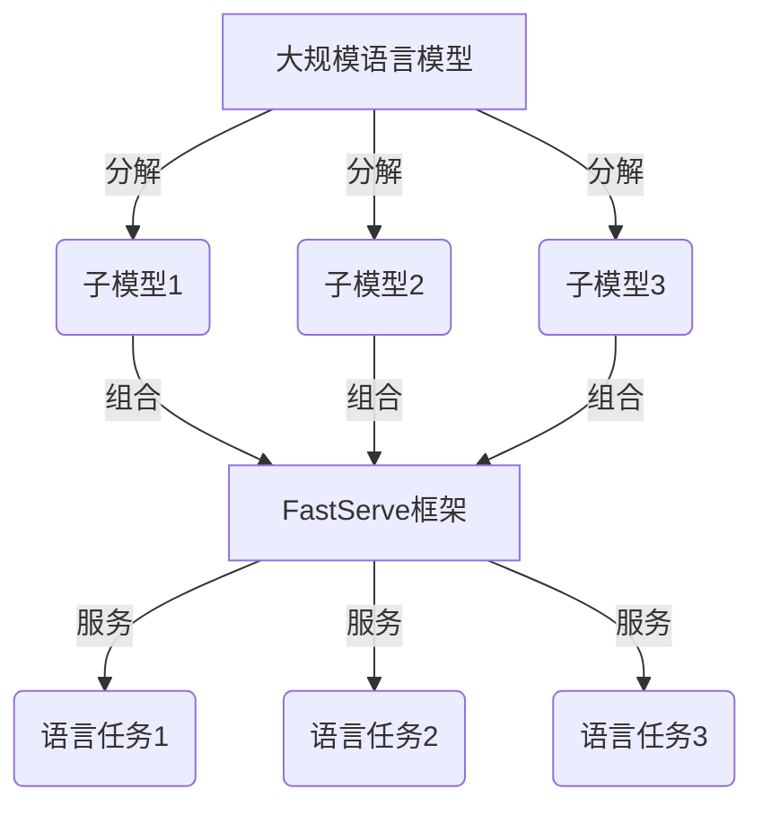

# 大规模语言模型从理论到实践 FastServe框架

## 1. 背景介绍

### 1.1 问题的由来

随着人工智能技术的快速发展,大规模语言模型在自然语言处理领域取得了令人瞩目的成就。然而,训练和部署这些庞大的模型面临着巨大的计算和存储挑战。传统的方法很难满足实时推理和高并发访问的需求,这严重限制了大规模语言模型在生产环境中的应用。

### 1.2 研究现状

为了解决这一问题,研究人员提出了各种优化技术,如模型压缩、知识蒸馏和增量学习等。然而,这些技术往往会牺牲模型的准确性和泛化能力。另一方面,一些公司开发了专用硬件和加速器,但成本高昂且缺乏灵活性。

### 1.3 研究意义

高效、可扩展的大规模语言模型服务对于实现人工智能的民主化至关重要。它可以使更多的个人和组织能够访问先进的自然语言处理功能,推动创新和促进技术的广泛应用。因此,开发一种能够高效训练、部署和服务大规模语言模型的框架具有重要的理论和实践意义。

### 1.4 本文结构

本文将介绍一种名为FastServe的创新框架,用于高效训练、部署和服务大规模语言模型。我们将详细探讨其核心概念、算法原理、数学模型、实现细节和实际应用场景。最后,我们将总结研究成果,并展望未来的发展趋势和挑战。

## 2. 核心概念与联系

FastServe框架的核心思想是将大规模语言模型分解为多个较小的子模型,并通过高效的模型组合和推理策略来提供统一的语言服务。这种分而治之的方法不仅可以降低单个模型的计算和存储开销,还能提高整体系统的可扩展性和容错能力。

FastServe框架由以下几个关键组件组成:

1. **模型分解器(Model Decomposer)**: 将大规模语言模型分解为多个较小的子模型,每个子模型专注于特定的语言任务或领域。

2. **模型组合器(Model Combiner)**: 根据输入查询,动态选择和组合适当的子模型,以提供准确的语言服务。

3. **推理引擎(Inference Engine)**: 高效地执行模型推理,支持批处理、流式处理和实时推理等多种模式。

4. **服务管理器(Service Manager)**: 管理模型生命周期,包括模型训练、部署、更新和监控等功能。

5. **负载均衡器(Load Balancer)**: 在多个计算节点之间智能分配推理请求,实现高可用性和自动扩展。

通过这些组件的紧密协作,FastServe框架能够高效地训练、部署和服务大规模语言模型,同时保持出色的性能和可扩展性。

## 3. 核心算法原理 & 具体操作步骤

### 3.1 算法原理概述

FastServe框架的核心算法是一种基于语义相似性的动态模型组合策略。它的工作原理如下:

1. 对输入查询进行语义表示,得到语义向量。

2. 计算语义向量与每个子模型的语义表示之间的相似度。

3. 根据相似度得分,选择最相关的子模型集合。

4. 将选定的子模型组合起来,执行联合推理。

5. 综合各个子模型的输出,生成最终结果。

该算法的关键在于如何有效地表示和比较语义相似性。FastServe框架采用了一种基于预训练语言模型的语义编码方法,能够捕捉丰富的语义信息,同时保持高效的计算性能。

### 3.2 算法步骤详解

1. **语义编码**

   对于输入查询$q$和每个子模型$m_i$,我们使用预训练的BERT模型对它们进行编码,得到对应的语义向量表示$\vec{q}$和$\vec{m_i}$:

   $$\vec{q} = \text{BERT}(q)$$
   $$\vec{m_i} = \text{BERT}(m_i)$$

2. **语义相似度计算**

   计算查询向量$\vec{q}$与每个子模型向量$\vec{m_i}$之间的余弦相似度:

   $$\text{sim}(q, m_i) = \frac{\vec{q} \cdot \vec{m_i}}{||\vec{q}|| \cdot ||\vec{m_i}||}$$

3. **子模型选择**

   根据相似度得分,选择前$k$个最相关的子模型集合$\mathcal{M}_k$:

   $$\mathcal{M}_k = \text{top-k}(\{(m_i, \text{sim}(q, m_i))\}_{i=1}^{N})$$

   其中$N$是总的子模型数量。

4. **模型组合与推理**

   对于选定的子模型集合$\mathcal{M}_k$,我们将它们的输出进行加权组合:

   $$\hat{y} = \sum_{m_i \in \mathcal{M}_k} w_i \cdot f_i(q)$$

   其中$f_i$是第$i$个子模型的推理函数,$w_i$是对应的权重系数,可以根据相似度得分或其他策略进行设置。

5. **结果生成**

   最终的输出$\hat{y}$就是FastServe框架对输入查询$q$的响应结果。

通过这种动态的模型组合策略,FastServe框架能够根据具体的查询内容,灵活地选择和组合最相关的子模型,从而提供准确和高效的语言服务。

### 3.3 算法优缺点

**优点**:

- 降低了单个模型的计算和存储开销,提高了可扩展性。
- 动态模型组合策略能够根据查询内容选择最相关的子模型,提高了准确性。
- 具有良好的容错能力,单个子模型出现故障不会影响整体服务。
- 支持增量更新和热插拔,方便模型的迭代和维护。

**缺点**:

- 需要预先训练语义编码模型,增加了一定的开销。
- 动态模型组合策略会引入一些额外的计算开销。
- 子模型之间可能存在冗余,导致存储空间的浪费。
- 需要设计合理的子模型划分策略,否则可能影响性能。

### 3.4 算法应用领域

FastServe框架及其核心算法可以广泛应用于以下场景:

- 大规模语言模型的在线服务和推理
- 问答系统、对话系统和智能助手
- 文本分类、情感分析和主题建模
- 机器翻译和多语种语言处理
- 知识图谱构建和实体链接
- 文本生成和自动写作等

总的来说,任何需要高效部署和服务大规模语言模型的应用场景,都可以考虑采用FastServe框架。

## 4. 数学模型和公式 & 详细讲解 & 举例说明

在FastServe框架中,我们采用了基于注意力机制的Transformer模型作为语义编码器。Transformer模型能够有效地捕捉序列数据中的长程依赖关系,在各种自然语言处理任务中表现出色。

### 4.1 数学模型构建

Transformer模型的核心组件是多头自注意力(Multi-Head Attention)机制,它可以被形式化描述为:

$$\text{MultiHead}(Q, K, V) = \text{Concat}(head_1, \dots, head_h)W^O$$

其中$head_i$由缩放点积注意力(Scaled Dot-Product Attention)计算得到:

$$\begin{aligned}
head_i &= \text{Attention}(QW_i^Q, KW_i^K, VW_i^V) \\
       &= \text{softmax}(\frac{QW_i^Q(KW_i^K)^T}{\sqrt{d_k}})VW_i^V
\end{aligned}$$

这里$Q$、$K$和$V$分别表示查询(Query)、键(Key)和值(Value)的输入表示,$W_i^Q$、$W_i^K$和$W_i^V$是可学习的投影矩阵,用于将输入映射到注意力子空间。$d_k$是缩放因子,用于防止点积值过大导致梯度饱和。

多头注意力机制通过并行计算多个注意力头,能够从不同的子空间捕捉不同的依赖关系,提高了模型的表示能力。

除了注意力机制,Transformer还包括位置编码、前馈网络和残差连接等关键组件,共同构建了一个强大的序列到序列(Seq2Seq)模型。

### 4.2 公式推导过程

我们以一个简单的序列到序列任务为例,推导Transformer模型的前向计算过程。

假设输入序列为$X = (x_1, x_2, \dots, x_n)$,目标输出序列为$Y = (y_1, y_2, \dots, y_m)$。我们首先将输入序列$X$输入到Transformer的编码器(Encoder)中,得到其隐藏状态表示$H^{enc} = (h_1^{enc}, h_2^{enc}, \dots, h_n^{enc})$:

$$H^{enc} = \text{Encoder}(X)$$

然后,我们将编码器的隐藏状态$H^{enc}$和前一时间步的目标输出$y_{t-1}$作为输入,送入Transformer的解码器(Decoder),得到当前时间步的输出概率分布:

$$P(y_t | y_{<t}, X) = \text{Decoder}(y_{t-1}, H^{enc})$$

通过对所有时间步的输出概率进行积累,我们可以得到整个目标序列$Y$的条件概率:

$$P(Y | X) = \prod_{t=1}^m P(y_t | y_{<t}, X)$$

在训练阶段,我们的目标是最大化上述条件概率,也就是最小化负对数似然损失函数:

$$\mathcal{L} = -\sum_{(X, Y) \in \mathcal{D}} \log P(Y | X)$$

其中$\mathcal{D}$表示训练数据集。通过梯度下降等优化算法,我们可以学习Transformer模型的参数,使其能够有效地建模输入和输出序列之间的条件概率分布。

### 4.3 案例分析与讲解

为了更好地理解Transformer模型在FastServe框架中的应用,我们以一个文本分类任务为例进行案例分析。

假设我们有一个新闻文本数据集,需要将每篇新闻归类为"政治"、"体育"、"科技"或"娱乐"四个主题类别之一。我们可以将这个任务建模为一个序列到序列的问题,其中输入序列$X$是新闻文本,目标输出序列$Y$是对应的主题标签。

我们首先使用预训练的BERT模型对输入新闻文本进行编码,得到其语义向量表示$\vec{x}$:

$$\vec{x} = \text{BERT}(X)$$

然后,我们将$\vec{x}$作为输入,送入一个微调后的Transformer模型,得到输出概率分布$P(Y | X)$:

$$P(Y | X) = \text{Transformer}(\vec{x})$$

在训练阶段,我们使用带标签的新闻数据集,最小化负对数似然损失函数$\mathcal{L}$,学习Transformer模型的参数。在推理阶段,对于一篇新的新闻文本$X^*$,我们可以计算出其主题概率分布$P(Y | X^*)$,并选择概率最大的类别作为预测结果。

在FastServe框架中,我们可以将上述文本分类模型作为一个子模型,专门处理与新闻主题相关的查询。当用户输入一个新闻相关的查询时,FastServe框架会自动选择并调用这个子模型,从而提供准确的分类结果。

### 4.4 常见问题解答

**Q: Transformer模型的计算复杂度如何?**

A: Transformer模型的计算复杂度主要来自于注意力