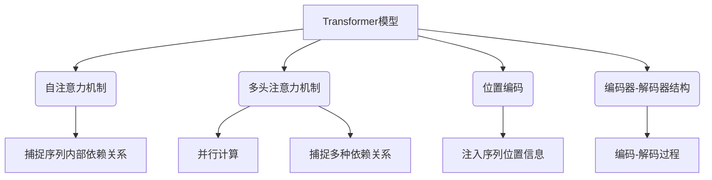

# 大规模语言模型从理论到实践：Transformer结构

## 1. 背景介绍

### 1.1 问题的由来

在自然语言处理(NLP)领域,传统的序列模型如RNN(循环神经网络)和LSTM(长短期记忆网络)在处理长序列时存在着计算效率低下和梯度消失/爆炸等问题。为了解决这些问题,Transformer模型应运而生。

Transformer是一种全新的基于注意力机制(Attention Mechanism)的序列到序列(Seq2Seq)模型,它完全摒弃了RNN和CNN(卷积神经网络)结构,使用了自注意力(Self-Attention)机制来捕捉输入序列中任意两个位置之间的依赖关系。

### 1.2 研究现状  

自2017年Transformer模型被提出以来,它在机器翻译、语音识别、文本生成等多个NLP任务上取得了卓越的表现,成为了NLP领域的主流模型结构。

随后,基于Transformer结构的大规模语言模型如BERT、GPT、XLNet等相继问世,在自然语言理解、生成等多个下游任务上展现出了强大的能力,推动了NLP技术的快速发展。

### 1.3 研究意义

深入理解Transformer模型的原理和实现细节,对于掌握大规模语言模型的本质至关重要。本文将全面解析Transformer模型的核心思想、关键组件、数学模型以及实现细节,为读者提供一个完整的理论和实践的结合,帮助读者从根本上把握大规模语言模型的本质。

### 1.4 本文结构

本文首先介绍Transformer模型的核心概念和基本原理,包括自注意力机制、多头注意力、位置编码等。然后详细阐述模型的数学表达,包括注意力计算、编码器/解码器结构等。接下来,通过实例代码讲解Transformer模型的实现细节。最后,探讨Transformer在实际应用中的场景,以及模型的优缺点和发展趋势。

## 2. 核心概念与联系

Transformer模型的核心思想是利用自注意力机制来捕捉输入序列中任意两个位置之间的依赖关系,从而避免了RNN的递归计算。

1. **自注意力机制(Self-Attention Mechanism)**: 通过计算查询(Query)与键(Key)之间的相似性,来确定查询对值(Value)的注意力权重。这种机制可以自动捕捉序列内部的长程依赖关系。

2. **多头注意力机制(Multi-Head Attention)**: 将注意力机制扩展为多个"头"(Head),每个头对应一个注意力机制,可以并行计算,从而提高计算效率。同时,不同头可以捕捉不同的依赖关系,增强模型的表达能力。

3. **位置编码(Positional Encoding)**: 由于Transformer模型没有递归结构,因此需要显式地注入序列的位置信息,以保证模型可以捕捉序列的顺序关系。

4. **编码器-解码器结构(Encoder-Decoder Architecture)**: Transformer模型由编码器(Encoder)和解码器(Decoder)两部分组成。编码器用于编码输入序列,解码器用于生成输出序列。两者之间通过注意力机制进行交互。

上述核心概念相互关联、环环相扣,共同构建了Transformer模型的基本框架。接下来,我们将详细阐述模型的数学表达和实现细节。

## 3. 核心算法原理 & 具体操作步骤

### 3.1 算法原理概述

Transformer模型的核心算法原理可以概括为以下几个关键步骤:

1. **输入嵌入(Input Embedding)**: 将输入序列(如文本序列)映射为向量表示。

2. **位置编码(Positional Encoding)**: 为每个位置添加位置信息,使模型能够捕捉序列的顺序关系。

3. **多头自注意力计算(Multi-Head Self-Attention)**: 在编码器和解码器中分别进行自注意力计算,捕捉输入序列和输出序列的内部依赖关系。

4. **编码器-解码器注意力(Encoder-Decoder Attention)**: 解码器对编码器的输出进行注意力计算,捕捉输入序列和输出序列之间的依赖关系。

5. **前馈神经网络(Feed-Forward Neural Network)**: 对注意力计算的结果进行非线性变换,提取更高层次的特征表示。

6. **输出层(Output Layer)**: 根据解码器的输出,生成目标序列(如翻译结果)。

上述步骤通过无监督的方式学习序列之间的依赖关系,从而实现序列到序列的转换任务。

### 3.2 算法步骤详解

#### 3.2.1 输入嵌入

将输入序列$X = (x_1, x_2, \dots, x_n)$映射为嵌入向量序列$E = (e_1, e_2, \dots, e_n)$,其中$e_i \in \mathbb{R}^{d_{model}}$是$x_i$的嵌入向量,维度为$d_{model}$。

#### 3.2.2 位置编码

为每个位置$i$计算位置编码向量$p_i \in \mathbb{R}^{d_{model}}$,并将其与嵌入向量$e_i$相加,得到含有位置信息的表示$z_i = e_i + p_i$。

位置编码向量$p_i$的计算公式为:

$$
p_i(2j) = \sin(i / 10000^{2j/d_{model}}) \\
p_i(2j+1) = \cos(i / 10000^{2j/d_{model}})
$$

其中$j$是维度索引,取值范围为$[0, d_{model}/2)$。

#### 3.2.3 多头自注意力

对于输入序列$Z = (z_1, z_2, \dots, z_n)$,多头自注意力计算过程如下:

1. 将$Z$线性映射为查询(Query)、键(Key)和值(Value)向量:

   $$
   Q = ZW^Q, K = ZW^K, V = ZW^V
   $$

   其中$W^Q, W^K, W^V \in \mathbb{R}^{d_{model} \times d_k}$是可学习的权重矩阵。

2. 计算注意力权重:

   $$
   \text{Attention}(Q, K, V) = \text{softmax}(\frac{QK^T}{\sqrt{d_k}})V
   $$

   其中$d_k$是缩放因子,用于防止内积过大导致梯度消失。

3. 多头注意力机制通过将注意力计算过程独立运行$h$次(即$h$个"头"),然后将结果拼接,最后通过线性变换得到最终的注意力表示:

   $$
   \text{MultiHead}(Q, K, V) = \text{Concat}(head_1, \dots, head_h)W^O
   $$

   其中$head_i = \text{Attention}(QW_i^Q, KW_i^K, VW_i^V)$,而$W_i^Q, W_i^K, W_i^V \in \mathbb{R}^{d_{model} \times d_k}$是每个头的可学习权重矩阵,$W^O \in \mathbb{R}^{hd_k \times d_{model}}$是输出权重矩阵。

#### 3.2.4 编码器-解码器注意力

解码器的自注意力计算过程与编码器类似,但需要遮掩(Masking)未来位置的信息,以保证每个位置的预测只依赖于当前和之前的输出。

解码器还需要对编码器的输出进行注意力计算,以捕捉输入序列和输出序列之间的依赖关系。这个过程与多头自注意力类似,只是查询(Query)来自解码器,而键(Key)和值(Value)来自编码器的输出。

#### 3.2.5 前馈神经网络

对注意力计算的结果进行非线性变换,提取更高层次的特征表示:

$$
\text{FFN}(x) = \max(0, xW_1 + b_1)W_2 + b_2
$$

其中$W_1 \in \mathbb{R}^{d_{model} \times d_{ff}}$,$W_2 \in \mathbb{R}^{d_{ff} \times d_{model}}$,$b_1 \in \mathbb{R}^{d_{ff}}$,$b_2 \in \mathbb{R}^{d_{model}}$是可学习的权重和偏置,而$d_{ff}$是前馈网络的隐层维度。

#### 3.2.6 输出层

根据解码器的输出,通过线性变换和softmax操作生成目标序列的概率分布:

$$
P(y_t|y_{<t}, X) = \text{softmax}(o_tW^O)
$$

其中$o_t$是解码器在时间步$t$的输出,$W^O \in \mathbb{R}^{d_{model} \times |V|}$是输出权重矩阵,而$|V|$是目标词表的大小。

### 3.3 算法优缺点

**优点:**

1. **并行计算**: 由于Transformer模型完全摒弃了RNN的递归结构,因此可以高效地并行计算,大大提高了计算效率。

2. **长程依赖捕捉**: 自注意力机制能够直接捕捉输入序列中任意两个位置之间的依赖关系,解决了RNN在处理长序列时存在的梯度消失/爆炸问题。

3. **灵活性**: Transformer模型的编码器-解码器结构可以轻松地应用于多种序列到序列的任务,如机器翻译、文本生成等。

**缺点:**

1. **计算复杂度高**: 自注意力机制需要计算查询与所有键的相似性,计算复杂度为$O(n^2d)$,其中$n$是序列长度,$d$是向量维度。当序列长度较大时,计算开销会急剧增加。

2. **缺乏位置信息**: Transformer模型本身无法捕捉序列的位置信息,需要显式地添加位置编码来注入位置信息。

3. **长序列性能下降**: 由于计算复杂度的限制,Transformer模型在处理超长序列时,性能会出现明显下降。

### 3.4 算法应用领域

Transformer模型及其变体已经广泛应用于自然语言处理的各个领域,包括但不限于:

- **机器翻译**: Transformer是目前机器翻译领域最先进的模型之一,在多种语言对上表现出色。

- **文本生成**: 基于Transformer的大型语言模型(如GPT)可以生成高质量、连贯性强的文本内容。

- **语音识别**: Transformer在语音识别任务中也展现出了优异的性能。

- **对话系统**: Transformer模型可以用于构建对话代理,生成自然的对话响应。

- **文本摘要**: Transformer可以对长文本进行摘要,提取关键信息。

- **自然语言理解**: 基于Transformer的预训练语言模型(如BERT)在多项自然语言理解任务上取得了最佳成绩。

除了NLP领域,Transformer模型及其变体也被应用于计算机视觉、推荐系统等其他领域。可以说,Transformer已经成为了人工智能领域的一个里程碑式的模型。

## 4. 数学模型和公式 & 详细讲解 & 举例说明

### 4.1 数学模型构建

Transformer模型的数学模型可以概括为以下几个关键组件:

1. **注意力机制(Attention Mechanism)**
2. **多头注意力(Multi-Head Attention)**
3. **编码器(Encoder)**
4. **解码器(Decoder)**

#### 4.1.1 注意力机制

注意力机制的核心思想是对输入序列中的每个元素赋予不同的权重,从而捕捉序列内部的依赖关系。具体来说,对于一个查询向量$q$和一组键向量$K = (k_1, k_2, \dots, k_n)$及对应的值向量$V = (v_1, v_2, \dots, v_n)$,注意力机制的计算过程如下:

1. 计算查询向量$q$与每个键向量$k_i$的相似度分数:

   $$
   s_i = f(q