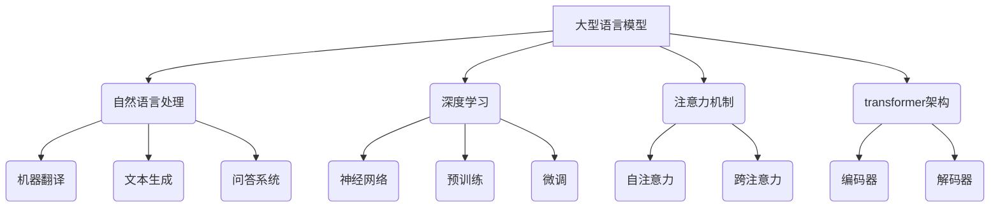

以下是根据您的要求撰写的技术博客文章正文内容：

# 大语言模型原理与工程实践：案例运行

## 1. 背景介绍

### 1.1 问题的由来

近年来,随着深度学习和人工智能技术的飞速发展,大型语言模型(Large Language Model, LLM)成为了自然语言处理领域的研究热点。这些模型通过在海量文本数据上进行预训练,学习丰富的语言知识和上下文信息,展现出令人惊叹的自然语言理解和生成能力。

然而,训练这种规模庞大的语言模型需要耗费大量的计算资源,而且对数据质量和模型优化算法也提出了更高的要求。此外,如何有效利用这些大型语言模型,将其应用到实际场景中,也是一个亟待解决的挑战。

### 1.2 研究现状  

目前,一些科技巨头和学术机构已经开发出多种大型语言模型,如OpenAI的GPT系列、谷歌的BERT、百度的ERNIE等。这些模型在自然语言理解、机器翻译、问答系统、文本生成等任务上表现出色。

与此同时,研究人员也在探索大型语言模型的理论基础、训练方法、模型压缩和部署等方面的新思路。例如,通过改进的注意力机制、参数高效编码等技术来提升模型性能;采用联邦学习等隐私保护技术来保护训练数据隐私;探索在移动设备等资源受限环境中部署大型模型的方案等。

### 1.3 研究意义

大型语言模型不仅在学术研究领域备受关注,更为重要的是其在工业界的广泛应用前景。通过掌握大型语言模型的核心原理和工程实践技术,我们可以:

1. 开发出更加智能和人性化的自然语言交互系统,如智能助手、客服机器人等,极大提升人机交互体验。

2. 构建高质量的文本生成系统,在内容创作、自动文案撰写、智能写作辅助等领域发挥重要作用。

3. 提升自然语言理解能力,为信息检索、知识图谱构建、舆情分析等任务提供强大支持。

4. 推动跨语言、跨领域的语义理解和知识迁移,促进不同领域的融合创新。

5. 探索人工智能系统的可解释性和可信赖性,推动人工智能技术的安全性和可控性。

总之,深入研究大型语言模型的原理和实践,对于推动自然语言处理技术的发展、促进人工智能在实际应用中的落地都具有重要意义。

### 1.4 本文结构

本文将全面介绍大型语言模型的核心原理、关键技术以及工程实践案例。具体来说,第2部分将阐述大型语言模型的核心概念和基本架构;第3部分重点讲解模型的核心算法原理和训练过程;第4部分将通过数学模型和公式深入解析模型的理论基础;第5部分将提供一个实际的工程实践案例,包括代码实现和运行结果分析;第6部分将介绍大型语言模型在不同领域的应用场景;第7部分将为读者推荐相关的学习资源和开发工具;最后第8部分将总结研究成果,并展望未来的发展趋势和面临的挑战。

## 2. 核心概念与联系

大型语言模型(Large Language Model, LLM)是一种基于深度学习技术的自然语言处理模型。它融合了多种关键概念和技术,包括:

1. **自然语言处理(NLP)**: 大型语言模型旨在解决自然语言处理中的各种任务,如机器翻译、文本生成、问答系统等。

2. **深度学习**: 大型语言模型通常采用深度神经网络结构,通过预训练和微调等技术来学习语言知识和上下文信息。

3. **注意力机制**: 注意力机制是大型语言模型的核心技术之一,包括自注意力和跨注意力两种形式,用于捕捉序列数据中的长程依赖关系。

4. **Transformer架构**: Transformer是一种全新的基于注意力机制的序列到序列模型架构,广泛应用于大型语言模型中。它包括编码器和解码器两个主要组件。

通过将上述概念和技术有机结合,大型语言模型展现出了强大的自然语言理解和生成能力,成为当前自然语言处理领域的研究热点和发展趋势。

## 3. 核心算法原理 & 具体操作步骤  

### 3.1 算法原理概述

大型语言模型的核心算法原理主要基于Transformer架构和自注意力机制。Transformer是一种全新的基于注意力机制的序列到序列模型,它完全摒弃了传统的循环神经网络和卷积神经网络结构,而是通过自注意力机制来捕捉输入序列中任意两个位置之间的长程依赖关系。

Transformer的主要创新点在于引入了多头自注意力(Multi-Head Self-Attention)机制,它允许模型同时关注输入序列中的不同位置,从而更好地捕捉序列的上下文信息。此外,Transformer还采用了位置编码(Positional Encoding)技术,用于注入序列的位置信息,从而使模型能够区分不同位置的输入。

在训练过程中,大型语言模型通常采用自监督学习(Self-Supervised Learning)的方式进行预训练。具体来说,模型会在大规模的文本语料库上学习下一个词的预测任务,从而获取丰富的语言知识和上下文信息。预训练完成后,模型可以进一步针对特定的下游任务(如机器翻译、文本生成等)进行微调(Fine-tuning),以提高在该任务上的性能表现。

### 3.2 算法步骤详解

大型语言模型的训练过程可以概括为以下几个主要步骤:

1. **数据预处理**: 首先需要对原始文本数据进行清洗、标记化、构建词表等预处理操作,以准备高质量的训练数据。

2. **模型初始化**: 根据预定义的模型架构(如Transformer)和超参数,初始化模型的权重参数。

3. **位置编码**: 为输入序列的每个位置添加位置编码,以注入位置信息。

4. **前向传播**: 将embedding后的输入序列输入到Transformer编码器中,通过多层的多头自注意力和前馈神经网络层,计算出序列的上下文表示。

5. **掩码语言模型损失**: 根据预训练任务(如掩码语言模型MLM),计算模型预测和真实标签之间的损失函数。

6. **反向传播**: 通过反向传播算法,计算损失函数相对于模型参数的梯度,并更新模型参数。

7. **模型评估**: 在验证集上评估模型的性能指标,如困惑度(Perplexity)、BLEU分数等。

8. **模型微调**(可选): 对于特定的下游任务,可以在预训练模型的基础上进行进一步的微调,以提高在该任务上的性能表现。

上述步骤通常需要在大规模的语料库上反复迭代训练,直到模型收敛或达到预期的性能水平。

### 3.3 算法优缺点

大型语言模型基于Transformer架构和自注意力机制的算法具有以下优缺点:

**优点**:

1. **长程依赖建模能力强**: 自注意力机制能够有效捕捉输入序列中任意两个位置之间的长程依赖关系,克服了传统RNN结构的梯度消失/爆炸问题。

2. **并行计算效率高**: Transformer的结构完全基于注意力机制,可以有效利用现代硬件(如GPU)的并行计算能力,加速训练过程。

3. **捕捉上下文信息能力强**: 通过预训练任务(如MLM)和位置编码技术,模型能够学习丰富的语言知识和上下文信息。

4. **适用于多种任务**: 预训练的大型语言模型可以通过微调的方式迁移到多种下游任务中,展现出强大的泛化能力。

**缺点**:

1. **计算资源需求高**: 训练大型语言模型需要消耗大量的计算资源(GPU/TPU)和存储资源,对硬件设施要求较高。

2. **长序列处理能力有限**: 由于注意力机制的计算复杂度与序列长度的平方成正比,导致模型难以处理极长的序列输入。

3. **缺乏显式的结构化知识**: 大型语言模型主要依赖于从数据中学习隐式的语言知识,缺乏对显式的结构化知识(如知识图谱)的利用。

4. **可解释性较差**: 由于模型内部的注意力机制和参数交互较为复杂,导致其预测结果的可解释性较差。

### 3.4 算法应用领域

基于Transformer架构和自注意力机制的大型语言模型已经在多个自然语言处理领域展现出卓越的性能表现,主要应用领域包括但不限于:

1. **机器翻译**: 将一种自然语言转换为另一种自然语言,如谷歌翻译、微软翻译等。

2. **文本生成**: 根据给定的上下文或提示,自动生成连贯、流畅的自然语言文本,如新闻自动撰写、创作辅助等。

3. **问答系统**: 基于给定的问题和背景知识,生成相应的答案,如智能助手、客服机器人等。

4. **文本摘要**: 自动生成针对长文本的简明摘要,用于信息检索、新闻聚合等场景。

5. **情感分析**: 分析给定文本的情感倾向(如正面、负面等),用于舆情监测、用户体验分析等。

6. **实体识别**: 从文本中识别出命名实体(如人名、地名、组织机构名等),为知识图谱构建等任务提供支持。

7. **对话系统**: 基于上下文对话历史,生成自然、连贯的机器回复,实现人机对话交互。

8. **语言理解基准测试**: 通过设计特定的语言理解任务,评估大型语言模型的理解和推理能力。

总的来说,大型语言模型凭借其强大的自然语言处理能力,在多个领域展现出广阔的应用前景,正在推动人工智能技术在实际场景中的落地。

## 4. 数学模型和公式 & 详细讲解 & 举例说明

### 4.1 数学模型构建

为了更好地理解大型语言模型的核心原理,我们需要从数学模型的角度对其进行建模和分析。在这里,我们将基于Transformer架构和自注意力机制,构建大型语言模型的数学模型。

假设输入序列为 $X = (x_1, x_2, \dots, x_n)$,其中 $x_i$ 表示第 $i$ 个词的embedding向量。我们的目标是学习一个模型 $f$,能够根据输入序列 $X$ 预测下一个词 $y$,即 $y = f(X)$。

在Transformer架构中,模型 $f$ 主要由编码器(Encoder)和解码器(Decoder)两个部分组成。编码器负责捕捉输入序列 $X$ 的上下文信息,生成序列的表示 $C$;解码器则基于编码器的输出 $C$ 和前一个预测的词 $y_{t-1}$,预测下一个词 $y_t$。

具体来说,编码器的计算过程可以表示为:

$$C = \text{Encoder}(X) = \text{LayerNorm}(\text{FFN}(\text{SelfAttn}(X)))$$

其中,SelfAttn表示自注意力层,FFN表示前馈神经网络层,LayerNorm表示层归一化操作。自注意力层的计算公式为:

$$\