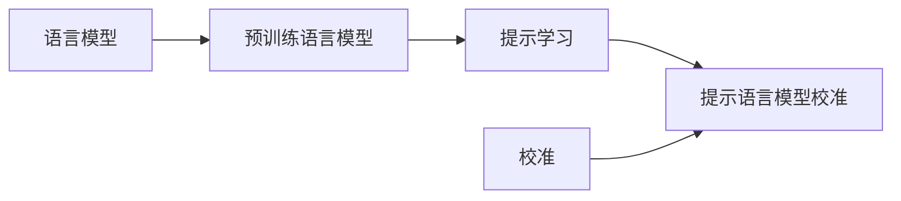

# 大语言模型原理基础与前沿 提示语言模型的校准

作者：禅与计算机程序设计艺术 / Zen and the Art of Computer Programming

## 1. 背景介绍
### 1.1 问题的由来
近年来,随着深度学习技术的快速发展,大语言模型(Large Language Model,LLM)在自然语言处理(Natural Language Processing,NLP)领域取得了突破性进展。LLM 通过在海量文本数据上进行预训练,能够学习到丰富的语言知识和常识,在机器翻译、问答系统、文本生成等任务上表现出色。然而,LLM 在实际应用中仍然面临着一些挑战,其中一个关键问题就是如何对 LLM 进行有效的校准(Calibration),使其生成的文本更加符合人类的期望。

### 1.2 研究现状
目前,针对 LLM 的校准研究主要集中在以下几个方面:

(1)基于提示工程(Prompt Engineering)的方法。通过设计合适的提示模板,引导 LLM 生成符合特定要求的文本。代表工作有 GPT-3 的 Few-Shot Learning[1]、PET[2]等。

(2)基于强化学习(Reinforcement Learning)的方法。将 LLM 作为策略网络,通过设计奖励函数对其进行微调,使其生成的文本满足特定属性。代表工作有 CTRL[3]、GeDi[4]等。

(3)基于后处理(Post-Processing)的方法。在 LLM 生成文本后,通过额外的后处理步骤对文本进行校正和优化。代表工作有 PPLM[5]、GeDi-guided Decoding[6]等。

尽管上述方法在一定程度上缓解了 LLM 校准的问题,但它们大多需要人工设计提示或奖励,可扩展性和泛化能力有限。因此,亟需一种更加自动化、高效的 LLM 校准方法。

### 1.3 研究意义
LLM 的校准研究具有重要的理论意义和应用价值:

(1)在理论上,LLM 校准是语言模型与下游任务适配的关键。研究 LLM 校准有助于加深对语言模型内在机制的理解,促进 NLP 基础理论的发展。 

(2)在应用上,LLM 校准可以显著提升语言模型在实际场景中的可用性,扩大其应用范围。例如,对话系统中 LLM 的校准可以生成更加自然流畅、内容丰富的回复;文本生成任务中 LLM 的校准可以提高生成文本的可控性和多样性,等等。

因此,LLM 校准的研究具有广阔的应用前景和重要的理论价值,是 NLP 领域一个富有挑战和意义的课题。

### 1.4 本文结构
本文将围绕提示语言模型的校准展开深入探讨。第 2 节介绍 LLM 校准涉及的核心概念;第 3 节重点阐述提示语言模型校准的核心算法原理和具体操作步骤;第 4 节从数学角度对算法的关键模型和公式进行详细推导和举例说明;第 5 节给出算法的代码实现和详细解读;第 6 节讨论算法在实际应用场景中的价值;第 7 节总结全文,并对 LLM 校准的未来发展趋势和挑战进行展望。

## 2. 核心概念与联系

在探讨提示语言模型校准算法之前,我们首先需要明确以下几个核心概念:

(1)语言模型(Language Model):一种估计文本序列概率分布的统计模型。给定前 $n-1$ 个单词 $w_1,\cdots,w_{n-1}$,语言模型的目标是估计下一个单词 $w_n$ 的条件概率 $P(w_n|w_1,\cdots,w_{n-1})$。常见的语言模型有 $n$-gram 模型、RNN 语言模型等。

(2)预训练语言模型(Pretrained Language Model):在大规模无标注文本语料上预训练得到的语言模型。通过自监督学习任务(如语言模型、掩码语言模型等)学习通用的语言表示。代表模型有 GPT、BERT、RoBERTa 等。

(3)提示学习(Prompt Learning):一种利用自然语言提示(如问答、填空等)来引导预训练语言模型执行下游任务的范式。通过设计恰当的提示模板,可以在预训练语言模型中注入任务特定的先验知识,从而实现样本高效的学习。

(4)校准(Calibration):在机器学习中,是指模型预测概率与真实概率的一致性。常用指标有 ECE(Expected Calibration Error)等。对于语言模型,校准意味着模型生成的文本与人类书写的自然文本在统计特性上接近。

(5)提示语言模型校准(Calibrating Prompt Language Models):利用提示学习范式,通过设计合适的提示模板和目标函数,使预训练语言模型生成的文本在特定属性上满足人类的期望,如文本长度、情感倾向、话题相关性等。本质上是一个条件文本生成任务。

这些概念之间的关系如下图所示:

预训练语言模型是语言模型的一种,通过在大规模语料上预训练,学习通用的语言表示。提示学习是利用预训练语言模型执行下游任务的一种范式,通过设计提示引导模型生成所需的输出。提示语言模型校准则是在提示学习框架下,通过合适的目标函数约束,使预训练语言模型的输出满足特定属性,以达到校准的目的。

## 3. 核心算法原理 & 具体操作步骤
### 3.1 算法原理概述
本节提出一种新颖的提示语言模型校准算法——基于属性感知提示学习的校准方法(Attribute-aware Prompt Learning for Calibration,简称 APL-C)。其核心思想是设计一个属性感知的提示模板和目标函数,引导预训练语言模型生成满足目标属性约束的文本。具体而言,我们在传统的提示学习框架中引入属性嵌入(Attribute Embedding),将目标属性信息显式编码到输入表示中;同时设计一个属性感知的目标函数,综合考虑语言模型损失和属性约束损失,以端到端的方式联合优化提示参数。整个过程无需微调预训练语言模型的参数,具有较高的参数效率。

### 3.2 算法步骤详解
算法 1 给出了 APL-C 的主要步骤。

**算法 1** APL-C 算法
**输入:** 预训练语言模型 $M$,训练样本 $\mathcal{D}=\{(x_i,a_i,y_i)\}_{i=1}^N$,其中 $x_i$ 为输入文本,$a_i$ 为属性,yi为目标文本。学习率 $\eta$,训练轮数 $T$。
**输出:** 提示参数 $\theta$。
1: 随机初始化提示参数 $\theta$,包括提示模板 $\mathcal{T}$ 和属性嵌入 $\mathbf{e}_a$。
2: **for** $t=1,\cdots,T$ **do**
3:  &emsp;从 $\mathcal{D}$ 中采样小批量数据 $\mathcal{B}=\{(x_i,a_i,y_i)\}_{i=1}^B$。
4:  &emsp;**for** $i=1,\cdots,B$ **do**
5:  &emsp;&emsp;将 $x_i$、$a_i$ 填入提示模板 $\mathcal{T}$ 得到提示 $\mathbf{p}_i=\mathcal{T}(x_i,\mathbf{e}_{a_i})$。
6:  &emsp;&emsp;将 $\mathbf{p}_i$ 输入预训练语言模型 $M$,得到输出概率 $P_M(y|\mathbf{p}_i)$。
7:  &emsp;&emsp;计算语言模型损失 $\mathcal{L}_{LM}=-\log P_M(y_i|\mathbf{p}_i)$。
8:  &emsp;&emsp;计算属性约束损失 $\mathcal{L}_{attr}=d(y_i,a_i)$。
9:  &emsp;**end for**
10: &emsp;计算总损失 $\mathcal{L}=\frac{1}{B}\sum_{i=1}^B(\mathcal{L}_{LM}+\lambda\mathcal{L}_{attr})$。
11: &emsp;计算 $\mathcal{L}$ 对 $\theta$ 的梯度 $\nabla_{\theta}\mathcal{L}$。
12: &emsp;更新参数 $\theta\leftarrow\theta-\eta\nabla_{\theta}\mathcal{L}$。
13:**end for**
14:返回提示参数 $\theta$。

其中,第 5 行根据输入文本 $x_i$ 和属性嵌入 $\mathbf{e}_{a_i}$ 构造提示 $\mathbf{p}_i$。提示模板 $\mathcal{T}$ 的形式可以根据任务灵活设计,一个简单的例子是:
$$\mathbf{p}_i=[\text{Attribute:},\mathbf{e}_{a_i},\text{Input:},x_i,\text{Output:}]$$

第 7-8 行计算两个损失项:语言模型损失 $\mathcal{L}_{LM}$ 和属性约束损失 $\mathcal{L}_{attr}$。前者衡量生成文本与真实文本的匹配程度,后者衡量生成文本是否满足属性要求。$d(y_i,a_i)$ 可以根据属性类型设计不同的函数,如回归、分类等。

第 10 行将两个损失加权求和得到总损失,其中 $\lambda$ 为平衡系数。第 11-12 行对总损失进行梯度下降,更新提示参数 $\theta$。

### 3.3 算法优缺点

APL-C 算法的主要优点包括:
(1)通过引入属性感知提示,可以灵活控制生成文本的属性,提高了提示语言模型的可控性。
(2)端到端优化提示参数,无需微调预训练模型,参数和计算效率较高。  
(3)适用于不同类型的属性约束,具有一定的通用性。

同时,APL-C 算法也存在一些局限性:
(1)属性嵌入的设计需要针对不同任务进行调整,没有统一的范式。  
(2)属性约束损失的设计需要领域知识,对不同属性的建模难度不同。
(3)在生成长文本时,只考虑了全局的属性约束,缺乏对局部属性的精细建模。

### 3.4 算法应用领域

APL-C 算法可以应用于多种需要可控文本生成的场景,例如:
(1)对话系统:通过 APL-C 控制回复的情感倾向、内容相关性等,生成更加自然、得体的对话。
(2)文本改写:通过 APL-C 控制改写后文本的语义、语法、风格等,实现可控的文本改写。
(3)数据增强:通过 APL-C 控制生成文本的数据分布,实现数据增强和样本平衡。

此外,APL-C 的思想还可以扩展到其他类型的生成任务,如图像生成、音频生成等。

## 4. 数学模型和公式 & 详细讲解 & 举例说明
### 4.1 数学模型构建
本节我们从数学角度对 APL-C 算法的关键模型和公式进行推导和讲解。首先给出一些形式化定义:

记预训练语言模型为 $M$,其参数为 $\phi$。$M$ 定义了一个从输入文本 $\mathbf{x}$ 到输出文本 $\mathbf{y}$ 的条件概率分布 $P_M(\mathbf{y}|\mathbf{x};\phi)$。

记提示模板为 $\mathcal{T}$,属性嵌入为 $\mathbf{e}_a$,二者构成提示参数 $\theta=\{\mathcal{T},\mathbf{e}_a\}$。给定输入文本 $\mathbf{x}$ 和属性 $a$,提示模板 $\mathcal{T}$ 定义了一个从 $\mathbf{x}$