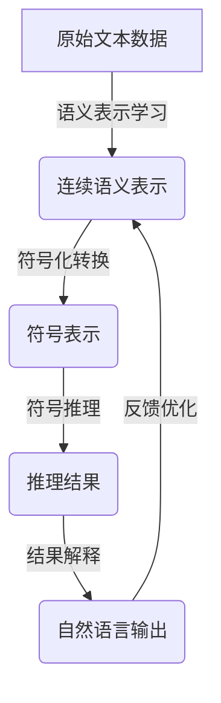

# 大语言模型应用指南：Algorithm-of-Thought

## 1. 背景介绍

### 1.1 问题的由来

在过去几年中,大型语言模型(Large Language Models, LLMs)在自然语言处理(NLP)领域取得了令人瞩目的进展。这些模型通过在海量文本数据上进行预训练,学习了丰富的语言知识和上下文信息,展现出惊人的语言生成和理解能力。

然而,尽管取得了卓越的成绩,现有的大型语言模型仍然存在一些局限性和挑战。首先,这些模型缺乏对语义和逻辑推理的深入理解,往往只是在语言层面上进行模式匹配和文本生成,而无法真正理解语义内涵。其次,现有模型通常是基于统计学习的,缺乏明确的因果推理和解释能力,难以解释模型的决策过程。此外,大型语言模型通常需要消耗大量的计算资源,导致了高昂的训练和推理成本。

为了解决这些问题,研究人员提出了一种新的范式,即"Algorithm-of-Thought"(AoT)。AoT旨在将符号推理与连续表示相结合,构建具有显式推理能力的新一代语言智能系统。通过将语言理解与形式化推理相结合,AoT有望实现更强大的语义理解、逻辑推理和解释能力,从而推动人工智能系统向真正的"通用人工智能"(Artificial General Intelligence, AGI)迈进。

### 1.2 研究现状

近年来,AoT范式受到了广泛关注,多个顶尖研究机构都在积极探索这一领域。例如,OpenAI提出了"Constitutent"模型,旨在将语言理解与符号推理相结合。DeepMind则提出了"Gated Transformer-Calculus"模型,试图将神经网络与符号推理相融合。此外,斯坦福大学、麻省理工学院等知名高校也在开展相关研究。

尽管取得了一些初步进展,但AoT范式仍处于起步阶段,面临着诸多挑战和难题。首先,如何有效地将连续表示与符号推理相结合,构建一个统一的框架,是一个关键问题。其次,如何设计高效的推理算法,在保证推理能力的同时,控制计算复杂度,也是一个重大挑战。此外,如何为AoT系统提供足够的先验知识和常识推理能力,以及如何评估和解释这类系统的推理过程,都是亟待解决的问题。

### 1.3 研究意义

AoT范式的研究具有重要的理论意义和应用价值。从理论层面来看,AoT有望揭示语言理解和推理的本质,为构建真正的"通用人工智能"奠定基础。从应用层面来看,AoT系统有望在诸多领域发挥重要作用,如自动问答、智能辅助决策、自动推理和证明等。

此外,AoT研究也将推动人工智能系统向可解释性和可信赖性迈进。传统的深度学习模型往往是一个"黑箱",难以解释其决策过程,这在一定程度上限制了其在关键领域的应用。相比之下,AoT系统通过显式的推理过程,能够提供更透明、更可解释的决策,从而提高人工智能系统的可信赖性和可解释性。

### 1.4 本文结构

本文将全面介绍AoT范式的核心理念、关键技术和应用前景。我们将从AoT的基本概念出发,阐述其与传统语言模型的区别和联系。接下来,我们将重点介绍AoT的核心算法原理,包括符号推理、连续表示融合等关键技术。然后,我们将探讨AoT在数学推理、自然语言理解等领域的应用,并给出具体的案例分析。最后,我们将总结AoT的发展趋势和面临的挑战,并对未来的研究方向进行展望。

## 2. 核心概念与联系

AoT(Algorithm-of-Thought)是一种将符号推理与连续表示相结合的新型语言智能范式。它旨在构建具有显式推理能力的智能系统,以克服现有语言模型的局限性。

传统的语言模型,如BERT、GPT等,主要基于统计学习和连续表示,缺乏对语义和逻辑的深入理解。这些模型通过在大规模语料库上进行预训练,学习语言的统计规律和上下文信息,从而实现文本生成和理解。然而,这种方法存在一些固有的局限性,如缺乏解释能力、推理能力有限、难以捕捉复杂的语义和逻辑关系等。

相比之下,AoT范式试图将符号推理与连续表示相结合,构建一种新型的语言智能系统。符号推理是基于形式化的规则和逻辑,能够对复杂的语义和逻辑关系进行精确的推理和推导。而连续表示则能够捕捉语言的统计规律和上下文信息,为推理过程提供有力支持。

通过将这两者相结合,AoT系统有望实现更强大的语言理解和推理能力。一方面,它可以利用连续表示来捕捉语言的统计特征和上下文信息,为推理过程提供有力支持。另一方面,它可以通过符号推理来精确地捕捉语义和逻辑关系,实现更深入的语义理解和复杂推理。

值得注意的是,AoT并非完全否定传统语言模型的作用,而是试图在其基础上进行改进和扩展。事实上,许多AoT系统都会利用预训练语言模型作为基础,并在此基础上引入符号推理模块,实现连续表示与符号推理的融合。

总的来说,AoT范式为语言智能系统带来了新的发展方向和机遇。它有望推动人工智能系统向真正的"通用人工智能"迈进,实现更强大的语言理解、推理和解释能力。

## 3. 核心算法原理 & 具体操作步骤

### 3.1 算法原理概述

AoT范式的核心算法原理是将符号推理与连续表示相结合,构建一种新型的语言智能系统。具体来说,该算法包括以下几个关键步骤:

1. **语义表示学习**:首先,算法需要从原始文本数据中学习语义表示,即将文本映射到连续的向量空间中。这通常是通过预训练语言模型(如BERT、GPT等)来实现的。

2. **符号化转换**:接下来,算法需要将连续的语义表示转换为符号形式,以便进行符号推理。这可以通过设计特定的规则或模型来实现。

3. **符号推理**:在获得符号化表示后,算法可以基于形式化的规则和逻辑,对符号进行推理和推导,以捕捉复杂的语义和逻辑关系。

4. **结果解释**:推理过程的结果需要被解释和翻译,以便于人类或下游任务进行理解和利用。这可以通过将符号表示转换回连续表示,并生成自然语言输出来实现。

5. **反馈优化**:算法可以利用推理结果和人类反馈,对语义表示、符号化转换规则和推理模块进行优化和改进,形成一个闭环的学习过程。

该算法的核心思想是利用连续表示来捕捉语言的统计特征和上下文信息,同时利用符号推理来精确地捕捉语义和逻辑关系,从而实现更强大的语言理解和推理能力。

### 3.2 算法步骤详解

接下来,我们将详细介绍AoT算法的每个步骤。

#### 3.2.1 语义表示学习

语义表示学习的目标是从原始文本数据中学习连续的语义表示,即将文本映射到连续的向量空间中。这通常是通过预训练语言模型(如BERT、GPT等)来实现的。

预训练语言模型通过在大规模语料库上进行自监督学习,学习文本的统计特征和上下文信息。具体来说,它们通常采用自编码器或自回归模型的架构,对文本进行掩码预测或下一词预测等任务,从而学习文本的语义表示。

学习到的语义表示通常是一个连续的向量,它能够捕捉文本的语义信息和上下文信息。例如,在BERT模型中,每个单词都被映射到一个固定长度的向量,这个向量编码了该单词在特定上下文中的语义信息。

语义表示学习是AoT算法的基础,它为后续的符号化转换和推理过程提供了重要的语义信息。

#### 3.2.2 符号化转换

符号化转换的目标是将连续的语义表示转换为符号形式,以便进行符号推理。这是一个将连续表示与符号推理相结合的关键步骤。

符号化转换可以通过设计特定的规则或模型来实现。一种常见的方法是基于语义相似性来聚类连续表示,将每个聚类视为一个符号。另一种方法是利用注意力机制,将连续表示映射到一组预定义的符号上。

无论采用何种方法,符号化转换都需要平衡表示能力和计算复杂度。一方面,符号表示需要足够丰富,以捕捉语言的复杂语义和逻辑关系。另一方面,符号集合的大小也不能过大,否则会导致计算复杂度急剧增加。

值得注意的是,符号化转换过程并不是一蹴而就的,它可能需要多次迭代和优化。算法可以利用推理结果和人类反馈,不断调整和改进符号化转换规则,以获得更好的符号表示。

#### 3.2.3 符号推理

在获得符号化表示后,算法可以基于形式化的规则和逻辑,对符号进行推理和推导,以捕捉复杂的语义和逻辑关系。

符号推理通常涉及多种技术,如逻辑规则推理、图搜索、约束求解等。具体的推理方法取决于应用场景和任务需求。

例如,在自然语言推理任务中,算法可以利用一阶逻辑规则对语句进行推理,推导出新的语义信息。在数学推理任务中,算法可以利用符号计算和等式变换规则,对数学表达式进行推导和简化。

符号推理的关键在于设计高效的推理算法,在保证推理能力的同时,控制计算复杂度。一种常见的优化方法是利用启发式搜索和剪枝技术,减少搜索空间和计算开销。

另一个重要的考虑因素是推理的可解释性。符号推理过程应该是透明和可解释的,以便于人类或下游任务理解和验证推理过程。这对于提高人工智能系统的可信赖性和可解释性至关重要。

#### 3.2.4 结果解释

推理过程的结果需要被解释和翻译,以便于人类或下游任务进行理解和利用。这可以通过将符号表示转换回连续表示,并生成自然语言输出来实现。

结果解释通常涉及两个步骤:首先,将推理结果从符号形式转换回连续表示;其次,利用语言生成模型(如GPT等)将连续表示转换为自然语言输出。

在将符号表示转换回连续表示时,可以采用与符号化转换相反的方法。例如,如果符号化转换是基于聚类的,那么就可以将每个符号映射回其对应的聚类中心向量。

在生成自然语言输出时,语言生成模型需要捕捉输出文本的语法、语义和上下文信息,以生成流畅、连贯的自然语言。这通常需要在大规模语料库上进行预训练,以学习语言的统计规律。

结果解释是将AoT算法的推理结果与人类或下游任务相连接的关键环节。一个高质量的结果解释不仅能够准确地传达推理结果的语义,还能够提供必要的解释和说明,