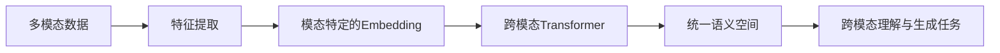

# 大语言模型应用指南：什么是多模态

## 1. 背景介绍
### 1.1 问题的由来
在人工智能的发展历程中,大语言模型(Large Language Models, LLMs)的出现标志着自然语言处理(Natural Language Processing, NLP)领域取得了重大突破。LLMs能够理解和生成接近人类水平的自然语言,在问答、对话、文本生成等任务上展现出了惊人的性能。然而,人类的交流和认知过程不仅仅局限于文本,还涉及视觉、语音等多种模态信息。为了让AI系统能够更全面地理解和交互with the world,学界和业界开始探索将多模态信息融入大语言模型,发展多模态大语言模型(Multimodal Large Language Models, MLLMs)。

### 1.2 研究现状
目前,多模态大语言模型的研究还处于起步阶段,但已经涌现出一些代表性的工作:
- OpenAI的DALL·E和CLIP模型实现了图像到文本、文本到图像的跨模态生成和检索。  
- DeepMind的Flamingo模型可以根据图像-文本对进行few-shot学习,在视觉问答等任务上取得了不错的效果。
- 微软的Florence模型将图像、视频、音频等多模态数据预训练到统一的语言模型中,展现出广泛的跨模态理解和生成能力。

### 1.3 研究意义
发展多模态大语言模型具有重要的理论和应用价值:
1. 从认知科学的角度看,MLLMs为探索人类多模态学习和推理机制提供了新的视角和工具。
2. 在实际应用中,MLLMs有望用于构建更加智能、自然的人机交互系统,如多模态对话、视觉问答、图像编辑等。
3. MLLMs的进一步发展将推动人工智能在更广泛领域的应用,如医疗诊断、教育、娱乐等。

### 1.4 本文结构
本文将围绕以下内容展开论述:
- 介绍多模态大语言模型的核心概念和技术原理
- 系统阐述MLLMs的关键算法、数学模型和实现细节 
- 总结MLLMs的应用现状、发展趋势和面临的挑战
- 为感兴趣的读者提供学习资源和实践指南

## 2. 核心概念与联系
多模态大语言模型的核心是将不同模态的数据映射到一个统一的语义空间,并利用自监督学习从海量数据中习得通用的跨模态表示和生成能力。其中涉及的关键概念包括:

- 多模态学习(Multimodal Learning):旨在处理和关联来自多种信息源的数据,挖掘不同模态数据之间的互补和关联信息,形成更全面、准确的认知。常见的模态包括文本、图像、语音、视频等。

- 语义嵌入空间(Semantic Embedding Space):将不同模态数据映射为相同维度的实值向量表示,使得语义相似的数据在该空间中距离较近。高质量的语义嵌入空间是实现跨模态理解和生成的基础。

- 自监督学习(Self-supervised Learning):无需人工标注大量数据,而是通过设计巧妙的预测任务,让模型从数据本身学习到有用的表示。在 MLLM 中,常见的自监督任务包括掩码语言建模、图文匹配、视频-文本对齐等。

- Transformer 架构:当前大语言模型的主流架构,擅长捕捉长距离依赖关系。MLLMs 在 Transformer 的基础上引入了处理多模态数据的模块,如视觉 Transformer、语音 Transformer 等。

下图概括了多模态大语言模型的核心组件及其关系:

## 3. 核心算法原理 & 具体操作步骤
### 3.1 算法原理概述
多模态大语言模型的训练过程通常包括两个阶段:预训练和微调。

在预训练阶段,模型在大规模多模态语料上进行自监督学习,旨在掌握通用的跨模态表示能力。主要采用的方法有:
- 掩码语言建模:随机遮掩输入文本的部分词元,让模型根据上下文和其他模态线索预测被遮掩词元。
- 图文匹配:给定图像-文本对,让模型判断它们是否语义匹配。
- 视频-文本对齐:让模型预测视频帧与文本描述之间的对应关系。

在微调阶段,将预训练模型应用于下游任务,通过少量标注数据进行监督学习,使其适应特定任务。

### 3.2 算法步骤详解
以图文匹配任务为例,详细说明多模态大语言模型的训练步骤:
1. 数据准备:收集大量图像-文本对作为训练语料,图像可以是物体、场景、人物等,文本可以是图像的标题、描述、问答等。

2. 图像编码:使用预训练的视觉模型(如 Vision Transformer)将图像转换为固定长度的特征向量。设输入图像为 $I$,得到的特征为 $v=VisionTransformer(I)$。

3. 文本编码:使用预训练的语言模型(如 BERT)将文本转换为固定长度的特征向量。设输入文本为 $T$,得到的特征为 $w=BERT(T)$。

4. 对齐学习:将图像特征 $v$ 和文本特征 $w$ 输入到对齐模块中,学习它们在公共语义空间中的表示。常用的对齐模块有:
   - 点积对齐:$s(I,T)=v^Tw$
   - 双线性对齐:$s(I,T)=v^TM_bw$,其中 $M_b$ 是可学习的双线性矩阵
   - MLP对齐:$s(I,T)=MLP([v,w])$,其中 $[·]$ 表示拼接操作

5. 损失函数:使用对比学习损失函数,最大化匹配图文对的对齐分数,最小化不匹配对的分数。常用的损失函数有:
   - InfoNCE损失:$L=-log\frac{exp(s(I,T))}{\sum_{T'}exp(s(I,T'))}$
   - 三元组损失:$L=max(0,\alpha-s(I,T)+s(I,T'))$

6. 优化训练:使用梯度下降法优化模型参数,最小化损失函数。常用的优化器有 Adam、AdamW 等。

### 3.3 算法优缺点
多模态大语言模型的主要优点包括:
- 通过自监督学习,可以充分利用大规模无标注数据,减少对人工标注的依赖。
- 学习到的跨模态表示具有较好的泛化性,可以迁移到各种下游任务中。
- 统一的语义空间有利于实现跨模态的理解、检索和生成。

主要缺点包括:  
- 模型参数量巨大,训练和推理成本高。
- 对低质量、有偏的数据较为敏感,可能放大数据中的偏见。
- 跨模态对齐仍然是一个挑战性问题,需要更多的研究来提高准确性和鲁棒性。

### 3.4 算法应用领域
多模态大语言模型可以应用于以下领域:
- 跨模态检索:根据文本查找相关的图像、视频,或根据图像、视频查找相关的文本。
- 跨模态问答:根据图像、视频回答自然语言问题,或根据文本描述生成相关的图像、视频。
- 多模态对话:理解和生成包含文本、图像、语音等多模态信息的对话。
- 多模态内容创作:根据文本描述自动生成图像、视频,或根据图像、视频自动生成文本描述。

## 4. 数学模型和公式 & 详细讲解 & 举例说明
### 4.1 数学模型构建
多模态大语言模型的数学基础是将不同模态数据映射到公共语义空间,并通过自监督学习目标来优化跨模态表示。以图文匹配任务为例,给出其数学模型。

设输入的图像-文本对为 $(I,T)$,其中图像 $I$ 由视觉模型编码为特征向量 $v\in\mathbb{R}^{d_v}$,文本 $T$ 由语言模型编码为特征向量 $w\in\mathbb{R}^{d_w}$。我们希望学习一个对齐函数 $f:\mathbb{R}^{d_v}\times\mathbb{R}^{d_w}\to\mathbb{R}$,使得匹配的图文对得分高,不匹配的图文对得分低。

常用的对齐函数形式包括:
1. 点积对齐:$f(v,w)=v^Tw$
2. 双线性对齐:$f(v,w)=v^TM_bw$,其中 $M_b\in\mathbb{R}^{d_v\times d_w}$ 是可学习的双线性矩阵
3. MLP对齐:$f(v,w)=MLP([v,w])$,其中 $MLP$ 是多层感知机,[·]表示拼接操作

对于一个训练样本 $(I,T)$,我们使用InfoNCE损失函数来优化对齐函数:

$$
L(I,T)=-log\frac{exp(f(v,w))}{\sum_{T'\in\mathcal{T}}exp(f(v,w'))}
$$

其中 $\mathcal{T}$ 是包含正样本 $T$ 和负样本 $T'$ 的文本集合。这个损失函数的目标是最大化正样本的对齐分数,同时最小化负样本的分数。

### 4.2 公式推导过程
以点积对齐为例,推导 InfoNCE 损失函数的梯度。设 $\theta$ 为模型参数,则损失函数关于 $\theta$ 的梯度为:

$$
\begin{aligned}
\frac{\partial L(I,T)}{\partial\theta}&=-\frac{\partial}{\partial\theta}log\frac{exp(v^Tw)}{\sum_{T'\in\mathcal{T}}exp(v^Tw')}\\
&=-\frac{\partial}{\partial\theta}(v^Tw-log\sum_{T'\in\mathcal{T}}exp(v^Tw'))\\
&=-(\frac{\partial v^T}{\partial\theta}w+v^T\frac{\partial w}{\partial\theta}-\sum_{T'\in\mathcal{T}}\frac{exp(v^Tw')}{\sum_{T''\in\mathcal{T}}exp(v^Tw'')}(\frac{\partial v^T}{\partial\theta}w'+v^T\frac{\partial w'}{\partial\theta}))
\end{aligned}
$$

其中 $\frac{\partial v}{\partial\theta}$ 和 $\frac{\partial w}{\partial\theta}$ 可以通过视觉模型和语言模型的反向传播计算得到。

### 4.3 案例分析与讲解
下面以一个具体的图文匹配案例来说明多模态大语言模型的训练过程:

给定一张图像 $I$,其中包含一只正在草地上奔跑的狗,和两个文本候选:
- $T_1$: A dog is running on the grass.
- $T_2$: A cat is sitting on the sofa.

我们的目标是训练一个模型,使其能够判断出图像 $I$ 与文本 $T_1$ 是匹配的,与 $T_2$ 是不匹配的。

首先,将图像 $I$ 输入视觉模型,得到图像特征 $v$;将文本 $T_1$ 和 $T_2$ 输入语言模型,得到文本特征 $w_1$ 和 $w_2$。

然后,计算图文对齐分数:$s_1=f(v,w_1)$,$s_2=f(v,w_2)$。假设我们使用点积对齐,则有 $s_1=v^Tw_1$,$s_2=v^Tw_2$。

接下来,计算 InfoNCE 损失:

$$
L(I,T_1)=-log\frac{exp(s_1)}{exp(s_1)+exp(s_2)}
$$

通过最小化这个损失函数,模型将学习到 $s_1$ 应该比 $s_2$ 大,即图像 $I$ 与文本 $T_1$ 的匹配度应该高于 $T_2$。

在训练过程中,我们将大量这样的图文匹配案例