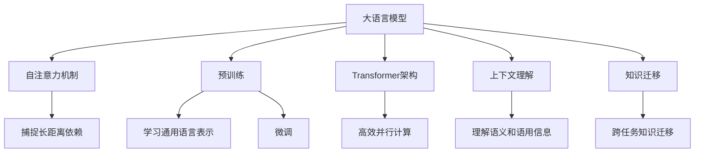

# 大语言模型应用指南：机器能思考吗

## 1. 背景介绍

### 1.1 问题的由来

在人工智能领域，大语言模型近年来受到了广泛关注和热议。这种基于深度学习的语言模型能够理解和生成人类语言,展现出令人惊讶的语言理解和生成能力。从GPT-3到ChatGPT,这些大型语言模型不仅在自然语言处理任务上取得了卓越成绩,更引发了一个深层次的问题:机器是否真正"理解"语言?它们是否拥有真正的思考能力?

### 1.2 研究现状  

目前,学术界和业界对于大语言模型的思考能力存在激烈争论。支持者认为,这些模型通过学习海量数据,掌握了语言的内在规律和知识结构,因此具备一定的理解和推理能力。而怀疑论者则认为,大语言模型只是在模拟人类语言,缺乏真正的理解和思考,它们的输出只是基于统计模式的预测。

### 1.3 研究意义

探讨大语言模型的思考能力,不仅关乎人工智能系统的发展方向,更涉及到人类对智能和意识的本质认知。如果大语言模型真正具备思考能力,那么它们就可能成为通用人工智能(AGI)的重要基础,为智能系统的发展带来革命性突破。反之,如果它们只是在模拟语言而没有真正的理解,那么人工智能的发展就需要走向新的道路。

### 1.4 本文结构

本文将全面探讨大语言模型的思考能力问题。我们将首先介绍大语言模型的核心概念和原理,包括自注意力机制、预训练和微调等。接下来,我们将深入剖析大语言模型的算法原理和数学模型,并通过实例和案例分析来说明它们的工作机制。然后,我们将介绍一些实际应用场景,展示大语言模型在自然语言处理任务中的卓越表现。最后,我们将总结大语言模型的发展趋势和面临的挑战,并对其思考能力问题进行深入探讨和评估。

## 2. 核心概念与联系

大语言模型是一种基于深度学习的自然语言处理模型,它能够从海量文本数据中学习语言的统计规律和知识结构。其核心概念包括:

1. **自注意力机制(Self-Attention Mechanism)**: 这是大语言模型的关键创新,它允许模型捕捉输入序列中任意两个位置之间的依赖关系,从而更好地理解上下文信息。

2. **预训练(Pre-training)**: 大语言模型通常在海量无标注文本数据上进行预训练,学习通用的语言表示,然后在特定任务上进行微调(fine-tuning),以获得更好的性能。

3. **transformer架构**: 大语言模型通常采用transformer架构,该架构完全依赖于注意力机制,避免了传统序列模型中的递归计算,从而提高了并行性和计算效率。

4. **上下文理解**: 大语言模型能够捕捉输入序列中的上下文信息,理解语言的语义和语用信息,而不仅仅是处理单词的字面意义。

5. **知识迁移**: 通过预训练和微调,大语言模型可以在不同任务和领域之间迁移知识,提高了模型的泛化能力和适应性。

这些核心概念相互关联,共同赋予了大语言模型强大的语言理解和生成能力。自注意力机制和transformer架构提供了高效的计算方式,预训练和微调则允许模型从海量数据中学习通用知识,上下文理解和知识迁移则使模型能够更好地理解和生成自然语言。

## 3. 核心算法原理 & 具体操作步骤  

### 3.1 算法原理概述

大语言模型的核心算法原理是基于transformer架构和自注意力机制。transformer是一种全新的序列模型架构,它完全依赖于注意力机制,避免了传统序列模型中的递归计算,从而提高了并行性和计算效率。

自注意力机制是transformer的关键创新,它允许模型捕捉输入序列中任意两个位置之间的依赖关系,从而更好地理解上下文信息。具体来说,自注意力机制通过计算查询(Query)、键(Key)和值(Value)之间的相似性来确定每个位置应该关注哪些其他位置,从而捕捉长距离依赖关系。

此外,大语言模型通常采用预训练和微调的策略。在预训练阶段,模型在海量无标注文本数据上进行训练,学习通用的语言表示。在微调阶段,模型在特定任务上进行进一步训练,以获得更好的性能。

### 3.2 算法步骤详解

大语言模型的算法步骤可以分为以下几个关键步骤:

1. **输入embedding**: 将输入序列(如文本)转换为向量表示,作为模型的输入。

2. **位置编码(Positional Encoding)**: 由于自注意力机制没有捕捉序列顺序的能力,因此需要添加位置编码来保留序列的位置信息。

3. **多头自注意力(Multi-Head Self-Attention)**: 这是transformer的核心机制,它通过计算查询、键和值之间的相似性来捕捉输入序列中任意两个位置之间的依赖关系。

4. **前馈神经网络(Feed-Forward Neural Network)**: 对自注意力的输出进行进一步处理,提取更高级的特征表示。

5. **编码器-解码器架构(Encoder-Decoder Architecture)**: 对于序列生成任务(如机器翻译、文本生成等),模型通常采用编码器-解码器架构,其中编码器捕捉输入序列的表示,解码器根据编码器的输出生成目标序列。

6. **预训练和微调**: 在预训练阶段,模型在海量无标注文本数据上进行训练,学习通用的语言表示。在微调阶段,模型在特定任务上进行进一步训练,以获得更好的性能。

以上步骤共同构建了大语言模型的核心算法流程,使其能够理解和生成自然语言。

### 3.3 算法优缺点

大语言模型算法的优点包括:

1. **高效并行计算**: transformer架构避免了递归计算,提高了并行性和计算效率。

2. **捕捉长距离依赖**: 自注意力机制能够捕捉输入序列中任意两个位置之间的依赖关系,从而更好地理解上下文信息。

3. **通用性和泛化能力**: 通过预训练和微调,大语言模型可以在不同任务和领域之间迁移知识,提高了模型的泛化能力和适应性。

4. **卓越的语言理解和生成能力**: 大语言模型展现出令人惊讶的语言理解和生成能力,在许多自然语言处理任务上取得了卓越成绩。

然而,大语言模型算法也存在一些缺点和限制:

1. **缺乏真正的理解和推理能力**: 尽管大语言模型展现出了令人惊讶的语言能力,但它们是否真正理解语言并具备思考能力仍然存在争议。

2. **数据质量依赖**: 大语言模型的性能高度依赖于训练数据的质量和数量,低质量或有偏差的数据可能会导致模型产生不当的输出。

3. **计算资源需求高**: 训练大型语言模型需要大量的计算资源,包括GPU、内存和存储空间,这可能会限制其在某些场景下的应用。

4. **缺乏解释性**: 大语言模型的内部工作机制通常是一个黑箱,很难解释它们是如何做出特定预测或决策的。

5. **安全和隐私风险**: 大语言模型可能会复制或放大训练数据中存在的偏见和不当内容,存在一定的安全和隐私风险。

### 3.4 算法应用领域

大语言模型算法在自然语言处理领域有广泛的应用,包括但不限于:

1. **机器翻译**: 大语言模型可以用于构建高质量的机器翻译系统,提高翻译质量和效率。

2. **文本生成**: 大语言模型可以生成看似人类编写的高质量文本,如新闻报道、小说、诗歌等。

3. **问答系统**: 大语言模型可以用于构建智能问答系统,回答各种复杂的自然语言问题。

4. **文本摘要**: 大语言模型可以自动生成文本摘要,提高信息获取和处理效率。

5. **情感分析**: 大语言模型可以用于分析文本中的情感倾向,广泛应用于社交媒体监测、客户服务等领域。

6. **自动写作辅助**: 大语言模型可以作为智能写作助手,协助人类完成各种写作任务。

7. **对话系统**: 大语言模型可以用于构建智能对话系统,进行自然语言交互。

8. **知识图谱构建**: 大语言模型可以从文本中提取实体、关系和事件,用于构建知识图谱。

总的来说,大语言模型算法为自然语言处理领域带来了革命性的进步,极大地推动了人机交互和信息处理能力的发展。

## 4. 数学模型和公式 & 详细讲解 & 举例说明

### 4.1 数学模型构建

大语言模型的数学模型基于transformer架构和自注意力机制。我们首先介绍自注意力机制的数学模型。

对于一个长度为 $n$ 的输入序列 $X = (x_1, x_2, \dots, x_n)$,自注意力机制计算查询(Query)、键(Key)和值(Value)之间的相似性,从而捕捉输入序列中任意两个位置之间的依赖关系。具体来说,对于每个位置 $i$,我们计算其与所有其他位置 $j$ 的注意力权重 $\alpha_{ij}$:

$$\alpha_{ij} = \frac{e^{s_{ij}}}{\sum_{k=1}^{n}e^{s_{ik}}}$$

其中 $s_{ij}$ 是查询 $q_i$ 和键 $k_j$ 之间的相似性分数,可以通过点积或其他相似性函数计算:

$$s_{ij} = q_i^T k_j$$

然后,我们根据注意力权重 $\alpha_{ij}$ 计算每个位置 $i$ 的值表示 $v_i$,作为自注意力的输出:

$$v_i = \sum_{j=1}^{n}\alpha_{ij}v_j$$

为了捕捉不同的依赖关系,transformer采用了多头自注意力机制,将查询、键和值分别投影到不同的子空间,并对每个子空间的自注意力输出进行拼接。

此外,transformer还引入了残差连接和层归一化,以提高模型的性能和稳定性。

### 4.2 公式推导过程

我们来详细推导自注意力机制的数学公式。

首先,我们定义查询矩阵 $Q$、键矩阵 $K$ 和值矩阵 $V$,它们分别由输入序列 $X$ 通过线性投影得到:

$$Q = XW_Q^T$$
$$K = XW_K^T$$
$$V = XW_V^T$$

其中 $W_Q$、$W_K$ 和 $W_V$ 分别是查询、键和值的权重矩阵。

接下来,我们计算查询和键之间的相似性分数矩阵 $S$:

$$S = QK^T$$

其中,每个元素 $s_{ij}$ 表示查询 $q_i$ 和键 $k_j$ 之间的相似性分数。

然后,我们对相似性分数矩阵 $S$ 进行缩放和软最大化操作,得到注意力权重矩阵 $A$:

$$A = \text{softmax}(\frac{S}{\