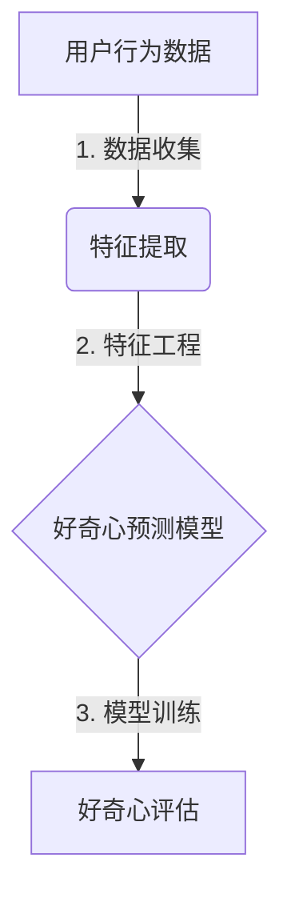

# 好奇心：驱动创新与发现的源泉

## 1. 背景介绍

### 1.1 问题的由来

好奇心是人类与生俱来的一种特质,它推动着我们不断探索未知、追求新知识。从古至今,好奇心一直是推动科学发展、技术创新和文化进步的根本动力。在当今这个瞬息万变的时代,好奇心的重要性更加凸显。

### 1.2 研究现状  

许多研究表明,好奇心不仅能促进个人的学习和发展,还能推动整个社会的进步。一些顶尖公司已经意识到好奇心的价值,并将其视为企业文化的核心部分。例如,谷歌鼓励员工利用 20% 的工作时间追求个人兴趣和创新想法。

### 1.3 研究意义

培养好奇心对于个人、组织乃至整个社会的发展都至关重要。好奇心可以激发创新思维,帮助我们突破常规,发现新的解决方案。它还能促进跨学科合作,推动不同领域的融合,产生意想不到的创新成果。

### 1.4 本文结构

本文将从多个角度探讨好奇心的本质、重要性和培养方式。我们将深入分析好奇心的核心概念,介绍相关的算法原理和数学模型,并通过实际案例加以说明。最后,我们将总结好奇心在未来的发展趋势和面临的挑战。

## 2. 核心概念与联系

好奇心是一种内在的驱动力,促使我们去探索未知、追求新知识。它包含以下几个核心概念:

1. **开放性思维**:好奇心需要一种开放、包容的思维方式,愿意接受新鲜事物并持开放态度。
2. **求知欲望**:好奇心源于对新知识的渴望,是一种内在的学习动机。
3. **质疑精神**:好奇心驱使我们质疑现状,不断提出"为什么"的问题。
4. **创新意识**:好奇心推动我们寻求新颖的解决方案,促进创新思维的形成。
5. **勇于尝试**:好奇心鼓励我们尝试新事物,不惧失败,勇于探索未知领域。

这些核心概念相互关联、相辅相成,共同构成了好奇心的基础。培养好奇心需要全面发展这些方面,形成一种积极主动、勇于探索的心智状态。

## 3. 核心算法原理 & 具体操作步骤 

### 3.1 算法原理概述

为了量化和评估好奇心,我们可以借助机器学习算法。其核心思想是基于个体的行为数据(如浏览记录、搜索历史等)构建用户画像,然后根据画像预测个体对新事物的好奇程度。

这个过程可以概括为以下三个步骤:

1. **数据收集**:收集用户的行为数据,如浏览记录、搜索历史、社交媒体活动等。
2. **特征提取**:从原始数据中提取有意义的特征,如主题偏好、新奇度、多样性等。
3. **模型训练**:基于提取的特征,使用机器学习算法(如决策树、神经网络等)训练好奇心预测模型。

trained_model = train(features, curiosity_labels)



### 3.2 算法步骤详解

1. **数据收集**

   - 从多个来源收集用户行为数据,如网站浏览记录、搜索历史、社交媒体活动等。
   - 数据预处理,如去重、清洗、标准化等,以确保数据质量。

2. **特征提取**

   - 从原始数据中提取有意义的特征,如主题分布、新奇度、多样性等。
   - 特征工程是关键步骤,需要综合考虑领域知识和算法需求。

3. **模型训练**

   - 将提取的特征作为输入,结合已标注的好奇心水平,训练机器学习模型。
   - 常用算法包括决策树、随机森林、神经网络等。
   - 模型评估和优化,如交叉验证、超参数调优等。

4. **模型应用**

   - 对新用户的行为数据进行特征提取,输入到训练好的模型中。
   - 模型输出预测的好奇心水平,可用于个性化推荐、内容优化等场景。

### 3.3 算法优缺点

**优点**:

- 能够基于大量行为数据进行客观评估,避免主观偏差。
- 可以精细地量化好奇心水平,为个性化应用提供支持。
- 算法可解释性较强,有助于理解好奇心的内在机理。

**缺点**:

- 需要大量高质量的训练数据,数据采集和标注成本较高。
- 算法性能受特征工程的影响较大,需要领域专家经验。
- 存在一定的隐私和伦理风险,需要审慎处理用户数据。

### 3.4 算法应用领域

好奇心预测算法可应用于多个领域,包括但不限于:

- **个性化推荐系统**:根据用户的好奇心水平,推荐新颖、多样的内容。
- **在线教育**:评估学习者的好奇心,并提供个性化的学习资源。
- **营销策略**:针对具有较高好奇心的用户群体,设计吸引眼球的营销活动。
- **人力资源管理**:甄别具有好奇心和创新潜力的求职者。
- **社交媒体分析**:分析用户好奇心,优化内容推荐和用户体验。

## 4. 数学模型和公式 & 详细讲解 & 举例说明

### 4.1 数学模型构建

为了量化好奇心,我们可以构建一个基于贝叶斯模型的数学框架。假设用户的好奇心水平服从伯努利分布,即每次面对新事物时,用户会以一定概率 $\theta$ 产生好奇心。我们的目标是估计这个隐含的 $\theta$ 参数。

在贝叶斯框架下,我们可以将 $\theta$ 看作是服从某种先验分布的随机变量。当观察到用户的行为数据 $D$ 时,我们可以根据贝叶斯公式计算 $\theta$ 的后验分布:

$$
p(\theta|D) = \frac{p(D|\theta)p(\theta)}{p(D)}
$$

其中:

- $p(\theta|D)$ 是 $\theta$ 的后验分布,描述了在观察到数据 $D$ 后,对 $\theta$ 的新的估计。
- $p(D|\theta)$ 是似然函数,描述了在给定 $\theta$ 的情况下,观察到数据 $D$ 的概率。
- $p(\theta)$ 是 $\theta$ 的先验分布,描述了在观察数据之前,对 $\theta$ 的初始假设。
- $p(D)$ 是证据,是一个归一化常数,确保后验分布的总概率为 1。

通过计算后验分布,我们可以得到 $\theta$ 的点估计(如均值或最大后验估计)作为用户的好奇心水平。

### 4.2 公式推导过程

假设用户在 $N$ 次独立事件中表现出好奇心的次数为 $k$,那么似然函数可以写为:

$$
p(D|\theta) = \theta^k(1-\theta)^{N-k}
$$

我们取先验分布为伯努利分布的共轭先验——Beta分布:

$$
p(\theta) = \frac{\Gamma(\alpha+\beta)}{\Gamma(\alpha)\Gamma(\beta)}\theta^{\alpha-1}(1-\theta)^{\beta-1}
$$

其中 $\alpha, \beta$ 是先验分布的参数,反映了我们对 $\theta$ 的初始假设。

将似然函数和先验分布代入贝叶斯公式,可以得到 $\theta$ 的后验分布:

$$
p(\theta|D) = \frac{\Gamma(\alpha+\beta+N)}{\Gamma(\alpha+k)\Gamma(\beta+N-k)}\theta^{\alpha+k-1}(1-\theta)^{\beta+N-k-1}
$$

这是一个新的 Beta 分布,其参数为 $\alpha+k, \beta+N-k$。通过这个后验分布,我们可以计算 $\theta$ 的均值或最大后验估计,作为用户好奇心水平的量化指标。

### 4.3 案例分析与讲解

为了更好地理解这个模型,我们来看一个具体的例子。假设一位用户在过去 100 次浏览网页的机会中,有 60 次选择了新颖的内容(即表现出好奇心)。我们希望估计这位用户的好奇心水平 $\theta$。

假设我们对 $\theta$ 的先验分布取 $\alpha=\beta=2$(这反映了我们对 $\theta$ 的中性态度,即 $\theta$ 在 0 到 1 之间均可能发生)。那么根据上面的公式,我们可以计算出 $\theta$ 的后验分布为:

$$
p(\theta|D) = \frac{\Gamma(104)}{\Gamma(62)\Gamma(42)}\theta^{61}(1-\theta)^{41}
$$

对于这个后验分布,我们可以计算出它的均值为 $\frac{62}{104} \approx 0.596$,这就是用户好奇心水平 $\theta$ 的点估计值。

通过这个例子,我们可以看到贝叶斯模型如何将先验知识和观察数据相结合,对隐含参数 $\theta$ 进行估计。这种方法不仅可以应用于好奇心建模,也可以推广到其他需要从有限数据中估计隐含参数的场景。

### 4.4 常见问题解答

**Q1: 为什么要使用贝叶斯模型?**

A1: 贝叶斯模型能够很好地处理隐含参数估计问题,并且可以自然地融入先验知识。相比于频率派方法,它更加灵活和解释性更强。

**Q2: 如何选择合适的先验分布?**

A2: 先验分布的选择取决于对参数的先验认知。通常,我们会选择与似然函数的共轭先验,以便于后验分布的计算。当没有足够的先验知识时,也可以选择非信息性的先验,如均匀分布或Jeffreys先验。

**Q3: 后验分布的均值是否就是最优的参数估计?**

A3: 并不一定。均值是一种点估计,但在某些情况下,我们也可以考虑使用最大后验估计或者整个后验分布。具体选择哪种方式,需要根据实际问题的需求来权衡。

**Q4: 这种模型是否适用于更复杂的场景?**

A4: 这个模型是一个相对简单的例子,但是贝叶斯框架可以推广到更复杂的模型中。例如,我们可以引入其他协变量,使用分层模型或者非参数贝叶斯方法等。模型的复杂程度取决于具体问题和可用数据。

## 5. 项目实践:代码实例和详细解释说明

在这一部分,我们将通过一个实际的代码示例,演示如何使用 Python 中的 PyMC3 库实现上述的贝叶斯好奇心模型。

### 5.1 开发环境搭建

首先,我们需要安装所需的 Python 包,包括 PyMC3、arviz(用于结果可视化)等:

```bash
pip install pymc3 arviz
```

### 5.2 源代码详细实现

```python
import arviz as az
import pymc3 as pm

# 生成模拟数据
N = 100  # 总次数
k = 60   # 好奇心次数

# 定义模型
with pm.Model() as model:
    # 定义先验分布
    alpha = 2
    beta = 2
    theta = pm.Beta('theta', alpha=alpha, beta=beta)
    
    # 定义似然函数
    y = pm.Binomial('y', n=N, p=theta, observed=k)
    
    # 采样
    trace = pm.sample(1000, chains=2, cores=2)

# 结果分析
az.plot_trace(trace, var_names='theta')
print(f'Mean curiosity level: {trace["theta"].mean():.3f}')
```

让我们逐步解释这段代码: