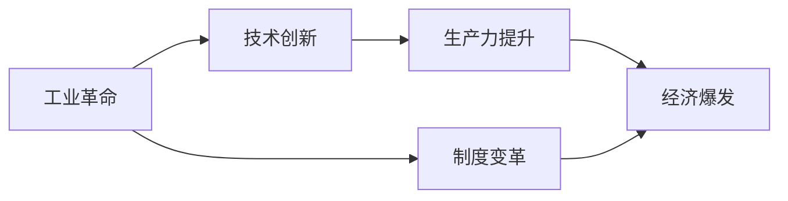
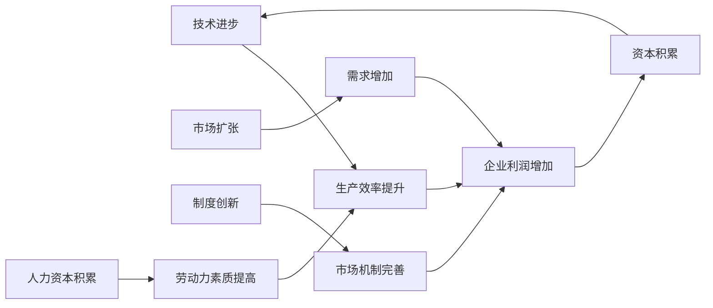

# 工业革命后的经济爆发期

## 1. 背景介绍

### 1.1 问题的由来

工业革命，始于18世纪末，是人类历史上一次重大的技术革命，它彻底改变了人类社会的生产方式和生活方式。这场革命带来了前所未有的生产力提升，也引发了经济的快速增长，史称“工业革命后的经济爆发期”。 

然而，工业革命并非一蹴而就，它经历了漫长的发展历程，其经济影响也并非均匀分布。深入研究工业革命后的经济爆发期，对于我们理解现代经济体系的形成、发展规律以及未来走向具有重要意义。

### 1.2 研究现状

目前，关于工业革命后经济爆发的研究已经取得了丰硕的成果。学者们从不同的角度，运用各种方法，对这一历史时期进行了深入的剖析。

* **宏观经济史研究:**  主要关注工业革命对经济增长、贸易、金融等方面的影响。
* **产业组织理论:**  分析了新技术、新产业的兴起对市场结构、企业行为的影响。
* **制度经济学:**  探讨了产权制度、法律体系等制度因素在经济发展中的作用。
* **计量经济学:**  利用统计数据和模型，对工业革命的经济影响进行量化分析。

### 1.3 研究意义

深入研究工业革命后的经济爆发期，具有以下几方面的意义：

* **有助于我们更好地理解现代经济体系的形成和发展规律。** 工业革命是现代经济体系形成的起点，研究这一时期经济发展的特点和规律，可以帮助我们更好地理解现代经济体系的运行机制。
* **为当前经济发展提供历史借鉴。**  当今世界正处于新一轮科技革命和产业变革浪潮之中，研究工业革命的经验教训，可以为我们应对当前挑战、推动经济发展提供有益借鉴。
* **有助于我们更好地把握未来经济发展的趋势。**  历史是未来的镜子，研究工业革命后的经济发展历程，可以帮助我们更好地预测未来经济发展的趋势，为制定相关政策提供参考。

### 1.4 本文结构

本文将从以下几个方面对工业革命后的经济爆发期进行深入分析：

* 核心概念与联系
* 核心技术变革及其影响
* 经济增长的动力机制
* 社会结构的变迁
* 未来发展趋势与挑战

## 2. 核心概念与联系

### 2.1 工业革命

工业革命并非一个单一的事件，而是一个持续时间长、影响范围广的变革过程。一般认为，工业革命可以分为两个阶段：

* **第一次工业革命（18世纪60年代 - 19世纪中期）：** 以蒸汽机为代表的机器生产取代手工劳动，以煤炭为主要能源，以纺织业为代表的轻工业率先发展。
* **第二次工业革命（19世纪后期 - 20世纪初期）：** 以电力、内燃机为代表的新能源、新技术广泛应用，重工业迅速发展，钢铁、化工、汽车等新兴产业崛起。

### 2.2 经济爆发

工业革命带来了生产力的巨大提升，直接推动了经济的快速增长。这一时期，经济增长呈现出以下几个特点：

* **高速增长:**  与工业革命前相比，经济增长速度明显加快。
* **持续增长:**  经济增长不再是短暂的繁荣，而是呈现出持续增长的态势。
* **结构性变化:**  产业结构发生重大变化，农业比重下降，工业比重上升。

### 2.3 技术创新

技术创新是推动工业革命和经济爆发的根本动力。这一时期，一系列重大技术发明和应用，极大地提高了生产效率，降低了生产成本，为经济增长创造了条件。

### 2.4 制度变革

与技术创新相伴随的是制度的变革。为了适应工业革命带来的新变化，资本主义制度不断完善，市场机制的作用日益增强，为经济发展提供了制度保障。

### 2.5 核心概念联系图

## 3. 核心技术变革及其影响

### 3.1 蒸汽机和机器生产

#### 3.1.1 蒸汽机的工作原理

蒸汽机是一种利用高温高压蒸汽推动活塞做功的机械装置。其基本工作原理是：将水加热成蒸汽，蒸汽膨胀推动活塞运动，活塞带动曲柄连杆机构将热能转换为机械能。

#### 3.1.2 蒸汽机的影响

蒸汽机的发明和应用，极大地提高了生产效率，推动了机器生产的普及。蒸汽机的应用，使得工厂可以摆脱对水力的依赖，从而可以建立在更靠近原料产地和市场的地方。

### 3.2 煤炭和钢铁

#### 3.2.1 煤炭的重要性

煤炭是工业革命的重要能源。煤炭的大规模开采和利用，为蒸汽机提供了充足的燃料，也为钢铁冶炼提供了高温条件。

#### 3.2.2 钢铁的应用

钢铁是工业革命的重要材料。钢铁的大规模生产和应用，使得机器制造更加便捷，也为铁路、桥梁等基础设施建设提供了坚实的物质基础。

### 3.3 纺织技术

#### 3.3.1 珍妮纺纱机

珍妮纺纱机是一种多轴纺纱机，可以同时纺出多根纱线，大大提高了纺纱效率。

#### 3.3.2 水力纺纱机

水力纺纱机利用水力驱动纺纱机，进一步提高了纺纱效率。

### 3.4 交通运输技术

#### 3.4.1 火车

火车的发明和应用，极大地提高了运输效率，降低了运输成本，促进了商品的流通和市场的发展。

#### 3.4.2 轮船

轮船的发明和应用，使得远洋航行成为可能，促进了国际贸易的发展。

## 4. 经济增长的动力机制

### 4.1 技术进步与资本积累

技术进步是推动经济增长的根本动力。技术进步可以提高生产效率，降低生产成本，从而提高企业的利润率，进而推动资本积累。资本积累又可以为技术进步提供资金支持，形成良性循环。

### 4.2 市场扩张与国际贸易

工业革命带来了生产力的巨大提升，使得商品产量大幅增加。为了消化过剩的产能，企业需要不断开拓新的市场。同时，工业革命也促进了国际贸易的发展，为经济增长提供了更广阔的空间。

### 4.3 制度创新与人力资本

制度创新是经济增长的重要保障。工业革命时期，资本主义制度不断完善，市场机制的作用日益增强，为经济发展提供了制度保障。同时，教育的普及和人力资本的积累，也为经济增长提供了智力支持。

### 4.4 经济增长动力机制图

## 5. 社会结构的变迁

### 5.1 城市化进程加速

工业革命吸引了大量农村人口涌入城市，城市人口急剧膨胀，城市化进程明显加速。城市成为工业革命的中心，也成为经济增长的引擎。

### 5.2 阶级结构的变化

工业革命导致了新的社会阶层的出现，即工业资产阶级和产业工人阶级。工业资产阶级掌握了生产资料，成为社会的主宰力量。产业工人阶级则依靠出卖劳动力为生，成为被雇佣者。

### 5.3 社会矛盾的激化

工业革命带来了巨大的财富，但也加剧了社会贫富差距。产业工人阶级的生活条件恶劣，社会矛盾日益激化，引发了一系列社会运动。

## 6. 实际应用场景

### 6.1 产业革命

工业革命的经验教训，对于我们理解和把握当前新一轮科技革命和产业变革具有重要意义。例如，人工智能、大数据、云计算等新技术的兴起，正在引发新一轮产业革命。

### 6.2 经济发展

工业革命的成功经验，可以为发展中国家提供借鉴。例如，中国改革开放以来，借鉴了西方发达国家的经验，大力发展工业，取得了举世瞩目的成就。

### 6.3 社会治理

工业革命也带来了一些社会问题，例如环境污染、贫富差距等。这些问题的解决，需要政府、企业和社会各界的共同努力。

## 7. 工具和资源推荐

### 7.1 学习资源推荐

* 《世界经济史》
* 《资本论》
* 《国富论》

### 7.2 开发工具推荐

* Python
* R
* Stata

### 7.3 相关论文推荐

* Mokyr, J. (1990). The lever of riches: Technological creativity and economic growth. Oxford University Press.
* Landes, D. S. (1998). The wealth and poverty of nations: Why some are so rich and some so poor. W. W. Norton & Company.
* Allen, R. C. (2000). The British Industrial Revolution in global perspective. Cambridge University Press.

## 8. 总结：未来发展趋势与挑战

### 8.1 研究成果总结

工业革命是人类历史上一次重大的技术革命和社会变革，它带来了生产力的巨大提升和经济的快速增长，同时也引发了一系列社会问题。研究工业革命的历史经验教训，对于我们理解现代经济体系的形成和发展规律、应对当前经济发展挑战、把握未来经济发展趋势具有重要意义。

### 8.2 未来发展趋势

* **新技术革命方兴未艾:** 人工智能、大数据、云计算等新技术的快速发展，将继续推动生产力的提升和经济的增长。
* **全球化进程不断深化:**  国际贸易和投资的自由化，将继续推动全球资源配置效率的提高和经济的增长。
* **可持续发展成为共识:**  环境保护、社会公平等问题日益受到重视，可持续发展理念将更加深入人心。

### 8.3 面临的挑战

* **技术进步带来的失业问题:** 新技术的应用可能会导致部分传统行业的失业问题。
* **贫富差距扩大问题:** 技术进步带来的财富增长可能会进一步拉大贫富差距。
* **环境污染问题:**  经济的快速增长可能会对环境造成更大的压力。

### 8.4 研究展望

未来的研究可以着重关注以下几个方面：

* 新技术革命对经济增长和社会结构的影响。
* 如何解决技术进步带来的失业和贫富差距问题。
* 如何实现经济增长与环境保护的协调发展。

## 9. 附录：常见问题与解答

### 9.1 为什么工业革命首先发生在英国？

英国发生工业革命的原因是多方面的，主要包括：

* **政治稳定:**  英国在17世纪确立了君主立宪制，政治相对稳定，为经济发展提供了良好的环境。
* **殖民扩张:**  英国拥有广阔的殖民地，为其提供了充足的原料产地和商品市场。
* **科技发达:**  英国拥有先进的科学技术和发明创造，为工业革命提供了技术基础。
* **资本积累:**  英国拥有雄厚的资本积累，为工业革命提供了资金支持。

### 9.2 工业革命对世界的影响是什么？

工业革命对世界的影响是极其深远的，主要体现在：

* **世界格局的变化:**  工业革命使得西方国家迅速崛起，成为世界的主导力量。
* **经济全球化的发展:**  工业革命促进了国际贸易和投资的发展，推动了世界经济的融合。
* **生活水平的提高:**  工业革命带来了生产力的巨大提升，使得人们的生活水平得到了极大的提高。
* **环境污染问题:**  工业革命也带来了一些负面影响，例如环境污染、资源枯竭等。

### 9.3 如何应对新技术革命带来的挑战？

为了应对新技术革命带来的挑战，我们需要：

* **发展教育，提高劳动者素质:**  加强教育和培训，提高劳动者的技能水平，以适应新技术的发展。
* **鼓励创新，发展新兴产业:**  加大对科技创新的支持力度，发展新兴产业，创造新的就业岗位。
* **完善社会保障体系:**  建立健全的社会保障体系，为失业者提供基本的生活保障。
* **加强国际合作:**  加强国际合作，共同应对新技术革命带来的挑战。

作者：禅与计算机程序设计艺术 / Zen and the Art of Computer Programming 
